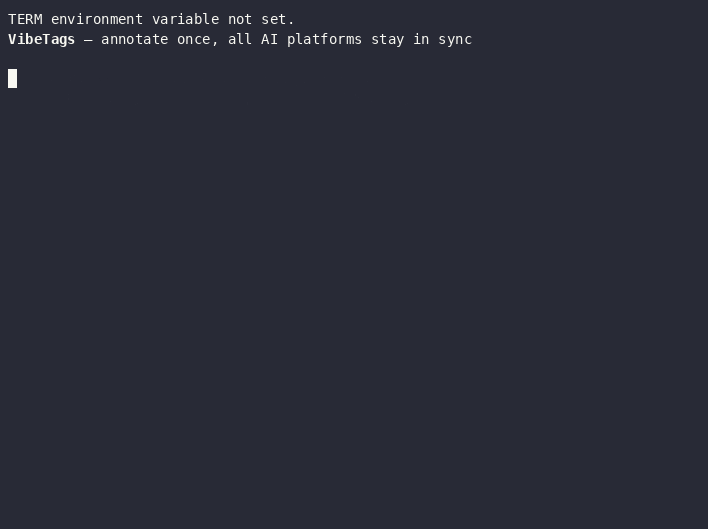

# VibeTags — AI Guardrails for Java Development

[](https://opensource.org/licenses/MIT)
[](https://central.sonatype.com/artifact/se.deversity.vibetags/vibetags-processor)
[](https://securityscorecards.dev/viewer/?uri=github.com/PIsberg/vibetags)
[](https://github.com/PIsberg/vibetags/actions/workflows/build.yml)
[](https://github.com/PIsberg/vibetags/actions/workflows/build.yml)
[](https://github.com/PIsberg/vibetags/actions/workflows/build.yml)
[](https://github.com/PIsberg/vibetags/actions/workflows/build.yml)
[](https://codecov.io/gh/PIsberg/vibetags)
[](https://github.com/PIsberg/VibeTags)

**VibeTags** is a compile-time Java annotation processor that generates AI platform-specific guardrail files from source annotations — zero runtime overhead, 27 AI platforms, all from a single `mvn compile`.

## Why VibeTags?

`.cursorrules`, `CLAUDE.md`, and similar files are hand-edited by each developer, grow inconsistent across the team, and go stale the moment the code changes. VibeTags makes your AI configuration **source-controlled and compile-enforced**:

- **Annotate once, all platforms updated** — add `@AILocked` to `PaymentProcessor` and every AI tool's guardrail file is regenerated on the next compile. No more per-developer copy-pasting across 27 config formats.
- **Derived from the code, not separate from it** — guardrails live next to the code they protect. When the code moves, the rules move with it.
- **Zero runtime cost** — `RetentionPolicy.SOURCE` annotations are erased at compile time; nothing reaches the JVM.

<!-- DEMO-GIF: generated by .github/workflows/demo.yml — run `gh workflow run demo.yml` to regenerate -->


## ⚡ Add VibeTags to Your Project in 60 Seconds

<details>
<summary><b>Maven</b></summary>

**1. Add to `pom.xml`:**

```xml
<dependencyManagement>
    <dependencies>
        <dependency>
            <groupId>se.deversity.vibetags</groupId>
            <artifactId>vibetags-bom</artifactId>
            <version>0.9.8</version>
            <type>pom</type>
            <scope>import</scope>
        </dependency>
    </dependencies>
</dependencyManagement>

<dependencies>
    <dependency>
        <groupId>se.deversity.vibetags</groupId>
        <artifactId>vibetags-annotations</artifactId>
    </dependency>
</dependencies>

<build>
    <plugins>
        <plugin>
            <groupId>org.apache.maven.plugins</groupId>
            <artifactId>maven-compiler-plugin</artifactId>
            <configuration>
                <annotationProcessorPaths>
                    <path>
                        <groupId>se.deversity.vibetags</groupId>
                        <artifactId>vibetags-processor</artifactId>
                        <version>0.9.8</version>
                    </path>
                </annotationProcessorPaths>
            </configuration>
        </plugin>
    </plugins>
</build>
```

**2. Opt in to the AI platforms you use** (file presence = opt-in; VibeTags never creates files on its own):

```bash
touch CLAUDE.md .cursorrules AGENTS.md   # Claude, Cursor, Codex CLI — add whichever you use
```

**3. Annotate your first class:**

```java
@AILocked(reason = "Legacy payment integration — changes will break production.")
public interface PaymentProcessor {
    String processPayment(double amount, String currency, String merchantId);
}
```

**4. Compile:**

```bash
mvn compile
```

`CLAUDE.md` and `.cursorrules` now contain generated guardrail rules. Open either file and look for the `VIBETAGS-START` / `VIBETAGS-END` marker block — that section is managed by VibeTags and regenerated on every compile.

</details>

<details>
<summary><b>Gradle</b></summary>

**1. Add to `build.gradle`:**

```groovy
dependencies {
    implementation platform('se.deversity.vibetags:vibetags-bom:0.9.8')
    annotationProcessor platform('se.deversity.vibetags:vibetags-bom:0.9.8')

    compileOnly 'se.deversity.vibetags:vibetags-annotations'
    annotationProcessor 'se.deversity.vibetags:vibetags-processor'
}
```

**2. Opt in to the AI platforms you use:**

```bash
touch CLAUDE.md .cursorrules AGENTS.md
```

**3. Annotate your first class:**

```java
@AILocked(reason = "Legacy payment integration — changes will break production.")
public interface PaymentProcessor {
    String processPayment(double amount, String currency, String merchantId);
}
```

**4. Compile:**

```bash
gradle compileJava
```

</details>

---

## Table of Contents

- [What is VibeTags?](#-what-is-vibetags)
- [Project Structure](#-project-structure)
- [Installation](#-quick-start)
- [How It Works](#-how-it-works)
- [Documentation](#-documentation)
- [Building from Source](#-building-both-projects)
- [Performance & Load Tests](#-performance--load-tests)
- [When to Use VibeTags](#-when-to-use-vibetags)
- [Advanced Features](#-advanced-features)
  - [@AIAudit - Continuous Security Auditing](#-aiaudit---continuous-security-auditing)
  - [@AIDraft - Requesting AI Implementations](#-aidraft---requesting-ai-implementations)
  - [Smart Validation Warnings](#-smart-validation-warnings)
  - [@AIContract - Freezing Public API Signatures](#-aicontract---freezing-public-api-signatures)
  - [@AITestDriven - Test-Driven AI Requirements](#-aitestdriven---test-driven-ai-requirements)
  - [@AIThreadSafe / @AIImmutable / @AIDeprecated / @AIObservability / @AIRegulation](#-new-in-v090-five-design-intent-annotations)
- [Contributing](#-contributing)
- [Project Components](#-project-components)
- [License](#-license)

## 🎯 What is VibeTags?

VibeTags provides Java annotations that serve as instructions for AI code generation tools. When your project is compiled, the VibeTags annotation processor automatically generates platform-specific configuration files that enforce your rules across different AI platforms.


### Key Features

The 24 annotations group into six categories by intent. Within each category they are listed alphabetically.

#### 🛡️ Protection & Access Control — keep AI away from code

- **🚫 @AIIgnore** - Exclude classes, methods, or fields from AI context entirely (auto-generated code, deprecated scaffolding)
- **🌉 @AILegacyBridge** - Mark compatibility bridges working around upstream dependencies/bugs (AI must not refactor or modernize structure; modify internal business logic only)
- **🔒 @AILocked** - Protect critical code from AI modifications (legacy systems, compliance code, security-critical logic)

#### 🚧 Behavioral Constraints — limit what AI can change

- **🧱 @AIArchitecture** - Enforce layering boundaries (declares `belongsTo` layer and forbidden `cannotReference` layers)
- **📜 @AIContract** - Freeze the public signature of an interface or method — AI may change internal logic but must not alter method names, parameter types, parameter order, return types, or checked exceptions
- **⚡ @AIPerformance** - Enforce strict time/space complexity constraints for performance-critical hot-paths
- **📦 @AIStrictClasspath** - Prevent dependency bloat (restricts imports and implementation to JDK and existing classpath only)

#### 🧬 Design Intent — declare properties AI must preserve

- **🧠 @AICore** - Mark well-tested core logic that is sensitive to changes (modifications require extreme caution)
- **❄️ @AIImmutable** - Declare a class immutable; the processor warns if any non-static instance field is non-final
- **🗣️ @AIInternationalized** - Prohibit hardcoded user-facing strings (all visible text must be extracted to i18n bundle message keys)
- **📡 @AIObservability** - Name the metrics, traces, and log statements downstream dashboards depend on — AI must not silently remove or rename them
- **🌐 @AIPublicAPI** - Protect public APIs (all modifications must be additive; forbidden to rename or change serialization formats)
- **🗄️ @AISchemaSafe** - Protect persistent database entities (forbids destructive changes, column drops, table drops)
- **🛡️ @AIStrictExceptions** - Enforce strict error handling (forbids swallowing exceptions or throwing generic RuntimeExceptions)
- **📐 @AIStrictTypes** - Require high-precision or timezone-sensitive data structures (e.g. `BigDecimal` for currency and `Instant`/`ZonedDateTime` for time)
- **🧵 @AIThreadSafe** - Declare a thread-safety strategy (`SYNCHRONIZED`, `LOCK_FREE`, `IMMUTABLE`, `THREAD_LOCAL`, `OTHER`) that AI must preserve on every change

#### 🔐 Security & Compliance — auditing, privacy, and regulation

- **🛡️ @AIAudit** - Tag critical infrastructure for continuous AI security auditing (SQL injection, thread safety, etc.)
- **🔐 @AIPrivacy** - Mark fields and methods that handle PII — AI must never include their values in logs, suggestions, test fixtures, or external API calls
- **📜 @AIRegulation** - Tie code to a specific regulatory clause (GDPR, PCI-DSS, HIPAA, SOX) — AI must document compliance impact and never weaken the requirement

#### 🛠️ Implementation Workflow — guide how AI works on the code

- **📋 @AIContext** - Guide AI on how to work with specific classes (performance optimizations, design patterns, frameworks)
- **✏️ @AIDraft** - Mark methods or classes that need AI implementation with detailed instructions
- **🧪 @AIParallelTests** - Enforce strict test isolation for concurrent execution (forbids shared mutable state or resource conflicts)
- **🧪 @AITestDriven** - Enforce Red-Green-Refactor discipline — AI must provide matching test updates alongside any logic changes (configurable coverage goal, framework, and mock policy)
- **♻️ @AIIdempotent** - Declare that an operation must remain idempotent; AI must never introduce side effects that cause repeated calls to produce different results
- **🚩 @AIFeatureFlag** - Mark code gated behind a feature flag; AI must preserve the flag check and never assume the flag is always active
- **🔐 @AISecure** - Mark security-critical code (authentication, encryption, authorization) — AI must not weaken security properties and must flag any change for security review

#### ♻️ Lifecycle — manage deprecation and removal

- **⚠️ @AIDeprecated** - Actively route callers away from a deprecated element — declares the replacement, migration guide, and removal deadline

### Supported AI Platforms

Generated configuration files work out-of-the-box with **32 AI platforms**:

#### Traditional / Single-file formats
- **Aider** (`CONVENTIONS.md`, `.aiderignore`)
- **Antigravity AI** (`.antigravityignore`)
- **Claude** (`CLAUDE.md`, `.claudeignore`)
- **Cline** (`.clinerules`)
- **Codex CLI** (`AGENTS.md`, `.codex/config.toml`, `.codex/rules/*.rules`)
- **Codeium** (`.codeiumignore`)
- **Cursor** (`.cursorrules` or **Granular** `.cursor/rules/*.mdc`)
- **Double.bot** (`.doubleignore`)
- **Gemini** (`gemini_instructions.md`, `GEMINI.md`, `.aiexclude`)
- **GitHub Copilot** (`.github/copilot-instructions.md`, `.copilotignore`)
- **JetBrains Junie** (`.junie/guidelines.md`)
- **Mentat** (`.mentatconfig.json`)
- **Open Interpreter** (`.interpreter/profiles/vibetags.yaml`)
- **Plandex** (`.plandex.yaml`)
- **Qwen** (`QWEN.md`, `.qwen/settings.json`, `.qwen/commands/refactor.md`, `.qwenignore`)
- **Sourcegraph Cody** (`.cody/config.json`, `.codyignore`)
- **Supermaven** (`.supermavenignore`)
- **Sweep** (`sweep.yaml`) — AI code review rules for the Sweep GitHub App
- **Windsurf IDE** (`.windsurfrules`)

#### Granular / Directory-based formats
- **Amazon Q** (`.amazonq/rules/*.md`)
- **Continue** (`.continue/rules/*.md` — YAML front-matter + Markdown)
- **Cursor** (`.cursor/rules/*.mdc` — YAML front-matter + Markdown)
- **PearAI** (`.pearai/rules/*.md` — YAML front-matter + Markdown)
- **Amazon Kiro** (`.kiro/steering/*.md`)
- **Roo Code** (formerly Roo Cline) (`.roo/rules/*.md`)
- **Tabnine** (`.tabnine/guidelines/*.md`)
- **Trae** (`.trae/rules/*.md`)
- **Universal AI** (`.ai/rules/*.md` — open standard for multi-tool projects)
- **Windsurf** (`.windsurf/rules/*.md` — YAML front-matter + Markdown)

## 📁 Project Structure

```
vibetags/
├── vibetags/              # Core annotation processor library
│   ├── pom.xml           # Maven build configuration
│   ├── build.gradle      # Gradle build configuration
│   └── src/              # Library source code
├── example/              # Example e-commerce application
│   ├── pom.xml           # Maven build configuration
│   ├── build.gradle      # Gradle build configuration
│   ├── README.md         # Detailed usage guide and best practices
│   └── src/              # Example source code with annotations
├── vibetags-annotations/ # The 24 @interface classes (zero deps, RetentionPolicy.SOURCE)
│   ├── pom.xml
│   ├── build.gradle
│   └── src/main/java/    # AIArchitecture, AIAudit, AIContract, AIContext, AICore, AIDeprecated, AIDraft, AIIdempotent, AIIgnore, AIImmutable, AIInternationalized, AILegacyBridge, AILocked, AIObservability, AIParallelTests, AIPerformance, AIPrivacy, AIPublicAPI, AIRegulation, AISchemaSafe, AIStrictClasspath, AIStrictExceptions, AIStrictTypes, AITestDriven, AIThreadSafe
├── vibetags-bom/         # Bill of Materials (versions only, no source)
│   └── pom.xml           # Imported by consumers to manage vibetags-* versions in one place
├── load-tests/           # Performance & safety test harness (standalone)
│   ├── README.md         # How to run, what to measure, baseline comparison guide
│   ├── pom.xml           # Maven configuration (JMH + JUnit 5)
│   ├── src/
│   │   ├── main/java/    # JMH benchmark classes + helpers
│   │   └── test/java/    # Stress test + concurrent build test
│   └── results/          # Frozen per-release baselines (env, stress, concurrent, jmh.json) + _plots/
├── tools/
│   └── plot-results.py   # Renders comparison PNGs from load-tests/results/
├── docs/                 # Architecture documentation and diagrams
│   ├── ARCHITECTURE.md   # Technical deep-dive into the processor internals
│   └── diagrams/         # PlantUML source files and rendered PNGs
├── .claude/
│   └── skills/
│       └── vibetags-usage/ # Claude Code skill — annotation reference and usage guide
└── README.md             # This file
```

## 🚀 Installation

### Prerequisites

- **Java 11 or higher**
- **Maven 3.6+** or **Gradle 7.0+**

VibeTags ships as **two artifacts**:

- **`vibetags-annotations`** — 24 `@interface` classes (zero dependencies). Goes on the consumer's compile classpath.
- **`vibetags-processor`** — the `javac` annotation processor (depends on slf4j/logback for `vibetags.log`). Goes on the annotation-processor path only — keeping it off `compileClasspath` is what stops slf4j/logback from leaking into consumer code.

The recommended setup uses the BOM (`vibetags-bom`) to manage both versions in one place; pinning each version explicitly is also supported.

#### Recommended: import the BOM

**Maven:**
```xml
<dependencyManagement>
    <dependencies>
        <dependency>
            <groupId>se.deversity.vibetags</groupId>
            <artifactId>vibetags-bom</artifactId>
            <version>0.9.8</version>
            <type>pom</type>
            <scope>import</scope>
        </dependency>
    </dependencies>
</dependencyManagement>

<dependencies>
    <dependency>
        <groupId>se.deversity.vibetags</groupId>
        <artifactId>vibetags-annotations</artifactId>
    </dependency>
</dependencies>

<!-- Processor only on the AP path, not as a regular dependency -->
<build>
    <plugins>
        <plugin>
            <groupId>org.apache.maven.plugins</groupId>
            <artifactId>maven-compiler-plugin</artifactId>
            <configuration>
                <annotationProcessorPaths>
                    <path>
                        <groupId>se.deversity.vibetags</groupId>
                        <artifactId>vibetags-processor</artifactId>
                        <version>0.9.8</version>
                    </path>
                </annotationProcessorPaths>
            </configuration>
        </plugin>
    </plugins>
</build>
```

> **Note:** `maven-compiler-plugin`'s `<annotationProcessorPaths>` does not honour `<dependencyManagement>` (see [MCOMPILER-391](https://issues.apache.org/jira/browse/MCOMPILER-391)). Reuse the BOM version property there — see `example/pom.xml`.

**Gradle:**
```groovy
dependencies {
    implementation platform('se.deversity.vibetags:vibetags-bom:0.9.8')
    annotationProcessor platform('se.deversity.vibetags:vibetags-bom:0.9.8')

    compileOnly 'se.deversity.vibetags:vibetags-annotations'
    annotationProcessor 'se.deversity.vibetags:vibetags-processor'
}
```

#### Alternative: pin versions directly (no BOM)

**Maven:**
```xml
<dependency>
    <groupId>se.deversity.vibetags</groupId>
    <artifactId>vibetags-annotations</artifactId>
    <version>0.9.8</version>
</dependency>
<!-- vibetags-processor goes in <annotationProcessorPaths> as shown above -->
```

**Gradle:**
```groovy
compileOnly 'se.deversity.vibetags:vibetags-annotations:0.9.8'
annotationProcessor 'se.deversity.vibetags:vibetags-processor:0.9.8'
```

> **Backwards compatibility:** Existing 0.5.x setups that depended on `vibetags-processor:<version>` directly continue to work — the processor pulls `vibetags-annotations` transitively. New projects should prefer the split pattern above.

## 📖 How It Works

1. **Add Annotations** - Place VibeTags annotations on your Java classes and methods
2. **Compile** - Run your normal build process (Maven/Gradle)
3. **Generate** - VibeTags automatically creates AI configuration files
4. **Use** - AI tools read these files and follow your guardrails

### Example Usage

```java
// Protect critical legacy code
@AILocked(reason = "Tied to legacy database schema. Changes will break production.")
public interface PaymentProcessor {
    String processPayment(double amount, String currency, String merchantId);
}

// Guide AI behavior for performance-critical code
@AIContext(
    focus = "Optimize for memory usage over CPU speed",
    avoids = "java.util.regex, String.split(), StringBuilder in loops"
)
public class StringParser {
    // AI will follow these guidelines
}

// Request AI implementation
@AIDraft(instructions = "Implement email sending with HTML template support and retry logic")
public boolean sendEmail(String to, String subject, String body) {
    // @DIDraft: AI should implement this
}

// Tag critical infrastructure for continuous security auditing
@AIAudit(checkFor = {"SQL Injection", "Thread Safety issues"})
public class DatabaseConnector {
    // AI must audit any modifications for SQL injection and thread safety
}

// Exclude auto-generated code from AI context entirely
@AIIgnore(reason = "Auto-generated at build time. Manual edits are overwritten on every build.")
public class GeneratedMetadata {
    // AI tools will not reference or suggest changes to this class
}

// Mark PII fields — AI must never log or expose these values
public class DatabaseConnector {
    @AIPrivacy(reason = "Database credential - never log or include in error messages")
    private final String username;

    @AIPrivacy(reason = "Database credential - never log or include in error messages")
    private final String password;
}

// Mark sensitive core logic
@AICore(sensitivity = "Critical", note = "Core transaction routing logic. Do NOT refactor without user approval.")
public class TransactionRouter {
    // AI will treat this as highly sensitive
}

// Enforce performance constraints
@AIPerformance(constraint = "Must maintain O(log n) time complexity for search operations")
public class BinarySearchTree {
    // AI will avoid suboptimal complexity implementations
}

// Freeze the public API signature — internal logic may change freely
public class PricingService {
    @AIContract(reason = "Signature locked by OpenAPI v2 contract shared with checkout-service and mobile-app")
    public double calculatePrice(String productId, int quantity, String customerId) {
        // AI can replace this entire implementation — just never touch the signature
    }
}
```

## 📚 Documentation

| Resource | What it covers |
|---|---|
| **[Example Project](example/README.md)** | A runnable e-commerce demo that shows all 15 annotations in realistic, real-world scenarios. Includes the exact output generated for every supported platform (Cursor, Claude, Gemini, Codex CLI, Qwen, Copilot, llms.txt, …), best practices for writing effective annotations, advanced configuration (custom log path, output root, Gradle setup), and a troubleshooting guide. Start here if you want to see VibeTags in action before adding it to your own project. |
| **[Architecture](docs/ARCHITECTURE.md)** | A technical deep-dive into how VibeTags works internally. Covers the multi-round annotation accumulation model, the file-existence opt-in mechanism, marker-based partial updates, multi-module build safety, granular rule generation and orphan cleanup, and all 22+ output file formats. Includes class, component, build-sequence, and data-flow diagrams. Essential reading before contributing or debugging unexpected processor behaviour. |
| **[Load Tests](load-tests/README.md)** | The performance harness — what each test category measures (annotation-volume sweep, JMH hot-path, concurrent build), which dimensions matter for a compile-time annotation processor, how to capture release-tagged baselines under `load-tests/results/<version>/`, and how to diff two baselines. Read before adding a new benchmark or treating a stress-test number as a regression. |
| **[Claude Code Skill](.claude/skills/vibetags-usage/SKILL.md)** | A Claude Code `/skill` that teaches your AI assistant how to use VibeTags alongside you. Covers the full annotation reference, valid and invalid annotation combinations, how to set up granular rules for Cursor/Trae/Roo Code, all processor options (Maven & Gradle), and a troubleshooting table for common issues. Install it in Claude Code and invoke it with `/vibetags-usage` so Claude knows the library as well as you do. |

## 🛠️ Building from Source

### Build Everything with Maven

```bash
# Build library
cd vibetags && mvn clean install

# Build example
cd ../example && mvn clean compile
```

### Build Everything with Gradle

```bash
# Build library
cd vibetags && gradle clean build publishToMavenLocal

# Build example
cd ../example && gradle clean build
```

## ⚡ Performance & Load Tests

The `load-tests/` subproject is a standalone Maven module that stress-tests and benchmarks `AIGuardrailProcessor`. It **must be run after** the processor is installed locally (`cd vibetags && mvn install -DskipTests`).

### What's included

| Test class | What it measures |
|---|---|
| `AnnotationVolumeStressTest` | Compiles N synthetic annotated classes (N = 10 → 10 000) in-process via `javax.tools.JavaCompiler` and reports wall-clock processor overhead vs. a `-proc:none` baseline, plus total output-file size. |
| `ConcurrentBuildTest` | Runs N threads simultaneously against a **shared** project root to surface file-corruption risks from the lack of write locking in `writeFileIfChanged`. |
| `ProcessorHotPathBenchmark` | JMH microbenchmarks for `writeFileIfChanged` (1 KB / 64 KB) and `buildServiceFileMap` / `resolveActiveServices`. |

### Running

```bash
# Install the processor first
cd vibetags && mvn install -DskipTests

# Stress + concurrent tests (full sweep: N = 10, 100, 500, 1000, 5000, 10 000)
cd load-tests && mvn test

# CI-sized run — skip N > 500 to keep it fast
cd load-tests && mvn test -Dstress.max.classes=500

# Increase concurrent threads (default: 4)
cd load-tests && mvn test -Dtest=ConcurrentBuildTest -Dload.test.threads=8

# JMH microbenchmarks (~2 min, produces a fat-jar)
cd load-tests && mvn package exec:java -Dexec.mainClass=org.openjdk.jmh.Main

# Run a specific JMH benchmark
cd load-tests && mvn package exec:java -Dexec.mainClass=org.openjdk.jmh.Main \
    -Dexec.args="writeFileIfChanged -f 1 -wi 3 -i 5 -tu ms"
```

Results are written to `load-tests/target/stress-results.txt` and printed to stdout.

> [!NOTE]
> The stress test passes `-Avibetags.root=<tempDir>` to the compiler so each run writes into an isolated temporary directory, not the project root. This is the same compiler option used in production when a consumer project needs to override the output directory.

### CI behaviour

The `load-tests` workflow job (see `.github/workflows/build.yml`) runs automatically on every push and PR using JDK 21. It caps the sweep at N = 500 (`-Dstress.max.classes=500`) so the job finishes in under a minute. The `stress-results.txt` artefact is uploaded for inspection even if a step fails.

### Baselines & comparison

Per-release baselines (env metadata, stress-sweep table, concurrent-build report, and JMH JSON) are committed under `load-tests/results/<version>/`. Run `python tools/plot-results.py` to regenerate the comparison PNGs in `load-tests/results/_plots/`. See [`load-tests/README.md`](load-tests/README.md) for the full capture procedure, what each metric means, and which dimensions are worth tracking for a compile-time annotation processor — actual numbers live with the baselines, not here.

## 🎓 When to Use VibeTags

| Scenario | Use Case |
|----------|----------|
| Legacy systems | Protect integrations that work and can't be changed |
| Core Logic | Protect stable, well-tested core functionality from regressions |
| Performance-critical | Guide AI toward specific optimization strategies and complexity constraints |
| Compliance code | PCI-DSS, HIPAA, and other regulated code |
| Boilerplate code | Let AI implement standard patterns safely |
| Team projects | Enforce consistent AI behavior across your team |
| Complex algorithms | Protect code that took months to stabilize |
| PII handling | Prevent AI from leaking personal data in logs or suggestions |

## 🔧 Advanced Features

- **Selective service generation** — opt out of specific AI platforms with no config required
- **Mixed annotation usage** for fine-grained control
- **Platform-specific configurations** generated automatically
- **Version Stamping** — every generated file includes a VibeTags version header for easy traceability
- **Compile-time Validation** — proactive warnings for contradictory or empty annotations
- **Configurable Logging** — full control over log file path and level, including turning it off
- **Granular Rules Support** — automatic generation of `.mdc` and `.md` files with YAML front-matter for precise AI scoping
- **Expanded Tool Support** — built-in support for Aider, Roo Code, and Trae

### Logging Configuration

VibeTags uses a dedicated file-based logger to record its operations during compilation. By default, it writes to `vibetags.log` in the project root at `INFO` level.

You can customize the log path and level using annotation processor options:

| Option | Default | Description |
|---|---|---|
| `vibetags.log.path` | `vibetags.log` | Path to the log file. Relative paths are resolved against the project root. Absolute paths are used as-is. |
| `vibetags.log.level` | `INFO` | Logback level: `TRACE`, `DEBUG`, `INFO`, `WARN`, `ERROR`, or `OFF`. Set to `OFF` to disable file logging entirely. |

#### Maven Configuration

```xml
<plugin>
    <groupId>org.apache.maven.plugins</groupId>
    <artifactId>maven-compiler-plugin</artifactId>
    <configuration>
        <compilerArgs>
            <arg>-Avibetags.log.path=logs/vibetags.log</arg>
            <arg>-Avibetags.log.level=DEBUG</arg>
        </compilerArgs>
    </configuration>
</plugin>
```

#### Gradle Configuration

```groovy
tasks.withType(JavaCompile) {
    options.compilerArgs += [
        '-Avibetags.log.path=logs/vibetags.log',
        '-Avibetags.log.level=DEBUG'
    ]
}
```

### Choosing Which AI Services to Support (Opt-in Model)

VibeTags operates on a **Strict Opt-in Model**. It **never** creates new configuration files on its own. Instead, it only populates or updates files that **already exist** in your project root. 

> [!IMPORTANT]
> **File Presence = Opt-in**. The existence of a specific file (like `CLAUDE.md`) is the signal VibeTags uses to determine which AI service you are using. If the file doesn't exist, VibeTags will not generate content for that service.

**How to enable a service:** 
Create an empty placeholder file for the service you want to support, then compile your project.

**Getting started:** create empty placeholder files for the services you use, then compile:

```bash
# --- Cursor ---
touch .cursorrules .cursorignore             # Traditional + ignore
mkdir -p .cursor/rules                       # Granular rules (per-class .mdc)

# --- Windsurf ---
touch .windsurfrules                         # Traditional .windsurfrules
mkdir -p .windsurf/rules                     # Granular rules (per-class .md)

# --- Zed, Cody, Supermaven ---
touch .rules                                 # Zed Editor
touch .codyignore && mkdir -p .cody && touch .cody/config.json  # Sourcegraph Cody
touch .supermavenignore                      # Supermaven

# --- Continue, Tabnine, Amazon Q, Universal AI ---
mkdir -p .continue/rules                     # Continue
mkdir -p .tabnine/guidelines                 # Tabnine
mkdir -p .amazonq/rules                      # Amazon Q
mkdir -p .ai/rules                           # Universal .ai/rules standard

# --- Trae, Roo Code ---
mkdir -p .trae/rules                         # Trae IDE
mkdir -p .roo/rules                          # Roo Code

# --- PearAI ---
mkdir -p .pearai/rules                       # PearAI granular rules (per-class .md)

# --- Amazon Kiro ---
mkdir -p .kiro/steering                      # Amazon Kiro steering files (per-class .md)

# --- Mentat, Sweep, Plandex ---
touch .mentatconfig.json                     # Mentat AI assistant
touch sweep.yaml                             # Sweep AI code review (GitHub App)
touch .plandex.yaml                          # Plandex AI coding agent

# --- Double.bot, Open Interpreter, Codeium, Antigravity ---
touch .doubleignore                          # Double.bot exclusion list
mkdir -p .interpreter/profiles && touch .interpreter/profiles/vibetags.yaml  # Open Interpreter
touch .codeiumignore                         # Codeium exclusion list
touch .antigravityignore                     # Antigravity AI exclusion list

# --- Cline, JetBrains Junie ---
touch .clinerules                            # Cline AI assistant
mkdir -p .junie && touch .junie/guidelines.md  # JetBrains Junie

# --- Other platforms ---
touch CONVENTIONS.md .aiderignore            # Aider
touch CLAUDE.md .claudeignore                # Claude
touch QWEN.md .qwenignore                   # Qwen
touch .aiexclude gemini_instructions.md GEMINI.md  # Gemini
mkdir -p .github && touch .github/copilot-instructions.md .copilotignore  # GitHub Copilot
touch AGENTS.md                              # Codex CLI
touch llms.txt llms-full.txt                 # Windsurf Cascade / llms.txt standard

mvn compile                                  # VibeTags populates all opted-in files
```

**Removing a service:** delete its file — it will never come back.

```bash
rm gemini_instructions.md   # permanently opt out of Gemini instructions
```

**If no files are present**, VibeTags logs a NOTE during compilation listing exactly which files you can create:

```
[NOTE] VibeTags: No AI config files found — nothing will be generated.
Create one or more of the following files in your project root to opt in:
  .cursorrules
  CLAUDE.md
  gemini_instructions.md
  .github/copilot-instructions.md
  .cursorignore
  .claudeignore
  .copilotignore
  .qwenignore
```

**Teams:** Only commit the config files for the AI tools your team actually uses.

### 🧩 Granular Rules (Cursor, Trae, Roo Code)

For modern AI IDEs like **Cursor** and **Trae**, VibeTags supports a granular rule system. Instead of one giant configuration file, VibeTags generates specific files for each annotated element.

- **Scoping**: Each rule is automatically scoped via `globs`. A rule for `OrderService` will only apply when the AI is working on `OrderService.java`.
- **Triggers**: Uses YAML front-matter (`.mdc` for Cursor, `.md` for Trae) to help the AI understand exactly when to apply each rule.
- **Cleanup**: VibeTags automatically cleans up "orphaned" rule files in these directories if you remove the corresponding annotations from your source code.

**Enable this mode** by creating the target directories:
```bash
mkdir -p .cursor/rules
mkdir -p .trae/rules
mkdir -p .roo/rules
```

### 🤖 Qwen Configuration

VibeTags generates comprehensive Qwen configuration files:

**QWEN.md** - Main project context file:
```markdown
# PROJECT CONTEXT
## LOCKED FILES (DO NOT EDIT)
* `com.example.PaymentProcessor` — Reason here

## CONTEXTUAL RULES
* `com.example.StringParser`
  * Focus: Optimize for memory usage
  * Avoid: java.util.regex, String.split()

## 🛡️ MANDATORY SECURITY AUDITS
* `com.example.DatabaseConnector`
  - Required Checks: SQL Injection, Thread Safety

## IGNORED ELEMENTS
* `com.example.GeneratedMetadata`
```

**.qwen/settings.json** - Qwen model configuration:
```json
{
  "project": {
    "model": "qwen3-coder-plus",
    "mcp": {
      "enabled": true
    }
  }
}
```

**.qwen/commands/refactor.md** - Custom `/refactor` command for code refactoring

**.qwenignore** - Glob patterns for files to exclude from Qwen's context

### 🌐 llms.txt Standard (Windsurf Cascade & LLM Agents)

VibeTags generates two files following the [llms.txt standard](https://llmstxt.org/) — a format that lets AI agents quickly discover and consume project rules without parsing messy HTML or bloating the context window.

| File | Role | Best for |
|---|---|---|
| `llms.txt` | **The Map** — concise directory, one bullet per rule | Windsurf Cascade, agents with limited context |
| `llms-full.txt` | **The Book** — fully expanded reference with all details | Claude 4.6, Gemini 1.5 Pro, Windsurf Cascade with large context |

Both files follow the standard hierarchy: `# ProjectName` (H1), `> summary blockquote`, informational text, and `## Section` resource groups.

**Opt in** by creating the files:

```bash
touch llms.txt llms-full.txt
mvn compile
```

**Sample `llms.txt` output:**

```markdown
# My Project

> AI guardrail rules generated from source annotations by VibeTags.

AI tools reading this file should respect the guardrails defined below.

## Locked Files
- [PaymentProcessor](com.example.payment.PaymentProcessor): Tied to legacy database schema v2.3

## Contextual Rules
- [StringParser](com.example.utils.StringParser): Focus — Optimize for memory usage. Avoid — java.util.regex, String.split()

## Security Audit Requirements
- [DatabaseConnector](com.example.database.DatabaseConnector): check for SQL Injection, Thread Safety issues

## Ignored Elements
- [GeneratedMetadata](com.example.internal.GeneratedMetadata): excluded from AI context
```

**Setting the project name:** Pass `-Avibetags.project=MyProjectName` to the compiler (Maven: `<compilerArg>`, Gradle: `annotationProcessorArgs`) to set the `# H1` title in both files. Defaults to `"This Project"`.

### ⚠️ Orphaned Annotation Warnings

If you use a VibeTags annotation (like `@AIIgnore`) but haven't created the recommended standalone file for an active service, the compiler will issue a **WARNING** to guide you:

`[WARNING] VibeTags: @AIIgnore used but .cursorignore is missing for Cursor support. Consider creating it.`

`[WARNING] VibeTags: @AIIgnore used but .qwenignore is missing for Qwen support. Consider creating it.`

`[WARNING] VibeTags: @AILocked used but .qwenignore is missing for Qwen support. Consider creating it.`

This helps you ensure your guardrails are correctly positioned without VibeTags forcing files into your project.

### 🛡️ @AIAudit - Continuous Security Auditing

The `@AIAudit` annotation enables continuous security auditing for critical infrastructure. When you tag a class or method with `@AIAudit`, AI assistants will automatically perform security reviews whenever they propose modifications to that code.

#### How It Works

1. **Annotate Critical Code**: Add `@AIAudit` with specific vulnerability checks
2. **Compile**: The annotation processor generates audit requirements
3. **AI Self-Audits**: When AI assistants modify tagged code, they must check for listed vulnerabilities

#### Example Usage

```java
@AIAudit(checkFor = {"SQL Injection", "Thread Safety issues"})
public class DatabaseConnector {
    // Database connection and query handling code
}
```

#### Generated Output by Platform

**Cursor (.cursorrules):**
```markdown
## 🛡️ MANDATORY SECURITY AUDITS
* `com.example.database.DatabaseConnector`
  - Required Checks: SQL Injection, Thread Safety issues
```

**Claude (CLAUDE.md):**
```xml
<audit_requirements>
  <file path="com.example.database.DatabaseConnector">
    <vulnerability_check>SQL Injection</vulnerability_check>
    <vulnerability_check>Thread Safety issues</vulnerability_check>
  </file>
</audit_requirements>
```

**Gemini (gemini_instructions.md):**
```markdown
# CONTINUOUS AUDIT REQUIREMENTS
File: `com.example.database.DatabaseConnector`
Critical Vulnerabilities to Prevent: 
- SQL Injection
- Thread Safety issues
```

**Codex CLI (AGENTS.md):**
```markdown
## 🛡️ MANDATORY SECURITY AUDITS
* `com.example.database.DatabaseConnector`
  - Required Checks: SQL Injection, Thread Safety issues
```

**Qwen (QWEN.md):**
```markdown
## 🛡️ MANDATORY SECURITY AUDITS
When proposing edits or writing code for the following files, you MUST perform a security review. Explicitly state that you have audited the changes for the listed vulnerabilities.

* `com.example.database.DatabaseConnector`
  - Required Checks: SQL Injection, Thread Safety issues
```

#### Common Vulnerability Checks

- SQL Injection
- Thread Safety issues
- XSS (Cross-Site Scripting)
- CSRF (Cross-Site Request Forgery)
- Command Injection
- Path Traversal
- Insecure Deserialization
- Authentication Bypass

### ✏️ @AIDraft - Requesting AI Implementations

The `@AIDraft` annotation allows you to mark specific classes or methods as drafts that require implementation. This surfaces actionable instructions directly to AI assistants in their respective configuration formats.

#### Example Usage

```java
@AIDraft(instructions = "Implement email sending via SMTP and push notifications via FCM. Ensure retry logic and rate limiting are applied.")
public class NotificationService {
    public void sendNotification(String userId, String message) {
        // AI will implement this based on instructions above
    }
}
```

#### Generated Output (Cursor .cursorrules)
```markdown
## 📝 IMPLEMENTATION TASKS (TODO)
* `com.example.NotificationService` - Task: Implement email sending via SMTP and push notifications via FCM. Ensure retry logic and rate limiting are applied.
```

### ⚠️ Smart Validation Warnings

VibeTags performs smart validation during compilation to ensure your guardrails are consistent. If it detects a contradiction or a missing configuration, it will issue a `WARNING` but will not break your build.

#### Contradictory Annotations
If you use both `@AIDraft` (implement this) and `@AILocked` (do not touch this) on the same element, VibeTags will warn you:
`[WARNING] VibeTags: com.example.MyClass is annotated with both @AIDraft and @AILocked. This is contradictory.`

#### Empty Audits
If you use `@AIAudit` without providing any items to check for, VibeTags will warn you:
`[WARNING] VibeTags: @AIAudit on com.example.MyClass has no 'checkFor' items list. It will be ignored.`

#### Redundant Privacy Annotations
If you use `@AIPrivacy` on an element that is already annotated with `@AIIgnore`, VibeTags will warn you — `@AIIgnore` already excludes the element from AI context entirely, making `@AIPrivacy` redundant:
`[WARNING] VibeTags: com.example.MyField is annotated with both @AIPrivacy and @AIIgnore. @AIIgnore already excludes the element from AI context; @AIPrivacy is redundant.`

#### Contradictory Contract Annotations
If you use `@AIContract` (signature frozen but logic can change) alongside `@AIDraft` (please implement this), VibeTags will warn you:
`[WARNING] VibeTags: com.example.PaymentGateway.charge is annotated with both @AIContract and @AIDraft. @AIContract freezes the signature, but @AIDraft implies the element is not yet implemented. Remove one of the two annotations.`

If you use `@AIContract` alongside `@AILocked` (no changes at all), VibeTags will warn about the overlapping intent:
`[WARNING] VibeTags: com.example.LegacyApi.process is annotated with both @AIContract and @AILocked. @AILocked prohibits all modifications; @AIContract permits internal-logic changes. Consider using only @AILocked if no changes at all are intended.`

#### Contradictory Test-Driven Annotations
If you use `@AITestDriven` on an element that is also annotated with `@AIIgnore`, VibeTags will warn you — an ignored element is excluded from AI context entirely, so test enforcement cannot apply:
`[WARNING] VibeTags: com.example.OrderService.processPayment is annotated with both @AITestDriven and @AIIgnore. @AIIgnore excludes the element from AI context entirely; @AITestDriven cannot enforce test coverage on an ignored element. Remove one of the two annotations.`

If you use `@AITestDriven` on an element that is also annotated with `@AILocked`, VibeTags will warn about the conflicting intent — `@AILocked` prohibits all changes while `@AITestDriven` permits changes when tests are provided:
`[WARNING] VibeTags: com.example.LegacyService.compute is annotated with both @AITestDriven and @AILocked. @AILocked prohibits all modifications; @AITestDriven permits changes only when tests are updated. Consider using only @AILocked if no changes at all are intended.`

#### Invalid Coverage Goal
If you use `@AITestDriven` with a `coverageGoal` outside the valid 0-100 range, VibeTags will warn you:
`[WARNING] VibeTags: @AITestDriven on com.example.Service.method has an invalid coverageGoal (150). Value must be between 0 and 100 (inclusive).`

#### @AILegacyBridge and @AIDraft Contradiction
Compatibility bridges should not be actively drafted or structurally modified:
`[WARNING] VibeTags: com.example.OldBridge is annotated with both @AILegacyBridge and @AIDraft; compatibility bridges should not be actively drafted or structurally modified.`

#### @AIPublicAPI and @AILocked Redundancy
Since `@AILocked` completely prohibits changes, public API checks are redundant:
`[WARNING] VibeTags: com.example.PublicController is annotated with both @AIPublicAPI and @AILocked; @AILocked already completely prohibits modifications, making public API rules redundant.`

#### @AIParallelTests and @AILocked Redundancy
Since `@AILocked` completely prohibits changes, parallel test rules are redundant:
`[WARNING] VibeTags: com.example.MyTest is annotated with both @AIParallelTests and @AILocked; @AILocked already completely prohibits modifications, making test-driven specifications redundant.`

#### @AISchemaSafe and @AIIgnore Redundancy
Since `@AIIgnore` completely excludes the class, DB schema rules are redundant:
`[WARNING] VibeTags: com.example.UserEntity is annotated with both @AISchemaSafe and @AIIgnore; ignore already completely excludes this element from AI context.`

#### @AIStrictClasspath and @AILocked Redundancy
Since `@AILocked` completely prohibits changes, classpath restriction checks are redundant:
`[WARNING] VibeTags: com.example.Utils is annotated with both @AIStrictClasspath and @AILocked; locked elements already completely prohibit changes.`

#### @AIArchitecture Configuration Check
Using `@AIArchitecture` with no configured layers is a no-op:
`[WARNING] VibeTags: com.example.DomainEntity is annotated with @AIArchitecture but has no configured 'belongsTo' or 'cannotReference' attributes.`

### 📜 @AIContract - Freezing Public API Signatures

The `@AIContract` annotation draws a hard line between **interface** and **implementation**. It tells AI assistants: *"You're welcome to change what happens inside this method — replace the algorithm, swap the data source, optimize the logic — but you must leave the method name, parameter types, parameter order, return type, and checked exceptions exactly as they are."*

#### Why it's needed

AI assistants often try to be helpful in ways that introduce breaking changes. When asked to optimize `calculateTax(double amount, String zipCode)`, an AI might decide `BigDecimal` is more appropriate than `double` and change the signature. For isolated private methods that's fine. For a method that's part of a public API contract shared with three other microservices, it's a deployment incident.

#### Rules of Engagement

When an element is annotated with `@AIContract`, the AI is instructed to respect:

1. **Signature Freeze** — method name, parameter types, parameter order, and return type are off-limits
2. **Exception Integrity** — no new checked exceptions that weren't already declared
3. **Behavioral Consistency** — if the contract says "returns a sorted list", the AI can change the sorting algorithm but cannot return an unsorted `Set`

#### Example Usage

```java
public class PricingService {

    /**
     * Signature pinned by OpenAPI v2 contract shared with checkout-service and mobile-app.
     * Internal pricing algorithm can be freely replaced (rule engine, ML model, lookup table).
     */
    @AIContract(reason = "Signature locked by OpenAPI v2 contract. checkout-service and mobile-app bind to this exact signature.")
    @AIPerformance(constraint = "Must complete in <5ms p99. Called on every cart update.")
    public double calculatePrice(String productId, int quantity, String customerId) {
        return 0.0; // AI can implement/optimize this freely
    }
}
```

**What the AI is ALLOWED to do:**
```java
// ✅ Internal logic replaced entirely — signature identical
public double calculatePrice(String productId, int quantity, String customerId) {
    PriceRule rule = ruleEngine.evaluate(productId, customerId);
    return rule.apply(quantity);
}
```

**What the AI is FORBIDDEN from doing:**
```java
// ❌ Changed double → BigDecimal and String → ProductId
public BigDecimal calculatePrice(ProductId productId, int quantity, CustomerId customerId) { ... }
```

#### Generated Output by Platform

**Cursor (.cursorrules):**
```markdown
## 🔐 CONTRACT-FROZEN SIGNATURES
The following elements have contract-frozen public signatures. You MAY change internal implementation logic, but MUST NOT modify method names, parameter types, parameter order, return types, or checked exceptions.

* `com.example.PricingService.calculatePrice` - Signature locked by OpenAPI v2 contract.
```

**Claude (CLAUDE.md):**
```xml
<contract_signatures>
  <element path="com.example.PricingService.calculatePrice">
    <reason>Signature locked by OpenAPI v2 contract.</reason>
  </element>
</contract_signatures>
<rule>You may refactor the internal logic of elements listed in <contract_signatures>, but you MUST NOT change their public signatures: method names, parameter types, parameter order, return types, or checked exceptions.</rule>
```

#### Best Use Cases

- **Public APIs / SDKs** — where external users depend on your method signatures
- **Microservice contracts** — where signatures are shared via OpenAPI specs or Protobuf definitions
- **Legacy bridges** — where modern code talks to older systems that expect exact data shapes
- **Framework-wired methods** — where Spring, Dagger, or another framework locates methods by exact signature

### 🧪 @AITestDriven - Test-Driven AI Requirements

The `@AITestDriven` annotation is the **accountability officer** of the VibeTags suite. It transforms the AI from a simple code generator into a disciplined engineer that follows a strict Red-Green-Refactor workflow.

When an AI tool scans a project and encounters this tag, it must treat the test suite as an immutable part of the "Definition of Done." Changes without tests are considered incomplete and must not be proposed.

#### How It Works: The Enforcement Loop

1. **Context Mapping** — The AI identifies the associated test class (via naming convention or explicit `testLocation`).
2. **Requirement Analysis** — Before implementing, the AI reads the existing tests to understand expected behavior.
3. **Synchronous Update** — New logic and new test cases are generated in a single pass. If the logic changes, the tests must reflect the new expected behavior.
4. **Regression Check** — The AI verifies its changes do not break existing tests; if they do, it must fix the logic or explain why the test contract needs to evolve.

#### Annotation Attributes

| Attribute | Type | Default | Description |
|---|---|---|---|
| `testLocation` | `String` | `""` | Explicit path to the test file when it doesn't follow standard naming (e.g. `src/test/integration/ProcTest.java`). Leave empty for convention-based resolution. |
| `coverageGoal` | `int` | `100` | Minimum statement-coverage percentage the AI must achieve in generated or updated tests. |
| `framework` | `Framework[]` | `{JUNIT_5}` | Testing frameworks the AI must use. Multiple values may be combined (e.g. `{JUNIT_5, MOCKITO}`). |
| `mockPolicy` | `String` | `""` | Instruction describing how external dependencies should be handled (e.g. `"Always mock external APIs"`, `"Use H2 for database tests"`). |

**Available frameworks:** `JUNIT_5`, `JUNIT_4`, `TESTNG`, `MOCKITO`, `ASSERTJ`, `SPOCK`, `NONE`

#### Example Usage

```java
public class OrderService {

    /**
     * Discount engine — the logic here evolves frequently as business rules change.
     * Every change MUST be accompanied by a full test update.
     */
    @AIDraft(instructions = "Implement discount calculation: percentage, fixed amount, BOGO, tiered.")
    @AITestDriven(
        coverageGoal = 100,
        framework = {AITestDriven.Framework.JUNIT_5, AITestDriven.Framework.ASSERTJ},
        mockPolicy = "Use fixed prices — no external pricing calls in unit tests"
    )
    public double calculateDiscount(String orderId, String discountCode) {
        return 0.0; // AI implements this, but must also provide the tests
    }

    /**
     * Order status state machine — complex workflow that must stay fully tested.
     */
    @AITestDriven(
        coverageGoal = 95,
        framework = {AITestDriven.Framework.JUNIT_5, AITestDriven.Framework.MOCKITO},
        testLocation = "src/test/java/com/example/service/OrderServiceTest.java",
        mockPolicy = "Mock OrderRepository and EventPublisher; use real state machine logic"
    )
    public String updateOrderStatus(String orderId, String newStatus) {
        return "CREATED";
    }
}
```

#### Generated Output by Platform

**Cursor (.cursorrules):**
```markdown
## 🧪 TEST-DRIVEN REQUIREMENTS
The following elements require a corresponding test update whenever their logic is modified.
AI MUST NOT propose changes to these elements without also providing the matching test code.

* `com.example.service.OrderService.calculateDiscount` - Coverage goal: 100%. Framework: JUNIT_5, ASSERTJ. Mock policy: Use fixed prices — no external pricing calls in unit tests.
* `com.example.service.OrderService.updateOrderStatus` - Coverage goal: 95%. Framework: JUNIT_5, MOCKITO. Test file: src/test/java/com/example/service/OrderServiceTest.java.
```

**Claude (CLAUDE.md):**
```xml
<test_driven_requirements>
  <element path="com.example.service.OrderService.calculateDiscount">
    <coverage_goal>100</coverage_goal>
    <frameworks>JUNIT_5, ASSERTJ</frameworks>
    <mock_policy>Use fixed prices — no external pricing calls in unit tests</mock_policy>
  </element>
  <element path="com.example.service.OrderService.updateOrderStatus">
    <coverage_goal>95</coverage_goal>
    <frameworks>JUNIT_5, MOCKITO</frameworks>
    <test_location>src/test/java/com/example/service/OrderServiceTest.java</test_location>
    <mock_policy>Mock OrderRepository and EventPublisher; use real state machine logic</mock_policy>
  </element>
</test_driven_requirements>
<rule>For any element listed in <test_driven_requirements>, you MUST provide both the implementation change AND the corresponding test code update in a single response. Changes without tests are incomplete and must not be proposed.</rule>
```

#### Compile-time Validation

`@AITestDriven` has three dedicated compile-time checks:

- **`@AITestDriven` + `@AIIgnore`** — contradictory. The element is excluded from AI context, so enforcing test coverage on it is impossible. Remove one of the two.
  `[WARNING] VibeTags: com.example.OrderService.processPayment is annotated with both @AITestDriven and @AIIgnore. @AIIgnore excludes the element from AI context entirely; @AITestDriven cannot enforce test coverage on an ignored element. Remove one of the two annotations.`

- **`@AITestDriven` + `@AILocked`** — contradictory. `@AILocked` prohibits all changes; `@AITestDriven` permits changes when tests are provided. Use only `@AILocked` if no changes are intended.
  `[WARNING] VibeTags: com.example.LegacyService.compute is annotated with both @AITestDriven and @AILocked. @AILocked prohibits all modifications; @AITestDriven permits changes only when tests are updated. Consider using only @AILocked if no changes at all are intended.`

- **`@AITestDriven` with invalid `coverageGoal`** — `coverageGoal` must be between 0 and 100 inclusive.
  `[WARNING] VibeTags: @AITestDriven on com.example.Service.method has an invalid coverageGoal (150). Value must be between 0 and 100 (inclusive).`

#### Best Use Cases

- **Business logic** — discount engines, pricing algorithms, order state machines that change often
- **Security-sensitive operations** — payment processing, authentication flows where regressions are costly
- **Draft implementations** — combine with `@AIDraft` to ensure the AI writes both the implementation and its tests in one shot
- **Core algorithms** — pair with `@AICore` when well-tested stability is critical
- **API surface evolution** — ensure any behavioral change is validated by tests before it reaches production

### 🆕 New in v0.9.8: Five Design-Intent Annotations

VibeTags v0.9.8 adds five annotations that capture *design intent* rather than process rules — they tell the AI what an element **is** so it cannot accidentally undo a property the team relies on.

#### 🧵 `@AIThreadSafe(strategy)`

Declares that the annotated class or method is explicitly designed to be thread-safe and names the strategy. Different from `@AIAudit` (which says "check for bugs") — this preserves a design invariant.

```java
@AIThreadSafe(strategy = AIThreadSafe.Strategy.LOCK_FREE,
              note = "Backed by ConcurrentHashMap; do not introduce a synchronized block on the cache map.")
public class SessionCache { ... }
```

Strategies: `SYNCHRONIZED`, `LOCK_FREE`, `IMMUTABLE`, `THREAD_LOCAL`, `OTHER`. Generated guidance: *"This class is explicitly designed as thread-safe via [strategy]. Any modification must preserve that guarantee and document its synchronization reasoning."*

#### ❄️ `@AIImmutable`

Declares a class immutable. Stronger than `@AIContext(avoids = "mutable state")` because it is a first-class intent. The processor warns at compile time when an `@AIImmutable` class declares a non-final, non-static instance field.

```java
@AIImmutable(note = "Used by every test runner; safe to share across threads.")
public final class AsyncTestConfig {
    private final int timeoutMs;
    public AsyncTestConfig(int timeoutMs) { this.timeoutMs = timeoutMs; }
}
```

#### ⚠️ `@AIDeprecated(replacedBy, migrationGuide, deadline)`

Richer than Java's `@Deprecated`. Where `@AILocked` preserves an element, `@AIDeprecated` actively routes AI toward killing it — the AI is told to suggest migrating callers to `replacedBy` rather than extending the deprecated element.

```java
@AIDeprecated(
    replacedBy = "com.example.payment.PaymentProcessor",
    migrationGuide = "Switch callers to PaymentProcessor.charge(); the new API uses Money instead of double.",
    deadline = "v2.0 (2026-Q4)")
public class OldPaymentApi { ... }
```

Generated guidance: *"Do not extend this element. Suggest migration to [replacedBy] for any caller. Scheduled for removal in [deadline]."*

#### 📡 `@AIObservability(metrics, traces, logs)`

Marks code with instrumentation that downstream dashboards/alerts depend on. AI assistants often delete metric counters or trace spans when refactoring surrounding code; this annotation makes the cost explicit.

```java
@AIObservability(
    metrics = {"orders.placed.total", "orders.placed.failed"},
    traces  = {"order.place"},
    logs    = {"OrderPlaced", "OrderPlacementFailed"},
    note    = "Watched by the Orders SLO dashboard.")
public void recordOrderPlaced(String orderId, boolean success) { ... }
```

#### 📜 `@AIRegulation(standard, clause, description)`

Ties code to a specific compliance requirement. Stronger than `@AIAudit` because it names the exact article. Generated guidance: *"This element implements [standard] [clause]. Any change must document its compliance impact and must not weaken the requirement."*

```java
@AIRegulation(standard = "GDPR", clause = "Art. 17",
              description = "Right to erasure — deletes all PII for the given user.")
public void deleteAllUserData(String userId) { ... }
```

#### Validation warnings for the v0.9.8 annotations

- `@AIImmutable` on a type with a non-final, non-static instance field — violates the immutability declaration
- `@AIDeprecated` + `@AILocked` — contradictory (locked preserves; deprecated routes callers away)
- `@AIThreadSafe(IMMUTABLE)` + `@AIImmutable` — redundant; `@AIImmutable` already implies thread-safety
- `@AIObservability` with no metrics, traces, or logs — no-op; nothing to preserve
- `@AIRegulation` with a blank `standard` — required attribute missing

### 🛡️ New in v0.9.8 (continued): Nine Platform Guardrail Annotations

In addition to design-intent specifications, v0.9.8 introduces nine platform-wide guardrails to prevent AI tools from breaking test isolation, refactoring compatibility bridges, or violating architectural boundaries.

#### 🧪 `@AIParallelTests`

Mandates strict test isolation in test generation and execution. AI assistants must avoid shared mutable state, specific execution orders, or static/resource contention (ports, DB rows).

```java
@AIParallelTests
public class ParallelTestSettings {
    public static final int THREAD_COUNT = 4;
}
```

Generated guidance: *"AI-generated or modified tests for this element must remain strictly isolated. Shared mutable state, execution order dependencies, or resource conflicts are strictly prohibited."*

#### 🌉 `@AILegacyBridge`

Protects legacy compatibility/helper bridges from unnecessary modernization or refactoring. Instructs AI assistants that the class works around a quirk or bug in upstream dependencies and its structural patterns must be left as-is, modifying only internal business logic.

```java
@AILegacyBridge
public class LegacyBridgeService {
    public String adaptLegacyCall(String key, String value) {
        return "KEY=" + key + ";VAL=" + value;
    }
}
```

Generated guidance: *"This class is a legacy compatibility bridge. Do not modernize or refactor its structural pattern. Modify internal business logic only if explicitly requested."*

#### 🧱 `@AIArchitecture(belongsTo, cannotReference)`

Defines architectural boundaries and package layering rules. The processor checks and warns at compile time if an architectural boundary is crossed.

```java
@AIArchitecture(belongsTo = "domain", cannotReference = {"infrastructure", "ui"})
public class LayeredDomainService {
    public void processCoreDomainLogic() { }
}
```

Generated guidance: *"This class belongs to the '[belongsTo]' layer. Any modification or implementation MUST NOT import, reference, or depend on classes in forbidden layers: [cannotReference]."*

#### 🌐 `@AIPublicAPI`

Exposes a public API surface and demands complete backwards-compatibility.

```java
@AIPublicAPI
public class PublicPaymentController {
    public String executeExternalPayment(String paymentToken, double amount) {
        return "SUCCESS";
    }
}
```

Generated guidance: *"This element is a public API. Any change must be strictly additive. Do not remove, rename, or modify signatures, checked exceptions, or serialization formats."*

#### 🛡️ `@AIStrictExceptions`

Enforces precise, robust exception handling. AI assistants must not catch or throw generic exceptions like `Exception`, `Throwable`, or `RuntimeException`.

```java
@AIStrictExceptions
public class TransactionalPaymentService {
    public void processTransaction(String accountId, double amount) throws IllegalArgumentException {
        if (accountId == null) throw new IllegalArgumentException("Account ID required");
    }
}
```

Generated guidance: *"Exceptions thrown or caught must be highly specific. Swallow-all catch blocks, throwing generic Exceptions/Throwables, or losing root cause stack traces are strictly prohibited."*

#### 📐 `@AIStrictTypes`

Prohibits loose typing (like `Object`, generic maps, or raw types) where well-defined, strongly-typed domain entities should be used.

```java
@AIStrictTypes
public class PaymentDetails {
    private final String accountHolder;
    private final BigDecimal amount;
    
    public PaymentDetails(String accountHolder, BigDecimal amount) {
        this.accountHolder = accountHolder;
        this.amount = amount;
    }
}
```

Generated guidance: *"Avoid loose typing (e.g. Object, raw types, or generic Map<String, Object>). Use well-defined, strongly-typed domain models and high-precision types."*

#### 🗣️ `@AIInternationalized`

Prohibits hardcoding of user-facing strings or messages, mandating i18n bundle message keys.

```java
@AIInternationalized
public class I18nMessageHelper {
    private final ResourceBundle messages;
    public I18nMessageHelper(Locale locale) {
        this.messages = ResourceBundle.getBundle("messages", locale);
    }
}
```

Generated guidance: *"All user-visible strings, messages, labels, or errors must be resolved via localization resource bundles. Hardcoding strings is strictly prohibited."*

#### 📦 `@AIStrictClasspath`

Prevents dependency bloat by restricting imports to standard JDK and existing classpath libraries. Prohibits dynamic class loading or runtime reflection hacks.

```java
@AIStrictClasspath
public class StrictUtility {
    public static String computeSecureHash(String input) {
        return String.valueOf(input.hashCode());
    }
}
```

Generated guidance: *"Dependencies are strictly constrained. Do not introduce new third-party imports, dynamic class loading, custom classloaders, or reflection hacks."*

#### 🗄️ `@AISchemaSafe`

Protects database entities and persistent schemas. Forbids destructive changes, dropping tables/columns, or breaking serialization/DTO backward compatibility.

```java
@AISchemaSafe
public class UserEntity {
    private final String userId;
    private final String emailAddress;
    
    public UserEntity(String userId, String emailAddress) {
        this.userId = userId;
        this.emailAddress = emailAddress;
    }
}
```

Generated guidance: *"Guarantees schema and serialization safety. Destructive modifications (dropping columns/tables, changing field names, or breaking serialization schemas) are strictly prohibited."*

#### ♻️ `@AIIdempotent`

Declares that the annotated method or type guarantees idempotency — calling it multiple times must produce the same result as calling it once. AI assistants must never introduce side effects (such as unconditional inserts or non-idempotent state mutations) that would break this guarantee.

```java
public class GdprService {
    @AIIdempotent(reason = "Deleting a user's data multiple times must produce the same result — must not throw on second invocation.")
    public void deleteAllUserData(String userId) {
        // idempotent delete — safe to re-call
    }
}
```

Generated guidance: *"Idempotency guaranteed. Multiple invocations must produce the same result as one. Never introduce side effects that cause repeated invocations to produce different results."*

## 🤝 Contributing

VibeTags is designed to evolve based on community needs. Future extensions could include:

- `@AIPattern` - Specify design patterns AI should follow
- `@AITest` - Guide AI in generating tests
- Custom annotation processors for organization-specific needs

## 📊 Project Components

### vibetags/
The core annotation processor library. Contains all 15 Java annotations and the annotation processor that generates AI configuration files at compile time.

### [example/](example/README.md)
A practical e-commerce application demonstrating real-world usage of all 8 VibeTags annotations. Shows how to protect legacy payment processors, guide AI on security configurations, request AI implementations for notification services, enforce continuous security auditing for database infrastructure, mark PII fields, identify core business logic, and enforce hot-path performance constraints.

### [docs/ARCHITECTURE.md](docs/ARCHITECTURE.md)
Technical reference for the annotation processor internals. Read this before contributing or if you need to understand why a particular file is (or is not) being generated.

### [.claude/skills/vibetags-usage/SKILL.md](.claude/skills/vibetags-usage/SKILL.md)
A Claude Code skill that gives your AI assistant a full working knowledge of VibeTags — annotation semantics, valid combinations, processor configuration, and troubleshooting. Activate it in Claude Code with `/vibetags-usage`.

## 📝 License

This project is licensed under the [MIT License](LICENSE).

**Built with ❤️ for safer AI-assisted development**
