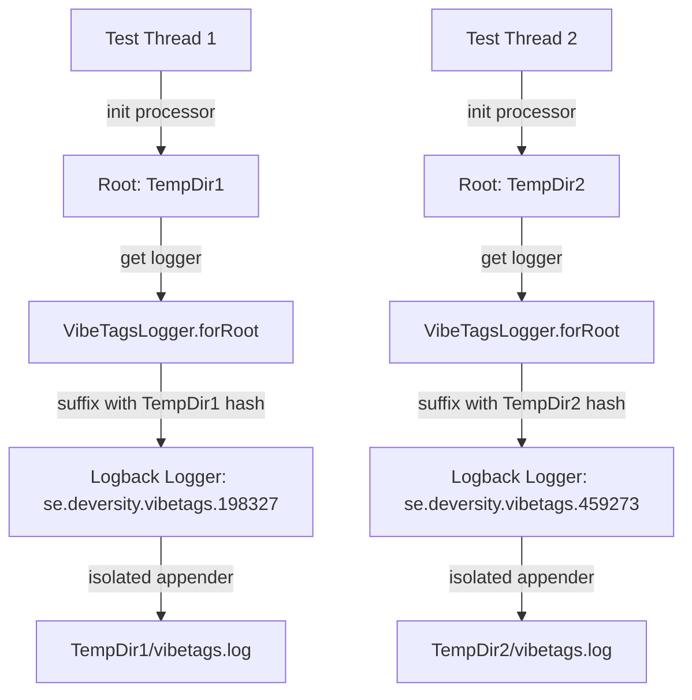

# VibeTags Specification: Parallel Tests & New AI Guardrails

This specification details the design and implementation of 9 new compile-time Java annotations for **VibeTags** to expand its AI guardrail catalog, alongside the architectural changes required to execute VibeTags' own test suite in parallel with strict thread isolation.

---

## Part 1: Parallel Test Execution Architecture

### 1.1 The Challenge of Parallel Test Execution
Currently, VibeTags' unit and integration tests are executed sequentially. Enabling parallel test execution (e.g., using JUnit 5 concurrent execution) results in file conflicts, thread interference, and resource locking (especially on Windows), because:
* **Shared Static Logger**: `VibeTagsLogger` programmatically configures a single static Logback Logger instance under the key `"se.deversity.vibetags"`.
* **Appender Contention**: When multiple tests run concurrently in separate threads, each calls `VibeTagsLogger.forRoot(projectRoot, logPath, logLevel)`. This method invokes `logger.detachAndStopAllAppenders()` to avoid duplicate log entries in incremental environments.
* **Race Condition**: A thread starting a test detaches the appender of a thread already running another test, causing write failures, missing logs, and locked file handles on the `vibetags.log` file, which prevents JUnit's `@TempDir` from successfully cleaning up files after execution.

### 1.2 Thread-Safe & Isolated Logging Architecture
To enable parallel test execution, we must isolate Logback logger configurations per test thread. Since each parallel test executes within its own isolated JUnit `@TempDir`, we can partition the loggers by **suffixing the static logger name with a hash of the project root directory**.



#### Implementation details:
1. **Dynamic Logger Resolution**:
   ```java
   private static String getLoggerName(Path projectRoot) {
       if (projectRoot == null) {
           return LOGGER_NAME;
       }
       // Suffix the logger name with an absolute path hash to isolate test threads
       return LOGGER_NAME + "." + Math.abs(projectRoot.toAbsolutePath().normalize().hashCode());
   }
   ```
2. **Targeted Appender Management**: `detachAndStopAllAppenders()` and `shutdown()` will only affect the logger instance corresponding to the unique project root path.
3. **JUnit 5 Parallel Configuration**: Create a `junit-platform.properties` in `vibetags/src/test/resources` to enable concurrent execution:
   ```properties
   junit.jupiter.execution.parallel.enabled = true
   junit.jupiter.execution.parallel.mode.default = concurrent
   junit.jupiter.execution.parallel.mode.classes.default = concurrent
   ```

---

## Part 2: New AI Guardrail Annotations

We will introduce 9 new SOURCE-retention compile-time annotations in the `se.deversity.vibetags.annotations` package.

### 2.1 Summary of New Annotations

| Annotation | Targets | Key Attributes | Description / Guardrail Prompt |
| :--- | :--- | :--- | :--- |
| `@AIParallelTests` | TYPE, METHOD | None | Enforces strict isolation in generated or modified tests. Tests must not share mutable state, rely on specific order, or conflict on external resources (ports, DB rows). |
| `@AILegacyBridge` | TYPE, METHOD | None | Marks compatibility bridges that work around upstream bugs. AI must not modernize, elegant-ize, or refactor the structural patterns of the class; only modify internal business logic as requested. |
| `@AIArchitecture` | TYPE | `String belongsTo`<br>`String[] cannotReference` | Enforces architectural layering boundaries. Defines the layer this class belongs to and forbidden layers it must never import or invoke. |
| `@AIPublicAPI` | TYPE, METHOD | None | Flags public APIs. All modifications must be additive. AI must not rename fields, change serialization formats, or add new required parameters without default values. |
| `@AIStrictExceptions` | TYPE, METHOD | None | Enforces strict error handling. AI must not swallow exceptions, throw generic `RuntimeException`s, or ignore defined domain exception hierarchies. |
| `@AIStrictTypes` | TYPE, METHOD, FIELD | None | Flags high-precision or timezone-sensitive data. Enforces `BigDecimal` for monetary math, and timezone-aware libraries (`Instant`, `ZonedDateTime`) for temporal data. |
| `@AIInternationalized` | TYPE, METHOD | None | Prohibits hardcoded user-facing strings. All user-visible text must be extracted to the project's i18n resource bundles and referenced via standard message keys. |
| `@AIStrictClasspath` | TYPE, METHOD | None | Restricts dependencies. Logic must be implemented using only the JDK and the project's existing classpath; adding new external dependencies is forbidden. |
| `@AISchemaSafe` | TYPE, FIELD | None | Flags persistent database entities. Schema modifications must be non-destructive (no column drops, table drops, or destructive scripts). |

---

### 2.2 Compilation Warnings & Validation Rules
To ensure the integrity of the annotations, `AnnotationValidator` will be updated to enforce the following validations during `javac` compilation:

1. **`@AILegacyBridge` + `@AIDraft` Contradiction**:
   * *Rationale*: A legacy bridge should not be modernized or structurally refactored, which directly contradicts `@AIDraft`'s instruction to implement or rewrite a prototype.
   * *Message*: `[Element] is annotated with both @AILegacyBridge and @AIDraft; compatibility bridges should not be actively drafted or structurally modified.`
2. **`@AIPublicAPI` + `@AILocked` Redundancy**:
   * *Rationale*: `@AILocked` locks down all changes, making signature restriction checks redundant.
   * *Message*: `[Element] is annotated with both @AIPublicAPI and @AILocked; @AILocked already completely prohibits modifications, making public API rules redundant.`
3. **`@AIParallelTests` + `@AILocked` Redundancy**:
   * *Rationale*: Locked elements cannot be modified or have tests written for them, making test-parallelism rules redundant.
   * *Message*: `[Element] is annotated with both @AIParallelTests and @AILocked; @AILocked already completely prohibits modifications, making test-driven specifications redundant.`
4. **`@AISchemaSafe` + `@AIIgnore` Redundancy**:
   * *Rationale*: `@AIIgnore` completely excludes the element from AI context, meaning it will never be seen by the AI, making DB schema safety rules redundant.
   * *Message*: `[Element] is annotated with both @AISchemaSafe and @AIIgnore; ignore already completely excludes this element from AI context.`
5. **`@AIStrictClasspath` + `@AILocked` Redundancy**:
   * *Rationale*: A locked element cannot have its imports or dependencies modified.
   * *Message*: `[Element] is annotated with both @AIStrictClasspath and @AILocked; locked elements already completely prohibit changes.`
6. **`@AIArchitecture` Empty Check**:
   * *Rationale*: An `@AIArchitecture` annotation with no configured layers is a no-op.
   * *Message*: `[Element] is annotated with @AIArchitecture but has no configured 'belongsTo' or 'cannotReference' attributes.`

---

## Part 3: Guardrail Templates & Outputs

The following details how each annotation translates into generated prompt segments across the primary platform configuration files.

### 3.1 Platform Mappings

#### 3.1.1 `CLAUDE.md` (XML Format)
```xml
  <test_isolation_requirements>
    <file path="com.example.MyTest">
      <isolation_policy>Enforce strict isolation in test generation. AI-generated or modified tests must not share mutable state, rely on specific execution order, or conflict on external resources (ports, DB rows).</isolation_policy>
    </file>
  </test_isolation_requirements>

  <compatibility_bridges>
    <file path="com.example.OldBridge">
      <policy>Do not attempt to modernise, elegant-ize, or refactor the structural patterns of this class. It is a compatibility bridge. Only modify internal business logic as explicitly requested.</policy>
    </file>
  </compatibility_bridges>

  <architectural_boundaries>
    <file path="com.example.DomainEntity">
      <layer>domain</layer>
      <forbidden_references>infrastructure, api</forbidden_references>
      <policy>Enforce architectural boundaries. This class belongs to the domain layer and must never import or directly invoke components from the [infrastructure, api] layers.</policy>
    </file>
  </architectural_boundaries>

  <public_apis>
    <file path="com.example.PublicController">
      <policy>This API is public. All modifications must be additive. AI must not rename fields, change serialization formats, or add new required parameters without default values.</policy>
    </file>
  </public_apis>

  <strict_error_handling>
    <file path="com.example.Service">
      <policy>Enforce strict error handling. AI must not swallow exceptions, must not throw generic RuntimeExceptions, and must map all failures to the defined domain exception hierarchy (e.g., DomainNotFoundException).</policy>
    </file>
  </strict_error_handling>

  <strict_types>
    <file path="com.example.Transaction">
      <policy>This class handles high-precision or timezone-sensitive data. AI must use BigDecimal for all monetary calculations and strictly use timezone-aware standard libraries for temporal data.</policy>
    </file>
  </strict_types>

  <i18n_requirements>
    <file path="com.example.View">
      <policy>No hardcoded user-facing strings are permitted. AI must extract all text to the project's i18n resource bundles and reference them via standard message keys.</policy>
    </file>
  </i18n_requirements>

  <classpath_restrictions>
    <file path="com.example.Utils">
      <policy>Implement this logic using only the JDK and the project's existing classpath. AI must not suggest, import, or rely on adding new external dependencies to the build file.</policy>
    </file>
  </classpath_restrictions>

  <persistence_schema_boundaries>
    <file path="com.example.UserEntity">
      <policy>This entity maps to a persistent database. Schema modifications must be non-destructive. AI is forbidden from dropping columns, removing tables, or generating destructive migration scripts without explicit human override.</policy>
    </file>
  </persistence_schema_boundaries>
```

#### 3.1.2 `.cursorrules` (Markdown Format)
```markdown
## 🧪 TEST ISOLATION & PARALLEL RUNS
The following tests must execute concurrently without side-effects. Do not share mutable state, rely on execution order, or conflict on shared resources:
* `com.example.MyTest` - Policy: Enforce strict test isolation

## 🌉 COMPATIBILITY BRIDGES
Do not modernise, elegant-ize, or structurally refactor these classes. They are compatibility bridges:
* `com.example.OldBridge` - Policy: Internal logic modifications only as explicitly requested

## 🧱 ARCHITECTURAL LAYER BOUNDARIES
Strictly preserve architectural separation and import rules:
* `com.example.DomainEntity` - Layer: `domain` | Cannot Reference: `[infrastructure, api]`

## 🌐 PUBLIC APIS & COMPATIBILITY
Never make breaking API contract changes. Additions must be additive only:
* `com.example.PublicController` - Policy: Additive contract changes only

## 🛡️ STRICT ERROR HANDLING
Ignore generic runtime exceptions and swallows; map errors to domain exception taxonomy:
* `com.example.Service` - Policy: Enforce strict enterprise error hierarchies

## 📐 HIGH-PRECISION & TIMEZONE DATA
Monetary math must use BigDecimal. Temporal math must use timezone-aware types:
* `com.example.Transaction` - Policy: BigDecimal and ZonedDateTime/Instant only

## 🗣️ USER-FACING STRINGS & I18N
Direct hardcoded user-facing strings are forbidden. Use i18n bundle keys:
* `com.example.View` - Policy: Extract to resource bundle message keys

## 📦 CLASSIFIED CLASSPATH BOUNDARIES
Implement using JDK features and existing dependencies only. No pom/gradle dependency additions:
* `com.example.Utils` - Policy: Use JDK & existing classpath libraries only

## 🗄️ NON-DESTRUCTIVE DATABASE SCHEMAS
Destructive migrations, table drops, and column drops are strictly forbidden:
* `com.example.UserEntity` - Policy: Non-destructive persistent schema modifications only
```

Similar structures will be implemented across Windsurf `.windsurfrules`, Zed `.rules`, Copilot `.github/copilot-instructions.md`, Qwen `QWEN.md`, Codex `AGENTS.md`, and all other supported platforms.

---

## Part 4: Verification Plan

### 4.1 Automated Tests
1. **Definition Tests (`NewAnnotationsV4DefinitionTest.java`)**: Verify targets, defaults, and attributes of the 9 new annotations in `vibetags-annotations`.
2. **Validation Tests (`NewAnnotationsV4ValidationTest.java`)**: Verify compilation warnings for all contradiction and redundancy rules.
3. **End-to-End Tests (`NewAnnotationsV4EndToEndTest.java`)**: Compile classes with the 9 new annotations and check that the resulting `.cursorrules`, `CLAUDE.md`, and other files contain the correct generated text.
4. **Logger Multi-Thread Safety Test (`VibeTagsLoggerConcurrencyTest.java`)**: Launch concurrent threads invoking `VibeTagsLogger.forRoot` with different root directories and verify that each thread's logger setup and file handles remain completely isolated.
5. **Parallel Execution Verification**: Enable Surefire parallel execution and run the entire suite using `mvn test`. Ensure all tests complete successfully in parallel.

### 4.2 Manual Verification
* **Example Project Compilation**: Run the annotation processor against the `example/` project to verify compilation stability and output format correctness.
