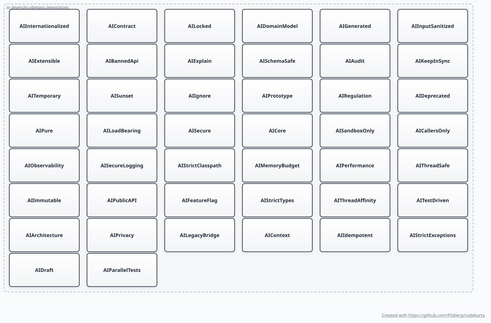

# Annotation Reference

Full list of the 44 `@AI*` annotations, their semantics, and the compile-time validation warnings the processor emits; the Javadoc on each `@interface` in `vibetags-annotations/` is the source of truth — this is a convenience index.

### The annotation surface

Every `@interface` in `vibetags-annotations`, parsed from the source rather than transcribed —
so the count in the picture and the count in the table below cannot silently disagree. There
are no edges: the annotations are independent by design, which is what lets a consumer put any
combination on one element and what makes `AnnotationValidator`'s contradiction warnings (listed
at the bottom of this file) the only coupling between them.

Regenerated by
[`tools/generate-architecture-diagrams.sh`](../tools/generate-architecture-diagrams.sh) from
[`vibetags-annotations/src/main/java/se/deversity/vibetags/annotations`](../vibetags-annotations/src/main/java/se/deversity/vibetags/annotations);
the rest of the parsed set is described in
[ARCHITECTURE.md](ARCHITECTURE.md#parsed-diagrams-code-karta). Adding an annotation means
rerunning that script — see the `add-annotation` skill for the full checklist.

### Visibility boundaries

Two places an annotation can be written and silently mean nothing, both inherent to JSR 269
rather than to VibeTags:

- **Method bodies.** Annotation processing sees declarations, not statements: `@AI*` on a local
  class or an anonymous class member never reaches the processor. Whenever the processor runs at
  all it detects these through the javac Tree API and emits a WARNING (hoist the guarded logic to
  a named member); a compilation whose *only* VibeTags annotations sit inside bodies never
  triggers the processor in the first place — see the SPI section of
  [PROCESSOR.md](PROCESSOR.md#spi-registration).
- **Overrides and subclasses.** SOURCE retention plus the absence of `@Inherited` means a lock
  does not follow an override. A same-compilation override of an `@AILocked` concrete method
  draws a WARNING (`LockedOverrideRule`); an override compiled separately cannot be seen at all —
  annotate it explicitly if the guardrail should apply there too.

### Annotations (all `RetentionPolicy.SOURCE`)

| Annotation | Targets | Key Attributes |
|---|---|---|
| `@AILocked` | TYPE, METHOD, FIELD | `reason: String` |
| `@AIContext` | TYPE, METHOD, PACKAGE | `focus: String`, `avoids: String` |
| `@AIDraft` | TYPE, METHOD | `instructions: String` |
| `@AIAudit` | TYPE, METHOD, PACKAGE | `checkFor: String[]` |
| `@AIIgnore` | TYPE, METHOD, FIELD | `reason: String` |
| `@AIPrivacy` | TYPE, METHOD, FIELD, PACKAGE | `reason: String` |
| `@AICore` | TYPE, METHOD, FIELD, PACKAGE | `sensitivity: String`, `note: String` |
| `@AIPerformance` | TYPE, METHOD | `constraint: String` |
| `@AIContract` | TYPE, METHOD | `reason: String` |
| `@AITestDriven` | TYPE, METHOD | `testLocation: String`, `coverageGoal: int`, `framework: Framework[]`, `mockPolicy: String` |
| `@AIThreadSafe` | TYPE, METHOD, PACKAGE | `strategy: Strategy`, `note: String` |
| `@AIImmutable` | TYPE, PACKAGE | `note: String` |
| `@AIDeprecated` | TYPE, METHOD, FIELD, PACKAGE | `replacedBy: String`, `migrationGuide: String`, `deadline: String` |
| `@AIObservability` | TYPE, METHOD | `metrics: String[]`, `traces: String[]`, `logs: String[]`, `note: String` |
| `@AIRegulation` | TYPE, METHOD, FIELD, PACKAGE | `standard: String`, `clause: String`, `description: String` |
| `@AIArchitecture` | TYPE, PACKAGE | `belongsTo: String`, `cannotReference: String[]` |
| `@AILegacyBridge` | TYPE, METHOD | `reason: String` |
| `@AIStrictClasspath` | TYPE, METHOD, PACKAGE | `reason: String` |
| `@AIInternationalized` | TYPE, METHOD | `reason: String` |
| `@AIPublicAPI` | TYPE, METHOD, PACKAGE | `reason: String` |
| `@AISchemaSafe` | TYPE, FIELD | `reason: String` |
| `@AIStrictExceptions` | TYPE, METHOD | `reason: String` |
| `@AIStrictTypes` | TYPE, METHOD, FIELD | `reason: String` |
| `@AIParallelTests` | TYPE, METHOD | `reason: String` |
| `@AIIdempotent` | TYPE, METHOD | `reason: String` |
| `@AIFeatureFlag` | TYPE, METHOD, FIELD | `flag: String`, `defaultValue: boolean` |
| `@AISecure` | TYPE, METHOD, PACKAGE | `aspect: String` |
| `@AICallersOnly` | TYPE, METHOD | `value: String[]` |
| `@AISandboxOnly` | TYPE, METHOD | `reason: String` |
| `@AIMemoryBudget` | TYPE, METHOD | `value: AllocationPolicy` |
| `@AIPure` | METHOD | `reason: String` |
| `@AIDomainModel` | TYPE | `allow: String[]` |
| `@AIExtensible` | TYPE | `value: Strategy` |
| `@AIInputSanitized` | PARAMETER, FIELD | `value: SanitizerType[]` |
| `@AISecureLogging` | FIELD, PARAMETER | `value: MaskingPolicy` |
| `@AIExplain` | TYPE, METHOD | `value: ComplexityLevel` |
| `@AIPrototype` | TYPE | `reason: String` |
| `@AISunset` | TYPE, METHOD, FIELD | `jira: String`, `replacement: Class<?>` |
| `@AITemporary` | TYPE, METHOD | `expiresOn: String`, `reason: String` |
| `@AIGenerated` | TYPE, METHOD, FIELD | `from: String`, `regenerateWith: String`, `editInstead: String` |
| `@AILoadBearing` | TYPE, METHOD, FIELD, PARAMETER | `invariant: String`, `breaksIf: String`, `suppressAudit: boolean` |
| `@AIBannedApi` | TYPE, METHOD, PACKAGE | `forbidden: String[]`, `useInstead: String`, `reason: String` |
| `@AIThreadAffinity` | TYPE, METHOD | `value: Affinity`, `thread: String`, `marshalVia: String`, `symptomIfViolated: String` |
| `@AIKeepInSync` | TYPE, METHOD, FIELD | `mirrors: String[]`, `reason: String`, `enforcedBy: String` |

**Annotation semantics:**

- `@AILocked` — code is visible but must not be modified by AI
- `@AIIgnore` — code is excluded from AI context entirely (treat as non-existent); unlike `@AILocked`, the AI should not even be aware of it
- `@AIPrivacy` — element handles PII; AI must never include its runtime values in logs, test fixtures, mock data, or API suggestions (GDPR/HIPAA/PCI-DSS use cases)
- `@AICore` — marks well-tested, sensitive core logic (e.g., months to stabilize); AI is instructed to treat changes with extreme care
- `@AIPerformance` — enforces strict time/space complexity on hot-path code; AI must not introduce O(n²) or worse solutions
- `@AIContract` — freezes the public signature (method name, parameter types, parameter order, return type, checked exceptions); AI may change internal logic but must not alter the visible API surface
- `@AITestDriven` — every change must include a matching test update; declares preferred framework, coverage goal, and mock policy
- `@AIThreadSafe` — declares an explicit thread-safety strategy (`SYNCHRONIZED`, `LOCK_FREE`, `IMMUTABLE`, `THREAD_LOCAL`, `OTHER`); AI must preserve the synchronization invariant
- `@AIImmutable` — declares the type immutable; the processor warns if any non-static field is non-final
- `@AIDeprecated` — actively routes AI toward replacing callers; richer than Java's `@Deprecated` (replacement target, migration guide, removal deadline)
- `@AIObservability` — names the metrics, trace spans, and log statements downstream dashboards depend on; AI must not silently remove or rename them
- `@AIRegulation` — ties code to a specific regulatory clause (GDPR, PCI-DSS, HIPAA, SOX, …); AI must document compliance impact and never weaken the requirement
- `@AIArchitecture` — declares `belongsTo` layer and forbidden `cannotReference` layers; AI must not introduce cross-layer imports
- `@AILegacyBridge` — marks compatibility shims for upstream quirks/bugs; AI must not modernize the structure, only internal logic may change
- `@AIStrictClasspath` — prohibits dynamic class loading, custom `ClassLoader`s, and runtime reflection; all deps must resolve at compile time
- `@AIInternationalized` — all user-visible text must come from i18n bundles; AI must never hardcode user-facing strings
- `@AIPublicAPI` — all changes must be additive and backward-compatible; renaming or changing serialization is forbidden
- `@AISchemaSafe` — maps to persistent storage; destructive schema changes require explicit backward-compatible migrations
- `@AIStrictExceptions` — prohibits catching/throwing `Exception`/`Throwable`; requires specific types with descriptive messages
- `@AIStrictTypes` — prohibits loose types (`Object`, raw collections, `double` for money); requires well-typed domain models
- `@AIParallelTests` — generated/modified tests must be parallel-safe: no shared mutable state, fixed ports, or execution-order dependencies
- `@AIIdempotent` — marks operations that must remain idempotent; AI must never introduce side effects that cause repeated invocations to produce different results
- `@AIFeatureFlag` — marks code gated behind a feature flag; AI must preserve the flag check and never assume it is always active
- `@AISecure` — marks security-critical code; AI must never weaken security properties and must flag every change for security review
- `@AICallersOnly` — only the listed callers may invoke the element; AI must not introduce calls from outside the allowed boundary
- `@AISandboxOnly` — sandbox/test-harness code; production code must never import or reference it
- `@AIMemoryBudget` — strict heap-allocation budget (`ZERO_ALLOCATION`, `NO_AUTOBOXING`, …); AI must optimize allocations and never add per-call garbage
- `@AIPure` — must remain a pure function: no side effects, no state mutation, deterministic for the same inputs
- `@AIDomainModel` — framework-free domain entity; AI must not import Spring, JPA/Hibernate, Jackson, or other framework packages (exceptions via `allow`)
- `@AIExtensible` — extend via the declared polymorphic pattern (`STRATEGY_PATTERN`, `VISITOR_PATTERN`, …); AI must not append branch conditionals
- `@AIInputSanitized` — parameter/field must pass approved sanitizers (`SQL_INJECTION`, `XSS`, `PATH_TRAVERSAL`, …) before reaching queries or renderers
- `@AISecureLogging` — sensitive value; AI must enforce the masking policy (`OMIT`, `HASH`, `MASK_CREDIT_CARD`, …) in any logging it writes
- `@AIExplain` — changes require a step-by-step proof of correctness in the PR/walkthrough, scaled to the declared complexity level
- `@AIPrototype` — experimental stub: QA/test constraints are relaxed, but production classes must never import it
- `@AISunset` — strict deprecation tied to a JIRA ticket; introducing *new* references is forbidden, callers route to `replacement`
- `@AITemporary` — hotfix/stub with an expiration date (`YYYY-MM-DD`); must be removed before expiry, warned at compile time once exceeded
- `@AIGenerated` — machine-generated; hand edits are silently overwritten. A **redirect**, not a wall: unlike `@AILocked` it names where the change belongs, and unlike `@AIIgnore` the element stays readable (an agent must understand generated behaviour, just never write it)
- `@AILoadBearing` — looks wrong, redundant, or over-defensive but is deliberate; records the failure that "cleaning it up" reintroduces. Edits are allowed while the `invariant` survives, which is what separates it from `@AILocked`. Also covers the *intentional omission* case, hosted on the enclosing element
- `@AIBannedApi` — named symbols are forbidden *at this element* even though they compile. Hosted on the consumer and pointing outward, because the banned symbols (stdlib, third-party) usually cannot be annotated themselves; `@AIArchitecture(cannotReference)` bans a layer rather than a symbol and carries no replacement
- `@AIThreadAffinity` — safe on **exactly one** thread; the inverse of `@AIThreadSafe`, which promises safety from any. Prevents the specific failure of an agent "fixing" affinity by adding a lock
- `@AIKeepInSync` — duplicated at named `mirrors` that must move together; the element is free to change, and the failure mode is a *partial* change that desyncs a mirror no compiler checks. `enforcedBy` names the parity test, if one exists

**Compile-time validation warnings:**

- `@AIDraft` + `@AILocked` on the same element — contradictory (locked but needs drafting)
- `@AIAudit` with empty `checkFor[]` — no-op; nothing to audit
- `@AIPrivacy` + `@AIIgnore` on the same element — redundant; ignore already excludes
- `@AIContract` + `@AIDraft` on the same element — contradictory (signature frozen but needs drafting)
- `@AIContract` + `@AILocked` on the same element — overlapping intent (`@AILocked` already prohibits all changes; `@AIContract` is redundant)
- `@AITestDriven` + `@AIIgnore` / `@AILocked` — contradictory (cannot enforce tests on excluded or locked code)
- `@AITestDriven` with `coverageGoal` outside `[0, 100]` — invalid value
- `@AIImmutable` on a type with a non-final, non-static instance field — violates the immutability declaration
- `@AIDeprecated` + `@AILocked` on the same element — contradictory (locked preserves; deprecated routes callers away)
- `@AIThreadSafe(IMMUTABLE)` + `@AIImmutable` — redundant; `@AIImmutable` already implies thread-safety
- `@AIObservability` with no metrics, traces, or logs — no-op; nothing to preserve
- `@AIRegulation` with a blank `standard` — required attribute missing
- `@AIIdempotent` + `@AIDraft` on the same element — contradictory (idempotent declares a stable contract; draft marks it as unfinished)
- `@AIFeatureFlag` + `@AILocked` on the same element — contradictory (locked freezes code; feature flag implies conditional execution)
- `@AIFeatureFlag` with blank `flag` — no-op; the flag key is unspecified
- `@AISecure` with blank `aspect` — advisory; consider specifying the security concern (e.g. `"authentication"`, `"encryption"`)
- `@AISecure` + `@AIIgnore` on the same element — contradictory; `@AIIgnore` hides the element but `@AISecure` requires AI visibility for security review
- `@AISunset` + `@AIDraft` on the same element — contradictory (sunset elements must not be actively drafted or expanded)
- `@AISunset` with a blank `jira` — required attribute missing
- `@AITemporary` with a blank or unparseable `expiresOn` date — invalid value
- `@AITemporary` whose `expiresOn` date has passed — expired workaround still in the codebase
- `@AIGenerated` + `@AIIgnore` on the same element — contradictory; generated code must stay readable (read but never write) while `@AIIgnore` hides it entirely
- `@AIGenerated` + `@AIDraft` on the same element — contradictory; draft asks the AI to implement it, but generated code is overwritten on the next build
- `@AIGenerated` with blank `regenerateWith` **and** blank `editInstead` — names a source but no route back to it, leaving a dead end rather than a redirect
- `@AILoadBearing` with a blank `breaksIf` — advisory; naming the concrete failure is what stops the code being "simplified" anyway
- `@AILoadBearing(suppressAudit = true)` + `@AIAudit` — contradictory; one suppresses audit findings, the other mandates them
- `@AIBannedApi` with empty `forbidden[]` — no-op; nothing is banned
- `@AIBannedApi` with a blank `useInstead` — advisory; a ban with no sanctioned route usually produces a worse substitute
- `@AIThreadAffinity` + `@AIThreadSafe` on the same element — contradictory; these are opposite claims (safe on exactly one thread vs. safe on any), so one of them is false
- `@AIThreadAffinity(NAMED)` with a blank `thread` — the required thread is unidentifiable
- `@AIThreadAffinity` with a blank `marshalVia` — advisory; a caller on the wrong thread is told "no" with no way to comply
- `@AIKeepInSync` with empty `mirrors[]` — no-op; nothing is kept in sync
- `@AIKeepInSync` + `@AIContract` on the same element — NOTE; verify the mirrors track something other than the frozen signature
- `@AIIgnore` present but no `.cursorignore` / `.claudeignore` / `.copilotignore` / `.qwenignore` / `.aiexclude` exists — orphaned ignore annotation
- `@AILocked` present but no `.aiexclude` — Gemini/Codex lock not active

**Modern-Java detectors:**

The checks above compare annotations against each other. These compare an annotation against the
*declaration* it sits on, and each one exists because a language feature newer than Java 8 changed
what that declaration already guarantees — or already forbids. All of them read
`javax.lang.model` only, so unlike `@AIArchitecture(cannotReference)` they still fire under
Gradle's compiler.

- `@AIImmutable` on a type with an array-typed instance field — `final` freezes the reference, not
  the elements. On a **record** (16) the generated accessor hands that array straight out, which is
  the case the language makes easiest to miss: records remove the usual reminder that a field wants
  a defensive copy
- `@AIExtensible` on a `final` type, a **record**, or an `enum` — implicitly or explicitly final, so
  nothing can extend it and the strategy/visitor/factory route the annotation asks for is not open
- `@AIExtensible` on a **sealed** type (17) — only the permitted subtypes can extend it, so adding
  an implementation also means editing the `permits` clause, which is exactly the central edit the
  annotation exists to avoid
- `@AIPure` on a `void` method — a pure method with no return value has no observable effect at
  all: either it mutates something (and is not pure) or it does nothing
- `@AIPublicAPI` on a non-public element, or one enclosed in a non-public type — no caller outside
  the package can bind to it, so the promise is about a surface that is not published. Under the
  enforcing mode it would guard a signature that is free to change
- `@AIThreadSafe(THREAD_LOCAL)` on a type that declares a `ThreadLocal` field — NOTE. Under
  **virtual threads** (21) that is one copy per task rather than one per pooled thread;
  `ScopedValue` ([JEP 506](https://openjdk.org/jeps/506), final in 25) binds a per-request constant
  for the call and releases it on return
- `@AILocked` / `@AIContract` / `@AIPublicAPI` on an element in the **unnamed package** — reachable
  without meaning to since **compact source files** ([JEP 512](https://openjdk.org/jeps/512), final
  in 25). VibeTags identifies a guarded element by its fully-qualified name, so two unnamed-package
  declarations sharing a simple name collide into one guardrail entry and one enforcement-baseline
  key

Adding a check is one line in `ValidationRules.PAIRS`, or an entry in `CoreRules` (an annotation
whose own attributes leave it instructing nobody) or `ModernJavaRules` (the list above). See
`processor/internal/validation/`.
