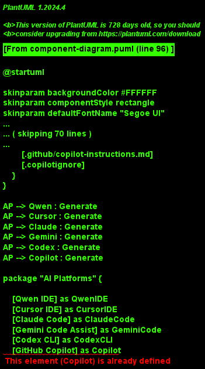
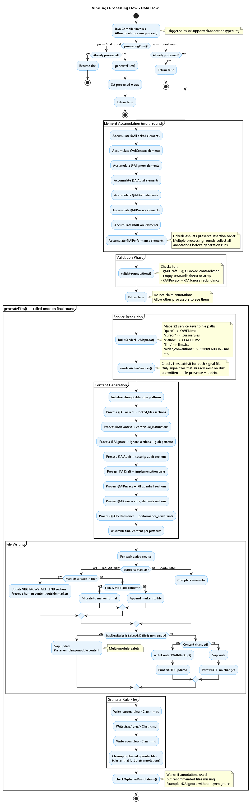
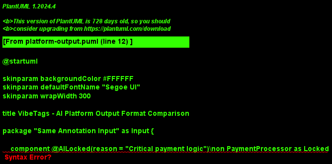

# VibeTags Architecture - Technical Deep Dive

## Overview

VibeTags is a **Java annotation processor** (JSR 269 compliant) that generates AI platform-specific configuration files from Java source code annotations. It operates at **compile-time only**, with zero runtime overhead.

```
Developer Annotations → javac + Annotation Processor → AI Config Files
```

### Key Technical Characteristics

- **Compile-time only**: Uses `@Retention(RetentionPolicy.SOURCE)` - annotations stripped from bytecode
- **Zero runtime dependency**: No VibeTags classes in production artifacts
- **File-existence opt-in**: Only generates files that already exist on disk
- **Write-if-changed**: Only updates files when content actually differs
- **Multi-platform**: Generates configs for 12+ AI platforms simultaneously (Cursor, Claude, Gemini, Codex, Copilot, Qwen, Aider, Trae, Roo, Windsurf via llms.txt, and more)
- **Version stamped**: Every file includes VibeTags version + GitHub URL

### Published Artifacts

As of 0.6.0, VibeTags ships as three coordinates on Maven Central:

| Artifact | Purpose | Goes on | Depends on |
|---|---|---|---|
| `se.deversity.vibetags:vibetags-annotations` | The 8 `@interface` classes | Consumer's compile classpath | nothing |
| `se.deversity.vibetags:vibetags-processor` | `AIGuardrailProcessor` + `VibeTagsLogger` (slf4j/logback) | Annotation-processor path only | `vibetags-annotations` |
| `se.deversity.vibetags:vibetags-bom` (pom-only) | Manages versions of the two jars above | `<dependencyManagement>` import / Gradle `platform(...)` | — |

The split keeps `slf4j` / `logback` (the processor's internal logging deps) off the consumer's `compileClasspath`. Existing 0.5.x setups that pin only `vibetags-processor` continue to work — the processor declares `vibetags-annotations` as a regular compile dependency so the annotation classes are still resolved transitively. New projects should adopt the split layout shown in the README's Installation section.

## Table of Contents

- [System Architecture](#system-architecture)
- [Component Diagram](#component-diagram)
- [Class Diagram](#class-diagram)
- [Build Sequence](#build-sequence)
- [Data Flow](#data-flow)
- [Platform Output Formats](#platform-output-formats)
- [Core Components](#core-components)
  - [Annotations](#annotations)
  - [Annotation Processor](#annotation-processor)
  - [Generated Output Files](#generated-output-files)
- [Build Flow](#build-flow)
- [Directory Structure](#directory-structure)
- [Design Decisions](#design-decisions)
- [Testing Strategy](#testing-strategy)
- [Limitations](#limitations)
- [Future Architecture](#future-architecture)

---

## System Architecture

### Component Diagram



*Figure 1: High-level system architecture showing component interactions*

**Technical Flow:**
1. Developer annotates Java source code with VibeTags annotations
2. Build system (Maven/Gradle) invokes `javac` compiler
3. `javac` discovers `AIGuardrailProcessor` via SPI (`META-INF/services/`)
4. Processor scans annotations during compilation
5. Processor generates platform-specific config files to project root
6. Compiled bytecode contains zero VibeTags artifacts

### Class Diagram


*Figure 2: Class architecture showing annotation definitions and processor*

**Key Components:**

**Annotations** — package `se.deversity.vibetags.annotations`, jar `vibetags-annotations`:
- `@AILocked` - Prevents AI modifications (reason: String)
- `@AIContext` - Guides AI behavior (focus: String, avoids: String)
- `@AIDraft` - Requests AI implementation (instructions: String)
- `@AIAudit` - Triggers security audits (checkFor: String[])
- `@AIIgnore` - Excludes from AI context (reason: String)
- `@AIPrivacy` - Marks PII-handling elements; AI must never log or expose their values (reason: String)
- `@AICore` - Marks sensitive core logic; AI must change with extreme caution (sensitivity: String, note: String)
- `@AIPerformance` - Hot-path constraint; AI must not introduce O(n²) complexity (constraint: String)
- `@AIContract` - Freezes the public signature; AI may change internal logic but must not alter method name, parameter types/order, return type, or checked exceptions (reason: String)

**Processor** — package `se.deversity.vibetags.processor`, jar `vibetags-processor`:
- `AIGuardrailProcessor` — extends `AbstractProcessor` (JSR 269); thin orchestrator (~230 lines) that wires the helpers below into the JSR 269 lifecycle
- `VibeTagsLogger` — SLF4J/Logback file logger, configurable via `-Avibetags.log.*`
- `@SupportedAnnotationTypes("*")` — processes all annotations
- `@SupportedSourceVersion(RELEASE_11)` — Java 11+ support
- Compile-scope dependency on `vibetags-annotations` so the processor code can reference annotation classes (e.g. `roundEnv.getElementsAnnotatedWith(AILocked.class)`) and so legacy single-coordinate consumers still get the annotations transitively.

**Internal helpers** — package `se.deversity.vibetags.processor.internal` (single-responsibility classes that do the actual work, since 0.6.0):
- `AnnotationCollector` — owns the nine `LinkedHashSet<Element>` accumulators that aggregate annotated elements across all `javac` rounds; also tracks the `anyAnnotationsFound` flag used for the multi-module preservation check
- `AnnotationValidator` — emits five compile-time consistency warnings (`@AIDraft`+`@AILocked` contradiction, empty `@AIAudit.checkFor`, redundant `@AIPrivacy`+`@AIIgnore`, `@AIContract`+`@AIDraft` contradiction, `@AIContract`+`@AILocked` overlap)
- `OrphanWarner` — emits warnings when annotations are used but the corresponding ignore-file isn't present (e.g. `@AIIgnore` without `.cursorignore`)
- `ServiceRegistry` — maps logical service keys to file paths and resolves which services are "active" via the file-existence opt-in
- `ElementNaming` — pure helpers for `elementPath`, `elementDisplayName`, `owningElement`
- `GuardrailContentBuilder` — owns every per-platform `StringBuilder` and runs nine `appendXxx(Element)` methods (one per annotation type); produces a `service-key → content` map plus the per-element granular rule map. No I/O.
- `GuardrailFileWriter` — atomic, marker-aware file writes, YAML front-matter preservation, legacy (pre-marker) block migration, and orphan cleanup for granular rule files
- `GranularRulesWriter` — writes per-class `.mdc`/`.md` files for Cursor / Trae / Roo and orchestrates orphan cleanup via the file writer

This split (introduced in 0.6.0) keeps each helper around 50–600 lines, well-tested in isolation, and makes the orchestrator's `generateFiles()` method a 50-line read.

---

## Build Sequence


*Figure 3: Sequence diagram of annotation processing during compilation*

### Processing Phases

**Phase 1: Element Accumulation (every round)**
```java
lockedElements.addAll(roundEnv.getElementsAnnotatedWith(AILocked.class));
// ... repeat for all 8 annotation types
validateAnnotations(processingEnv.getMessager(), roundEnv);
return false; // do not claim annotations
```
- Accumulates annotated elements into `LinkedHashSet`s across all rounds
- Validates annotations each round for early compiler feedback
- Returns `false` so other processors still see the annotations

**Phase 1b: Generation Trigger**
```java
if (roundEnv.processingOver() && !processed) {
    generateFiles();
    processed = true;
}
```
- `generateFiles()` runs exactly once, on the final round when `processingOver()` is true
- Idempotency guard (`processed` flag) prevents double-generation

**Phase 2: Validation**
```java
validateAnnotations(processingEnv.getMessager(), roundEnv);
```
- Checks for contradictory annotations (@AIDraft + @AILocked on same element)
- Warns about empty @AIAudit (no checkFor items)
- Emits compiler warnings via `Messager`

**Phase 3: Service Resolution**
```java
Map<String, Path> serviceFiles = buildServiceFileMap(root);
Set<String> activeServices = resolveActiveServices(messager, serviceFiles);
```
- Maps 17+ service keys to file paths
- Checks file existence (file presence = opt-in)
- Only active services get generated

**Phase 4: Content Generation**
- Iterates each annotation type
- Accumulates platform-specific content in StringBuilders
- Formats output per platform conventions (Markdown, XML, TOML, JSON)

**Phase 5: File Writing**
```java
boolean changed = writeFileIfChanged(filePath, content);
```
- Strips whitespace for comparison
- Only writes if content differs
- Emits NOTE: "updated" or "no changes"

**Phase 6: Orphaned Annotation Check**
```java
checkOrphanedAnnotations(messager, activeServices, ...);
```
- Warns if annotations used but recommended files missing
- Example: @AIIgnore used but .qwenignore missing

---

## Data Flow



*Figure 4: Detailed data flow through the annotation processor*

### Annotation Processing Details

**@AILocked Processing:**
```java
for (Element element : roundEnv.getElementsAnnotatedWith(AILocked.class)) {
    AILocked locked = element.getAnnotation(AILocked.class);
    String className = element.toString();
    String reason = locked.reason();
    
    // Append to all platforms
    cursorRules.append("* `").append(className).append("` - Reason: ").append(reason).append("\n");
    qwenMd.append("* `").append(className).append("` — ").append(reason).append("\n");
    // ... other platforms
}
```

**@AIContext Processing:**
```java
for (Element element : roundEnv.getElementsAnnotatedWith(AIContext.class)) {
    AIContext context = element.getAnnotation(AIContext.class);
    String className = element.toString();
    
    // Platform-specific formatting
    cursorRules.append("* `").append(className).append("`\n")
               .append("  * Focus: ").append(context.focus())
               .append("\n  * Avoid: ").append(context.avoids()).append("\n");
}
```

**@AIIgnore Processing:**
```java
for (Element element : roundEnv.getElementsAnnotatedWith(AIIgnore.class)) {
    String className = element.toString();
    
    // Write to ignore sections
    qwenIgnore.append("* `").append(className).append("`\n");
    
    // Write glob patterns to standalone ignore files
    String globPattern = "**/"+ element.getSimpleName() + ".java\n";
    qwenIgnoreFile.append(globPattern);
}
```

**@AIAudit Processing:**
```java
for (Element element : roundEnv.getElementsAnnotatedWith(AIAudit.class)) {
    AIAudit audit = element.getAnnotation(AIAudit.class);
    String className = element.toString();
    String[] checkFor = audit.checkFor();
    
    // Platform-specific audit format
    qwenAudit.append("* `").append(className).append("`\n");
    qwenAudit.append("  - Required Checks: ").append(String.join(", ", checkFor)).append("\n");
}
```

**@AIPrivacy Processing:**
```java
for (Element element : roundEnv.getElementsAnnotatedWith(AIPrivacy.class)) {
    AIPrivacy privacy = element.getAnnotation(AIPrivacy.class);
    String elementPath = element.toString();
    String reason = privacy.reason();

    // Claude: XML pii_guardrails block
    claudePrivacy.append("    <element path=\"").append(elementPath).append("\">\n");
    claudePrivacy.append("      <reason>").append(reason).append("</reason>\n");
    claudePrivacy.append("    </element>\n");

    // Cursor / Codex / Copilot / Gemini / Qwen: Markdown list
    cursorPrivacy.append("* `").append(elementPath).append("` — ").append(reason).append("\n");
}

// After the loop, if hasPrivacyAnnotations == true, finalize PII sections for all platforms
// Claude gets <pii_guardrails> XML + <rule> about never logging values
// Others get a "## 🔐 PII GUARDRAILS" Markdown section
```

---

## Platform Output Formats



*Figure 5: Same annotation data formatted for different AI platforms*

### Platform-Specific Format Examples

**Qwen (QWEN.md)** - Clean Markdown:
```markdown
# PROJECT CONTEXT
# Generated by VibeTags v1.0.0-SNAPSHOT | https://github.com/PIsberg/vibetags

## LOCKED FILES (DO NOT EDIT)
* `com.example.PaymentProcessor` — Critical payment logic

## CONTEXTUAL RULES
* `com.example.StringParser`
  * Focus: Memory optimization
  * Avoid: java.util.regex

## 🛡️ MANDATORY SECURITY AUDITS
* `com.example.DatabaseConnector`
  - Required Checks: SQL Injection, Thread Safety

## IGNORED ELEMENTS
* `com.example.GeneratedMetadata`
```

**Claude (CLAUDE.md)** - XML Structure:
```xml
<!-- Generated by VibeTags v1.0.0-SNAPSHOT | https://github.com/PIsberg/vibetags -->
<project_guardrails>
  <locked_files>
    <file path="com.example.PaymentProcessor">
      <reason>Critical payment logic</reason>
    </file>
  </locked_files>
  <audit_requirements>
    <file path="com.example.DatabaseConnector">
      <vulnerability_check>SQL Injection</vulnerability_check>
      <vulnerability_check>Thread Safety</vulnerability_check>
    </file>
  </audit_requirements>
</project_guardrails>
<rule>Never propose edits to locked files.</rule>
```

**Cursor (.cursorrules)** - Markdown with Emoji:
```markdown
# AUTO-GENERATED AI RULES
# Generated by VibeTags v1.0.0-SNAPSHOT | https://github.com/PIsberg/vibetags

## LOCKED FILES (DO NOT EDIT)
* `com.example.PaymentProcessor` - Reason: Critical payment logic

## 🛡️ MANDATORY SECURITY AUDITS
* `com.example.DatabaseConnector`
  - Required Checks: SQL Injection, Thread Safety
```

**.qwen/settings.json** - JSON Configuration:
```json
{
  "project": {
    "model": "qwen3-coder-plus",
    "mcp": {
      "enabled": true
    }
  }
}
```

**.qwenignore** - Glob Patterns:
```
# AUTO-GENERATED BY VIBETAGS
# Generated by VibeTags v1.0.0-SNAPSHOT | https://github.com/PIsberg/vibetags
# Qwen-specific exclusion list.
**/GeneratedMetadata.java
```

---

## Core Components

### Annotations

All annotations use `@Retention(RetentionPolicy.SOURCE)` — they exist only at compile time and are stripped from final bytecode.

| Annotation | Targets | Attributes | Purpose |
|---|---|---|---|
| **`@AILocked`** | TYPE, METHOD, FIELD | `reason: String` | Protects critical code from AI modifications |
| **`@AIContext`** | TYPE, METHOD | `focus: String`, `avoids: String` | Guides AI behavior with positive/negative instructions |
| **`@AIDraft`** | TYPE, METHOD | `instructions: String` | Marks incomplete code needing AI implementation |
| **`@AIAudit`** | TYPE, METHOD | `checkFor: String[]` | Triggers mandatory security vulnerability checks |
| **`@AIIgnore`** | TYPE, METHOD, FIELD | `reason: String` | Excludes element from AI context entirely |
| **`@AIPrivacy`** | TYPE, METHOD, FIELD | `reason: String` | Marks PII-handling elements; AI must never log or expose their values |
| **`@AICore`** | TYPE, METHOD, FIELD | `sensitivity: String`, `note: String` | Marks well-tested core logic; AI must change with extreme caution |
| **`@AIPerformance`** | TYPE, METHOD, FIELD | `constraint: String` | Hot-path constraint; AI must not introduce O(n²) or worse complexity |
| **`@AIContract`** | TYPE, METHOD | `reason: String` | Freezes public signature; AI may change internal logic but must not alter method name, parameter types/order, return type, or checked exceptions |

**Annotation semantics compared:**
- `@AILocked` — visible to AI but must not be modified
- `@AIIgnore` — removed from AI context completely; AI should not reference it
- `@AIPrivacy` — visible to AI but runtime values are strictly confidential; never log, expose in suggestions, test fixtures, or external API calls
- `@AICore` — visible, modifiable, but AI must treat changes with extreme caution and verify test coverage
- `@AIPerformance` — visible, modifiable, but AI must never introduce O(n²) or worse complexity
- `@AIContract` — visible, modifiable internally, but the public signature (name, param types/order, return type, checked exceptions) is immutable

**Invalid combinations that trigger compiler WARNINGs:**
- `@AIPrivacy` + `@AIIgnore` — redundant; `@AIIgnore` already hides the element from AI entirely
- `@AIContract` + `@AIDraft` — contradictory; a frozen signature that also needs drafting is logically inconsistent
- `@AIContract` + `@AILocked` — overlapping; `@AILocked` already prohibits all modifications, making `@AIContract`'s "logic is changeable" carve-out meaningless

### Annotation Processor

**Class:** `se.deversity.vibetags.processor.AIGuardrailProcessor`

**Key Characteristics:**
- Extends `javax.annotation.processing.AbstractProcessor` (JSR 269)
- Registered via SPI: `META-INF/services/javax.annotation.processing.Processor`
- Supports Java 11+ source versions
- Uses `@SupportedAnnotationTypes("*")` to process all annotations
- **Thin orchestrator** (~230 lines): all the actual work lives in `internal/*` helpers

**Processing Logic:**

```
Accumulation phase (every round, until processingOver() == true):
1. AnnotationCollector.collect(roundEnv) — drains the round into the nine
   LinkedHashSet<Element> accumulators (one per annotation type)
2. AnnotationValidator.validate(messager, roundEnv) — five compile-time checks:
   - @AIDraft + @AILocked contradiction
   - Empty @AIAudit.checkFor
   - Redundant @AIPrivacy + @AIIgnore
   - @AIContract + @AIDraft contradiction (signature frozen but needs drafting)
   - @AIContract + @AILocked overlap (both annotations on same element)
3. process() returns false so other processors still see the annotations

Generation phase (once, on the round where processingOver() == true):
4. ServiceRegistry.buildServiceFileMap(root) → service-key → file-path map
5. ServiceRegistry.resolveActiveServices(messager, files) → file-existence opt-in
6. GuardrailContentBuilder.build() runs all nine per-annotation appenders
   (Locked / Context / Ignore / Audit / Draft / Privacy / Core / Performance / Contract)
   in one pass, then assembles llms.txt, llms-full.txt, gemini, and the final
   service-key → content map. The builder owns every per-platform StringBuilder
   and performs no I/O.
7. GuardrailFileWriter.writeFileIfChanged(...) for each active service —
   marker-aware updates, YAML front-matter preservation, atomic writes
8. GranularRulesWriter.writeAll(...) — per-class .mdc/.md for Cursor / Trae / Roo
9. GranularRulesWriter.cleanupAll(...) — remove orphaned granular files
   (skipping the names just written, to avoid delete-then-recreate cycles)
10. OrphanWarner.warnAboutOrphans(...) — warn if annotations used without
    the corresponding ignore-file (e.g. @AIIgnore without .cursorignore)
```

**Output File Generation:**

| File | Format | Platform | Content |
|---|---|---|---|
| `QWEN.md` | Markdown | Qwen | Project context, locked files, rules, audits, ignored elements |
| `.qwen/settings.json` | JSON | Qwen | Model config (qwen3-coder-plus), MCP settings |
| `.qwen/commands/refactor.md` | Markdown | Qwen | Custom `/refactor` command |
| `.qwenignore` | Glob patterns | Qwen | Standalone exclusion list |
| `.cursorrules` | Markdown | Cursor | Locked files, context rules, security audits |
| `.cursorignore` | Glob patterns | Cursor | Standalone exclusion list |
| `.cursor/rules/<Class>.mdc` | YAML front-matter + Markdown | Cursor | Per-class granular rules |
| `CLAUDE.md` | XML + Markdown | Claude | `<locked_files>`, `<audit_requirements>`, `<rule>` elements |
| `.claudeignore` | Glob patterns | Claude | Standalone exclusion list |
| `.aiexclude` | Glob patterns | Gemini/Codex | Binary blocklist of locked/ignored files |
| `AGENTS.md` | Markdown | Codex | Locked files, context rules, security guardrails |
| `.codex/config.toml` | TOML | Codex | Model and tool configuration |
| `.codex/rules/vibetags.rules` | Starlark | Codex | Command permissions |
| `gemini_instructions.md` | Markdown | Gemini | Continuous audit requirements |
| `.github/copilot-instructions.md` | Markdown | Copilot | Locked files, context guidelines |
| `.copilotignore` | Glob patterns | Copilot | Standalone exclusion list |
| `CONVENTIONS.md` | Markdown | Aider | All guardrail rules as coding conventions |
| `.aiderignore` | Glob patterns | Aider | Standalone exclusion list |
| `.trae/rules/<Class>.md` | YAML front-matter + Markdown | Trae IDE | Per-class granular rules |
| `.roo/rules/<Class>.md` | Markdown | Roo Code | Per-class granular rules |
| `llms.txt` | Markdown | Windsurf Cascade, all LLM agents | Concise map/directory (llms.txt standard) |
| `llms-full.txt` | Markdown | Windsurf Cascade, large-context LLMs | Full expanded reference book (llms.txt standard) |

### Generated Output Files

#### Example: @AIAudit Output

**Source:**
```java
@AIAudit(checkFor = {"SQL Injection", "Thread Safety issues"})
public class DatabaseConnector { }
```

**Generated in QWEN.md:**
```markdown
## 🛡️ MANDATORY SECURITY AUDITS
When proposing edits or writing code for the following files, you MUST perform a security review. Explicitly state that you have audited the changes for the listed vulnerabilities.

* `com.example.database.DatabaseConnector`
  - Required Checks: SQL Injection, Thread Safety issues
```

**Generated in CLAUDE.md:**
```xml
<audit_requirements>
  <file path="com.example.database.DatabaseConnector">
    <vulnerability_check>SQL Injection</vulnerability_check>
    <vulnerability_check>Thread Safety issues</vulnerability_check>
  </file>
</audit_requirements>
<rule>If you are asked to modify any file listed in <audit_requirements>, you must first silently analyze your proposed code for the listed vulnerabilities.</rule>
```

**Generated in .cursorrules:**
```markdown
## 🛡️ MANDATORY SECURITY AUDITS
* `com.example.database.DatabaseConnector`
  - Required Checks: SQL Injection, Thread Safety issues
```

---

## Build Flow

### Maven Flow

```
mvn clean compile
    ↓
Resolve vibetags-annotations on compile classpath
   + vibetags-processor on annotationProcessorPaths
   (versions supplied by vibetags-bom import)
    ↓
javac discovers processor via META-INF/services/
    ↓
Compile Java sources
    ↓
AIGuardrailProcessor.process() executes
    ↓
Validate annotations
    ↓
Resolve active services (file-existence opt-in)
    ↓
Generate 15+ AI config files at project root
    ↓
Compilation complete
```

### Gradle Flow

```
gradle clean build
    ↓
Resolve vibetags-annotations (compileOnly)
   + vibetags-processor (annotationProcessor)
   (versions supplied by platform('vibetags-bom'))
    ↓
javac with explicit annotation processor path
    ↓
Compile Java sources
    ↓
AIGuardrailProcessor.process() executes
    ↓
Generate AI config files
    ↓
Build complete
```

---

## Directory Structure

```
vibetags/
├── vibetags-annotations/              # Published as se.deversity.vibetags:vibetags-annotations
│   ├── src/main/java/se/deversity/vibetags/annotations/
│   │   ├── AILocked.java
│   │   ├── AIContext.java
│   │   ├── AIDraft.java
│   │   ├── AIAudit.java
│   │   ├── AIIgnore.java
│   │   ├── AIPrivacy.java
│   │   ├── AICore.java
│   │   ├── AIPerformance.java
│   │   └── AIContract.java
│   ├── pom.xml
│   └── build.gradle
│
├── vibetags/                          # Published as se.deversity.vibetags:vibetags-processor
│   ├── src/
│   │   ├── main/
│   │   │   ├── java/se/deversity/vibetags/processor/
│   │   │   │   ├── AIGuardrailProcessor.java     # JSR 269 orchestrator (~230 lines)
│   │   │   │   ├── VibeTagsLogger.java           # SLF4J/Logback file logger
│   │   │   │   └── internal/                     # Single-responsibility helpers
│   │   │   │       ├── AnnotationCollector.java       # 8 LinkedHashSets per round
│   │   │   │       ├── AnnotationValidator.java       # Compile-time consistency warnings
│   │   │   │       ├── OrphanWarner.java              # "annotation used but ignore-file missing"
│   │   │   │       ├── ServiceRegistry.java           # Service map + file-existence opt-in
│   │   │   │       ├── ElementNaming.java             # elementPath / displayName helpers
│   │   │   │       ├── GuardrailContentBuilder.java   # Per-platform StringBuilders + 8 appenders
│   │   │   │       ├── GuardrailFileWriter.java       # Marker-aware atomic writes + legacy migration
│   │   │   │       └── GranularRulesWriter.java       # Per-class .mdc/.md + orphan cleanup
│   │   │   └── resources/META-INF/services/
│   │   │       └── javax.annotation.processing.Processor
│   │   └── test/                      # Unit + integration tests (336 tests total)
│   │       └── processor/
│   │           ├── AnnotationDefinitionsTest.java
│   │           ├── AIGuardrailProcessorTest.java
│   │           ├── AIGuardrailProcessorUnitTest.java
│   │           ├── AIGuardrailProcessorProcessTest.java
│   │           ├── AIIgnoreProcessorUnitTest.java
│   │           ├── AIPrivacyProcessorTest.java
│   │           ├── CleanupGranularDirectoryTest.java        # 0.6.0: orphan-removal coverage
│   │           ├── WriteFileFrontMatterTest.java            # 0.6.0: YAML front-matter coverage
│   │           ├── StripLegacyVibeTagsBlockEdgeCasesTest.java # 0.6.0: legacy migration edges
│   │           ├── QwenProcessorUnitTest.java
│   │           ├── AnnotationProcessorEndToEndTest.java
│   │           └── QwenEndToEndTest.java
│   ├── pom.xml                        # Maven build config (depends on vibetags-annotations)
│   └── build.gradle                   # Gradle build config
│
├── vibetags-bom/                      # Published as se.deversity.vibetags:vibetags-bom (pom-only)
│   └── pom.xml                        # <dependencyManagement> for vibetags-annotations + vibetags-processor
│
├── example/                           # Demo e-commerce application
│   ├── src/main/java/com/example/
│   │   ├── database/
│   │   │   └── DatabaseConnector.java         # @AIAudit example
│   │   ├── internal/
│   │   │   └── GeneratedMetadata.java         # @AIIgnore example
│   │   ├── payment/
│   │   │   └── PaymentProcessor.java          # @AILocked example
│   │   ├── security/
│   │   │   └── SecurityConfig.java            # @AILocked + @AIContext
│   │   └── ...                                # More examples
│   ├── QWEN.md                        # Generated: Qwen project context
│   ├── .qwen/                         # Generated: Qwen directory
│   │   ├── settings.json              # Generated: Qwen model settings
│   │   └── commands/
│   │       └── refactor.md            # Generated: Qwen custom command
│   ├── .qwenignore                    # Generated: Qwen exclusion list
│   ├── .cursorrules                   # Generated: Cursor rules
│   ├── CLAUDE.md                      # Generated: Claude guardrails
│   ├── llms.txt                       # Generated: llms.txt standard (concise map)
│   ├── llms-full.txt                  # Generated: llms.txt standard (full reference)
│   └── ...                            # Other AI config files
│
├── docs/                              # Documentation
│   ├── ARCHITECTURE.md                # This file
│   └── diagrams/                      # PlantUML source + PNG images
│       ├── class-diagram.puml
│       ├── class-diagram.png
│       ├── build-sequence.puml
│       ├── build-sequence.png
│       ├── component-diagram.puml
│       ├── component-diagram.png
│       ├── data-flow.puml
│       ├── data-flow.png
│       ├── platform-output.puml
│       └── platform-output.png
│
├── .gitignore
├── README.md
└── package.json
```

---

## Design Decisions

### 1. SOURCE Retention

**Decision:** All annotations use `RetentionPolicy.SOURCE`

**Rationale:**
- Zero runtime overhead — annotations stripped during compilation
- No dependency pollution in production artifacts
- Processor only needed at compile-time
- Consumer projects have no runtime dependency on VibeTags

### 2. Single Processor, Multiple Outputs

**Decision:** One processor generates all 15+ output files in a single pass

**Rationale:**
- Single source of truth for annotation data
- Consistent content across all platforms
- No duplication of parsing logic
- Atomic generation (all or nothing)

**Internal split (since 0.6.0):** the single SPI entry point (`AIGuardrailProcessor`) is now a thin orchestrator. The actual work is divided across eight focused helpers in `internal/`: a collector for accumulation, a validator and an orphan warner for compile-time warnings, a registry for service↔file mapping and the file-existence opt-in, a builder for per-platform string assembly, and two writers (one general, one granular) for atomic file I/O. This keeps each class testable in isolation while preserving the "one processor, single pass" property externally.

### 3. File-existence Opt-in Model

**Decision:** The annotation processor uses the presence of specific files on disk to determine which AI services are active.

**Implementation:**
```java
static Set<String> resolveActiveServices(Messager messager, Map<String, Path> allServiceFiles) {
    Set<String> optInKeys = Set.of(
        "cursor", "claude", "aiexclude", "codex", "gemini", "copilot", "qwen",
        "cursor_ignore", "claude_ignore", "copilot_ignore", "qwen_ignore",
        "llms", "llms_full"
    );

    return allServiceFiles.entrySet().stream()
        .filter(e -> optInKeys.contains(e.getKey()))
        .filter(e -> Files.exists(e.getValue()))
        .map(Map.Entry::getKey)
        .collect(Collectors.toSet());
}
```

**Rationale:**
- **Manual Control**: Developers decide which AI tools they support
- **No Clutter**: VibeTags never creates files for unused AI tools
- **Zero Configuration**: No complex config needed — `touch` or `rm` is sufficient

### 4. Write-if-Changed Logic

**Decision:** Only write files when content actually differs

**Implementation:**
```java
boolean writeFileIfChanged(String filePath, String content) {
    String existing = Files.exists(path) ? Files.readString(path) : "";
    if (stripWhitespace(existing).equals(stripWhitespace(content))) {
        return false; // No changes
    }
    Files.writeString(path, content, StandardCharsets.UTF_8);
    return true;
}
```

**Rationale:**
- Prevents unnecessary file system writes
- Avoids triggering file watchers
- Preserves file modification timestamps
- Git-friendly (no false-positive changes)

### 5. StringBuilder Accumulation

**Decision:** Build entire file content in memory before writing

**Rationale:**
- Simple implementation
- Easy to reason about
- Files are small (< 10KB typically)
- Atomic write (write succeeds or fails completely)

### 6. Wildcard Annotation Matching

**Decision:** `@SupportedAnnotationTypes("*")`

**Rationale:**
- Automatically picks up new annotations without code changes
- Single processor handles all VibeTags annotations
- Easy to extend with new annotation types

### 7. Version Stamping

**Decision:** Every generated file includes version header:
```
# Generated by VibeTags v1.0.0-SNAPSHOT | https://github.com/PIsberg/vibetags
```

**Rationale:**
- **Traceability**: Identifies processor version
- **Debugging**: Simplifies troubleshooting
- **Attribution**: Links back to source repository

### 8. Smart Validation Layer

**Decision:** Processor performs lightweight validation and emits compiler WARNINGs

**Supported Checks:**
- `@AIDraft + @AILocked`: Warns about contradictory annotations
- Empty `@AIAudit`: Warns if no checkFor items
- `@AIPrivacy + @AIIgnore`: Warns that `@AIPrivacy` is redundant — `@AIIgnore` already hides the element from AI
- `@AIContract + @AIDraft`: Warns that the combination is contradictory — a frozen signature cannot also need drafting
- `@AIContract + @AILocked`: Warns that the combination has overlapping intent — `@AILocked` already prohibits all modifications
- Orphaned annotations: Warns if recommended files missing

**Example:**
```
[WARNING] VibeTags: @AIIgnore used but .qwenignore is missing for Qwen support. Consider creating it.
[WARNING] VibeTags: myField is annotated with both @AIPrivacy and @AIIgnore. @AIIgnore already excludes the element from AI context; @AIPrivacy is redundant.
```

---

## Testing Strategy

### Unit Tests (vibetags/)

| Test Class | Tests | Purpose |
|---|---|---|
| `AnnotationDefinitionsTest` | 40 | Verify annotation structure, retention policies, targets, defaults — all 9 annotations including @AICore, @AIPerformance, and @AIContract |
| `AIGuardrailProcessorTest` | 3 | Processor configuration (@SupportedAnnotationTypes, source version) |
| `AIGuardrailProcessorUnitTest` | 40 | Processor logic: resolveActiveServices, writeFileIfChanged, checkOrphanedAnnotations, validateAnnotations, stripLegacyVibeTagsBlock basics |
| `AIGuardrailProcessorProcessTest` | 64 | process() method: annotation accumulation, PII sections, orphaned annotation warnings, write-if-changed, marker-based updates, llms.txt opt-in, aider opt-in |
| `AIIgnoreProcessorUnitTest` | 11 | @AIIgnore annotation definition and opt-in behavior |
| `AIPrivacyProcessorTest` | 15 | @AIPrivacy: generated content for all platforms, @AIPrivacy+@AIIgnore redundancy warning, no-op when no annotations |
| `AIContractProcessorTest` | 15 | @AIContract: annotation definition, @AIContract+@AIDraft and @AIContract+@AILocked validation warnings, per-platform content (Cursor, Claude, Codex, Gemini, Copilot, Qwen, llms.txt, Aider), no-op when absent |
| `CleanupGranularDirectoryTest` | 8 | (0.6.0) Orphan removal: marker stripping, boilerplate-only deletion, human-content preservation, excludeQNames, YAML front-matter |
| `WriteFileFrontMatterTest` | 4 | (0.6.0) Markers placed AFTER YAML front-matter on .mdc files; hash-marker fallback for .aiderignore-style files |
| `StripLegacyVibeTagsBlockEdgeCasesTest` | 7 | (0.6.0) XML-closer detection edge cases: both `</rule>` and `</project_guardrails>`, multi-paragraph human content, bare-header detection |
| `QwenProcessorUnitTest` | 15 | Qwen-specific: service file map, active resolution, file generation, settings JSON validation |
| `AnnotationProcessorEndToEndTest` | 79 | End-to-end snapshot net: compile example, verify all generated files and content across all 9 annotation types × all platforms (the safety net for `GuardrailContentBuilder` extraction) |
| `GranularRulesEndToEndTest` | 9 | Cursor/Trae/Roo granular rule file generation, orphaned file cleanup |
| `QwenEndToEndTest` | 19 | Qwen end-to-end: QWEN.md structure, settings.json format, .qwenignore patterns, version stamping |
| `MultiModuleStabilityTest` | 3 | Multi-module safety: no-annotation module preserves sibling module content |
| `VibeTagsLoggerUnitTest` | 10 | File logging: log level filtering, file rotation, shutdown |
| `AIGuardrailProcessorIntegrationTest` | 23 | Full workflow with backup/restore (conditional, requires `-Drun.integration.tests=true`) |

**Total: ~410 tests** (374 at 0.6.0; `@AIContract` support added 36 new tests across `AnnotationDefinitionsTest`, `AnnotationProcessorEndToEndTest`, and the new `AIContractProcessorTest`).

### Test Patterns

**Mockito Mocking:**
```java
Messager messager = mock(Messager.class);
RoundEnvironment roundEnv = mock(RoundEnvironment.class);
Element element = mock(Element.class);
```

**Capturing Messager:**
```java
List<String> warnings = new ArrayList<>();
Messager messager = capturingMessager(Diagnostic.Kind.WARNING, warnings);
// Assert warnings contain expected messages
```

**Temp Directories:**
```java
@Test
void testResolveActiveServices(@TempDir Path tempDir) throws IOException {
    Files.createFile(tempDir.resolve("QWEN.md"));
    // Test with isolated file system
}
```

### CI/CD

GitHub Actions workflow tests:
- **Maven builds:** JDK 11, 17, 21
- **Gradle builds:** JDK 17, 21 (Gradle requires 17+)
- Verifies generated file existence
- Validates content in all outputs
- Code coverage via Codecov

---

## Limitations

### 1. Output Location Defaults to JVM Working Directory

**Default:** Uses `Paths.get("")` which resolves to the JVM working directory

**Impact of default:**
- Can write to wrong directory in IDE builds that don't set cwd to project root
- Breaks if build is invoked from a subdirectory

**Resolution:** Pass `-Avibetags.root=<path>` via `<compilerArg>` in Maven or `annotationProcessorArgs` in Gradle to override the output directory explicitly. Most IDE integrations need this set.

### 2. No Incremental Build Awareness

**Problem:** Regenerates all files on every compilation

**Impact:**
- Unnecessary file I/O
- Can interfere with build caching
- No way to skip generation if annotations unchanged

### 3. Hardcoded Output Formats

**Problem:** Each platform's format is hardcoded in the processor

**Impact:**
- Cannot customize template structure
- Adding new platforms requires code changes
- No user control over formatting

### 4. Limited Validation Logic

**Problem:** Basic validation only (contradictions, empty arrays)

**Impact:**
- Complex contradictory logic might slip through
- No enforcement of cross-file consistency beyond basic checks

---

## Future Architecture

See [CONCEPT_PLUGIN.md](CONCEPT_PLUGIN.md) for the proposed migration to a plugin/CLI architecture.

### Proposed Components

```
vibetags-core/          # Shared scanning + generation logic
vibetags-cli/           # Standalone CLI (any language support)
vibetags-maven-plugin/  # Maven plugin with configurable output paths
vibetags-gradle-plugin/ # Gradle plugin with task configuration avoidance
vibetags-processor/     # Legacy wrapper (deprecated)
```

### Key Improvements

- **Configurable output paths** via `vibetags.yaml`
- **Language-agnostic** support for comment-based annotations
- **Incremental build support** with file change detection
- **Customizable templates** for output formats
- **Enhanced validation** for annotation misuse

---

## Dependencies

### vibetags-annotations

| Dependency | Scope | Purpose |
|---|---|---|
| (none) | — | Pure `@interface` declarations on top of `java.lang.annotation.*` |

### vibetags-processor

| Dependency | Scope | Purpose |
|---|---|---|
| `se.deversity.vibetags:vibetags-annotations` | compile | Annotation classes referenced symbolically by the processor (`AILocked.class`, …) and surfaced transitively to legacy single-coordinate consumers |
| `org.slf4j:slf4j-api` | compile | Processor-internal logging API |
| `ch.qos.logback:logback-classic` | compile | File appender that writes `vibetags.log` |
| `javax.annotation.processing.*` | JDK (compile) | JSR 269 API |
| `javax.lang.model.*` | JDK (compile) | Language model API |
| `org.junit.jupiter` | test | Unit testing |
| `org.mockito` | test | Mocking framework |

### example (recommended layout)

| Dependency | Scope | Purpose |
|---|---|---|
| `se.deversity.vibetags:vibetags-bom` | `<scope>import</scope>` / `platform(...)` | Manages the two versions below |
| `se.deversity.vibetags:vibetags-annotations` | compile / `compileOnly` | Annotation symbols for `javac` |
| `se.deversity.vibetags:vibetags-processor` | `<annotationProcessorPaths>` / `annotationProcessor` | Processor on the AP path only — keeps slf4j/logback off compileClasspath |

**Note:** Annotations have zero runtime footprint — completely stripped during compilation. The split exists purely to reduce the consumer's compile-time dependency surface.

---

## Build Commands

### Maven

```bash
# Build library — order matters: annotations first, then processor, then BOM
cd vibetags-annotations && mvn install
cd ../vibetags && mvn clean install
cd ../vibetags-bom && mvn install

# Build example (generates AI config files)
cd ../example && mvn clean compile

# Run tests
cd ../vibetags && mvn test

# Run integration tests
cd vibetags && mvn test -Drun.integration.tests=true
```

### Gradle

```bash
# Build library — annotations first, then processor; BOM is Maven-only
cd vibetags-annotations && gradle clean build publishToMavenLocal
cd ../vibetags && gradle clean build publishToMavenLocal
cd ../vibetags-bom && mvn install   # Gradle reads it from mavenLocal()

# Build example (generates AI config files)
cd ../example && gradle clean build

# Run tests
cd ../vibetags && gradle test
```

---

## AI Platform Integration

### Qwen

**Files:** `QWEN.md` + `.qwen/settings.json` + `.qwen/commands/refactor.md` + `.qwenignore`

**Behavior:** Qwen reads `QWEN.md` as comprehensive project context, including locked files, contextual rules, security audit requirements, and ignored elements. The `.qwen/settings.json` configures the model (typically `qwen3-coder-plus`) and enables MCP (Model Context Protocol) for enhanced capabilities.

**QWEN.md Structure:**
```markdown
# PROJECT CONTEXT
## LOCKED FILES (DO NOT EDIT)
* `com.example.PaymentProcessor` — Reason here

## CONTEXTUAL RULES
* `com.example.StringParser`
  * Focus: Optimize for memory usage
  * Avoid: java.util.regex, String.split()

## 🛡️ MANDATORY SECURITY AUDITS
* `com.example.DatabaseConnector`
  - Required Checks: SQL Injection, Thread Safety

## IGNORED ELEMENTS
* `com.example.GeneratedMetadata`
```

**.qwen/settings.json Structure:**
```json
{
  "project": {
    "model": "qwen3-coder-plus",
    "mcp": {
      "enabled": true
    }
  }
}
```

**.qwen/commands/refactor.md:** Defines a custom `/refactor` command that instructs Qwen to refactor code while following the project's contextual rules defined in `QWEN.md`.

**.qwenignore:** Standard glob patterns to exclude files from Qwen's context window.

### Cursor

**Files:** `.cursorrules` + `.cursorignore`

**Behavior:** Cursor reads `.cursorrules` for core instructions and respects the `.cursorignore` glob patterns for excluding entire files from its context window.

### Claude

**Files:** `CLAUDE.md` + `.claudeignore`

**Behavior:** Claude treats `CLAUDE.md` as foundational context. XML tags appeal to Claude's parsing strengths. Enforces `<rule>` elements strictly.

### Gemini

**Files:** `.aiexclude` + `gemini_instructions.md`

**Behavior:** `.aiexclude` is a binary blocklist (hard guardrail). `gemini_instructions.md` provides detailed persona and audit guidance.

### Codex CLI

**Files:** `AGENTS.md` + `.codex/config.toml` + `.codex/rules/vibetags.rules`

**Behavior:** Codex CLI automatically reads `AGENTS.md` from the project root. The `.codex/config.toml` defines tool behavior, and `vibetags.rules` defines security-conscious command permissions using Starlark.

### GitHub Copilot

**Files:** `.github/copilot-instructions.md` + `.copilotignore`

**Behavior:** Copilot uses the instructions file to guide its completions and respects `.copilotignore` (standard glob format) to exclude specific files from being used as context.

### Windsurf Cascade & LLM Agents (llms.txt Standard)

**Files:** `llms.txt` + `llms-full.txt`

**Standard:** [llms.txt](https://llmstxt.org/) — a Markdown-based format analogous to `robots.txt` but for content rather than crawling rules. Instead of parsing HTML, LLM agents read a clean Markdown file that tells them what the project contains and where to look.

**Behavior:**
- `llms.txt` is the **map**: agents read it first to understand the project's guardrail structure, then decide what to fetch. Concise bullet links (`[SimpleClassName](FQN): detail`) keep the context window lean.
- `llms-full.txt` is the **book**: large-context models (Claude 4.6, Gemini 1.5 Pro, Windsurf Cascade) load the entire file in one shot to search across all rules at once.

**Format hierarchy (both files):**

```markdown
# ProjectName                        ← H1, required (set via vibetags.project option)

> Summary blockquote                 ← optional, brief description

Informational paragraph.             ← optional, key details for the LLM

## Locked Files                      ← H2 section
- [ClassName](FQN): reason

## Contextual Rules
- [ClassName](FQN): Focus — ... Avoid — ...

## Security Audit Requirements
- [ClassName](FQN): check for vulnerability1, vulnerability2

## Ignored Elements
- [ClassName](FQN): excluded from AI context

## Implementation Tasks
- [ClassName](FQN): instructions

## PII / Privacy Guardrails
- [ClassName](FQN): reason
```

**`llms-full.txt` expands each entry into `###` sub-sections with bold labels:**

```markdown
### com.example.database.DatabaseConnector
- **Required Checks**: SQL Injection, Thread Safety issues
```

**Project name option:** Pass `-Avibetags.project=MyProject` (Maven `<compilerArg>`, Gradle `annotationProcessorArgs`) to set the `# H1` title. Defaults to `"This Project"`.

---

*Last updated: 2026-05-05 — added `@AIContract` annotation (9th annotation type); see `processor/internal/` for the helper split introduced in 0.6.0.*
