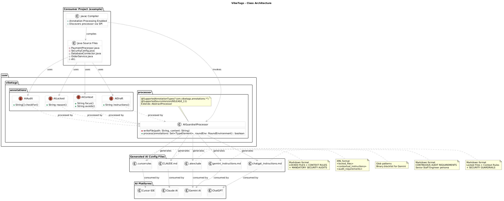
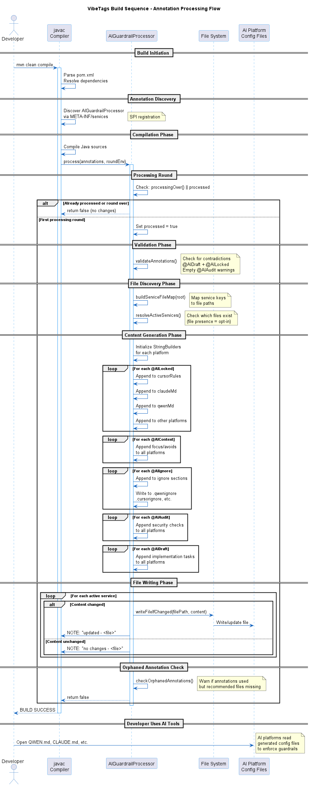

# VibeTags Architecture

## Overview

VibeTags is a Java annotation processor that generates AI platform-specific configuration files from Java source code annotations. It operates at **compile-time only**, with zero runtime overhead.

```
Developer Annotations → javac + Annotation Processor → AI Config Files
```

## Table of Contents

- [System Architecture](#system-architecture)
- [Component Diagram](#component-diagram)
- [Build Sequence](#build-sequence)
- [Core Components](#core-components)
  - [Annotations](#annotations)
  - [Annotation Processor](#annotation-processor)
  - [Generated Output Files](#generated-output-files)
- [Build Flow](#build-flow)
- [Directory Structure](#directory-structure)
- [Design Decisions](#design-decisions)
- [Limitations](#limitations)
- [Future Architecture](#future-architecture)

---

## System Architecture

```
┌─────────────────────────────────────────────────────────────────────┐
│                        Developer Workspace                           │
├─────────────────────────────────────────────────────────────────────┤
│                                                                      │
│  ┌──────────────────┐         ┌──────────────────────────────┐     │
│  │  Java Source     │         │  VibeTags Library             │     │
│  │  Files           │         │  ┌─────────────────────────┐  │     │
│  │                  │         │  │  Annotations             │  │     │
│  │  @AILocked       │         │  │  - AILocked.java         │  │     │
│  │  @AIContext      │────────>│  │  - AIContext.java        │  │     │
│  │  @AIDraft        │  uses   │  │  - AIDraft.java          │  │     │
│  │  @AIAudit        │         │  │  - AIAudit.java          │  │     │
│  └────────┬─────────┘         │  └─────────────────────────┘  │     │
│           │                   │  ┌─────────────────────────┐  │     │
│           │                   │  │  Annotation Processor     │  │     │
│           │                   │  │  AIGuardrailProcessor     │  │     │
│           │                   │  │  (JSR 269 compliant)      │  │     │
│           │                   │  └─────────────────────────┘  │     │
│           │                   └──────────────────────────────┘     │
│           │                                    │                   │
│           ▼                                    ▼                   │
│  ┌───────────────────────────────────────────────────────┐         │
# VibeTags Architecture

## Overview

VibeTags is a Java annotation processor that generates AI platform-specific configuration files from Java source code annotations. It operates at **compile-time only**, with zero runtime overhead.

```
Developer Annotations → javac + Annotation Processor → AI Config Files
```

## Table of Contents

- [System Architecture](#system-architecture)
- [Component Diagram](#component-diagram)
- [Build Sequence](#build-sequence)
- [Core Components](#core-components)
  - [Annotations](#annotations)
  - [Annotation Processor](#annotation-processor)
  - [Generated Output Files](#generated-output-files)
- [Build Flow](#build-flow)
- [Directory Structure](#directory-structure)
- [Design Decisions](#design-decisions)
- [Limitations](#limitations)
- [Future Architecture](#future-architecture)

---

## System Architecture

```
┌─────────────────────────────────────────────────────────────────────┐
│                        Developer Workspace                           │
├─────────────────────────────────────────────────────────────────────┤
│                                                                      │
│  ┌──────────────────┐         ┌──────────────────────────────┐     │
│  │  Java Source     │         │  VibeTags Library             │     │
│  │  Files           │         │  ┌─────────────────────────┐  │     │
│  │                  │         │  │  Annotations             │  │     │
│  │  @AILocked       │         │  │  - AILocked.java         │  │     │
│  │  @AIContext      │────────>│  │  - AIContext.java        │  │     │
│  │  @AIDraft        │  uses   │  │  - AIDraft.java          │  │     │
│  │  @AIAudit        │         │  │  - AIAudit.java          │  │     │
│  └────────┬─────────┘         │  └─────────────────────────┘  │     │
│           │                   │  ┌─────────────────────────┐  │     │
│           │                   │  │  Annotation Processor     │  │     │
│           │                   │  │  AIGuardrailProcessor     │  │     │
│           │                   │  │  (JSR 269 compliant)      │  │     │
│           │                   │  └─────────────────────────┘  │     │
│           │                   └──────────────────────────────┘     │
│           │                                    │                   │
│           ▼                                    ▼                   │
│  ┌───────────────────────────────────────────────────────┐         │
│  │         javac Compiler (with annotation processing)    │         │
│  └───────────────────────────────────────────────────────┘         │
│                            │                                        │
│                            ▼                                        │
│  ┌───────────────────────────────────────────────────────┐         │
│  │         Generated AI Configuration Files               │         │
│  │  ┌─────────────┬──────────┬───────────┬──────────┐   │         │
│  │  │.cursorrules │ CLAUDE.md│ .aiexclude│AGENTS.md │   │         │
│  │  │.cursorignore│          │           │          │   │         │
│  │  └─────────────┴──────────┴───────────┴──────────┘   │         │
│  └───────────────────────────────────────────────────────┘         │
└─────────────────────────────────────────────────────────────────────┘
         │                                        │
         ▼                                        ▼
┌──────────────────┐                    ┌──────────────────────┐
│  AI Platforms    │                    │  AI Assistants        │
│                  │                    │                       │
│  • Cursor IDE   │                    │  Read config files    │
│  • Claude       │                    │  Enforce guardrails   │
│  • Gemini       │                    │  During code gen      │
│  • Codex CLI    │                    │                       │
│  • Copilot      │                    │                       │
└──────────────────┘                    └──────────────────────┘
```

---

## Component Diagram



*Figure 1: Class architecture showing annotations, processor, and generated outputs*

---

## Build Sequence



*Figure 2: Sequence diagram of annotation processing during compilation*

---

## Core Components

### Annotations

All annotations use `@Retention(RetentionPolicy.SOURCE)` — they exist only at compile time and are stripped from the final bytecode.

| Annotation | Targets | Attributes | Purpose |
|---|---|---|---|
| **`@AILocked`** | TYPE, METHOD, FIELD | `reason: String` | Protects critical code from AI modifications |
| **`@AIContext`** | TYPE, METHOD | `focus: String`, `avoids: String` | Guides AI behavior with positive/negative instructions |
| **`@AIDraft`** | TYPE, METHOD | `instructions: String` | Marks incomplete code needing AI implementation |
| **`@AIAudit`** | TYPE, METHOD | `checkFor: String[]` | Triggers mandatory security vulnerability checks |
| **`@AIIgnore`** | TYPE, METHOD, FIELD | `reason: String` | Excludes element from AI context entirely — treat as non-existent |

**`@AIIgnore` vs `@AILocked`:** `@AILocked` prevents modification while keeping the element visible to AI. `@AIIgnore` removes the element from AI context completely — AI tools should not reference it, suggest changes to it, or include it in completions.

### Annotation Processor

**Class:** `se.deversity.vibetags.processor.AIGuardrailProcessor`

**Key Characteristics:**
- Extends `javax.annotation.processing.AbstractProcessor` (JSR 269)
- Registered via SPI: `META-INF/services/javax.annotation.processing.Processor`
- Supports Java 11+ source versions
- Processes all `se.deversity.vibetags.annotations.*` annotations (wildcard matching)

**Processing Logic:**

```
1. Early exit if no annotations found
2. Determine output directory (current working directory)
3. Initialize builders with VibeTags Version Header (v1.0.0-SNAPSHOT)
4. Standard Validation: Check for @AIDraft/@AILocked contradictions and empty @AIAudit
5. Pass 1: Process @AILocked → append to all builders
6. Pass 2: Process @AIContext → append to all builders
7. Pass 3: Process @AIIgnore → append ignore sections to all builders
8. Pass 4: Process @AIAudit → append audit sections to all builders
9. Pass 5: Process @AIDraft → append implementation task sections to all builders
10. Resolve active services (see File-existence Opt-in below)
11. Write only active service files to project root using UTF-8 encoding
12. Return true (claim annotations)
```

**Output File Generation:**

| File | Format | Platform | Content |
|---|---|---|---|
| `.cursorrules` | Markdown | Cursor IDE | Locked files, context rules, security audits |
| `CLAUDE.md` | XML + Markdown | Claude | `<locked_files>`, `<contextual_instructions>`, `<audit_requirements>` |
| `.aiexclude` | Glob patterns | Gemini | Binary blocklist of locked files |
| `AGENTS.md` | Markdown | Codex CLI | Locked files, context rules, security guardrails |
| `.codex/config.toml` | TOML | Codex CLI | Model and tool configuration |
| `.codex/rules/*.rules` | Starlark | Codex CLI | Command permissions |
| `gemini_instructions.md` | Markdown | Gemini | Continuous audit requirements |
| `QWEN.md`           | Markdown | Qwen   | Project context, locked files, contextual rules, security audits, ignored elements |
| `.qwen/settings.json` | JSON | Qwen   | Model configuration (qwen3-coder-plus), MCP settings |
| `.qwen/commands/refactor.md` | Markdown | Qwen   | Custom `/refactor` command for code refactoring |
| `.cursorignore`     | Glob patterns | Cursor | Standalone exclusion list |
| `.claudeignore`     | Glob patterns | Claude | Standalone exclusion list |
| `.copilotignore`    | Glob patterns | Copilot | Standalone exclusion list |
| `.qwenignore`       | Glob patterns | Qwen   | Standalone exclusion list |

### Generated Output Files

#### Example: @AIAudit Output

**Source:**
```java
@AIAudit(checkFor = {"SQL Injection", "Thread Safety issues"})
public class DatabaseConnector { }
```

**Generated in `.cursorrules`:**
```markdown
## 🛡️ MANDATORY SECURITY AUDITS
* `com.example.database.DatabaseConnector`
  - Required Checks: SQL Injection, Thread Safety issues
```

**Generated in `CLAUDE.md`:**
```xml
<audit_requirements>
  <file path="com.example.database.DatabaseConnector">
    <vulnerability_check>SQL Injection</vulnerability_check>
    <vulnerability_check>Thread Safety issues</vulnerability_check>
  </file>
</audit_requirements>
```

**Generated in `gemini_instructions.md`:**
```markdown
# CONTINUOUS AUDIT REQUIREMENTS
File: `com.example.database.DatabaseConnector`
Critical Vulnerabilities to Prevent:
- SQL Injection
- Thread Safety issues
```

**Generated in `QWEN.md`:**
```markdown
## 🛡️ MANDATORY SECURITY AUDITS
When proposing edits or writing code for the following files, you MUST perform a security review. Explicitly state that you have audited the changes for the listed vulnerabilities.

* `com.example.database.DatabaseConnector`
  - Required Checks: SQL Injection, Thread Safety issues
```

**Generated in `.qwen/settings.json`:**
```json
{
  "project": {
    "model": "qwen3-coder-plus",
    "mcp": {
      "enabled": true
    }
  }
}
```

**Generated in `.qwenignore`:**
```
# AUTO-GENERATED BY VIBETAGS
# Qwen-specific exclusion list.
**/GeneratedMetadata.java
```

---

## Build Flow

### Maven Flow

```
mvn clean compile
    ↓
Resolve vibetags-processor dependency (provided scope)
    ↓
javac discovers processor via META-INF/services/
    ↓
Compile Java sources
    ↓
AIGuardrailProcessor.process() executes
    ↓
Generate 5 AI config files at project root
    ↓
Compilation complete
```

### Gradle Flow

```
gradle clean build
    ↓
Resolve vibetags-processor (compileOnly + annotationProcessor)
    ↓
javac with explicit annotation processor path
    ↓
Compile Java sources
    ↓
AIGuardrailProcessor.process() executes
    ↓
Generate 5 AI config files at project root
    ↓
Build complete
```

---

## Directory Structure

```
vibetags/
├── vibetags/                          # Core annotation processor library
│   ├── src/
│   │   ├── main/
│   │   │   ├── java/com/vibetags/
│   │   │   │   ├── annotations/       # Annotation definitions (SOURCE retention)
│   │   │   │   │   ├── AILocked.java
│   │   │   │   │   ├── AIContext.java
│   │   │   │   │   ├── AIDraft.java
│   │   │   │   │   ├── AIAudit.java
│   │   │   │   │   └── AIIgnore.java
│   │   │   │   └── processor/         # JSR 269 annotation processor
│   │   │   │       └── AIGuardrailProcessor.java
│   │   │   └── resources/META-INF/services/
│   │   │       └── javax.annotation.processing.Processor
│   │   └── test/                      # Unit + integration tests
│   ├── pom.xml                        # Maven build config
│   └── build.gradle                   # Gradle build config
│
├── example/                           # Demo e-commerce application
│   ├── src/main/java/com/example/
│   │   ├── database/
│   │   │   └── DatabaseConnector.java         # @AIAudit example
│   │   ├── internal/
│   │   │   └── GeneratedMetadata.java         # @AIIgnore example
│   │   ├── payment/
│   │   │   └── PaymentProcessor.java          # @AILocked example
│   │   ├── security/
│   │   │   └── SecurityConfig.java            # @AILocked + @AIContext
│   │   ├── service/
│   │   │   ├── NotificationService.java       # @AIContext + @AIDraft
│   │   │   └── OrderService.java              # Mixed annotations
│   │   ├── strategy/
│   │   │   ├── PaymentStrategy.java           # @AIContext
│   │   │   └── impl/CreditCardStrategy.java   # @AIDraft
│   │   └── utils/
│   │       └── StringParser.java              # @AIContext
│   ├── .cursorrules                   # Generated: Cursor rules
│   ├── CLAUDE.md                      # Generated: Claude guardrails
│   ├── .aiexclude                     # Generated: Gemini blocklist
│   ├── AGENTS.md                      # Generated: Codex instructions
│   ├── .codex/                        # Generated: Codex configuration
│   │   ├── config.toml                # Codex tool settings
│   │   └── rules/                     # Codex command rules
│   │       └── vibetags.rules         # Starlark command permissions
│   ├── gemini_instructions.md         # Generated: Gemini audit requirements
│   ├── QWEN.md                        # Generated: Qwen project context
│   ├── .qwen/                         # Generated: Qwen directory
│   │   ├── settings.json              # Generated: Qwen model settings
│   │   └── commands/                  # Generated: Qwen custom commands
│   ├── .cursorignore                  # Generated: Cursor exclusion list
│   ├── .claudeignore                  # Generated: Claude exclusion list
│   ├── .copilotignore                 # Generated: Copilot exclusion list
│   ├── .qwenignore                    # Generated: Qwen exclusion list
│   ├── pom.xml                        # Maven build config
│   └── build.gradle                   # Gradle build config
│
├── docs/                              # Documentation
│   ├── ARCHITECTURE.md                # This file
│   ├── CONCEPT_PLUGIN.md              # Future plugin architecture
│   └── diagrams/                      # PlantUML source + images
│       ├── class-diagram.puml
│       ├── class-diagram.png
│       ├── build-sequence.puml
│       └── build-sequence.png
│
├── src/                               # Web UI (React + Vite)
├── package.json
└── README.md
```

---

## Design Decisions

### 1. SOURCE Retention

**Decision:** All annotations use `RetentionPolicy.SOURCE`

**Rationale:**
- Zero runtime overhead — annotations stripped during compilation
- No dependency pollution in production artifacts
- Processor only needed at compile-time
- Consumer projects have no runtime dependency on VibeTags

### 2. Single Processor, Multiple Outputs

**Decision:** One processor generates all 5 output files in a single pass

**Rationale:**
- Single source of truth for annotation data
- Consistent content across all platforms
- No duplication of parsing logic
- Atomic generation (all or nothing)

### 3. Working Directory Output

**Decision:** Output files written to `Paths.get("").toAbsolutePath()`

**Rationale:**
- Works for standard Maven/Gradle builds from project root
- No configuration required
- Files land where developers expect them

**Trade-off:** Can break in IDE builds or subdirectory builds (see [Limitations](#limitations))

### 4. StringBuilder Accumulation

**Decision:** Build entire file content in memory before writing

**Rationale:**
- Simple implementation
- Easy to reason about
- Files are small (< 10KB typically)
- Atomic write (write succeeds or fails completely)

### 5. Wildcard Annotation Matching

**Decision:** `@SupportedAnnotationTypes("se.deversity.vibetags.annotations.*")`

**Rationale:**
- Automatically picks up new annotations without code changes
- Single processor handles all VibeTags annotations
- Easy to extend with new annotation types

### 6. Service Resolution (Opt-in Logic)

**Decision:** The annotation processor uses the presence of specific files on disk to determine which AI services are active.

**Rationale:**
- **Manual Control**: Developers decide which AI tools they support by creating the corresponding files.
- **No Clutter**: VibeTags will never spam the project root with files for AI tools that aren't being used.
- **Zero Configuration**: No complex XML/JSON config is needed to enable/disable services; `touch` or `rm` is sufficient.

**Implementation:** `buildServiceFileMap()` + `resolveActiveServices(Messager, Map)` static helpers in `AIGuardrailProcessor`.

### 8. Version Stamping

**Decision:** Every generated configuration file begins with a version header (e.g., `# Generated by VibeTags v1.0.0-SNAPSHOT`).

**Rationale:**
- **Traceability**: Helps developers identify which version of the processor produced a specific file.
- **Debugging**: Simplifies troubleshooting by confirming if a project is using an outdated processor version.

### 9. Smart Validation Layer

**Decision:** The processor performs lightweight validation before file generation and emits compiler WARNINGs for invalid usage.

**Rationale:**
- **Developer Feedback**: Provides immediate feedback during the build process without failing the compilation.
- **Consistency**: Prevents contradictory instructions (like @AILocked + @AIDraft) from reaching the AI tools.

**Supported Checks:**
- `@AIIgnore`: Warns if `.cursorignore`, `.claudeignore`, `.copilotignore`, or `.qwenignore` are missing for active services.
- `@AIIgnore` / `@AILocked`: Warns if `.aiexclude` is missing for active Gemini/Codex services.

---

## Limitations

### 1. Output Location Fragility

**Problem:** Uses `Paths.get("")` which resolves to JVM working directory

**Impact:**
- Can write to wrong directory in IDE builds
- Breaks if build invoked from subdirectory
- No way to customize output location

**Workaround:** Always build from project root directory

### 2. No Incremental Build Awareness

**Problem:** Regenerates all files on every compilation

**Impact:**
- Unnecessary file I/O
- Can interfere with build caching
- No way to skip generation if annotations unchanged

### 3. Hardcoded Output Formats

**Problem:** Each platform's format is hardcoded in the processor

**Impact:**
- Cannot customize template structure
- Adding new platforms requires code changes
- No user control over formatting

### 4. Limited Validation Logic

**Problem:** While basic validation for contradictions and empty arrays is implemented, it does not cover all edge cases.

**Impact:**
- Complex contradictory logic might still slip through.
- No enforcement of cross-file consistency beyond basic checks.

---

## Future Architecture

See [CONCEPT_PLUGIN.md](CONCEPT_PLUGIN.md) for the proposed migration to a plugin/CLI architecture.

### Proposed Components

```
vibetags-core/          # Shared scanning + generation logic
vibetags-cli/           # Standalone CLI (any language support)
vibetags-maven-plugin/  # Maven plugin with configurable output paths
vibetags-gradle-plugin/ # Gradle plugin with task configuration avoidance
vibetags-processor/     # Legacy wrapper (deprecated)
```

### Key Improvements

- **Configurable output paths** via `vibetags.yaml`
- **Language-agnostic** support for comment-based annotations
- **Incremental build support** with file change detection
- **Customizable templates** for output formats
- **Validation and warnings** for annotation misuse

---

## Testing Strategy

### Unit Tests (vibetags/)

| Test Class | Tests | Purpose |
|---|---|---|
| `AnnotationDefinitionsTest` | 21 | Verify annotation structure and defaults (includes @AIIgnore) |
| `AIGuardrailProcessorTest` | 3 | Processor configuration validation |
| `AIGuardrailProcessorUnitTest` | 10 | Processor structure, inheritance, service opt-in logic, and warning emission |
| `AIIgnoreProcessorUnitTest` | 7 | @AIIgnore annotation definition and service opt-in behaviour |
| `AnnotationProcessorEndToEndTest` | 18 | Generated file content validation (includes @AIIgnore output) |
| `AIGuardrailProcessorIntegrationTest` | 14 | Full workflow end-to-end (conditional, includes @AIIgnore) |

### Integration Tests

Run with: `mvn test -Drun.integration.tests=true`

Tests require the example project to be compiled first.

### CI/CD

GitHub Actions workflow tests:
- **Maven builds:** JDK 11, 17, 21
- **Gradle builds:** JDK 17, 21 (Gradle requires 17+)
- Verifies generated file existence
- Validates @AIAudit content in all outputs

---

## Dependencies

### vibetags-processor

| Dependency | Scope | Purpose |
|---|---|---|
| `javax.annotation.processing.*` | JDK (compile) | JSR 269 API |
| `javax.lang.model.*` | JDK (compile) | Language model API |
| `org.junit.jupiter` | test | Unit testing |

### example

| Dependency | Scope | Purpose |
|---|---|---|
| `se.deversity.vibetags:vibetags-processor` | provided / compileOnly | Annotations + processor |

**Note:** Annotations have zero runtime footprint — they are completely stripped during compilation.

---

## Build Commands

### Maven

```bash
# Build library
cd vibetags && mvn clean install

# Build example (generates AI config files)
cd example && mvn clean compile

# Run tests
cd vibetags && mvn test

# Run integration tests
cd vibetags && mvn test -Drun.integration.tests=true
```

### Gradle

```bash
# Build library
cd vibetags && gradle clean build publishToMavenLocal

# Build example (generates AI config files)
cd example && gradle clean build

# Run tests
cd vibetags && gradle test
```

---

## AI Platform Integration

### Cursor

**File:** `.cursorrules`

**Behavior:** Cursor reads `.cursorrules` for core instructions and respects the `.cursorignore` glob patterns for excluding entire files from its context window.


### Claude

**File:** `CLAUDE.md`

**Behavior:** Claude treats this as foundational context. XML tags appeal to Claude's parsing strengths. Enforces `<rule>` elements strictly.

### Gemini

**Files:** `.aiexclude` + `gemini_instructions.md`

**Behavior:** `.aiexclude` is a binary blocklist (hard guardrail). `gemini_instructions.md` provides detailed persona and audit guidance.


### Codex CLI

**File:** `AGENTS.md` (and `.codex/` directory)

**Aesthetics:** Optimized for the Codex CLI's context window.

**Behavior:** Codex CLI automatically reads `AGENTS.md` from the project root. The `.codex/config.toml` defines tool behavior, and `vibetags.rules` defines security-conscious command permissions using Starlark.

### GitHub Copilot

**Files:** `.github/copilot-instructions.md` + `.copilotignore`

**Behavior:** Copilot uses the instructions file to guide its completions and respects `.copilotignore` (standard glob format) to exclude specific files from being used as context.

### Qwen

**Files:** `QWEN.md` + `.qwen/settings.json` + `.qwen/commands/refactor.md` + `.qwenignore`

**Behavior:** Qwen reads `QWEN.md` as comprehensive project context, including locked files, contextual rules, security audit requirements, and ignored elements. The `.qwen/settings.json` configures the model (typically `qwen3-coder-plus`) and enables MCP (Model Context Protocol) for enhanced capabilities.

**QWEN.md Structure:**
```markdown
# PROJECT CONTEXT
## LOCKED FILES (DO NOT EDIT)
* `com.example.PaymentProcessor` — Reason here

## CONTEXTUAL RULES
* `com.example.StringParser`
  * Focus: Optimize for memory usage
  * Avoid: java.util.regex, String.split()

## 🛡️ MANDATORY SECURITY AUDITS
* `com.example.DatabaseConnector`
  - Required Checks: SQL Injection, Thread Safety

## IGNORED ELEMENTS
* `com.example.GeneratedMetadata`
```

**.qwen/settings.json Structure:**
```json
{
  "project": {
    "model": "qwen3-coder-plus",
    "mcp": {
      "enabled": true
    }
  }
}
```

**.qwen/commands/refactor.md:** Defines a custom `/refactor` command that instructs Qwen to refactor code while following the project's contextual rules defined in `QWEN.md`.

**.qwenignore:** Standard glob patterns to exclude files from Qwen's context window.

**Key Features:**
- Comprehensive project context in a single markdown file
- Security audit requirements with explicit vulnerability checks
- Custom commands for specialized workflows (e.g., `/refactor`)
- Model configuration with MCP support
- Standalone ignore file using glob patterns

---

*Last updated: April 2026*
