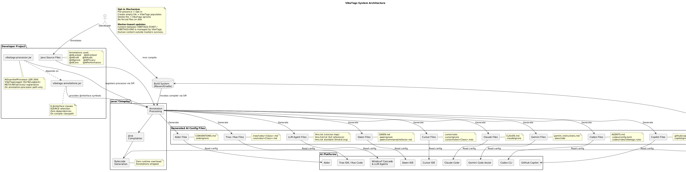
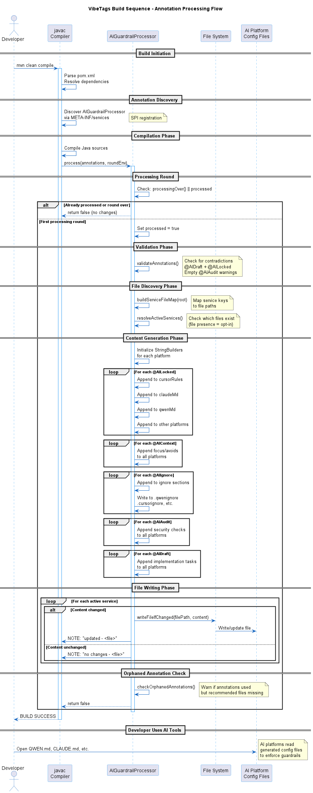
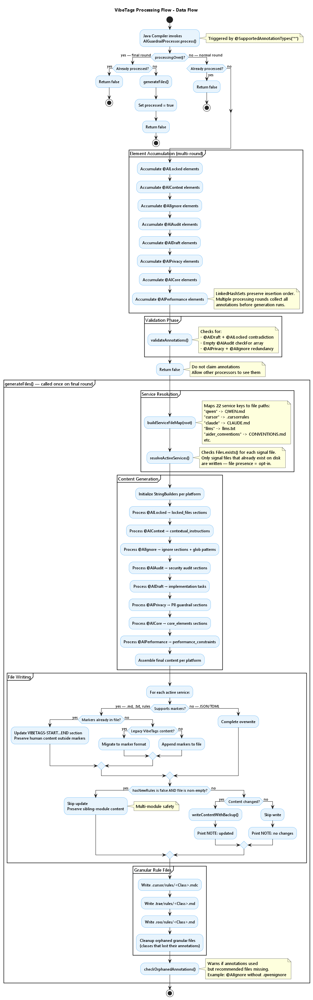
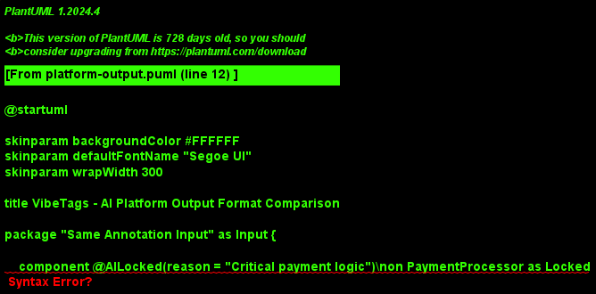

# VibeTags Architecture - Technical Deep Dive

## Table of Contents

- [Overview](#overview)
- [System Architecture](#system-architecture)
- [Build Sequence](#build-sequence)
- [Data Flow](#data-flow)
- [Platform Output Formats](#platform-output-formats)
- [Core Components](#core-components)
- [Build Flow](#build-flow)
- [Directory Structure](#directory-structure)
- [Design Decisions](#design-decisions)
- [Testing Strategy](#testing-strategy)
- [Limitations](#limitations)
- [Future Architecture](#future-architecture)
- [Repository Layout Notes](#repository-layout-notes)
- [Design History](#design-history)
- [Dependencies](#dependencies)
- [Build Commands](#build-commands)
- [AI Platform Integration](#ai-platform-integration)

## Overview

VibeTags is a **Java annotation processor** (JSR 269 compliant) that generates AI platform-specific configuration files from Java source code annotations. It operates at **compile-time only**, with zero runtime overhead.

```
Developer Annotations → javac + Annotation Processor → AI Config Files
```

### Key Technical Characteristics

- **Compile-time only**: Uses `@Retention(RetentionPolicy.SOURCE)` - annotations stripped from bytecode
- **Zero runtime dependency**: No VibeTags classes in production artifacts
- **File-existence opt-in**: Only generates files that already exist on disk
- **Write-if-changed**: Only updates files when content actually differs
- **Multi-platform**: Generates configs for all supported AI platforms simultaneously (Cursor, Claude, Gemini, Codex, Copilot, Qwen, Aider, Trae, Roo, Windsurf via llms.txt, AI PR reviewers like CodeRabbit/PR-Agent/Ellipsis, context packers, and more — see the [project facts](../README.md#project-facts))
- **Version stamped**: Every file includes VibeTags version + GitHub URL

### Published Artifacts

As of 0.6.0, VibeTags ships as three coordinates on Maven Central:

| Artifact | Purpose | Goes on | Depends on |
|---|---|---|---|
| `se.deversity.vibetags:vibetags-annotations` | The `@interface` classes (see [project facts](../README.md#project-facts) for the count) | Consumer's compile classpath | nothing |
| `se.deversity.vibetags:vibetags-processor` | `AIGuardrailProcessor` + `VibeTagsLogger` (slf4j/logback) | Annotation-processor path only | `vibetags-annotations` |
| `se.deversity.vibetags:vibetags-bom` (pom-only) | Manages versions of the two jars above | `<dependencyManagement>` import / Gradle `platform(...)` | — |

The split keeps `slf4j` / `logback` (the processor's internal logging deps) off the consumer's `compileClasspath`. Existing 0.5.x setups that pin only `vibetags-processor` continue to work — the processor declares `vibetags-annotations` as a regular compile dependency so the annotation classes are still resolved transitively. New projects should adopt the split layout shown in the README's Installation section.

## Table of Contents

- [System Architecture](#system-architecture)
- [Component Diagram](#component-diagram)
- [Class Diagram](#class-diagram)
- [Parsed diagrams (code-karta)](#parsed-diagrams-code-karta)
- [Build Sequence](#build-sequence)
- [Data Flow](#data-flow)
- [Platform Output Formats](#platform-output-formats)
- [Core Components](#core-components)
  - [Annotations](#annotations)
  - [Annotation Processor](#annotation-processor)
  - [Generated Output Files](#generated-output-files)
- [Build Flow](#build-flow)
- [Directory Structure](#directory-structure)
- [Design Decisions](#design-decisions)
- [Testing Strategy](#testing-strategy)
- [Limitations](#limitations)
- [Future Architecture](#future-architecture)
- [Repository Layout Notes](#repository-layout-notes)
- [Design History](#design-history)

---

## System Architecture

### Component Diagram



*Figure 1: High-level system architecture showing component interactions*

**Technical Flow:**
1. Developer annotates Java source code with VibeTags annotations
2. Build system (Maven/Gradle) invokes `javac` compiler
3. `javac` discovers `AIGuardrailProcessor` via SPI (`META-INF/services/`)
4. Processor scans annotations during compilation
5. Processor generates platform-specific config files to project root
6. Compiled bytecode contains zero VibeTags artifacts

### Class Diagram


*Figure 2: `se.deversity.vibetags.processor` — parsed from source by code-karta*

The hand-drawn PlantUML class diagram that used to stand here is [archived](diagrams/archive/):
it drew 8 of the 44 annotations and named 8 internal helper classes, of which `processor/internal/`
now holds 24 at the top level alone (129 files counting its subpackages).
Hand-maintained structure drifts, and that one had. Both halves of what it showed are parsed
from source instead — the processor above, and
[the annotation surface](ANNOTATIONS.md#the-annotation-surface) in the annotation reference.

### Parsed diagrams (code-karta)

The component, sequence, data-flow and platform-output diagrams in this file are hand-drawn:
they say what the design *intends*, and they show actors — a developer, Maven, javac — that no
parser can see. The SVGs under [`diagrams/codekarta/`](diagrams/codekarta/) are parsed from the
source by [code-karta](https://github.com/PIsberg/codekarta) and say what the code currently
*is*. Keeping both is deliberate — when they disagree, that gap is real drift, and it is the
kind nothing else in the build reports.

All five are produced by one script,
[`tools/generate-architecture-diagrams.sh`](../tools/generate-architecture-diagrams.sh), which
is also where the input scope of each is pinned:

| Diagram | Parsed from | Embedded in | What it answers |
|---------|-------------|-------------|-----------------|
| [`class-diagram.svg`](diagrams/codekarta/class-diagram.svg) | [`processor/`](../vibetags/src/main/java/se/deversity/vibetags/processor) | this file, above | How the orchestrator, the internals and the model relate |
| [`model/class-diagram.svg`](diagrams/codekarta/model/class-diagram.svg) | [`processor/model/`](../vibetags/src/main/java/se/deversity/vibetags/processor/model) | [LOAD-BEARING.md](LOAD-BEARING.md#the-compiler-boundary-internal--model--content) | The compiler-free data model the rendering layer reads |
| [`content/class-diagram.svg`](diagrams/codekarta/content/class-diagram.svg) | [`internal/content/`](../vibetags/src/main/java/se/deversity/vibetags/processor/internal/content) | [PLATFORMS.md](PLATFORMS.md#the-rendering-layer) | Which renderer, formatter and registry a new platform plugs into |
| [`annotations/class-diagram.svg`](diagrams/codekarta/annotations/class-diagram.svg) | [`annotations/`](../vibetags-annotations/src/main/java/se/deversity/vibetags/annotations) | [ANNOTATIONS.md](ANNOTATIONS.md#the-annotation-surface) | Every `@AI*` type that actually exists, counted by a parser rather than by hand |
| [`sequence/aiguardrailprocessor-sequence-diagram.svg`](diagrams/codekarta/sequence/aiguardrailprocessor-sequence-diagram.svg) | [`AIGuardrailProcessor.java`](../vibetags/src/main/java/se/deversity/vibetags/processor/AIGuardrailProcessor.java) | [Build Sequence](#build-sequence), [LOAD-BEARING.md](LOAD-BEARING.md#core-processing-flow) | The orchestrator's real call order — the thing `<locked_files>` protects |

Regenerate with:

```bash
sh tools/generate-architecture-diagrams.sh
```

The CLI is resolved from Maven Central, so only the first run needs a network and nothing is
vendored into the repository. The diagrams are committed rather than built in CI: they describe
shape, shape changes rarely, and a diff in one of them is a signal worth reading in a pull
request. Adding a diagram means adding it to the script *and* linking it from the doc whose
question it answers — an unreferenced SVG in a repository is a file nobody regenerates.

**Scope, not settings.** Every diagram is aimed at one package on purpose. A stitched call graph
over `processor.internal` produced 986 nodes across roughly 36000×43700 pixels — technically a
diagram, practically a data dump — and `--max-depth` does not help, because the fan-out is
horizontal rather than deep. Scope the input instead. The script also pins `--layout elk`: the
default engine lays every node of one BFS depth into a single unbounded row, which for this
processor renders about 19500px wide against ELK's 2300px.

**Two of code-karta's modes do not fit this repository**, and the script says so in a comment so
the experiment isn't repeated. `--modules-only` needs `module-info.java`; VibeTags ships no JPMS
descriptors, because the processor has to load on whatever classpath a consumer's javac hands
it, so the parsed graph comes back empty. `--state-machine` reads enum constants as states, and
the two enums here — `content.Platform` and `model.ElementTag` — are catalogues rather than
machines: the generated SVG is sixty-odd boxes with zero transition edges. The tables in
[PLATFORMS.md](PLATFORMS.md) and [ANNOTATIONS.md](ANNOTATIONS.md) render that shape better.

**Key Components:**

**Annotations** — package `se.deversity.vibetags.annotations`, jar `vibetags-annotations` (see the [project facts](../README.md#project-facts) for the count). Full list, targets, attributes, and semantics: [docs/ANNOTATIONS.md](ANNOTATIONS.md).

**Processor** — package `se.deversity.vibetags.processor`, jar `vibetags-processor`:
- `AIGuardrailProcessor` — extends `AbstractProcessor` (JSR 269); orchestrator that wires the helpers below into the JSR 269 lifecycle and does none of the work itself
- `VibeTagsLogger` — SLF4J/Logback file logger, configurable via `-Avibetags.log.*`
- `LazyFileAppender` — the appender behind that logger; it opens `vibetags.log` on the first event that survives level filtering, so a build that logs nothing leaves no file behind
- `@SupportedAnnotationTypes("*")` — processes all annotations
- Overrides `getSupportedSourceVersion()` to return `SourceVersion.latestSupported()` instead of a fixed `@SupportedSourceVersion` — the library builds/tests against Java 21, but pinning e.g. `RELEASE_17` would make javac emit a "supported source version" warning on every newer JDK a consumer compiles with
- Compile-scope dependency on `vibetags-annotations` so the processor code can reference annotation classes (e.g. `roundEnv.getElementsAnnotatedWith(AILocked.class)`) and so legacy single-coordinate consumers still get the annotations transitively.

**Internal helpers** — package `se.deversity.vibetags.processor.internal` (single-responsibility classes that do the actual work, since 0.6.0):
- `AnnotationCollector` — owns one `LinkedHashSet<Element>` accumulator per annotation type (keyed by annotation class, driven by `model.GuardrailAnnotations.ALL`), aggregating annotated elements across all `javac` rounds; also tracks the `anyAnnotationsFound` flag used for the multi-module preservation check. `model()` snapshots the accumulators into the compiler-free `GuardrailModel` the rendering layer reads — memoized until the next `collect()`/`reset()`. Buckets are created once and only cleared **in place**, because the processor holds three of them as fields
- `AnnotationValidator` — the entry point for compile-time consistency warnings. The checks are individually testable rules in `internal/validation/`: `PairRule` (contradictory annotation pairs, as a table), `CoreRules` (attributes that leave an annotation instructing nobody), `ArchitectureRule` (the Tree-API import scan for `@AIArchitecture(cannotReference)`), `ModernJavaRules` (an annotation that contradicts the declaration it sits on — records, sealed types, virtual threads, the unnamed package). `ValidationRules` indexes rules by the annotation they scan so the round is queried once per annotation type rather than once per check. Full list in [ANNOTATIONS.md](ANNOTATIONS.md)
- `OrphanWarner` — emits warnings when annotations are used but the corresponding ignore-file isn't present (e.g. `@AIIgnore` without `.cursorignore`)
- `ServiceRegistry` — maps logical service keys to file paths and resolves which services are "active" via the file-existence opt-in
- `ElementNaming` — pure helpers for `elementPath`, `elementDisplayName`, `owningElement`. Member signatures are derived structurally from `ExecutableElement` rather than taken from `Element.toString()`, whose format `javax.lang.model` leaves to the implementation: ECJ renders `public int getKeyRotationHours() ` where javac renders `getKeyRotationHours()`, and this string is the element's identity in `.vibetags-locks` and in granular rule filenames. The derivation reproduces javac's rendering exactly, since that is what every committed fixture and every consumer's generated files were produced by; `ElementNamingFormatParityTest` pins it and the `ecj-degradation` CI leg checks the two compilers agree
- `GuardrailContentBuilder` — A highly decoupled, thin coordinator (~150 lines) that builds AI guardrail files by delegating file rendering to specific `PlatformRenderer` implementations. Coordinates the build process, lazily allocates platform StringBuilders, and returns the final service-key → content map. No I/O.
- `GuardrailFileWriter` — atomic, marker-aware file writes, YAML front-matter preservation, legacy (pre-marker) block migration, and orphan cleanup for granular rule files. Since 0.7.1 also owns the cache-fast-path entry to `writeFileIfChanged` and a streaming byte-compare for non-marker files.
- `GranularRulesWriter` — writes per-class `.mdc`/`.md` files for Cursor / Trae / Roo / Windsurf / Continue / Tabnine / Amazon Q / Amazon Kiro / `.ai/rules` and orchestrates orphan cleanup via the file writer
- `WriteCache` — per-output-file content cache backed by a `.vibetags-cache` sidecar at the project root; lets `GuardrailFileWriter` skip the read+compare path on no-change rebuilds. **Detailed below in [Design Decision 5](#5-write-cache-since-071).** _(since 0.7.1)_
- `ModuleSidecar` — per-module rendered-body store (`.vibetags-mod-<moduleId>` files at the VibeTags root) enabling multi-module aggregation: every module persists its own contribution, and each compile merges all sidecars into the shared marker files using `VIBETAGS-MODULE:` sub-markers. Sidecar format v2; v1 files (written by processors that derived module identity from the working directory — issue #278) are pruned on read.
- `ModuleRootResolver` — resolves the compiled module's root directory *and source set* by walking up from a source file of a live round to the nearest `pom.xml`/`build.gradle(.kts)`, returning a `ModuleIdentity`; this is the module identity fed to `ModuleSidecar`. It reaches the source file through the javac Tree API when available and otherwise through `Elements.getFileObjectOf` (Java 18+) — necessary because Gradle wraps the `ProcessingEnvironment` for incremental processing and `Trees.instance` rejects anything but javac's own (issue #331). Falls back to the JVM working directory when neither is available or sources are in-memory.
- `ModuleIdentity` — record of `(module root, source set)`. The source set (`main`, `test`, `integrationTest`, …, read from the `src/<name>/` segment) gives each javac invocation over the same module its own sidecar file, so a `test-compile` round cannot overwrite what `compile` wrote (issue #330).
- `ModuleOutputWriter` — per-module (nested) output: writes a module's own guardrails into that module's own directory (opt-in by file/dir existence there), by re-running the single-module pipeline scoped to the module. It does not merge across *modules*; it does concatenate the sidecar bodies of this module's own source sets, and it spares their granular stems during cleanup. The reactor-root files are unaffected.
- `RoleConfig` — parses a `.vibetags-roles` config (name → globs/FQNs) and routes annotated owners into human-named topic files via `GranularRulesWriter`; first-match wins, unmatched owners keep their per-class file. Glob matching is done against a path reconstructed from the element FQN (separator-independent), so it works under non-javac/in-memory compilation. Null when the file is absent (per-class behavior); its content hash is folded into the build fingerprint. Lives in `processor.model` because the rendering layer reads it through `RenderingContext.roles()`.

**The model** — package `se.deversity.vibetags.processor.model` (the compiler-free seam between the javac-facing half and the rendering half):
- `GuardrailModel` — the immutable snapshot every `PlatformRenderer` reads: one insertion-ordered bucket of `TaggedElement` per annotation type, plus the `@AILocked` source positions and the `anyAnnotationsFound` flag
- `TaggedElement` — one annotated element as plain data: the five precomputed name forms (`path`, `qualifiedName`, `simpleName`, `displayName`, `granularQName`), its `ElementTag` kind, its owning type/package, and the `@AI*` annotation instances themselves. Equality is by path + kind — a value identity, so a granular-rules map can key on it without pinning javac's object graph past the round that produced it
- `ElementTag` — a name-for-name mirror of `javax.lang.model.element.ElementKind`, plus `UNKNOWN` for "the compiler reported no kind". The names are a published contract (the `kind` field in `.vibetags-locks`, and lower-cased granular headings), pinned by `ElementTagMappingTest`
- `GuardrailAnnotations` — the single ordered registry of collected annotation types; adding a guardrail annotation is one line here
- `SourceLocation` — file + 1-based inclusive line range for `.vibetags-locks`; best-effort, absent under non-javac compilers
- `ContentHash` — the 8-hex content hash shared by `BuildFingerprint`, `RoleConfig`, and `MirrorConfig`

Nothing in this package may import `javax.lang.model`, `javax.annotation.processing`, `javax.tools`, or `com.sun.source`, and nothing in it may depend on the processor or its internals. `ArchitectureRulesTest` enforces both directions, along with the matching rule for the content layer. See `docs/LOAD-BEARING.md` for why the seam exists — chiefly that an `Element` is only valid while its round is live, and the parallel write phase runs after the last one closes.

This split keeps each helper around 50–600 lines, well-tested in isolation, and makes the orchestrator's `generateFiles()` method a 50-line read.

---

## Build Sequence



*Figure 3: Sequence diagram of annotation processing during compilation*

This one is hand-drawn, and stays that way: its participants include a developer and a build
system, which no parser can see. The same story from inside the processor —
[`sequence/aiguardrailprocessor-sequence-diagram.svg`](diagrams/codekarta/sequence/aiguardrailprocessor-sequence-diagram.svg),
[parsed from `AIGuardrailProcessor.java`](#parsed-diagrams-code-karta) — is a numbered call
order rather than a picture of the flow, and at roughly 9800×7700 pixels it is meant to be
opened and panned rather than read on a page. Reach for it when you need to know *what actually
runs and in which order*, particularly around
`generateFiles()`, whose step order is [load-bearing](LOAD-BEARING.md#core-processing-flow) and
under `<locked_files>` for that reason.

### Processing Phases

**Phase 1: Element Accumulation (every round)**
```java
lockedElements.addAll(roundEnv.getElementsAnnotatedWith(AILocked.class));
// ... repeat for every annotation type
validateAnnotations(processingEnv.getMessager(), roundEnv);
return false; // do not claim annotations
```
- Accumulates annotated elements into `LinkedHashSet`s across all rounds
- Validates annotations each round for early compiler feedback
- Returns `false` so other processors still see the annotations

**Phase 1b: Generation Trigger**
```java
if (roundEnv.processingOver() && !processed) {
    generateFiles();
    processed = true;
}
```
- `generateFiles()` runs exactly once, on the final round when `processingOver()` is true
- Idempotency guard (`processed` flag) prevents double-generation

**Phase 2: Validation**
```java
validateAnnotations(processingEnv.getMessager(), roundEnv);
```
- Checks for contradictory annotations (@AIDraft + @AILocked on same element)
- Warns about empty @AIAudit (no checkFor items)
- Emits compiler warnings via `Messager`

**Phase 3: Service Resolution**
```java
Map<String, Path> serviceFiles = buildServiceFileMap(root);
Set<String> activeServices = resolveActiveServices(messager, serviceFiles);
```
- Maps 17+ service keys to file paths
- Checks file existence (file presence = opt-in)
- Only active services get generated

**Phase 4: Content Generation**
- Iterates each annotation type
- Accumulates platform-specific content in StringBuilders
- Formats output per platform conventions (Markdown, XML, TOML, JSON)

**Phase 5: File Writing**
```java
boolean changed = fileWriter.writeFileIfChanged(filePath, content, hasNewRules);
```
Three layered fast paths in front of the actual write, in order of cheapness:
1. **Cache fast path** _(0.7.1)_ — if `WriteCache.isUnchanged(file, body)` is true (size + mtime + 32-bit fingerprint match what we recorded last build), return immediately. No file read, no compare, no write.
2. **Streaming byte-compare fast path** _(0.7.1, non-marker files only)_ — when the on-disk byte length matches the new content's byte length exactly, stream-compare with early exit on first byte mismatch. Avoids materialising the entire file as a `String`.
3. **Read-and-compare path** — `Files.readString` + strip-tolerant `.equals()`, the original logic. Used for marker files (`.md`, `.mdc`, `llms*.txt`) and non-marker files where the size already differs by ≤64 bytes (whitespace tolerance).

After a successful write or a streaming-byte-equal hit, `WriteCache.recordWrite(...)` updates the cache entry. After all platform files are processed, `generateFiles()` calls `writeCache.flush()` once to persist the sidecar atomically.

`Messager` emits NOTE: `"updated"` or `"no changes"` for each file.

**Phase 6: Orphaned Annotation Check**
```java
checkOrphanedAnnotations(messager, activeServices, ...);
```
- Warns if annotations used but recommended files missing
- Example: @AIIgnore used but .qwenignore missing

---

## Data Flow



*Figure 4: Detailed data flow through the annotation processor*

### Annotation Processing Details

**@AILocked Processing:**
```java
for (Element element : roundEnv.getElementsAnnotatedWith(AILocked.class)) {
    AILocked locked = element.getAnnotation(AILocked.class);
    String className = element.toString();
    String reason = locked.reason();

    // Append to all platforms
    cursorRules.append("* `").append(className).append("` - Reason: ").append(reason).append("\n");
    qwenMd.append("* `").append(className).append("` — ").append(reason).append("\n");
    // ... other platforms
}
```

**@AIContext Processing:**
```java
for (Element element : roundEnv.getElementsAnnotatedWith(AIContext.class)) {
    AIContext context = element.getAnnotation(AIContext.class);
    String className = element.toString();

    // Platform-specific formatting
    cursorRules.append("* `").append(className).append("`\n")
               .append("  * Focus: ").append(context.focus())
               .append("\n  * Avoid: ").append(context.avoids()).append("\n");
}
```

**@AIIgnore Processing:**
```java
for (Element element : roundEnv.getElementsAnnotatedWith(AIIgnore.class)) {
    String className = element.toString();

    // Write to ignore sections
    qwenIgnore.append("* `").append(className).append("`\n");

    // Write glob patterns to standalone ignore files
    String globPattern = "**/"+ element.getSimpleName() + ".java\n";
    qwenIgnoreFile.append(globPattern);
}
```

**@AIAudit Processing:**
```java
for (Element element : roundEnv.getElementsAnnotatedWith(AIAudit.class)) {
    AIAudit audit = element.getAnnotation(AIAudit.class);
    String className = element.toString();
    String[] checkFor = audit.checkFor();

    // Platform-specific audit format
    qwenAudit.append("* `").append(className).append("`\n");
    qwenAudit.append("  - Required Checks: ").append(String.join(", ", checkFor)).append("\n");
}
```

**@AIPrivacy Processing:**
```java
for (Element element : roundEnv.getElementsAnnotatedWith(AIPrivacy.class)) {
    AIPrivacy privacy = element.getAnnotation(AIPrivacy.class);
    String elementPath = element.toString();
    String reason = privacy.reason();

    // Claude: XML pii_guardrails block
    claudePrivacy.append("    <element path=\"").append(elementPath).append("\">\n");
    claudePrivacy.append("      <reason>").append(reason).append("</reason>\n");
    claudePrivacy.append("    </element>\n");

    // Cursor / Codex / Copilot / Gemini / Qwen: Markdown list
    cursorPrivacy.append("* `").append(elementPath).append("` — ").append(reason).append("\n");
}

// After the loop, if hasPrivacyAnnotations == true, finalize PII sections for all platforms
// Claude gets <pii_guardrails> XML + <rule> about never logging values
// Others get a "## 🔐 PII GUARDRAILS" Markdown section
```

---

## Platform Output Formats



*Figure 5: Same annotation data formatted for different AI platforms*

### Platform-Specific Format Examples

**Qwen (QWEN.md)** - Clean Markdown:
```markdown
# PROJECT CONTEXT
# Generated by VibeTags v1.0.0-SNAPSHOT | https://github.com/PIsberg/vibetags

## LOCKED FILES (DO NOT EDIT)
* `com.example.PaymentProcessor` — Critical payment logic

## CONTEXTUAL RULES
* `com.example.StringParser`
  * Focus: Memory optimization
  * Avoid: java.util.regex

## 🛡️ MANDATORY SECURITY AUDITS
* `com.example.DatabaseConnector`
  - Required Checks: SQL Injection, Thread Safety

## IGNORED ELEMENTS
* `com.example.GeneratedMetadata`
```

**Claude (CLAUDE.md)** - XML Structure:
```xml
<!-- Generated by VibeTags v1.0.0-SNAPSHOT | https://github.com/PIsberg/vibetags -->
<project_guardrails>
  <locked_files>
    <file path="com.example.PaymentProcessor">
      <reason>Critical payment logic</reason>
    </file>
  </locked_files>
  <audit_requirements>
    <file path="com.example.DatabaseConnector">
      <vulnerability_check>SQL Injection</vulnerability_check>
      <vulnerability_check>Thread Safety</vulnerability_check>
    </file>
  </audit_requirements>
</project_guardrails>
<rule>Never propose edits to locked files.</rule>
```

**Stanza coalescing (`ClaudeTestDrivenSection`).** To keep the file's signal-to-noise
ratio high (issue #283), the `<test_driven_requirements>` section collapses two or more
`@AITestDriven` elements that share identical guardrail values into a single
`<test_driven_default coverage_goal="…" frameworks="…" [test_location="…"] [mock_policy="…"]>`
block with an `<applies-to>` member list, instead of repeating a full `<element>` stanza
per class. A mirror-convention `testLocation` (`src/test/java/<pkg>/<Class>Test.java` on a
TYPE) is rendered as the `test_location="src/test/java/{path}Test.java"` template; empty
locations omit the attribute. Elements whose values diverge — or any set smaller than the
threshold — keep their individual stanza. Grouping follows the collector's insertion order,
so the output stays deterministic (byte-stable) for the fingerprint short-circuit.

**Cursor (.cursorrules)** - Markdown with Emoji:
```markdown
# AUTO-GENERATED AI RULES
# Generated by VibeTags v1.0.0-SNAPSHOT | https://github.com/PIsberg/vibetags

## LOCKED FILES (DO NOT EDIT)
* `com.example.PaymentProcessor` - Reason: Critical payment logic

## 🛡️ MANDATORY SECURITY AUDITS
* `com.example.DatabaseConnector`
  - Required Checks: SQL Injection, Thread Safety
```

**.qwen/settings.json** - JSON Configuration:
```json
{
  "project": {
    "model": "qwen3-coder-plus",
    "mcp": {
      "enabled": true
    }
  }
}
```

**.qwenignore** - Glob Patterns:
```
# AUTO-GENERATED BY VIBETAGS
# Generated by VibeTags v1.0.0-SNAPSHOT | https://github.com/PIsberg/vibetags
# Qwen-specific exclusion list.
**/GeneratedMetadata.java
```

---

## Core Components

### Annotations

All annotations use `@Retention(RetentionPolicy.SOURCE)` — they exist only at compile time and are stripped from final bytecode.

The full table of every annotation (targets, attributes, semantics) and every compile-time validation warning the processor emits now live in one place: **[docs/ANNOTATIONS.md](ANNOTATIONS.md)**.

### Annotation Processor

**Class:** `se.deversity.vibetags.processor.AIGuardrailProcessor`

**Key Characteristics:**
- Extends `javax.annotation.processing.AbstractProcessor` (JSR 269)
- Registered via SPI: `META-INF/services/javax.annotation.processing.Processor`
- Supports Java 11+ source versions
- Uses `@SupportedAnnotationTypes("*")` to process all annotations
- **Orchestrator only**: every piece of actual work lives in an `internal/*` helper

**Processing Logic:**

```
Accumulation phase (every round, until processingOver() == true):
1. AnnotationCollector.collect(roundEnv) — drains the round into the LinkedHashSet<Element> accumulators (one per annotation type). The Elements stay here; AnnotationCollector.model() snapshots them into the compiler-free GuardrailModel at generate time, because an Element is only valid while its round is live
2. AnnotationValidator.validate(messager, roundEnv) — compile-time checks:
   - Contradiction checks (e.g. @AIDraft + @AILocked, @AILegacyBridge + @AIDraft)
   - Redundancy checks (e.g. @AIPrivacy + @AIIgnore, @AIPublicAPI + @AILocked, @AIParallelTests + @AILocked)
   - Config validation (e.g. empty @AIAudit, empty @AIArchitecture, invalid @AITestDriven coverageGoal)
   - Modern-Java checks against the declaration itself (e.g. @AIExtensible on a sealed type, @AIPure on a void method, an array field under @AIImmutable)
   - One getElementsAnnotatedWith per annotation type, not per check — the rules are indexed by what they scan
3. ModuleRootResolver.fromRound(env, roundEnv) — on the first non-empty round, resolves the module root and source set by walking up from a root element's source file (javac Tree API, else Elements.getFileObjectOf) to the nearest directory containing pom.xml / build.gradle(.kts). This — not the JVM working directory, which is the reactor root for every module of an in-process Maven build and ~/.gradle/workers under Gradle — is the module identity used for multi-module sidecar aggregation (issues #278, #331). The source set splits the sidecar so compile and test-compile do not overwrite each other (issue #330). Falls back to the working directory when no compiler API exposes the source file.
4. process() returns false so other processors still see the annotations

Generation phase (once, on the round where processingOver() == true):
5. ServiceRegistry.buildServiceFileMap(root) → service-key → file-path map
6. ServiceRegistry.resolveActiveServices(messager, files) → file-existence opt-in
7. GuardrailContentBuilder.build() lazily allocates the platform StringBuilders via `initBuilders()`, then delegates file rendering to modular, stateless `PlatformRenderer` implementations (under `se.deversity.vibetags.processor.internal.content.platforms.*`). Renderers orchestrate formatters from `FormatterRegistry` to build precise Markdown, XML, TOML, or Starlark files, and return the final service-key → content map. No I/O. **Before the render loop** it computes the granular owner set once (the keys of `GranularRenderer.renderGranular`) and passes it on `RenderingContext.granularOwners()`; an aggregate renderer whose granular sibling is active (`GranularIndexSection.indexActive`) then collapses to a **scoped-rules index** — always-loaded safety buckets inline, one pointer line per element to its scoped file — instead of duplicating every element's full guardrails. Single-opt-in aggregates render in full, unchanged.
8. GuardrailFileWriter.writeFileIfChanged(...) for each active service — three-layer fast path (WriteCache hit → streaming byte-compare → readString + strip-equals); marker-aware updates, YAML front-matter preservation, atomic tmp+move writes; on success records the new fingerprint in WriteCache
9. GranularRulesWriter.writeAll(...) — per-class .mdc/.md for Cursor / Trae / Roo / Windsurf / Continue / Tabnine / Amazon Q / Amazon Kiro / .ai/rules / Claude Code / GitHub Copilot. When a `RoleConfig` (`.vibetags-roles`) is present, matching owners are grouped into human-named role files (first-match; unmatched owners keep their per-class file) instead.
10. GranularRulesWriter.cleanupAll(...) — remove orphaned granular files (skipping the names just written, to avoid delete-then-recreate cycles; invalidates the WriteCache entry for any file it deletes or rewrites)
    - ModuleOutputWriter.write(...) — per-module (nested) output: re-runs the single-module pipeline against the opted-in module directory (`compilationRoot()`), scoped to this compilation's annotations. No sidecar, no cross-module merge — orthogonal to the root aggregation above. Gated on a resolved `moduleRoot` that differs from the VibeTags root (the module's own opt-in set is also folded into the fingerprint at step 5-ish so a fresh module opt-in isn't short-circuited).
11. OrphanWarner.warnAboutOrphans(...) — warn if annotations used without the corresponding ignore-file (e.g. @AIIgnore without .cursorignore)
12. WriteCache.flush() — atomically persist the .vibetags-cache sidecar (no-op if no entries changed this build)
```

**Output File Generation:** the processor writes one file per active service; the full file ↔ platform ↔ format table (65 output paths as of this writing) is maintained in one place: **[docs/PLATFORMS.md](PLATFORMS.md)**.

### Generated Output Files

#### Example: @AIAudit Output

**Source:**
```java
@AIAudit(checkFor = {"SQL Injection", "Thread Safety issues"})
public class DatabaseConnector { }
```

**Generated in QWEN.md:**
```markdown
## 🛡️ MANDATORY SECURITY AUDITS
When proposing edits or writing code for the following files, you MUST perform a security review. Explicitly state that you have audited the changes for the listed vulnerabilities.

* `com.example.database.DatabaseConnector`
  - Required Checks: SQL Injection, Thread Safety issues
```

**Generated in CLAUDE.md:**
```xml
<audit_requirements>
  <file path="com.example.database.DatabaseConnector">
    <vulnerability_check>SQL Injection</vulnerability_check>
    <vulnerability_check>Thread Safety issues</vulnerability_check>
  </file>
</audit_requirements>
<rule>If you are asked to modify any file listed in <audit_requirements>, you must first silently analyze your proposed code for the listed vulnerabilities.</rule>
```

**Generated in .cursorrules:**
```markdown
## 🛡️ MANDATORY SECURITY AUDITS
* `com.example.database.DatabaseConnector`
  - Required Checks: SQL Injection, Thread Safety issues
```

---

## Build Flow

### Maven Flow

```
mvn clean compile
    ↓
Resolve vibetags-annotations on compile classpath
   + vibetags-processor on annotationProcessorPaths
   (versions supplied by vibetags-bom import)
    ↓
javac discovers processor via META-INF/services/
    ↓
Compile Java sources
    ↓
AIGuardrailProcessor.process() executes
    ↓
Validate annotations
    ↓
Resolve active services (file-existence opt-in)
    ↓
Generate 15+ AI config files at project root
    ↓
Compilation complete
```

### Gradle Flow

```
gradle clean build
    ↓
Resolve vibetags-annotations (compileOnly)
   + vibetags-processor (annotationProcessor)
   (versions supplied by platform('vibetags-bom'))
    ↓
javac with explicit annotation processor path
    ↓
Compile Java sources
    ↓
AIGuardrailProcessor.process() executes
    ↓
Generate AI config files
    ↓
Build complete
```

---

## Directory Structure

```
vibetags/
├── vibetags-annotations/              # Published as se.deversity.vibetags:vibetags-annotations
│   ├── src/main/java/se/deversity/vibetags/annotations/
│   │   ├── AILocked.java
│   │   ├── AIContext.java
│   │   ├── ...                          # every @interface — see ../README.md#project-facts
│   │   └── AITemporary.java
│   ├── pom.xml
│   └── build.gradle
│
├── vibetags/                          # Published as se.deversity.vibetags:vibetags-processor
│   ├── src/
│   │   ├── main/
│   │   │   ├── java/se/deversity/vibetags/processor/
│   │   │   │   ├── AIGuardrailProcessor.java     # JSR 269 orchestrator; delegates to internal/
│   │   │   │   ├── VibeTagsLogger.java           # SLF4J/Logback file logger
│   │   │   │   ├── internal/                     # javac-facing helpers
│   │   │   │   │   ├── AnnotationCollector.java       # one LinkedHashSet per annotation type; model() snapshots them
│   │   │   │   │   ├── AnnotationValidator.java       # Entry point for compile-time consistency warnings
│   │   │   │   │   ├── validation/                    # The checks themselves: PairRule, CoreRules,
│   │   │   │   │   │                                  #   ArchitectureRule, ModernJavaRules + registry
│   │   │   │   │   ├── OrphanWarner.java              # "annotation used but ignore-file missing"
│   │   │   │   │   ├── ServiceRegistry.java           # Service map + file-existence opt-in
│   │   │   │   │   ├── ElementNaming.java             # elementPath / displayName helpers
│   │   │   │   │   ├── GuardrailContentBuilder.java   # Thin coordinator delegating to PlatformRenderers
│   │   │   │   │   ├── GuardrailFileWriter.java       # Marker-aware atomic writes + cache + streaming compare
│   │   │   │   │   ├── GranularRulesWriter.java       # Per-class .mdc/.md + orphan cleanup
│   │   │   │   │   ├── WriteCache.java                # 0.7.1: per-file content cache (.vibetags-cache sidecar)
│   │   │   │   │   └── content/                       # Rendering — compiler-free, reads the model only
│   │   │   │   │       ├── annotations/               # one AI*Formatter per annotation
│   │   │   │   │       └── platforms/                 # one PlatformRenderer per output file
│   │   │   │   └── model/                        # The compiler-free seam: internal → model ← content
│   │   │   │       ├── GuardrailModel.java            # immutable snapshot the renderers read
│   │   │   │       ├── TaggedElement.java             # one annotated element as plain data
│   │   │   │       ├── ElementTag.java                # name-for-name mirror of ElementKind
│   │   │   │       ├── GuardrailAnnotations.java      # the single ordered annotation registry
│   │   │   │       ├── RoleConfig.java                # .vibetags-roles routing
│   │   │   │       ├── SourceLocation.java            # file + line range for .vibetags-locks
│   │   │   │       └── ContentHash.java               # the shared 8-hex content hash
│   │   │   └── resources/META-INF/services/
│   │   │       └── javax.annotation.processing.Processor
│   │   └── test/                      # Unit + integration tests (424 tests total)
│   │       └── processor/
│   │           ├── AnnotationDefinitionsTest.java
│   │           ├── AIGuardrailProcessorTest.java
│   │           ├── AIGuardrailProcessorUnitTest.java
│   │           ├── AIGuardrailProcessorProcessTest.java
│   │           ├── AIIgnoreProcessorUnitTest.java
│   │           ├── AIPrivacyProcessorTest.java
│   │           ├── AIContractProcessorTest.java               # 0.7.0: @AIContract coverage
│   │           ├── CleanupGranularDirectoryTest.java          # 0.6.0: orphan-removal coverage
│   │           ├── WriteFileFrontMatterTest.java              # 0.6.0: YAML front-matter coverage
│   │           ├── StripLegacyVibeTagsBlockEdgeCasesTest.java # 0.6.0: legacy migration edges
│   │           ├── WriteCacheTest.java                        # 0.7.1: cache hit/miss/invalidation
│   │           ├── WriteCacheProcessorIntegrationTest.java    # 0.7.1: cache E2E via processor
│   │           ├── StreamingByteCompareTest.java              # 0.7.1: fileBytesEqual helper
│   │           ├── GuardrailFileWriterCoverageTest.java       # 0.7.1: streaming + noopMessager
│   │           ├── QwenProcessorUnitTest.java
│   │           ├── NewPlatformsEndToEndTest.java
│   │           ├── GranularRulesEndToEndTest.java
│   │           ├── MultiModuleStabilityTest.java
│   │           ├── AnnotationProcessorEndToEndTest.java
│   │           └── QwenEndToEndTest.java
│   ├── pom.xml                        # Maven build config (depends on vibetags-annotations)
│   └── build.gradle                   # Gradle build config
│
├── vibetags-bom/                      # Published as se.deversity.vibetags:vibetags-bom (pom-only)
│   └── pom.xml                        # <dependencyManagement> for vibetags-annotations + vibetags-processor
│
├── examples/basic/                           # Demo e-commerce application
│   ├── src/main/java/com/example/
│   │   ├── database/
│   │   │   └── DatabaseConnector.java         # @AIAudit example
│   │   ├── internal/
│   │   │   └── GeneratedMetadata.java         # @AIIgnore example
│   │   ├── payment/
│   │   │   └── PaymentProcessor.java          # @AILocked example
│   │   ├── security/
│   │   │   └── SecurityConfig.java            # @AILocked + @AIContext
│   │   └── ...                                # More examples
│   ├── QWEN.md                        # Generated: Qwen project context
│   ├── .qwen/                         # Generated: Qwen directory
│   │   ├── settings.json              # Generated: Qwen model settings
│   │   └── commands/
│   │       └── refactor.md            # Generated: Qwen custom command
│   ├── .qwenignore                    # Generated: Qwen exclusion list
│   ├── .cursorrules                   # Generated: Cursor rules
│   ├── CLAUDE.md                      # Generated: Claude guardrails
│   ├── llms.txt                       # Generated: llms.txt standard (concise map)
│   ├── llms-full.txt                  # Generated: llms.txt standard (full reference)
│   └── ...                            # Other AI config files
│
├── docs/                              # Documentation
│   ├── ARCHITECTURE.md                # This file
│   └── diagrams/                      # Hand-drawn PlantUML + parsed code-karta SVG
│       ├── build-sequence.puml        # Hand-drawn: PlantUML source
│       ├── build-sequence.png         #             rendered by generate.cjs
│       ├── component-diagram.puml
│       ├── component-diagram.png
│       ├── data-flow.puml
│       ├── data-flow.png
│       ├── platform-output.puml
│       ├── platform-output.png
│       ├── codekarta/                 # Parsed: tools/generate-architecture-diagrams.sh
│       │   ├── class-diagram.svg              # processor
│       │   ├── model/class-diagram.svg        # processor.model
│       │   ├── content/class-diagram.svg      # internal.content
│       │   ├── annotations/class-diagram.svg  # the 44 @AI* types
│       │   └── sequence/                      # AIGuardrailProcessor call order
│       └── archive/                   # Superseded hand-drawn diagrams, kept for history
│
├── .gitignore
├── README.md
└── package.json
```

---

## Design Decisions

### 1. SOURCE Retention

**Decision:** All annotations use `RetentionPolicy.SOURCE`

**Rationale:**
- Zero runtime overhead — annotations stripped during compilation
- No dependency pollution in production artifacts
- Processor only needed at compile-time
- Consumer projects have no runtime dependency on VibeTags

### 2. Single Processor, Multiple Outputs

**Decision:** One processor generates all 17+ output files in a single pass

**Rationale:**
- Single source of truth for annotation data
- Consistent content across all platforms
- No duplication of parsing logic
- Atomic generation (all or nothing)

**Internal split (since 0.6.0):** the single SPI entry point (`AIGuardrailProcessor`) is now a thin orchestrator. The actual work is divided across eight focused helpers in `internal/`: a collector for accumulation, a validator and an orphan warner for compile-time warnings, a registry for service↔file mapping and the file-existence opt-in, a builder for per-platform string assembly, and two writers (one general, one granular) for atomic file I/O. This keeps each class testable in isolation while preserving the "one processor, single pass" property externally.

### 3. File-existence Opt-in Model

**Decision:** The annotation processor uses the presence of specific files on disk to determine which AI services are active.

**Implementation:**
```java
static Set<String> resolveActiveServices(Messager messager, Map<String, Path> allServiceFiles) {
    Set<String> optInKeys = Set.of(
        "cursor", "claude", "aiexclude", "codex", "gemini", "copilot", "qwen",
        "cursor_ignore", "claude_ignore", "copilot_ignore", "qwen_ignore",
        "llms", "llms_full"
    );

    return allServiceFiles.entrySet().stream()
        .filter(e -> optInKeys.contains(e.getKey()))
        .filter(e -> Files.exists(e.getValue()))
        .map(Map.Entry::getKey)
        .collect(Collectors.toSet());
}
```

**Rationale:**
- **Manual Control**: Developers decide which AI tools they support
- **No Clutter**: VibeTags never creates files for unused AI tools
- **Zero Configuration**: No complex config needed — `touch` or `rm` is sufficient

### 4. Write-if-Changed Logic

**Decision:** Only write files when content actually differs.

**Implementation** (current, after 0.7.1 layered fast paths):
```java
boolean writeFileIfChanged(String path, String content, boolean hasNewRules) {
    Path file = Paths.get(path);

    // Fast path 1: WriteCache hit — size + mtime + 32-bit fingerprint match
    if (writeCache != null && writeCache.isUnchanged(file, content)) {
        return false;
    }

    // Fast path 2 (non-marker files): streaming byte-compare with early exit
    if (!supportsMarkers && fileExists && existingSize == contentByteLen) {
        if (fileBytesEqual(file, contentBytes)) {
            writeCache.recordWrite(file, content);
            return false;
        }
        // sizes match but bytes differ → write directly, no readString needed
    }

    // Slow path: Files.readString + strip-tolerant equals (marker files,
    // or non-marker files where size differs by ≤64 bytes)
    String existing = Files.readString(file, UTF_8);
    if (existing.strip().equals(finalContent.strip())) return false;

    writeContentWithBackup(file, finalContent); // tmp + atomic-move
    writeCache.recordWrite(file, content);
    return true;
}
```

**Rationale:**
- Prevents unnecessary file system writes
- Avoids triggering file watchers
- Preserves file modification timestamps
- Git-friendly (no false-positive changes)
- Three-layer fast path means warm-cache no-change rebuilds skip nearly all I/O

### 5. Write Cache (since 0.7.1)

**Decision:** Maintain a per-output-file content cache in `.vibetags-cache` at the project root, looked up before any read or write inside `writeFileIfChanged`.

**What it stores** — one tab-separated row per generated file:
```
<absolute-path>\t<8-char-fingerprint>\t<size-bytes>\t<mtime-millis>
```

**The fingerprint is `String.hashCode()`**, not SHA-256 or CRC32C. Why:
- 32-bit collision space matches CRC32; for two non-adversarial VibeTags bodies the collision probability is 2⁻³² ≈ 1 in 4 billion. Size and mtime are checked first as independent guards, so a hash collision can only cause us to skip writing identical content — never silently corrupt output.
- Cached internally on the `String` after first computation → O(1) on subsequent lookups for the same reference.
- HotSpot intrinsifies `String.hashCode()` on x86 with vectorised instructions for the first computation.
- Crucially: **no UTF-8 byte array materialisation per call.** An earlier CRC32C-of-bytes design allocated a fresh `byte[s.length()]` per cache lookup — for a 1 MB body that's 1 MB of garbage per hit, defeating the cache's allocation-saving purpose.

**Lookup** (`WriteCache.isUnchanged`) — single `Files.readAttributes(BasicFileAttributes.class)` for size + mtime, then fingerprint compare. ~10 µs per call on warm-cache local SSD; constant time regardless of body size.

**Persistence** — loaded lazily on first lookup, written atomically once at the end of `generateFiles()` via tmp+move. Safe to delete (rebuilt on the next compile); gitignored.

**Invalidation** — `mtime` change (user edited the file), `size` change, file deletion, or fingerprint mismatch all bypass the cache and fall through to the read-and-compare path. The granular-rules orphan cleanup explicitly invalidates the cache for any file it deletes or rewrites outside the marker block.

**Measured impact** (`WriteCacheHitBenchmark` in `load-tests/`, JMH AverageTime + GC profiler, 100-call batches):

| Body | File type | cache hit | no cache | wall-clock | allocation |
|---|---|---:|---:|---:|---:|
| 1 KB | `.md` | 16.4 µs | 208.5 µs | **13×** | **15×** |
| 12 KB | `.md` | 18.1 µs | 262.7 µs | **15×** | **135×** |
| 1 MB | `.md` | 18.6 µs | 3 405 µs | **183×** | **11 159×** |

Cache-hit cost is bounded by the single stat syscall — flat curves regardless of body size. The no-cache path scales linearly with body size because it must `readString` the entire file.

### 6. Streaming Byte-Compare for Non-Marker Files (since 0.7.1)

**Decision:** When a non-marker output file exists at exactly the new content's byte length, stream-compare bytes with early exit on first mismatch instead of materialising the full file as a `String` for `.equals()`.

**Where it applies** — `.cursorignore`, `.aiderignore`, `.aiexclude`, ignore-style files, `.json`/`.toml` configs. Marker files (`.md`, `.mdc`, `llms*.txt`) keep the `readString` path because they need the full string for marker-position parsing and front-matter handling.

**Implementation** — `GuardrailFileWriter.fileBytesEqual(Path, byte[])` reads through an 8 KB buffered `InputStream` and compares byte-by-byte against the expected array. Caller has already verified `Files.size(file) == expected.length` — early return on size mismatch is the existing `nonMarkerSizeMismatch` check.

**Rationale:**
- Avoids a multi-MB `String` allocation when the file matches.
- Finds mismatches in the first kilobyte without reading the rest of the file.
- Strip-tolerant `readString` path is still used for ≤64-byte size differences (handles trailing-whitespace drift).

### 7. Pre-sized Per-Platform StringBuilders (since 0.7.1)

**Decision:** `GuardrailContentBuilder` pre-allocates the nine main per-platform buffers based on the collected element count instead of relying on `StringBuilder`'s default 16-char capacity.

**Implementation** — `mainBuilderHint()` returns `clamp(4096, 1500 × elementCount, 256·1024)`:
- Floor of 4 KB so empty/small projects don't waste cycles on grows.
- ~1500 chars per annotated element across all sections (Locked/Context/Audit/Draft/Privacy/Core/Performance/Contract/Ignore).
- Cap of 256 KB so a hypothetical 10 000-element codebase doesn't pre-allocate megabytes per platform across the ~12 active platforms.

**Affected buffers:** `cursorRules`, `claudeMd`, `codexAgents`, `copilot`, `qwenMd`, `windsurfRules`, `zedRules`, `llmsTxt` (sized larger because it aggregates), `llmsFullTxt` (same).

**Rationale:**
- Eliminates the log₂(N) `char[]` grow-and-copy passes that the eight per-annotation `appendXxx()` loops previously triggered as content accumulated.
- Output is byte-identical to prior versions — verified by all 75 end-to-end snapshot tests on every release commit.

### 6. Wildcard Annotation Matching

**Decision:** `@SupportedAnnotationTypes("*")`

**Rationale:**
- Automatically picks up new annotations without code changes
- Single processor handles all VibeTags annotations
- Easy to extend with new annotation types

### 7. Version Stamping

**Decision:** Every generated file includes version header:
```
# Generated by VibeTags v1.0.0-SNAPSHOT | https://github.com/PIsberg/vibetags
```

**Rationale:**
- **Traceability**: Identifies processor version
- **Debugging**: Simplifies troubleshooting
- **Attribution**: Links back to source repository

### 8. Smart Validation Layer

**Decision:** Processor performs lightweight validation and emits compiler WARNINGs

**Supported Checks:**
- `@AIDraft + @AILocked`: Warns about contradictory annotations
- Empty `@AIAudit`: Warns if no checkFor items
- `@AIPrivacy + @AIIgnore`: Warns that `@AIPrivacy` is redundant — `@AIIgnore` already hides the element from AI
- `@AIContract + @AIDraft`: Warns that the combination is contradictory — a frozen signature cannot also need drafting
- `@AIContract + @AILocked`: Warns that the combination has overlapping intent — `@AILocked` already prohibits all modifications
- Orphaned annotations: Warns if recommended files missing

**Example:**
```
[WARNING] VibeTags: @AIIgnore used but .qwenignore is missing for Qwen support. Consider creating it.
[WARNING] VibeTags: myField is annotated with both @AIPrivacy and @AIIgnore. @AIIgnore already excludes the element from AI context; @AIPrivacy is redundant.
```

---

## Testing Strategy

### Unit Tests (vibetags/)

| Test Class | Tests | Purpose |
|---|---|---|
| `AnnotationDefinitionsTest` | 40 | Verify annotation structure, retention policies, targets, and defaults (the original annotation set; newer annotations are covered by the `NewAnnotations*` definition tests) |
| `AIGuardrailProcessorTest` | 3 | Processor configuration (@SupportedAnnotationTypes, source version) |
| `AIGuardrailProcessorUnitTest` | 40 | Processor logic: resolveActiveServices, writeFileIfChanged, checkOrphanedAnnotations, validateAnnotations, stripLegacyVibeTagsBlock basics |
| `AIGuardrailProcessorProcessTest` | 64 | process() method: annotation accumulation, PII sections, orphaned annotation warnings, write-if-changed, marker-based updates, llms.txt opt-in, aider opt-in |
| `AIIgnoreProcessorUnitTest` | 11 | @AIIgnore annotation definition and opt-in behavior |
| `AIPrivacyProcessorTest` | 15 | @AIPrivacy: generated content for all platforms, @AIPrivacy+@AIIgnore redundancy warning, no-op when no annotations |
| `AIContractProcessorTest` | 15 | @AIContract: annotation definition, @AIContract+@AIDraft and @AIContract+@AILocked validation warnings, per-platform content (Cursor, Claude, Codex, Gemini, Copilot, Qwen, llms.txt, Aider), no-op when absent |
| `CleanupGranularDirectoryTest` | 8 | (0.6.0) Orphan removal: marker stripping, boilerplate-only deletion, human-content preservation, excludeQNames, YAML front-matter |
| `WriteFileFrontMatterTest` | 4 | (0.6.0) Markers placed AFTER YAML front-matter on .mdc files; hash-marker fallback for .aiderignore-style files |
| `StripLegacyVibeTagsBlockEdgeCasesTest` | 7 | (0.6.0) XML-closer detection edge cases: both `</rule>` and `</project_guardrails>`, multi-paragraph human content, bare-header detection |
| `WriteCacheTest` | 15 | (0.7.1) `WriteCache`: hit, miss-on-different-body, mtime/size/delete invalidation, persistence across instances, corrupt-cache fallback, recordWrite-on-missing-file, flush-on-unwritable-parent |
| `WriteCacheProcessorIntegrationTest` | 3 | (0.7.1) Cache E2E via processor: `.vibetags-cache` is created on first compile; second compile against unchanged sources keeps file mtimes stable; external edit invalidates the entry and triggers a rewrite that preserves user content above the marker block |
| `StreamingByteCompareTest` | 8 | (0.7.1) `GuardrailFileWriter.fileBytesEqual`: exact match, first-/last-byte mismatch, empty file, 256 KB random, 64 KB with one bit flipped, multi-byte UTF-8, exact 8 KB buffer-boundary |
| `GuardrailFileWriterCoverageTest` | 4 | (0.7.1) Streaming-cache hit records cache entry; size match + byte mismatch + `!hasNewRules` skips; same with `hasNewRules=true` writes; all four `noopMessager` overloads return silently |
| `QwenProcessorUnitTest` | 15 | Qwen-specific: service file map, active resolution, file generation, settings JSON validation |
| `NewPlatformsEndToEndTest` | 29 | (0.7.0) Windsurf, Zed, Cody, Supermaven, Continue, Tabnine, Amazon Q, `.ai/rules/` E2E |
| `AnnotationProcessorEndToEndTest` | 76 | End-to-end snapshot net: compiles annotated fixture sources in-memory via `ProcessorTestHarness`, verifies all generated files and content across all 9 annotation types × all platforms (the safety net for `GuardrailContentBuilder` extraction) <!-- not-a-total --> |
| `GranularRulesEndToEndTest` | 9 | Cursor/Trae/Roo granular rule file generation, orphaned file cleanup |
| `QwenEndToEndTest` | 19 | Qwen end-to-end: QWEN.md structure, settings.json format, .qwenignore patterns, version stamping |
| `MultiModuleStabilityTest` | 3 | Multi-module safety: no-annotation module preserves sibling module content |
| `VibeTagsLoggerUnitTest` | 13 | File logging: log level filtering, file rotation, shutdown |
| `AIGuardrailProcessorIntegrationTest` | 23 | Full workflow with backup/restore. Self-contained via `ProcessorTestHarness`; runs with plain `mvn test` |

**Total: 1484 tests** (the surefire summary of `mvn test` in `vibetags/`, measured 2026-08-06). The
per-class tallies above date from the 0.7.x era and the table no longer lists every class; trust the
build's own summary over any total restated here.

**JMH benchmarks** (under `load-tests/`, not counted above):
- `ProcessorHotPathBenchmark` — 6 benchmarks: `buildServiceFileMap`, `resolveActiveServices_{all,none}Present`, `writeFileIfChanged_{noChange,smallWrite,largeWrite}`. Run on every release-tagged baseline.
- `WriteCacheHitBenchmark` _(0.7.1)_ — 8 benchmarks proving the cache: `(small=1KB, medium=12KB, large=1MB) × (marker .md, non-marker .cursorrules) × (cacheHit, noCache)` minus the four cache-hit cases at the same body size that are constant-time. Plots in `load-tests/results/_plots/cache-hit-{time,alloc}.png`.

### Concurrency & Thread-Isolated Logging

To run all 724+ unit and integration tests concurrently without static resource conflicts, the VibeTags test suite leverages a thread-isolated execution architecture under JUnit 5.

#### 1. JUnit 5 Parallel Test Execution
Tests are run fully concurrently at both the class and method levels. This is configured in [junit-platform.properties](../vibetags/src/test/resources/junit-platform.properties):
```properties
junit.jupiter.execution.parallel.enabled = true
junit.jupiter.execution.parallel.mode.default = concurrent
junit.jupiter.execution.parallel.mode.classes.default = concurrent
```

#### 2. Thread-Isolated Logger Contexts
Because tests initialize compiler environments dynamically, multiple threads compile and write logs concurrently. To prevent parallel threads from overwriting each other's Logback appenders or locking file handles, VibeTags partitions logging context using **absolute path hashing**:
- **Logger Name Suffixing**: The logger name is programmatically appended with a hash of the absolute normalized path of the compilation project root:
  ```java
  private static String getLoggerName(Path projectRoot) {
      if (projectRoot == null) return LOGGER_NAME;
      return LOGGER_NAME + "." + Math.abs(projectRoot.toAbsolutePath().normalize().hashCode());
  }
  ```
- **Context Partitioning**: Programmatically isolates logging configurations dynamically (e.g. `se.deversity.vibetags.491083`), detaching and closing previous appenders to prevent double-output during incremental compiles.
- **FS Isolation Verification**: Handled by `VibeTagsLoggerConcurrencyTest`, which spins up concurrent execution loops to verify thread safety and filesystem isolation.

### Test Patterns

**Mockito Mocking:**
```java
Messager messager = mock(Messager.class);
RoundEnvironment roundEnv = mock(RoundEnvironment.class);
Element element = mock(Element.class);
```

**Capturing Messager:**
```java
List<String> warnings = new ArrayList<>();
Messager messager = capturingMessager(Diagnostic.Kind.WARNING, warnings);
// Assert warnings contain expected messages
```

**Temp Directories:**
```java
@Test
void testResolveActiveServices(@TempDir Path tempDir) throws IOException {
    Files.createFile(tempDir.resolve("QWEN.md"));
    // Test with isolated file system
}
```

### CI/CD

GitHub Actions workflow tests:
- **Maven builds:** JDK 21, 25, 26
- **Gradle builds:** JDK 21, 25, 26
- Verifies generated file existence
- Validates content in all outputs
- Code coverage via Codecov

---

## Limitations

### 1. Output Location Defaults to JVM Working Directory

**Default:** Uses `Paths.get("")` which resolves to the JVM working directory

**Impact of default:**
- Can write to wrong directory in IDE builds that don't set cwd to project root
- Breaks if build is invoked from a subdirectory

**Resolution:** Pass `-Avibetags.root=<path>` via `<compilerArg>` in Maven or `annotationProcessorArgs` in Gradle to override the output directory explicitly. Most IDE integrations need this set.

### 2. No Gradle Incremental-Annotation-Processing Registration

**Problem:** Not registered as `META-INF/gradle/incremental.annotation.processors`. Gradle therefore treats VibeTags as a non-incremental processor and recompiles every annotated source on each round.

**What's already mitigated:** The `WriteCache` (since 0.7.1) avoids the file-write side of the cost — when no annotations changed, generated files are byte-stable and no I/O happens. See [Design Decision 5](#5-write-cache-since-071) above. The remaining gap is purely on the `javac`/Gradle side: input-source recompilation isn't yet skipped.

**Why we haven't registered:**
- VibeTags is structurally an aggregating processor (it needs to see the full picture across all rounds to compute orphan cleanup and shared platform files like `llms.txt`). Aggregating processors are supported by Gradle but the registration changes the contract: every modified source triggers a full processor rerun.
- Combined with the cache, the practical wall-clock win over the current behaviour is small.

**Workaround for now:** in Gradle, `gradle compileJava --no-daemon -PskipVibeTags=true` can be approximated by compiling without the annotation-processor path; the cache then preserves the existing files on the next regular build.

### 3. Hardcoded Output Formats

**Problem:** Each platform's format is hardcoded in the processor

**Impact:**
- Cannot customize template structure
- Adding new platforms requires code changes
- No user control over formatting

### 4. Limited Validation Logic

**Problem:** Basic validation only (contradictions, empty arrays)

**Impact:**
- Complex contradictory logic might slip through
- No enforcement of cross-file consistency beyond basic checks

---

## Future Architecture

See [archive/CONCEPT_PLUGIN.md](archive/CONCEPT_PLUGIN.md) for the proposed migration to a
plugin/CLI architecture. It is archived rather than live: `vibetags-cli` shipped in 1.1.0 with
two commands that need no core extraction, so the sketch below records a shape, not a
commitment.

### Proposed Components

```
vibetags-core/          # Shared scanning + generation logic
vibetags-cli/           # Standalone CLI (any language support)
vibetags-maven-plugin/  # Maven plugin with configurable output paths
vibetags-gradle-plugin/ # Gradle plugin with task configuration avoidance
vibetags-processor/     # Legacy wrapper (deprecated)
```

### Key Improvements

- **Configurable output paths** via `vibetags.yaml`
- **Language-agnostic** support for comment-based annotations
- **Incremental build support** with file change detection
- **Customizable templates** for output formats
- **Enhanced validation** for annotation misuse

---

## Dependencies

### vibetags-annotations

| Dependency | Scope | Purpose |
|---|---|---|
| (none) | — | Pure `@interface` declarations on top of `java.lang.annotation.*` |

### vibetags-processor

| Dependency | Scope | Purpose |
|---|---|---|
| `se.deversity.vibetags:vibetags-annotations` | compile | Annotation classes referenced symbolically by the processor (`AILocked.class`, …) and surfaced transitively to legacy single-coordinate consumers |
| `org.slf4j:slf4j-api` | compile | Processor-internal logging API |
| `ch.qos.logback:logback-classic` | compile | File appender that writes `vibetags.log` |
| `javax.annotation.processing.*` | JDK (compile) | JSR 269 API |
| `javax.lang.model.*` | JDK (compile) | Language model API |
| `org.junit.jupiter` | test | Unit testing |
| `org.mockito` | test | Mocking framework |

### example (recommended layout)

| Dependency | Scope | Purpose |
|---|---|---|
| `se.deversity.vibetags:vibetags-bom` | `<scope>import</scope>` / `platform(...)` | Manages the two versions below |
| `se.deversity.vibetags:vibetags-annotations` | compile / `compileOnly` | Annotation symbols for `javac` |
| `se.deversity.vibetags:vibetags-processor` | `<annotationProcessorPaths>` / `annotationProcessor` | Processor on the AP path only — keeps slf4j/logback off compileClasspath |

**Note:** Annotations have zero runtime footprint — completely stripped during compilation. The split exists purely to reduce the consumer's compile-time dependency surface.

---

## Build Commands

Build order is `vibetags-annotations` → `vibetags` → `vibetags-bom` → `example`, for both Maven and Gradle. The full command sequences (build, test, single-test-class) are maintained in one place: **[../CLAUDE.md#build-and-test](../CLAUDE.md#build-and-test)** (agent briefing) and the "Building from Source" section of [../README.md](../README.md).

---

## AI Platform Integration

### Qwen

**Files:** `QWEN.md` + `.qwen/settings.json` + `.qwen/commands/refactor.md` + `.qwenignore`

**Behavior:** Qwen reads `QWEN.md` as comprehensive project context, including locked files, contextual rules, security audit requirements, and ignored elements. The `.qwen/settings.json` configures the model (typically `qwen3-coder-plus`) and enables MCP (Model Context Protocol) for enhanced capabilities.

Sample `QWEN.md` / `.qwen/settings.json` output and the `.qwen/commands/refactor.md` / `.qwenignore` roles are documented in one place: [USAGE.md § Qwen Configuration](../USAGE.md#-qwen-configuration).

### Cursor

**Files:** `.cursorrules` + `.cursorignore`

**Behavior:** Cursor reads `.cursorrules` for core instructions and respects the `.cursorignore` glob patterns for excluding entire files from its context window.

### Claude

**Files:** `CLAUDE.md` + `.claudeignore`

**Behavior:** Claude treats `CLAUDE.md` as foundational context. XML tags appeal to Claude's parsing strengths. Enforces `<rule>` elements strictly.

### Gemini

**Files:** `.aiexclude` + `gemini_instructions.md`

**Behavior:** `.aiexclude` is a binary blocklist (hard guardrail). `gemini_instructions.md` provides detailed persona and audit guidance.

### Codex CLI

**Files:** `AGENTS.md` + `.codex/config.toml` + `.codex/rules/vibetags.rules`

**Behavior:** Codex CLI automatically reads `AGENTS.md` from the project root. The `.codex/config.toml` defines tool behavior, and `vibetags.rules` defines security-conscious command permissions using Starlark.

### GitHub Copilot

**Files:** `.github/copilot-instructions.md` + `.copilotignore`

**Behavior:** Copilot uses the instructions file to guide its completions and respects `.copilotignore` (standard glob format) to exclude specific files from being used as context.

### Windsurf Cascade & LLM Agents (llms.txt Standard)

**Files:** `llms.txt` + `llms-full.txt`

**Standard:** [llms.txt](https://llmstxt.org/) — a Markdown-based format analogous to `robots.txt` but for content rather than crawling rules. Instead of parsing HTML, LLM agents read a clean Markdown file that tells them what the project contains and where to look. `llms.txt` is the **map** (concise directory); `llms-full.txt` is the **book** (fully expanded reference).

The format hierarchy, a sample `llms.txt` output, opt-in commands, and the `vibetags.project` naming option are documented in one place: [USAGE.md § llms.txt Standard](../USAGE.md#-llmstxt-standard-windsurf-cascade--llm-agents).

---

## Repository Layout Notes

The developer-facing facts about each subproject that the directory tree alone does not say
(moved here from `CLAUDE.md` when that file went on its context diet; the build order and the
one-line map stay there):

- `vibetags-annotations/` — the 44 `@interface` classes, zero dependencies. On the consumer's
  compile classpath. Build first.
- `vibetags/` — the processor (`AIGuardrailProcessor` + `VibeTagsLogger`). On the consumer's
  annotation-processor path only.
- `vibetags-bom/` — pom-only BOM managing the published versions. Maven only; Gradle reads it
  via `mavenLocal()` / `platform(...)`.
- `vibetags-cli/` — companion CLI (`init` creates opt-in files, `doctor` reports project
  health). Depends on `vibetags` as a library for `ServiceRegistry.optInKeys()` and the marker
  constants — it must never carry its own platform list. Build after `vibetags`.
- `examples/basic/`, `examples/multimodule/`, `examples/multimodule-indexed/` — demo consumers (the last
  two are reactors, asserted in CI).
- `examples/kotlin/`, `examples/groovy/`, `examples/scala/` — JVM-language consumers, all built on
  the JDK 21 Gradle CI leg. Kotlin (kapt) and Groovy (joint-compilation stubs +
  `javaAnnotationProcessing`) get full support with the same stub caveats (no body-scoped
  annotations, stub positions); Scala is Java-sources-only (scalac has no JSR 269) and its CI
  step asserts the annotated Scala class does NOT appear. Clojure is documented as impossible
  (no javac; SOURCE retention inexpressible) — support matrix in USAGE.md.
- `load-tests/` — standalone benchmark harness; pins `<processor.version>` directly
  (intentional — cross-version comparison is the wrong workload for a BOM).
- `action/locked-files/` — GitHub Action consuming `.vibetags-locks`.
- `vibetags-parent/` — pom-only. Every version in the repository is declared here and nowhere
  else: third-party dependencies, plugins, and `<revision>`, the VibeTags release version. Not
  published: `flatten-maven-plugin` resolves it away before deploy, so the POMs on Maven
  Central are self-contained and consumers gain nothing new to resolve. Subprojects reference
  it by `<relativePath>`, so each builds straight from a checkout with no install step.

## Design History

The documents below are point-in-time records, kept for provenance. They describe decisions as
they were made, not the system as it is; for current behaviour, the reference docs above win.
[archive/README.md](archive/README.md) is the routing table: it says when each was retired and
where its current answer lives.

- [archive/SPEC.md](archive/SPEC.md) — the pre-1.0 design specification for parallel test
  execution and the annotations added in that initiative. Implemented; superseded by the
  reference docs.
- [archive/PLAN.md](archive/PLAN.md) — the step-by-step execution plan for that same initiative.
  All shipped.
- [archive/transitive-guardrails.md](archive/transitive-guardrails.md) — the design proposal
  behind guardrails inherited from dependencies. Shipped in 1.2.0.
- [archive/CONCEPT_PLUGIN.md](archive/CONCEPT_PLUGIN.md) — the proposed core/CLI/plugin split.
  Deliberately not built; `vibetags-cli` shipped instead.
- [diagrams/archive/](diagrams/archive/README.md) — superseded diagram generations, kept so a
  reader of an old release can see what its docs pictured.

Ideas that have not shipped are the other direction and are not history:
[proposals/](proposals/) holds those. Dated analyses that were never reference material
(benchmark captures, audits, surveys) live under `analysis/` at the repository root, dated in the
filename.

---

*Last updated: 2026-08-15 — added the Design History section so the historical spec, plan,
proposals, and archived diagrams are routed from exactly one place (`DocsIndexCompletenessTest`
now fails an orphaned doc). Previous update 2026-08-01 — replaced the restated annotation counts
and the `AIGuardrailProcessor` line count with links and properties. Restating a number the
README already pins is how the previous "39 annotations" here outlived the 44 that exist; a line
count in prose rots on the next commit. `ProjectFactsConsistencyTest` guards the README's
figures, and nothing guards a copy of them.*
