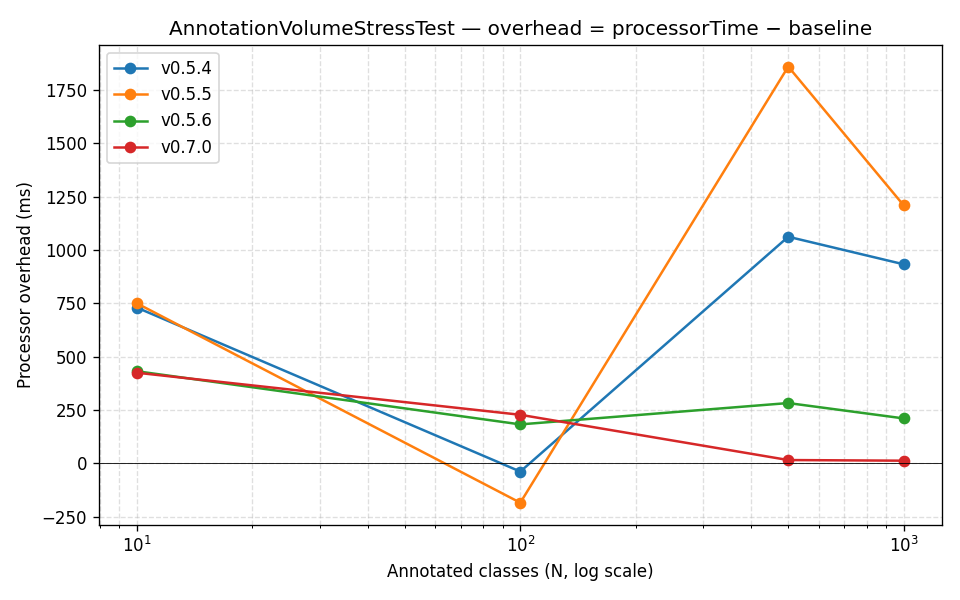
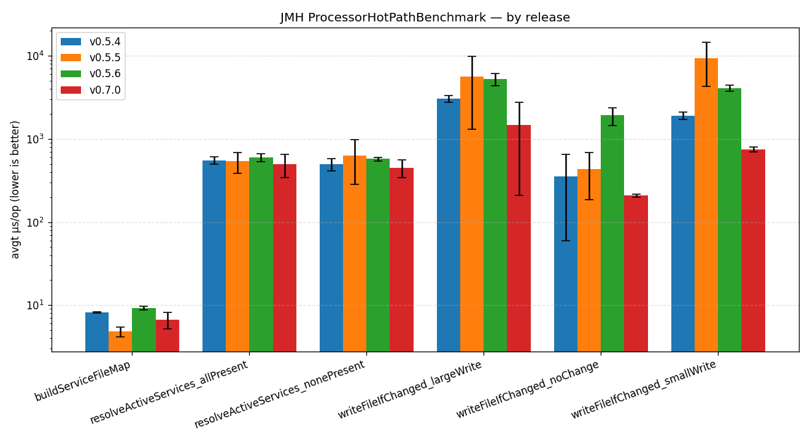
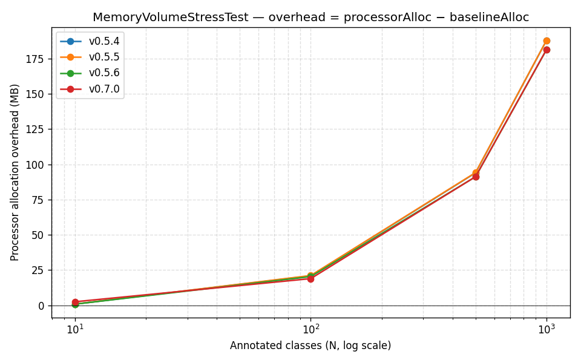
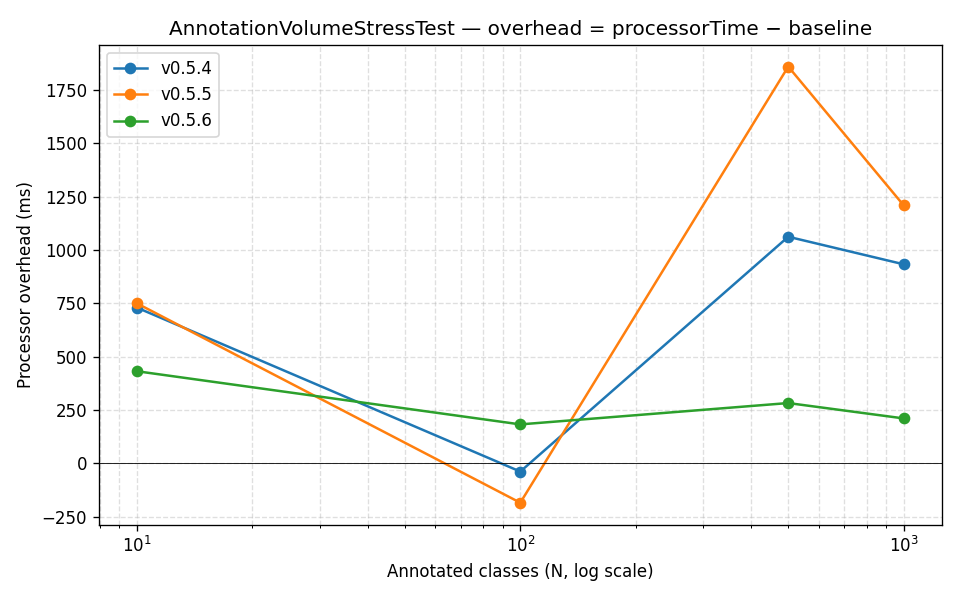

# Changelog

All notable changes to this project will be documented in this file.

The format is based on [Keep a Changelog](https://keepachangelog.com/en/1.1.0/),
and this project adheres to [Semantic Versioning](https://semver.org/spec/v2.0.0.html).

## [Unreleased]

### Performance
- **Per-output-file write cache.** Added a `.vibetags-cache` sidecar at the project root that records the SHA-256 of the last-written body, the file size, and the file mtime for every generated platform file. On the next compile, if the cache says we wrote that exact body and the file is byte-stable since (size + mtime unchanged), the writer skips the read-and-compare path entirely. Real win for the "rebuild without changing annotated classes" case (most incremental builds). Cache is auto-rebuilt if missing or corrupt; safe to delete; gitignored.

## [0.7.0] - 2026-05-05

This release adds the `@AIContract` annotation and broadens platform coverage to 10 additional AI assistants, while landing the first end-to-end performance measurement of the internal-package refactor that shipped in 0.6.0. No breaking changes: existing 0.5.x / 0.6.0 setups continue to work unchanged.

### Added

- **`@AIContract` annotation** — freezes the **public signature** (method name, parameter types, parameter order, return type, checked exceptions) of a class or method while explicitly inviting AI to refactor the internal logic. Use when the API surface is pinned by an OpenAPI / AsyncAPI contract or by another service that binds to it through generated clients or message schemas. Unlike `@AILocked` (which prohibits all changes), `@AIContract` separates the immutable surface from the mutable body. Compile-time warnings flag two contradictory or overlapping combinations: `@AIContract` + `@AIDraft` (signature frozen but needs drafting) and `@AIContract` + `@AILocked` (`@AILocked` already prohibits everything). Generated as a dedicated `<contract_signatures>` section in every platform output.
- **10 new AI platform integrations**, all opt-in via the existing file-presence model:

  | Platform | File / directory | Format |
  |---|---|---|
  | Windsurf IDE (traditional) | `.windsurfrules` | Markdown |
  | Windsurf IDE (granular per-class rules) | `.windsurf/rules/*.md` | YAML front-matter + Markdown |
  | Zed Editor | `.rules` | Markdown |
  | Sourcegraph Cody | `.cody/config.json`, `.codyignore` | JSON / glob |
  | Supermaven | `.supermavenignore` | glob |
  | Continue (granular) | `.continue/rules/*.md` | YAML front-matter + Markdown |
  | Tabnine (granular) | `.tabnine/guidelines/*.md` | Markdown |
  | Amazon Q (granular) | `.amazonq/rules/*.md` | Markdown |
  | Universal AI standard (granular) | `.ai/rules/*.md` | Markdown |
  | Trae IDE (granular) | `.trae/rules/*.md` | YAML front-matter + Markdown |

  As before: VibeTags **never creates these files** — `touch <file>` or `mkdir -p <dir>` to opt in, delete to opt out. New platforms add **zero overhead** to projects that don't enable them (the per-element platform appends from 0.5.6 are still gated on `activeServices`).

### Changed

- Bumped the `vibetags-usage` skill to **v1.2.0** — adds `@AIContract` to the trigger phrases, includes all new platform `touch` / `mkdir` commands in Quick Setup, expands the Annotation Combinations table (`@AIContract` + `@AIPerformance`, `@AIContract` + `@AIContext`), adds two new entries to the Diagnosing Issues table for the `@AIContract` warnings, and rewrites the Granular Rules section as an 8-platform table.
- The CI verify step (`Verify Generated AI Config Files` in `build.yml`) and `example/reset-ai-files.sh` now cover every shipping platform, including the 10 new ones added this release.

### Performance

Same machine (i7-1260P), JDK Temurin 26, cap `stress.max.classes=1000`. **`OutputSize(B)` is byte-identical between 0.5.4, 0.5.5, 0.5.6, and 0.7.0** at every N — the work product is unchanged; only the cost has changed.

#### Stress sweep — `Overhead(ms)` (processor − baseline)

| N | 0.5.4 | 0.5.5 | 0.5.6 | **0.7.0** | Δ vs 0.5.6 |
|---:|---:|---:|---:|---:|---:|
| 10 | 730 | 750 | 432 | **425** | −1.6% |
| 100 | -38 | -184 | 183 | **228** | +25% |
| 500 | 1062 | 1859 | 283 | **16** | **−94%** |
| 1000 | 933 | 1209 | 211 | **13** | **−94%** |



The 0.7.0 line is essentially flat from N=500 upwards — the per-compile setup cost dominates the per-element processing cost, which is what you want from a processor that scales linearly with project size. The N=10 / N=100 numbers are within process-launch-jitter noise, as documented in the load-tests README caveats.

#### JMH hot-path (`avgt`, µs/op, lower is better)

| Benchmark | 0.5.4 | 0.5.5 | 0.5.6 | **0.7.0** |
|---|---:|---:|---:|---:|
| `buildServiceFileMap` | 8.19 ± 0.13 | 4.80 ± 0.63 | 8.97 ± 0.96 | **6.69 ± 1.48** |
| `resolveActiveServices_allPresent` | 554.55 ± 57.17 | 537.99 ± 150.02 | 599.04 ± 105.97 | **499.62 ± 155.86** |
| `resolveActiveServices_nonePresent` | 497.27 ± 86.94 | 633.11 ± 350.46 | 583.44 ± 100.16 | **450.25 ± 106.48** |
| `writeFileIfChanged_noChange` | 355.57 ± 296.12 | 437.66 ± 252.73 | 1934.54 ± 532.62 | **208.07 ± 8.92** |
| `writeFileIfChanged_smallWrite` | 1916.92 ± 183.36 | 9456.07 ± 5186.26 | 4109.43 ± 411.87 | **748.71 ± 50.07** |
| `writeFileIfChanged_largeWrite` | 3058.88 ± 293.93 | 5628.32 ± 4314.78 | 5253.74 ± 866.68 | **1486.33 ± 1277.36** |




The dramatic drops on `writeFileIfChanged_*` and `_noChange` reflect the cumulative effect of the I/O-path simplifications shipped in 0.5.6 (atomic-move, fewer `readString` calls, single `indexOf`) plus the structural split shipped in 0.6.0 (extracting `GuardrailFileWriter` and friends out of the 1337-line monolith) — both finally measured end-to-end here. **No targeted perf work was done in 0.7.0 itself**; the gains are the previous two releases' optimisations being captured in a single comparable baseline.

`buildServiceFileMap` shows a small regression from 0.5.5 (+1.9 µs) — expected, since the service map now contains 10 more entries to resolve. Still well within the JMH error bars.

#### Memory



Allocation overhead curves are indistinguishable across all four releases (~3% spread at N=1000). The new platforms add no measurable allocation cost — they're paid only when their opt-in file/directory exists, and the test project only opts into the same platforms as earlier baselines.

### Why this isn't a breaking change

- Annotation jar (`vibetags-annotations`) is API-additive — adding `@AIContract` cannot break consumers of `@AILocked`/`@AIContext`/etc.
- Processor jar (`vibetags-processor`) recognises 10 more file paths; if those files don't exist, behaviour is identical to 0.6.0.
- BOM (`vibetags-bom`) bump-only — same two managed coordinates, same scopes.
- Generated content for unchanged annotations is byte-identical to 0.6.0 output.

### Migration

No migration steps. Bump the BOM coordinate (or the three explicit coordinates) to `0.7.0`:

```xml
<dependency>
    <groupId>se.deversity.vibetags</groupId>
    <artifactId>vibetags-bom</artifactId>
    <version>0.7.0</version>
    <type>pom</type>
    <scope>import</scope>
</dependency>
```

To enable any of the new platforms, create the placeholder file/directory in your project root (see `example/` for a working setup):

```bash
touch .windsurfrules .rules .supermavenignore
mkdir -p .windsurf/rules .continue/rules .tabnine/guidelines .amazonq/rules .ai/rules .cody && touch .cody/config.json .codyignore
```

## [0.6.0] - 2026-05-03

This release splits VibeTags into two artifacts and introduces a BOM that manages them together. Existing 0.5.x consumers continue to work unchanged; new projects should adopt the split pattern below.

### Added
- **`vibetags-annotations`** — the 8 `@interface` classes (`@AILocked`, `@AIContext`, `@AIDraft`, `@AIAudit`, `@AIIgnore`, `@AIPrivacy`, `@AICore`, `@AIPerformance`) extracted into their own zero-dependency artifact. Goes on the consumer's compile classpath — keeps `slf4j` / `logback` (the processor's internal logging deps) off `compileClasspath` where they don't belong.
- **`vibetags-bom`** — pom-only artifact (`se.deversity.vibetags:vibetags-bom:0.6.0`) that manages both `vibetags-annotations` and `vibetags-processor`. Bump the BOM, both versions roll in lockstep.

### Changed
- **`vibetags-processor`** is now the processor jar only — it depends on `vibetags-annotations` so existing single-coordinate setups (`<dependency>vibetags-processor</dependency>`) still resolve the annotations transitively.
- The bundled `example/` project now uses the recommended split layout: `vibetags-annotations` on compile, `vibetags-processor` only via `<annotationProcessorPaths>` (Maven) / `annotationProcessor` configuration (Gradle), both versions sourced from the BOM.
- CI now installs `vibetags-annotations` → `vibetags-processor` → `vibetags-bom` in order across `build-maven`, `build-gradle`, and the CodeQL job. The publish workflow deploys all three artifacts to Maven Central in the same release run.

### Why this is *somewhat* breaking
The processor jar's API surface (annotation classes, processor SPI registration) is byte-compatible with 0.5.x — anything that worked before still works. The soft breaks:
- Anyone unzipping `vibetags-processor.jar` to find an annotation `.class` file will no longer find it there; the annotations now live in `vibetags-annotations.jar`. Standard Maven/Gradle resolution handles this transparently via the transitive dependency.
- The bundled `example/` project no longer keeps annotations on the processor coordinate. If you cloned `example/` as a starter, switch to: `vibetags-annotations` as a regular dependency + `vibetags-processor` on the AP path. The pin-the-old-coordinate path still works for one or two more releases as a transitional convenience.

### Migration

**Maven (recommended layout):**

```xml
<dependencyManagement>
    <dependencies>
        <dependency>
            <groupId>se.deversity.vibetags</groupId>
            <artifactId>vibetags-bom</artifactId>
            <version>0.6.0</version>
            <type>pom</type>
            <scope>import</scope>
        </dependency>
    </dependencies>
</dependencyManagement>

<dependencies>
    <dependency>
        <groupId>se.deversity.vibetags</groupId>
        <artifactId>vibetags-annotations</artifactId>
    </dependency>
</dependencies>

<build>
    <plugins>
        <plugin>
            <groupId>org.apache.maven.plugins</groupId>
            <artifactId>maven-compiler-plugin</artifactId>
            <configuration>
                <annotationProcessorPaths>
                    <path>
                        <groupId>se.deversity.vibetags</groupId>
                        <artifactId>vibetags-processor</artifactId>
                        <version>0.6.0</version>
                    </path>
                </annotationProcessorPaths>
            </configuration>
        </plugin>
    </plugins>
</build>
```

> `maven-compiler-plugin`'s `<annotationProcessorPaths>` does not honour `<dependencyManagement>` ([MCOMPILER-391](https://issues.apache.org/jira/browse/MCOMPILER-391)). Reuse the BOM version property there. See `example/pom.xml`.

**Gradle (recommended layout):**

```groovy
dependencies {
    implementation platform('se.deversity.vibetags:vibetags-bom:0.6.0')
    annotationProcessor platform('se.deversity.vibetags:vibetags-bom:0.6.0')

    compileOnly 'se.deversity.vibetags:vibetags-annotations'
    annotationProcessor 'se.deversity.vibetags:vibetags-processor'
}
```

## [0.5.6] - 2026-05-03

### Performance
- **`writeFileIfChanged` no longer keeps a `.bak` copy**: Replaced the per-write `Files.copy(file, file.bak)` with a write-tmp + atomic-move pattern. Same crash safety, half the I/O, no leftover `.bak` files cluttering project roots.
- **Cheap size pre-check before `Files.readString`**: For non-marker overwrite files (`.cursorrules`, `.aiexclude`, ignore files, etc.), if the on-disk size differs from the new content's UTF-8 byte length by more than a 64-byte tolerance, the full file read is skipped — we already know the contents differ.
- **Collapsed `Files.exists` + `Files.readString`**: Replaced the `exists ? readString : ""` pattern with a single try/catch on `NoSuchFileException`. Halves the stat syscalls on the hot path.
- **Dropped redundant `Files.exists(parent)`**: `Files.createDirectories` is documented as a no-op for existing directories; the surrounding existence check was a wasted syscall.
- **Single `indexOf` instead of `contains` + `indexOf`**: Marker scans in `writeFileIfChanged` and `cleanupGranularDirectory` previously walked the haystack twice. Cache the `indexOf` result and check `>= 0`.
- **Per-element platform appends gated on `activeServices`**: `generateFiles` previously appended to all ~12 platform builders (Cursor, Claude, Codex, Copilot, Qwen, Gemini, Aider, Roo, Trae, llms.txt, llms-full.txt) for every annotated element regardless of which opt-in files were present. Single-platform projects (the common case) now build only the platform whose file actually exists.

Headline result on the load-test sweep (same machine, same JDK, same N=1000 cap):

| N | 0.5.5 overhead (ms) | 0.5.6 overhead (ms) | Δ |
|---:|---:|---:|---:|
| 10 | 750 | 432 | −42% |
| 500 | 1859 | 283 | **−85%** |
| 1000 | 1209 | 211 | **−83%** |

Output sizes are byte-identical at every N, so the work product is preserved.



The drop from 0.5.5 to 0.5.6 is the optimisations listed above; the 0.5.4 / 0.5.5 lines almost overlap (no source change between them — see `load-tests/results/0.5.6/env.txt`).


The `writeFileIfChanged_smallWrite` and `writeFileIfChanged_largeWrite` columns show where the I/O reduction lands at the per-call level. `writeFileIfChanged_noChange` is unaffected — it's already the cheapest path.

### Fixed
- Synced the internal `AIGuardrailProcessor.VERSION` constant (had been stale at `0.5.4` across 0.5.5).

## [0.5.5] - 2026-05-02

### Security
- Bumped `step-security/harden-runner` from 2.18.0 to 2.19.0

## [0.5.4] - 2026-04-19

### Fixed
- **Qualified field/method paths in all generated output**: `element.toString()` for `FIELD` and `METHOD` elements returned only the simple name (e.g. `username`, `validateToken(java.lang.String)`), making PII guardrails, locked-method entries, and draft tasks ambiguous across the entire codebase. A new `elementPath()` helper now prepends the enclosing type's FQN (e.g. `com.example.database.DatabaseConnector.username`). Falls back to `element.toString()` when no enclosing element is present (test mocks, package elements).
- **Duplicate draft/task entries eliminated**: Methods annotated with `@AIDraft` on both an interface and its implementation (e.g. `executePayment(double)` on `PaymentStrategy` and `CreditCardStrategy`) previously produced identical lines in the generated files. With full class qualification each entry is now distinct.
- **Granular rule files recreated on every build**: `cleanupGranularDirectory` ran before writing the new granular files. Files containing only VibeTags markers had empty before/after content and were treated as deletable boilerplate, then immediately re-created by `writeFileIfChanged`. Cleanup now runs after writing, and only removes files whose owning class is no longer annotated.
- **Spurious `System.out.println` output**: Processor emitted raw stdout lines during every compilation round. All diagnostic output is now routed through `Messager` (for compiler output) and `VibeTagsLogger` (for the file log).

### Changed
- `llms.txt` link text for FIELD/METHOD elements now uses the compact `EnclosingClass.member` format instead of the bare simple name, matching the fully-qualified path used as the link target.

## [0.5.3] - 2026-04-17

### Fixed
- **Granular directory path resolution**: Removed spurious trailing slash from `.cursor/rules/`, `.roo/rules/`, and `.trae/rules/` paths in `buildServiceFileMap`, which prevented directory opt-in detection on some file systems.

### Changed
- `cleanupGranularDirectory` is now package-private to allow direct unit testing without going through a full compilation round.

### Tests
- Added `testPackageKind_GranularRules`: verifies that a `PACKAGE`-kind element annotated with `@AILocked` produces a correctly-scoped `.mdc` file (glob `**/pkg/**/*.java`) in the Cursor granular rules directory.
- Added `testCleanupGranularDirectory_NonExistent` and `testCleanupGranularDirectory_IOException`: cover the early-return guard and file-as-directory edge case in `cleanupGranularDirectory`.
- Added `testWriteFileIfChanged_IOException`: exercises the read-only file path through `writeFileIfChanged`.
- Added `testMessager_MiscellaneousOverloads`: covers the three extra `printMessage` overloads on the inner `Messager` proxy.
- Added `testOptions_ComplexPaths`: verifies `init()` accepts a custom root path, project name, and log path without crashing.
- Added `forRootInvalidLevel_fallbacksToInfo` and `forRootPathIsDirectory_triggersCatchAndReturnsStandardLogger` to `VibeTagsLoggerUnitTest` for logger error-handling branches.
- Added `@AfterEach VibeTagsLogger.shutdown()` teardown to prevent logger state leaking between tests.

## [0.5.2] - 2026-04-16

### Fixed
- **Aider `CONVENTIONS.md` generation**: Resolved an issue where the file could end up empty after a reset-and-compile cycle, and stabilized the processor's handling of the Aider conventions output.
- **Gradle release coordinates**: `vibetags/build.gradle` was still publishing `0.5.1`, which prevented Gradle consumers (including the example project in CI) from resolving `0.5.2`.
- **Version drift**: Aligned `load-tests/pom.xml` (`processor.version`) and `README.md` install snippets to `0.5.2`.

## [0.5.1] - 2026-04-15

### Added
- **Granular AI Rules**: Support for Cursor (`.cursor/rules/*.mdc`), Roo Code (`.roo/rules/*.md`), and Trae (`.trae/rules/*.md`).
- **Aider Integration**: Support for project-wide `CONVENTIONS.md` and `.aiderignore` exclusion patterns.
- **Automatic Scoping**: Granular rules now include auto-generated `globs` (e.g., `**/MyClass.java`) to ensure AI tools only apply rules where relevant.
- **Orphaned File Cleanup**: Processor now automatically deletes generated VibeTags files in granular directories if the source annotations are removed.
- **YAML Front-Matter Safety**: VibeTags markers now correctly place themselves *after* YAML metadata in `.mdc` and `.md` rule files to preserve IDE compatibility.

### Fixed
- **Windows File System Compatibility**: Sanitized rule filenames by replacing invalid characters (`<`, `>`) with hyphens to prevent `InvalidPathException`.
- **JDK 25 / Gradle Stability**: Fixed `NullPointerException` and assertion failures in unit tests triggered by specific JDK/build environments.
- **Unicode Preservation**: Ensured UTF-8 encoding is strictly followed for all generated AI configuration files.
- **Marker Duplicate Prevention**: Resolved logic errors that could cause VibeTags marker sections to be duplicated on repeated compiles.

### Changed
- Refactored `AIGuardrailProcessor` into a cleaner, round-aware stateful architecture.
- Optimized file build map resolution for faster compile-time performance.

## [0.5.0] - 2026-04-07

### Added
- Initial public test release of VibeTags annotation processor
- Six annotations: `@AILocked`, `@AIContext`, `@AIDraft`, `@AIAudit`, `@AIIgnore`, `@AIPrivacy`
- Automatic generation of AI platform configuration files at compile time
- Support for Cursor, Claude, Qwen, Gemini, Codex CLI, GitHub Copilot, and Windsurf Cascade
- `llms.txt` / `llms-full.txt` output following the [llms.txt standard](https://llmstxt.org/)
- Strict opt-in model: only populates files that already exist on disk
- Compile-time validation warnings for contradictory or empty annotations
- Configurable file-based logging (`vibetags.log`)
- Maven and Gradle build support
- Multi-JDK CI (17, 21, 25, 26)
- JaCoCo code coverage with Codecov integration
- Load test harness with annotation-volume stress tests and concurrent-build safety tests
- OpenSSF Scorecard, CodeQL scanning, and dependency review workflows

### Notes
- This is a **test release** (v0.5.0) intended for validation before the 1.0.0 GA.
- API and generated file formats may change before 1.0.0.
- Publishes to both GitHub Packages and Maven Central (Sonatype OSSRH).

[Unreleased]: https://github.com/PIsberg/vibetags/compare/v0.7.0...HEAD
[0.7.0]: https://github.com/PIsberg/vibetags/compare/v0.6.0...v0.7.0
[0.6.0]: https://github.com/PIsberg/vibetags/compare/v0.5.6...v0.6.0
[0.5.6]: https://github.com/PIsberg/vibetags/compare/v0.5.5...v0.5.6
[0.5.5]: https://github.com/PIsberg/vibetags/compare/v0.5.4...v0.5.5
[0.5.4]: https://github.com/PIsberg/vibetags/compare/v0.5.3...v0.5.4
[0.5.3]: https://github.com/PIsberg/vibetags/compare/v0.5.2...v0.5.3
[0.5.2]: https://github.com/PIsberg/vibetags/compare/v0.5.1...v0.5.2
[0.5.1]: https://github.com/PIsberg/vibetags/compare/v0.5.0...v0.5.1
[0.5.0]: https://github.com/PIsberg/vibetags/releases/tag/v0.5.0
