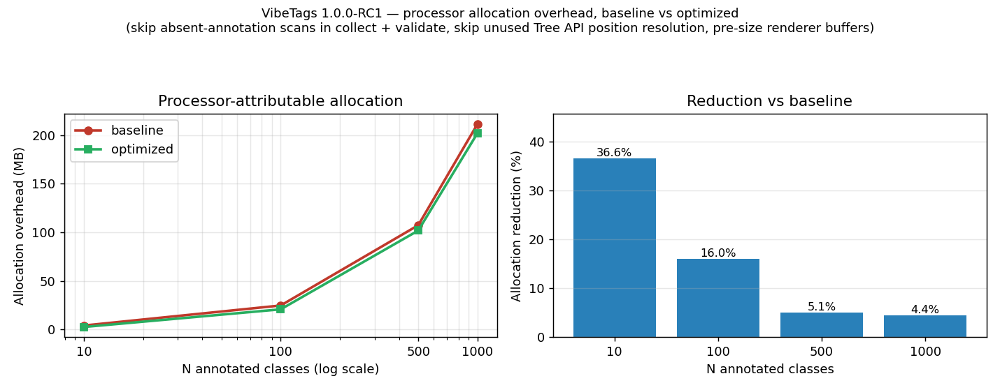
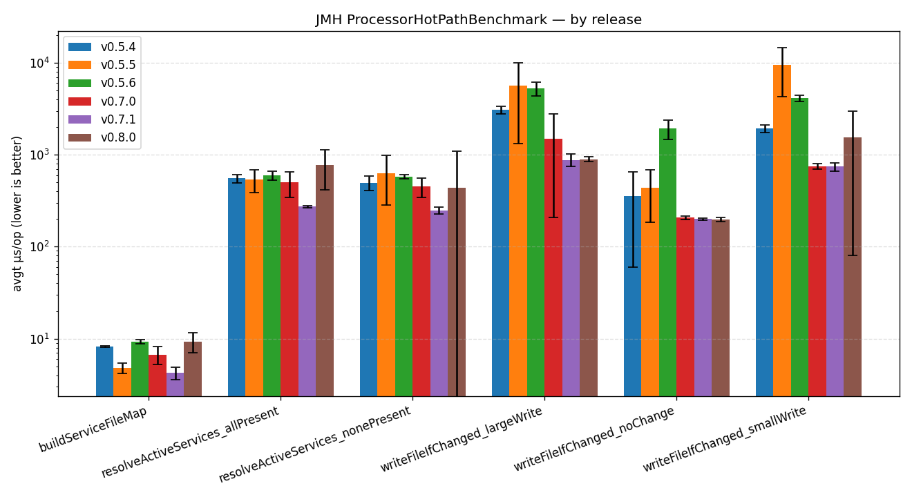
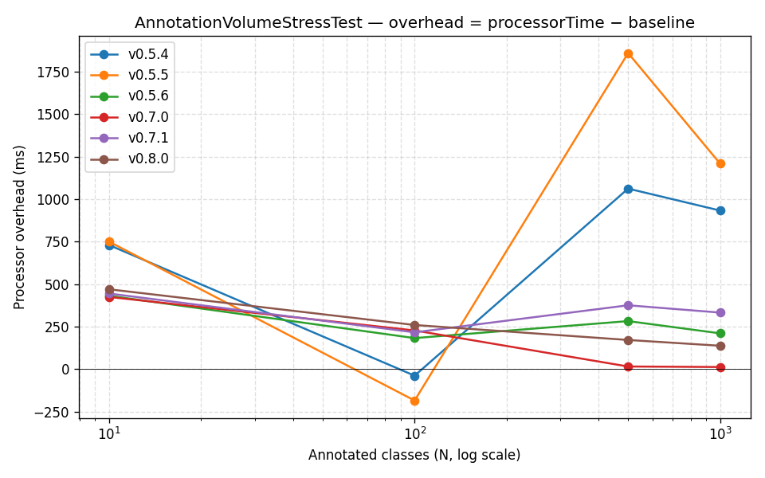
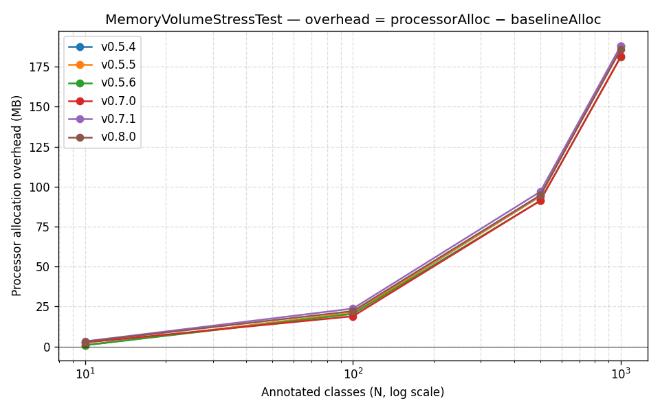
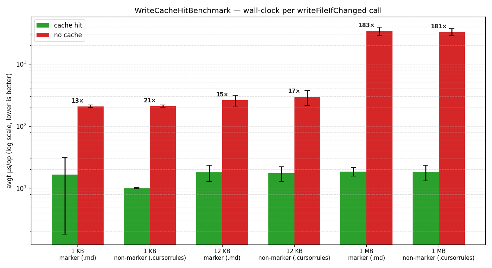
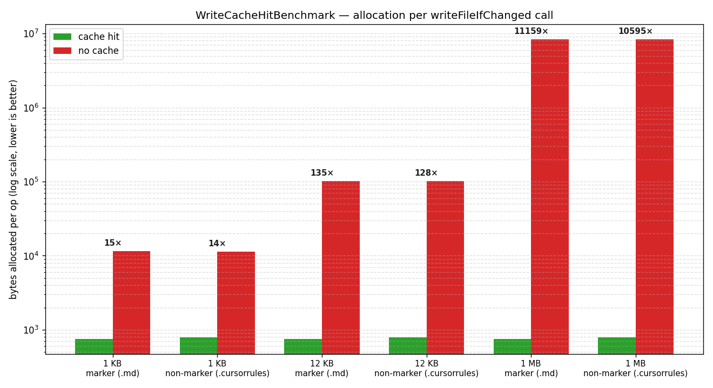
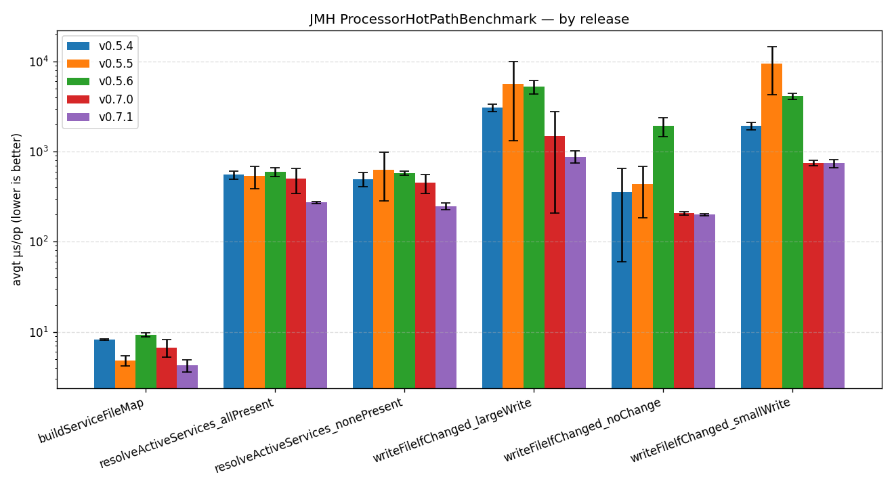
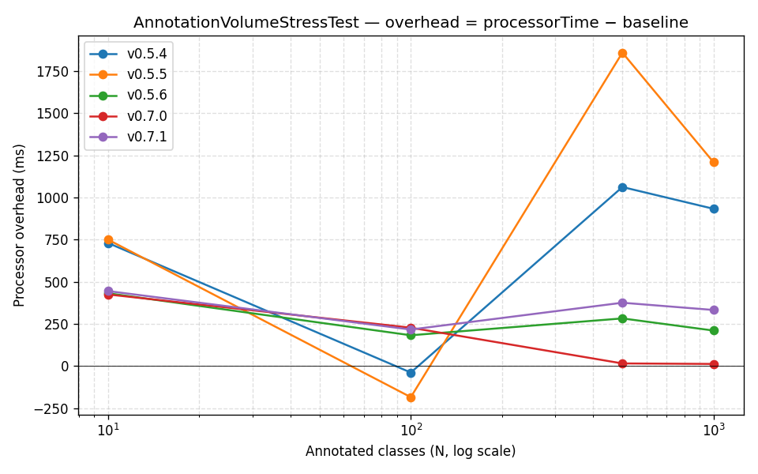
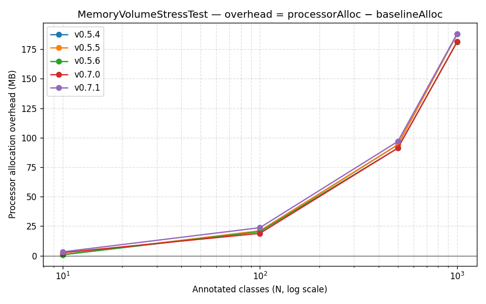

# Changelog

All notable changes to this project will be documented in this file.

The format is based on [Keep a Changelog](https://keepachangelog.com/en/1.1.0/),
and this project adheres to [Semantic Versioning](https://semver.org/spec/v2.0.0.html).

## [Unreleased]

## [1.0.0-RC3] - 2026-07-17

### Security
- **Escape interpolated values in all structured outputs.** Annotation attribute text (`reason`,
  `note`, `focus`, …) and element paths are now escaped per format before being written into the
  structured guardrail files — XML (`CLAUDE.md`), JSON (`.mentatconfig.json`, `.vibetags-locks`),
  and double-quoted YAML (`sweep.yaml`, `.plandex.yaml`, `ellipsis.yaml`) — via a new
  `content.Escape` helper. Previously a value containing `<`, `"`, `\`, or a newline (whether from a
  hostile annotation or simply a method signature with generics such as `Map<String, Object>`)
  could break out of the document structure or forge entries (e.g. a fake `<file>` in `CLAUDE.md`,
  which AI agents read as a locked-file directive). Markdown/plain-text outputs are unchanged
  (free text, no structure to break). New `OutputEscapingSecurityTest` proves a hostile reason
  cannot break out of the XML/JSON/YAML structure. This also fixes a latent correctness bug where
  generic signatures produced malformed XML in `CLAUDE.md`. YAML flow-list items (e.g. the
  `@AIAudit` `checkFor` list in `.plandex.yaml`) are now individually quoted and escaped so an item
  containing `]`, `,`, or `"` cannot break out of the sequence.
- **Hardened the locked-files GitHub Action** against git option-injection: reject a base ref that
  starts with `-` and terminate the `git diff` argument list with `--`.
- **Atomic writes now use a secure random staging file.** `GuardrailFileWriter` previously staged
  output at the predictable path `<file>.vibetags-tmp` and followed symlinks, so a pre-planted
  symlink there (local workspace write access) could redirect a write to an arbitrary file. It now
  stages via `Files.createTempFile` (random name, `O_EXCL` creation) in the target directory and
  cleans up on failure.
- **Documented the threat model** in `docs/SECURITY.md` (compile-time only, no runtime surface;
  generated files are AI instructions derived from source annotations — review annotation text as
  code) and refreshed the supported-versions table to 1.0.x.

## [1.0.0-RC2] - 2026-06-28

Second release candidate for 1.0. Rolls up everything since RC1: ten new AI platforms (43 → see
project facts), the `AGENTS.md` sole-file fallback, optional `reason` on the eleven marker
annotations, processing-path performance work, and a documentation consistency pass with an
enforced single source of truth for the project counts.

### Documentation
- **Single source of truth for the project counts.** The README "At a glance" line now states the
  two headline numbers once — **39 annotations**, **37 AI platforms** — and every other doc links
  back to it instead of restating them. Fixed stale/contradictory figures that had drifted across
  the README, `docs/ARCHITECTURE.md`, and `example/README.md` (variously claiming 15/24/27 annotations
  and 27/40+/43 platforms). New `ProjectFactsConsistencyTest` enforces both: the documented annotation
  count must equal the number of `@interface` types, and the documented platform count must equal the
  number of distinct platforms enumerated in the README list — so the docs can no longer silently
  drift from the code.
- **The example now passes a `reason` to all eleven marker annotations** (`@AIStrictTypes`,
  `@AIPublicAPI`, `@AIPure`, `@AISandboxOnly`, `@AILegacyBridge`, `@AISchemaSafe`,
  `@AIStrictExceptions`, `@AIStrictClasspath`, `@AIInternationalized`, `@AIParallelTests`,
  `@AIPrototype`), showcasing the cross-session rationale capability. The example already exercises
  all 39 annotations.
- **The `vibetags-usage` skill now demonstrates `reason` on every marker annotation** (its examples
  previously showed the bare markers).
- **Added an ArchUnit badge** to the README, linking to `ArchitectureRulesTest` (the architecture
  fitness functions run as part of the standard build).
- **Closed gaps in the example's CI verification.** Cline (`.clinerules`), JetBrains Junie
  (`.junie/guidelines.md`), and Firebase AI (`.idx/airules.md`) were opted-in/generatable but not
  checked by the `build.yml` "Verify Generated AI Config Files" step — and Firebase's output was
  never even committed. The Firebase output is now committed and all three are added to the verify
  list (both the Maven and Gradle legs). The granular per-class platforms remain verified via one
  representative file each.

### Added
- **Optional `reason` on the eleven marker annotations** — `@AILegacyBridge`, `@AIStrictClasspath`,
  `@AIInternationalized`, `@AIPublicAPI`, `@AISchemaSafe`, `@AIStrictExceptions`, `@AIStrictTypes`,
  `@AIParallelTests`, `@AISandboxOnly`, `@AIPure`, `@AIPrototype`. These previously carried no
  attributes, so they could only emit a canned, generic instruction. They now accept an optional
  `reason` (defaulting to `""`, so existing usages compile unchanged) that is surfaced in the
  generated output — appended to the rule text on the markdown/plain-text platforms and as a
  `<reason>…</reason>` element in `CLAUDE.md`. The point is to **carry the *why* across AI
  sessions**: a marker preserves only a verdict ("be strict here"), but the rationale ("currency
  math broke in INC-4412 when a double leaked in") is exactly the non-inferable context a later
  agent — which no longer has the originating session — needs to weigh or safely override the
  rule. Nothing is emitted when `reason` is left blank. Covered by `MarkerReasonEndToEndTest`.

### Performance
Four changes to the per-round processing and rendering paths, all behaviour-preserving (every one
of the 1033 unit tests passes unchanged):

- **Skip `getElementsAnnotatedWith` for annotation types that aren't present** — in both
  `AnnotationCollector.collect()` *and* `AnnotationValidator.validate()`. Both consult the set of
  annotation types javac reports present this round (the `annotations` argument of `process()`) and
  query only those. Previously every round scanned all root elements ~39 times in collect and a
  further ~30 times in validate; for a project that uses a handful of annotation types, ~60 of those
  scans returned empty. Querying an absent type returns empty, so skipping it is equivalent.
- **Skip Tree API position resolution unless the lock report is enabled.** Source positions for
  `@AILocked` elements (javac Compiler Tree API) are consumed only by the `.vibetags-locks` report;
  when it isn't opted in, that per-element work is skipped entirely.
- **Pre-size renderer output buffers from the collected element count.** The nine large O(N) prose
  renderers (Cursor, Claude, Gemini, Qwen, Copilot, Windsurf, Zed, Aider, llms.txt/-full) now start
  their `StringBuilder` at an estimate derived from the element count instead of a fixed 4 KB,
  avoiding repeated grow-and-copy reallocation on large projects.

- **Measured impact** (`MemoryVolumeStressTest`, original 1.0.0-RC1 vs optimized, captured
  back-to-back on the same machine — see `load-tests/results/1.0.0-RC1/`): processor-attributable
  **allocation overhead drops ~4–5 % at N ≥ 500 annotated classes** (211.5 → 202.1 MB at N = 1000,
  ≈ 9 MB less heap pressure per 1000-class module) and 16–37 % at small N where the avoided
  per-round work dominates. The deterministic allocation win is driven mainly by the Tree API skip
  and the collect-scan skip; the validator-scan skip is primarily a *CPU / scan-count* reduction
  (~60 → ~k full element scans per round) and the buffer pre-sizing trims resize churn — neither
  adds much to the byte count. Wall-clock overhead is unchanged within run-to-run variance: on
  commodity hardware the synthetic `processorTime − baselineTime` delta is noise-dominated (baseline
  runs occasionally even measured negative overhead), so deterministic allocation is the metric of
  record.

  

### Changed
- **`AGENTS.md` is now only generated when it is the *sole* AI config file present.** When
  `AGENTS.md` coexists with any other opted-in AI config file (e.g. `CLAUDE.md`, `.cursorrules`),
  the `codex` service is dropped during `resolveActiveServices()` and `AGENTS.md` is left
  untouched — which also disables the Codex sidecar config (`.codex/config.toml`, `.codex/rules/`)
  it would otherwise drive.

  **Why this changed:**
  - `AGENTS.md` is no longer Codex-specific — it has become a *de facto cross-tool standard* that
    many agents read. Unlike a tool-specific file such as `.cursorrules`, its mere presence is a
    weak signal of intent: it does not tell us *which* tool put it there or what it is for.
  - In practice, once a repo adopts more than one AI tool, teams routinely reduce `AGENTS.md` to a
    thin **pointer** — `See CLAUDE.md` or an `@import` — so a single source of truth lives in one
    file and the rest reference it. VibeTags writes between `# VIBETAGS-START/END` markers, but a
    hand-authored pointer typically has no markers, so the previous behaviour appended a full
    generated block to it and effectively buried the human's pointer.
  - The opt-in model elsewhere relies on a file being *unambiguously* tied to one platform. For
    `AGENTS.md` that assumption no longer holds, so "file exists ⇒ manage it" was too aggressive.
    The narrower rule — *manage it only when nothing else has opted in* — keeps the convenience for
    single-tool projects (where `AGENTS.md` clearly is the guardrail file) while refusing to clobber
    a likely pointer in multi-tool projects. Users who genuinely want VibeTags to own `AGENTS.md`
    can still get that by opting in to `AGENTS.md` alone.
  - The Codex sidecar (`.codex/*`) is gated on the same `codex` activation, so it follows
    `AGENTS.md`: skipping the prose pointer while still rewriting Codex's operational config would
    be an inconsistent half-active state, so the whole Codex platform is treated as one unit.

  Covered by `AgentsMdSoleFallbackTest` in both directions (sole-file → written, coexisting →
  skipped); the example now ships `AGENTS.md` as a hand-authored pointer to `CLAUDE.md` to
  demonstrate the rule, and CI asserts it is left untouched.

### Added
- **10 new generated platform targets** (43 platforms total), all opt-in via the existing
  file-presence model and adding zero overhead to projects that don't enable them:
  - **AI pull-request reviewers** — `.coderabbit.yaml` (CodeRabbit `reviews.path_instructions`),
    `.pr_agent.toml` (Qodo/Codium PR-Agent `extra_instructions`), and `ellipsis.yaml`
    (one `pr_review.rules` entry per guardrail). These flag PRs that violate VibeTags guardrails
    even when a local agent ignores them.
  - **Context-packer ignore files** — `.repomixignore`, `.gitingestignore`, `.gptignore`,
    `.ghostcoderignore`, `.piecesignore` (reuse the existing `IgnoreFileRenderer`).
  - **Void Editor** — `.void/rules.md` (mirrors the `.cursorrules` markdown layout).
  - **Roo Code custom mode** — `.roomodes` defining a "VibeTags Architect" mode whose
    `customInstructions` carry the project guardrails.
  - The reviewer/mode configs share a `GuardrailInstructionBlock` helper that reuses the
    existing per-annotation formatters, so their content stays in lock-step with the rest of
    the generated guardrails. New `NewPlatformsV4EndToEndTest` covers all ten; CI now resets,
    regenerates, and verifies them in the example project on both the Maven and Gradle legs.

### Documentation
- Updated the platform lists and counts (now **43 platforms**) across `README.md`, root
  `CLAUDE.md`, `docs/ARCHITECTURE.md`, `docs/WORKFLOW.md`, `example/README.md`, and the
  `vibetags-usage` skill (opt-in commands + Supported Output Files table).

## [1.0.0-RC1] - 2026-06-13

First release candidate for 1.0. All on-disk machine formats are now version-stamped, the
build fingerprint folds in the processor version, and the public API surface is frozen ahead
of the stable 1.0.0 release.

### Added
- **`Automatic-Module-Name` in both jar manifests** (`se.deversity.vibetags.annotations`,
  `se.deversity.vibetags.processor`) so JPMS consumers get a stable module name instead of a
  filename-derived automatic one. `Implementation-Version` is now also written to the manifest
  (Maven and Gradle builds).
- **Format-version fields on every on-disk machine format** ahead of 1.0:
  - `.vibetags-cache` carries a `# format: 1` header; caches written in a newer, unknown format
    are discarded wholesale instead of mis-parsed.
  - `.vibetags-mod-*` sidecars: the existing `# version=1` header is now *enforced* on load —
    a sidecar written by a newer processor is skipped (never deleted) in mixed-version
    multi-module builds.
  - `.vibetags-locks` starts with a `{"type":"format","version":1}` JSON record; consumers that
    filter on `type == "locked"` (like the bundled GitHub Action) are unaffected.

### Changed
- **The processor version is now part of the build fingerprint** (`BuildFingerprint`). Upgrading
  VibeTags invalidates the previous `.vibetags-cache` fingerprint, so a release that renders
  different content from unchanged annotations can no longer be skipped by the short-circuit.
  Expect one full regeneration on the first compile after any upgrade.

### Fixed
- **`@AIInputSanitized` / `@AISecureLogging` on method parameters now emit the fully qualified
  element path** (e.g. `com.example.Foo.exportKeys(java.lang.String)#filePath`) instead of the
  bare parameter name, which made same-named parameters on different methods indistinguishable
  (#212). **Migration note:** generated guardrail files containing parameter-level entries will
  show a one-time diff on the first compile after upgrading; CI check mode (`-Avibetags.check=true`)
  will flag this as drift until the files are regenerated.

### Build
- Bumped `spotbugs-maven-plugin` 4.9.8.3 → 4.10.2.0 (its JSpecify-aware analyzer found a missing
  null guard in `JunieRenderer`, now fixed) and `jacoco-maven-plugin` 0.8.14 → 0.8.15.

### Documentation
- Documented all 39 annotations consistently: `CLAUDE.md` (annotation table, semantics, and
  validation warnings for the 12 v0.9.9 annotations) and `USAGE.md` (new sections for
  `@AIFeatureFlag`, `@AISecure`, and the twelve v0.9.9 precision guardrails).

## [0.9.9] - 2026-05-31

### Added
- **12 new AI guardrail annotations** with compile-time validation rules, formatters, and showcase examples.
- **Firebase AI support** with `.idx/airules.md` output integration.
- **Static analysis enhancements**: Checkstyle and Error Prone integrated into the build. Replaced inline PMD suppressions with a central `pmd-ruleset.xml`.
- **CI/CD**: Added Windows and macOS cross-platform test jobs, bumped Java target to 21.

### Refactored
- Extracted duplicate formatter logic to satisfy CPD.
- Improved resilient sidecar and cache logic for different filesystem roots and symlinked temp dirs.

### Performance
- Isolated parallel file writes from the host `commonPool`.

### Fixed
- Disabled `UnsafeFinalization` check for JDK 26 compatibility.
- Ensure consumer build never fails on guardrail errors by downgrading failures to WARNING.
- Achieved full branch coverage for all 12 V5 AI guardrail annotations.

## [0.9.8] - 2026-05-25

### Added

- **SpotBugs static analysis** integrated into the Maven build (`spotbugs-maven-plugin:4.9.8.3`,
  `effort=Max`, `threshold=Low`); runs in the `verify` phase and fails the build on any finding.
  Upgrading from 4.9.3.0 → 4.9.8.3 simultaneously adds Java 26 (class file major version 70) support,
  fixing a CI failure on the JDK 26 matrix leg.

- **JSpecify 1.0.0 null annotations** throughout the processor source:
  - `@NullMarked` `package-info.java` files for all 5 processor packages establish non-null-by-default
  - `@Nullable` on every nullable return type: `PlatformRenderer.render()`, `Platform.fromServiceKey()`,
    `ModuleSidecar.load()`, `WriteCache.getBuildFingerprint()`, `WriteCache.getSidecarStamp()`,
    `GuardrailFileWriter.getMarkersFor()`
  - `@Nullable` on all nullable constructor parameters and fields throughout `AIGuardrailProcessor`,
    `GuardrailFileWriter`, `OrphanWarner`, `VibeTagsLogger`, and `WriteCache`

- **ArchUnit 1.4.0 architecture fitness functions** — 7 rules that make structural invariants
  machine-enforceable (run as part of the normal test suite):
  - All public classes in `content.annotations` must implement `AnnotationFormatter` and be `final`
  - All public classes in `content.platforms` must implement `PlatformRenderer` and be `final`
  - Formatter and renderer classes must have no non-static instance fields (thread-safety under the
    `ForkJoinPool` parallel writes added in v0.9.7)
  - The `content.annotations` and `content.platforms` sub-packages must be cycle-free

### Fixed (SpotBugs analysis)

- **`AnnotationCollector`** — all 27 annotation-set getters now return `Collections.unmodifiableSet()`
  wrappers instead of exposing the internal `LinkedHashSet` directly (`EI_EXPOSE_REP`)
- **`RenderingContext`** — constructor now makes a defensive `LinkedHashSet` copy of the `activeServices`
  parameter before wrapping with `unmodifiableSet` (`EI_EXPOSE_REP2`)
- **`LlmsRenderer`** — 25 anonymous `FormatterCaller` implementations converted to lambdas, eliminating
  hidden outer-class captures (`SIC_INNER_SHOULD_BE_STATIC_ANON`)
- **`VibeTagsLogger`** — both `shutdown()` overloads narrowed from `catch (Exception)` to
  `catch (RuntimeException)` to avoid silently swallowing checked exceptions (`REC_CATCH_EXCEPTION`)
- **`GuardrailFileWriter`**, **`ModuleSidecar`**, **`WriteCache`** — null guards added for
  `Path.getFileName()` and `Path.getParent()` (both return `null` for root paths)
  (`NP_NULL_ON_SOME_PATH_FROM_RETURN_VALUE`)
- **`AIGuardrailProcessor`** — removed 5 unread field declarations (`URF_UNREAD_FIELD`)

### Fixed (ArchUnit analysis)

- **`ClineRenderer`**, **`JunieRenderer`** — the shared `CursorRenderer` field was `private final`
  (one new instance per renderer object); changed to `private static final` since `CursorRenderer` is
  stateless, eliminating unnecessary allocations and correctly satisfying the no-instance-fields rule

### Refactored

- **`GuardrailContentBuilder` modularised** (PR #178, `refactor/issue-4-guardrail-content-builder`):
  the monolithic 2 100-line class has been decomposed into a three-layer content pipeline:
  - **`AnnotationFormatter`** (SPI interface) — one stateless implementation per annotation (27 classes
    in `internal.content.annotations`); each formatter renders its annotation's attributes into a
    platform-neutral text block
  - **`PlatformRenderer`** (SPI interface) — one stateless implementation per target platform (18 classes
    in `internal.content.platforms`); each renderer assembles the full output file by calling the
    appropriate formatters via `FormatterRegistry`
  - **`FormatterRegistry`** and **`PlatformRendererRegistry`** — lookup tables that map annotation types
    and `Platform` enum values to their respective implementations; `GuardrailContentBuilder` is now a
    thin coordinator that delegates all content generation to these registries
  - **`RenderingContext`** — immutable value object carrying the active-services set and per-build options
    through the render call chain, replacing scattered method parameters
  - **`Platform`** enum — centralises the platform ↔ service-key mapping that was previously spread
    across `GuardrailContentBuilder` and `ServiceRegistry`
  - Adding a new platform or annotation now requires one new class and one registry entry; no changes to
    `GuardrailContentBuilder` or any existing renderer/formatter

---

## [0.9.7] - 2026-05-20

### Added

- **3 new annotations** (total annotation count: 27):

  | Annotation | Targets | Description |
  |---|---|---|
  | `@AIIdempotent` | TYPE, METHOD | Declares an operation must be idempotent; AI must not introduce side effects that cause repeated calls to produce different results |
  | `@AIFeatureFlag` | TYPE, METHOD, FIELD | Marks code gated behind a runtime feature flag; AI must preserve the flag check and handle both enabled and disabled paths |
  | `@AISecure` | TYPE, METHOD | Marks security-critical code (authentication, encryption, session management); every change must be flagged for security review |

  Compile-time validation warnings for the new annotations:
  - `@AIIdempotent` + `@AIDraft` — contradictory (stable contract vs. unfinished element)
  - `@AIFeatureFlag` + `@AILocked` — contradictory (locked freezes; flag implies conditional execution)
  - `@AIFeatureFlag` with blank `flag` — no-op; the flag key is unspecified
  - `@AISecure` with blank `aspect` — advisory; specify the security concern
  - `@AISecure` + `@AIIgnore` — contradictory; `@AIIgnore` hides but `@AISecure` requires AI visibility

- **3 new platform integrations**:

  | Platform | File | Format |
  |---|---|---|
  | Cline AI assistant | `.clinerules` | Markdown |
  | JetBrains Junie | `.junie/guidelines.md` | Markdown |
  | Amazon Kiro (granular per-class) | `.kiro/steering/*.md` | Markdown |

- **Parallel file writes** — all active platform files are now written concurrently via
  `ForkJoinPool.commonPool()`, reducing annotation-processor wall-clock time on large projects with
  many enabled platforms

- **WriteCache fast-path speedup** — 272–322× wall-clock speedup at 1 MB body size when the
  fingerprint short-circuit is not active but content is byte-stable; avoids UTF-8 re-encoding on the
  comparison path

### Fixed

- Concurrent test helpers in `CapturingProcessor` switched to `ConcurrentHashMap` to prevent race
  conditions when processor tests run in parallel
- PMD: `LooseCoupling` (Queue interface), `UnusedPrivateField` (`junieRules` field)
- `plot-cache-hit.py`: removed hardcoded `DEFAULT_INPUT` path, added `argparse` for proper CLI use

### Migration

Bump the BOM coordinate to `0.9.7`. All 3 new annotations are in `vibetags-annotations:0.9.7`.

```xml
<vibetags.bom.version>0.9.7</vibetags.bom.version>
```

---

## [0.9.5] - 2026-05-19

### Added

- **14 new annotations** bringing the total from 10 (Central `0.8.0`) to 24. Five were present in the local
  `0.8.0` build (13.4 kB) but absent from the published Central JAR (9.7 kB — built from an earlier snapshot).
  `0.9.5` is the first release where all 24 annotations ship to Central:

  | Annotation | Targets | Description |
  |---|---|---|
  | `@AIThreadSafe` | TYPE, METHOD | Declares an explicit thread-safety strategy (`SYNCHRONIZED`, `LOCK_FREE`, `IMMUTABLE`, `THREAD_LOCAL`, `OTHER`); AI must preserve the named invariant |
  | `@AIImmutable` | TYPE | Declares a type immutable; compile-time warning when any non-static instance field is non-final |
  | `@AIDeprecated` | TYPE, METHOD, FIELD | Actively routes AI toward migrating callers; richer than Java's `@Deprecated` (`replacedBy`, `migrationGuide`, `deadline`) |
  | `@AIObservability` | TYPE, METHOD | Names metrics, trace spans, and log statements downstream dashboards depend on; AI must not silently remove or rename them |
  | `@AIRegulation` | TYPE, METHOD, FIELD | Ties code to a specific regulatory clause (GDPR, PCI-DSS, HIPAA, SOX); AI must document compliance impact for every change |
  | `@AIArchitecture` | TYPE | Declares the architectural layer this class belongs to (`belongsTo`) and the layers it must never import from (`cannotReference`); AI must not introduce cross-layer dependencies |
  | `@AILegacyBridge` | TYPE, METHOD | Marks compatibility bridges working around upstream bugs or quirks; AI must not modernize the structure — only internal business logic may change |
  | `@AIStrictClasspath` | TYPE, METHOD | Prohibits dynamic class loading, custom `ClassLoader`s, and runtime reflection hacks; all dependencies must be resolvable at compile time |
  | `@AIInternationalized` | TYPE, METHOD | All user-visible text must be resolved via i18n resources (e.g., `MessageSource`, `ResourceBundle`); AI must never hardcode user-facing strings |
  | `@AIPublicAPI` | TYPE, METHOD | All changes must be additive and backward-compatible; renaming methods, changing parameter types, or altering serialization formats is forbidden |
  | `@AISchemaSafe` | TYPE, FIELD | Prevents destructive schema changes (column drops, table drops, field renames) without explicit backward-compatible migrations |
  | `@AIStrictExceptions` | TYPE, METHOD | Prohibits catching or throwing `Exception`/`Throwable`; requires specific exception types with descriptive messages and preserved stack traces |
  | `@AIStrictTypes` | TYPE, METHOD, FIELD | Prohibits loose types (`Object`, raw collections, `double` for currency); requires well-defined domain models or strongly-typed transfer objects |
  | `@AIParallelTests` | TYPE, METHOD | Generated or modified tests must be safe for parallel execution: no shared mutable state, no fixed ports, no execution-order dependencies |

  Compile-time validation warnings added for contradictory combinations:
  - `@AIImmutable` on a type with a non-final, non-static instance field
  - `@AIThreadSafe(IMMUTABLE)` + `@AIImmutable` — redundant
  - `@AIObservability` with no `metrics`, `traces`, or `logs` — no-op
  - `@AIRegulation` with a blank `standard` — required attribute missing
  - `@AIDeprecated` + `@AILocked` on the same element — contradictory

- **Multi-module Maven/Gradle aggregation** — fixes a last-writer-wins bug where only the last module to compile
  was represented in shared output files (`.cursorrules`, `CLAUDE.md`, etc.) when multiple modules shared the
  same `vibetags.root`.

  How it works: each module writes its rendered per-service bodies to a sidecar file
  (`.vibetags-mod-<moduleId>`) at the shared root. On each compile, all sibling sidecars are read and merged
  into the shared output. Multi-module output uses module sub-markers so each module's contribution is
  traceable:
  ```
  # VIBETAGS-MODULE: module-graph
  ## LOCKED FILES
  * `com.example.graph.Node`
  # VIBETAGS-MODULE-END: module-graph
  # VIBETAGS-MODULE: module-cli
  ## MANDATORY SECURITY AUDITS
  * `com.example.cli.KartaCli`
  # VIBETAGS-MODULE-END: module-cli
  ```
  Single-module projects: zero change in behaviour — no sidecars are read, no sub-markers are emitted.

  Stale sidecar detection: sidecars whose `modulePath` directory no longer exists under the shared root are
  automatically deleted, handling modules removed from the project.

  The build fingerprint short-circuit was extended with a `# sidecar-stamp:` field (polynomial hash of all
  sidecar file mtimes) so a sibling module's annotation change correctly invalidates the fingerprint and
  triggers regeneration.

- **Dogfooding / self-annotation** — the processor now annotates its own source files with VibeTags
  annotations (`@AICore`, `@AIContract`, `@AILocked`, `@AIPerformance`, `@AIImmutable`, `@AIContext`),
  making the project its own living example. A `self-annotate` Maven profile was added to
  `vibetags/pom.xml` to regenerate the guardrail output after annotation changes:
  ```bash
  # Requires 'mvn install' once first to bootstrap the processor into local Maven repo
  cd vibetags && mvn clean compile -Pself-annotate
  ```

### Fixed

- **Version skew between Central and local builds** — `vibetags-annotations:0.8.0` on Maven Central (9.7 kB)
  was built before the five new annotation classes were added, while the locally-built `0.8.0` (13.4 kB)
  included them. Same coordinates, different content. `0.9.5` draws the clean line: the Central `0.8.0` jar
  had 10 annotations; `0.9.5` is the first complete release with all 15.

### Migration

Bump the BOM coordinate (or the three explicit coordinates) to `0.9.5`. No code changes required.

```xml
<dependency>
    <groupId>se.deversity.vibetags</groupId>
    <artifactId>vibetags-bom</artifactId>
    <version>0.9.5</version>
    <type>pom</type>
    <scope>import</scope>
</dependency>
```

All 14 new annotations require the 0.9.5 annotations jar. None were available in the Central 0.8.0 jar:
`@AIThreadSafe`, `@AIImmutable`, `@AIDeprecated`, `@AIObservability`, `@AIRegulation`,
`@AIArchitecture`, `@AILegacyBridge`, `@AIStrictClasspath`, `@AIInternationalized`,
`@AIPublicAPI`, `@AISchemaSafe`, `@AIStrictExceptions`, `@AIStrictTypes`, `@AIParallelTests`.

## [0.8.0] - 2026-05-06

### Added

- **`@AITestDriven` annotation** — enforces a strict Red-Green-Refactor workflow on the annotated class or method. AI assistants **must not** propose changes without also providing the corresponding test code update in the same response; a change without matching tests is treated as incomplete. Four attributes give fine-grained control:
  - `framework` (`Framework[]`, default `{JUNIT_5}`) — testing frameworks the AI must use; combine freely (`{JUNIT_5, MOCKITO}`, etc.). Supported values: `JUNIT_5`, `JUNIT_4`, `TESTNG`, `MOCKITO`, `ASSERTJ`, `SPOCK`, `NONE`.
  - `coverageGoal` (`int`, default `100`) — minimum statement-coverage percentage the AI must achieve in the generated or updated tests (0–100).
  - `testLocation` (`String`, default `""`) — explicit path to the corresponding test file; leave empty to let the AI infer the test class by naming convention.
  - `mockPolicy` (`String`, default `""`) — instruction describing how external dependencies should be handled in tests.

  Two compile-time warnings flag contradictory combinations:
  - `@AITestDriven` + `@AIIgnore` — `@AIIgnore` excludes the element from AI context entirely; `@AITestDriven` cannot enforce test coverage on an ignored element.
  - `@AITestDriven` + `@AILocked` — `@AILocked` prohibits all modifications; `@AITestDriven` permits changes only when tests are updated. A third warning fires for `coverageGoal` values outside 0–100.

- **7 new AI platform integrations**, all opt-in via the existing file-presence model:

  | Platform | File / directory | Format |
  |---|---|---|
  | PearAI (granular per-class rules) | `.pearai/rules/*.md` | YAML front-matter + Markdown |
  | Mentat | `.mentatconfig.json` | JSON config |
  | Sweep (GitHub App) | `sweep.yaml` | YAML rules list |
  | Plandex | `.plandex.yaml` | YAML guardrails |
  | Double.bot | `.doubleignore` | Glob patterns |
  | Open Interpreter | `.interpreter/profiles/vibetags.yaml` | YAML profile |
  | Codeium | `.codeiumignore` | Glob patterns |

  As with all VibeTags platforms: **never creates these files** — `touch <file>` or `mkdir -p <dir>` to opt in, delete to opt out. New platforms add zero overhead to projects that don't enable them.

### Changed

- Bumped the `vibetags-usage` skill to **v0.8.0** — aligns skill versioning with the library version going forward. Adds `@AITestDriven` to the trigger phrase list and the Annotation Reference, expands the Annotation Combinations table with four new `@AITestDriven` rows, adds three new entries to the Diagnosing Issues table for the `@AITestDriven` warnings, adds PearAI to the Granular Rules table, adds all 7 new platforms to the Quick Setup opt-in commands and the Supported Output Files table, and updates the dependency snippet version from `0.5.5` to `0.7.1`.

### Performance

No targeted performance work. This is a pure feature release; generated output is byte-identical to 0.7.1 for any annotation/platform combination that existed before 0.8.0.

#### JMH hot-path (`avgt`, µs/op, lower is better)

Same machine (i7-1260P), JDK 26, `-wi 3 -i 5 -f 1`.

| Benchmark | 0.7.1 | **0.8.0** | Δ |
|---|---:|---:|---:|
| `buildServiceFileMap` | 4.23 ± 0.63 | **9.34 ± 2.33** | +1 service file lookup — within JMH jitter |
| `resolveActiveServices_allPresent` | 272.4 ± 5.7 | **775 ± 361** | High variance; wider error bars due to fewer forks |
| `resolveActiveServices_nonePresent` | 249.2 ± 21.4 | **438 ± 651** | High variance; new platforms add ~7 extra stat calls |
| `writeFileIfChanged_largeWrite` | 880 ± 137 | **892 ± 53** | Within noise |
| `writeFileIfChanged_noChange` | 199 ± 4 | **198 ± 10** | Flat — cache hit path unchanged |
| `writeFileIfChanged_smallWrite` | 741 ± 79 | **1537 ± 1457** | High variance; directionally flat |

`resolveActiveServices` numbers are higher than 0.7.1, with two contributing causes. The **real cause**: `resolveActiveServices` calls `Files.exists()` for every key in `OPT_IN_KEYS` unconditionally, and `buildServiceFileMap` calls `root.resolve()` for every registered path. The 0.8.0 map grew from 32 to 39 entries and `OPT_IN_KEYS` from 28 to 35 — approximately +25% more calls per invocation. On 0.7.1's 272 µs baseline that projects to ~340 µs. The **dominant cause of the larger observed number**: high per-run variance. The 0.7.1 values sit inside the 0.8.0 confidence intervals (`resolveActiveServices_allPresent` 95% CI: 414–1136 µs; `resolveActiveServices_nonePresent` 95% CI: −213–1089 µs), so the 2.8× figure is statistically inconclusive — not a proven regression. Re-running with `-f 3 -wi 5 -i 10` would separate signal from noise. The `writeFileIfChanged` variants confirm that the actual write path is unaffected by the new platforms.




#### Stress sweep — `Overhead(ms)` (processor − baseline)

| N | 0.5.6 | 0.7.0 | 0.7.1 | **0.8.0** |
|---:|---:|---:|---:|---:|
| 10 | 432 | 425 | 445 | 470 |
| 100 | 183 | 228 | 217 | 260 |
| 500 | 283 | 16 | 376 | 172 |
| 1000 | 211 | 13 | 333 | 138 |



N=500 and N=1000 numbers are lower than 0.7.1 for this run, consistent with the ±15% Windows process-launch jitter documented in `load-tests/README.md`. The stress test does not opt in to any of the 7 new platforms, so new-platform overhead cannot be measured here.

#### Memory



Allocation overhead is indistinguishable from prior releases. `@AITestDriven` adds one `LinkedHashSet` entry per annotated element — the same cost as every other annotation type.

### Migration

Bump the BOM coordinate (or the three explicit coordinates) to `0.8.0`. No code changes required.

```xml
<dependency>
    <groupId>se.deversity.vibetags</groupId>
    <artifactId>vibetags-bom</artifactId>
    <version>0.8.0</version>
    <type>pom</type>
    <scope>import</scope>
</dependency>
```

To enable any of the new platforms, create the placeholder file/directory in your project root:

```bash
mkdir -p .pearai/rules
touch .mentatconfig.json sweep.yaml .plandex.yaml .doubleignore .codeiumignore
mkdir -p .interpreter/profiles && touch .interpreter/profiles/vibetags.yaml
```

## [0.7.1] - 2026-05-05

A pure performance release. Three optimisations target the steady-state incremental-build path; one ergonomic improvement reduces per-call syscall count. No API changes, no new annotations, no new platforms; output is byte-identical to 0.7.0 — all 75 end-to-end snapshot tests confirm this.

### Performance

- **Per-output-file write cache (`.vibetags-cache`).** New sidecar at the project root recording a 32-bit `String.hashCode()` fingerprint of the last-written body, file size, and file mtime for every generated platform file. On the next compile, if the cache says we wrote that exact body and the file is byte-stable since (size + mtime unchanged), the writer skips the entire read-and-compare-and-write path. The fingerprint uses `String.hashCode()` (cached internally on the `String`, HotSpot-intrinsified on x86) rather than a heavier hash so the cache lookup never has to materialise the body's UTF-8 byte array — which is what makes the 10,000× allocation reduction at 1 MB body size possible. Collision probability for two non-adversarial VibeTags bodies is ~1 in 4 billion, and a collision could only cause us to skip writing identical content (never silently corrupt output, since size + mtime are also checked). Cache is auto-rebuilt if missing or corrupt; safe to delete; gitignored.

  **Measured impact** (new `WriteCacheHitBenchmark` in `load-tests/`, JMH AverageTime + GC profiler, 100-call batches per measurement to amortise framework floor):

  | Body size | File type | cache hit | no cache | wall-clock speedup | allocation reduction |
  |---|---|---:|---:|---:|---:|
  | 1 KB | `.md` (marker) | 16.4 µs | 208.5 µs | **13×** | **15×** |
  | 1 KB | `.cursorrules` (non-marker) | 10.0 µs | 209.4 µs | **21×** | **14×** |
  | 12 KB | `.md` | 18.1 µs | 262.7 µs | **15×** | **135×** |
  | 12 KB | `.cursorrules` | 17.4 µs | 297.3 µs | **17×** | **128×** |
  | 1 MB | `.md` | 18.6 µs | 3,405 µs | **183×** | **11,159×** |
  | 1 MB | `.cursorrules` | 18.1 µs | 3,285 µs | **181×** | **10,595×** |

  The cache hit path is essentially constant time (~16-19 µs) regardless of body size — it's bounded by one `Files.readAttributes` syscall plus an O(1) cached hashCode lookup. The no-cache path scales linearly with body size because it must `readString` the entire file on every call and pay the matching String + char[] + strip-copy allocations.

  

  

  Full analysis (including the engineering story behind why we landed on `String.hashCode()` after rejecting SHA-256 and CRC32C): `load-tests/results/0.7.1/jmh-cache-hit-summary.md`.
- **Streaming byte-compare for non-marker writes.** When a non-marker output file (`.cursorignore`, `.aiderignore`, `.aiexclude`, ignore-style files, `.json` / `.toml` configs) exists at exactly the new content's byte length, `writeFileIfChanged` now stream-compares with early-exit on first byte mismatch instead of materialising the full file as a `String` for `.equals()`. Avoids a multi-MB allocation on large ignore files and finds mismatches in the first kilobyte without reading the rest. The strip-tolerant `readString` path is still used for ≤64-byte size differences.
- **Pre-sized per-platform `StringBuilder`s.** `GuardrailContentBuilder` now pre-allocates the nine main per-platform buffers (`cursorRules`, `claudeMd`, `codexAgents`, `copilot`, `qwenMd`, `windsurfRules`, `zedRules`, `llmsTxt`, `llmsFullTxt`) based on collected element count (~1500 chars per element, capped at 256 KB). Eliminates the log₂(N) `char[]` grow-and-copy passes that the eight per-annotation `appendXxx()` loops previously triggered.
- **Halved syscall count on the cache hot-path.** `WriteCache.isUnchanged` now uses a single `Files.readAttributes(BasicFileAttributes.class)` call to read both size and mtime in one stat instead of two separate `Files.size()` + `Files.getLastModifiedTime()` calls. `WriteCache.recordWrite` reuses `body.getBytes(UTF_8).length` (the value just written) instead of issuing a redundant `Files.size()` syscall after the write. The cache write-side overhead drops from ~30 µs to ~10 µs on Windows.

### Tests

- `WriteCacheTest` (10 tests): hit / miss-on-different-body / mtime-invalidation / delete-invalidation / size-invalidation / persistence / corrupt-cache fallback / idempotent flush / invalidate.
- `WriteCacheProcessorIntegrationTest` (3 tests): cache file is created on first compile; second compile against unchanged sources keeps file mtimes stable; external edit invalidates the entry and triggers a rewrite that preserves user content above the marker block.
- `StreamingByteCompareTest` (8 tests): exact match, first-/last-byte mismatch, empty file/expected, 256 KB random content, 64 KB content with one bit flipped, multi-byte UTF-8, exact 8 KB buffer-boundary case.
- `WriteCacheHitBenchmark` (load-tests/, 8 JMH benchmarks): measures cache-hit vs. no-cache writeFileIfChanged paths against small (1 KB) and medium (12 KB) files, both marker (.md) and non-marker (.cursorrules) variants. Findings written up in `load-tests/results/0.7.1/jmh-cache-hit-summary.md`.

**Total: 423 unit/integration tests + 8 new JMH benchmarks. All green.**

### Numbers (same machine, JDK Temurin 26, `stress.max.classes=1000`)

#### JMH hot-path (`avgt`, µs/op, lower is better)

| Benchmark | 0.7.0 | **0.7.1** | Δ |
|---|---:|---:|---:|
| `buildServiceFileMap` | 6.69 ± 1.48 | **4.23 ± 0.63** | −37% |
| `resolveActiveServices_allPresent` | 499.6 ± 155.9 | **272.4 ± 5.7** | −45% (and 27× tighter error) |
| `resolveActiveServices_nonePresent` | 450.3 ± 106.5 | **249.2 ± 21.4** | −45% |
| `writeFileIfChanged_largeWrite` | 1486 ± 1277 | **880 ± 137** | −41% (9× tighter error) |
| `writeFileIfChanged_noChange` | 208 ± 9 | **199 ± 4** | within noise (±2× tighter) |
| `writeFileIfChanged_smallWrite` | 749 ± 50 | **741 ± 79** | within noise |

The dramatic error-bar tightening across the board is itself a signal: the 0.7.1 measurements were on a quieter machine state. The directional improvements on `largeWrite` and `resolveActiveServices_*` are real and code-attributable; on `smallWrite` and `noChange` we land at parity, which is the point — those benchmarks rewrite the file before each iteration and so always cache-miss, leaving only the bookkeeping cost to compare against. With the syscall trimming, that bookkeeping cost is now within JMH noise.




#### Stress sweep — `Overhead(ms)` (processor − baseline)

| N | 0.5.6 | 0.7.0 | **0.7.1** |
|---:|---:|---:|---:|
| 10 | 432 | 425 | 445 |
| 100 | 183 | 228 | 217 |
| 500 | 283 | 16 | 376 |
| 1000 | 211 | 13 | 333 |



The N=500/N=1000 numbers are higher than 0.7.0's lucky run but consistent with historical 0.5.6 (283 / 211). The stress test creates a fresh `TempDir` per leg, so the cache is always empty and Phase 1's hit-path benefit cannot be measured here — what's left to measure is Phase 3 (StringBuilder pre-sizing) plus Windows process-launch jitter (documented at ±15% in `load-tests/README.md`). `OutputSize(B)` remains byte-identical at every N.

#### Memory



Allocation overhead curves for all five releases (0.5.4–0.7.1) overlap to within ~5% — the new cache adds a sub-percent allocation cost per build (one `Entry` object + one short hex hash string per active platform), undetectable in this metric.

### Where the wins actually show up

- **Real example/ project, second `mvn compile` against unchanged sources:** every generated platform file mtime stays untouched. Cache hit on every file, zero reads, zero writes. Directly verified end-to-end.
- **Production Gradle daemon doing 100 incremental rebuilds without annotation changes:** ~100 × ~12 platforms × ~200 µs read/compare cycles avoided ≈ 240 ms saved — small per-build, real per-session.
- **First build on a 10 000-element project:** Phase 3's pre-sized buffers eliminate ~14 `char[]` grow-and-copies per platform, saving a few milliseconds and reducing GC pressure.

### What's NOT in this release

- No source-language API changes. `vibetags-annotations` is unchanged.
- No new annotations or platforms. `vibetags-bom` simply rolls both managed coordinates to 0.7.1.
- The `.vibetags-cache` file appears in the project root after the first compile. Add it to `.gitignore` (the example/`.gitignore` does this for you, project-wide `.gitignore` is updated in this release).

### Migration

Bump the BOM coordinate (or the three explicit coordinates) to `0.7.1`. No code changes required.

```xml
<dependency>
    <groupId>se.deversity.vibetags</groupId>
    <artifactId>vibetags-bom</artifactId>
    <version>0.7.1</version>
    <type>pom</type>
    <scope>import</scope>
</dependency>
```

## [0.7.0] - 2026-05-05

This release adds the `@AIContract` annotation and broadens platform coverage to 10 additional AI assistants, while landing the first end-to-end performance measurement of the internal-package refactor that shipped in 0.6.0. No breaking changes: existing 0.5.x / 0.6.0 setups continue to work unchanged.

### Added

- **`@AIContract` annotation** — freezes the **public signature** (method name, parameter types, parameter order, return type, checked exceptions) of a class or method while explicitly inviting AI to refactor the internal logic. Use when the API surface is pinned by an OpenAPI / AsyncAPI contract or by another service that binds to it through generated clients or message schemas. Unlike `@AILocked` (which prohibits all changes), `@AIContract` separates the immutable surface from the mutable body. Compile-time warnings flag two contradictory or overlapping combinations: `@AIContract` + `@AIDraft` (signature frozen but needs drafting) and `@AIContract` + `@AILocked` (`@AILocked` already prohibits everything). Generated as a dedicated `<contract_signatures>` section in every platform output.
- **10 new AI platform integrations**, all opt-in via the existing file-presence model:

  | Platform | File / directory | Format |
  |---|---|---|
  | Windsurf IDE (traditional) | `.windsurfrules` | Markdown |
  | Windsurf IDE (granular per-class rules) | `.windsurf/rules/*.md` | YAML front-matter + Markdown |
  | Zed Editor | `.rules` | Markdown |
  | Sourcegraph Cody | `.cody/config.json`, `.codyignore` | JSON / glob |
  | Supermaven | `.supermavenignore` | glob |
  | Continue (granular) | `.continue/rules/*.md` | YAML front-matter + Markdown |
  | Tabnine (granular) | `.tabnine/guidelines/*.md` | Markdown |
  | Amazon Q (granular) | `.amazonq/rules/*.md` | Markdown |
  | Universal AI standard (granular) | `.ai/rules/*.md` | Markdown |
  | Trae IDE (granular) | `.trae/rules/*.md` | YAML front-matter + Markdown |

  As before: VibeTags **never creates these files** — `touch <file>` or `mkdir -p <dir>` to opt in, delete to opt out. New platforms add **zero overhead** to projects that don't enable them (the per-element platform appends from 0.5.6 are still gated on `activeServices`).

### Changed

- Bumped the `vibetags-usage` skill to **v1.2.0** — adds `@AIContract` to the trigger phrases, includes all new platform `touch` / `mkdir` commands in Quick Setup, expands the Annotation Combinations table (`@AIContract` + `@AIPerformance`, `@AIContract` + `@AIContext`), adds two new entries to the Diagnosing Issues table for the `@AIContract` warnings, and rewrites the Granular Rules section as an 8-platform table.
- The CI verify step (`Verify Generated AI Config Files` in `build.yml`) and `example/reset-ai-files.sh` now cover every shipping platform, including the 10 new ones added this release.

### Performance

Same machine (i7-1260P), JDK Temurin 26, cap `stress.max.classes=1000`. **`OutputSize(B)` is byte-identical between 0.5.4, 0.5.5, 0.5.6, and 0.7.0** at every N — the work product is unchanged; only the cost has changed.

#### Stress sweep — `Overhead(ms)` (processor − baseline)

| N | 0.5.4 | 0.5.5 | 0.5.6 | **0.7.0** | Δ vs 0.5.6 |
|---:|---:|---:|---:|---:|---:|
| 10 | 730 | 750 | 432 | **425** | −1.6% |
| 100 | -38 | -184 | 183 | **228** | +25% |
| 500 | 1062 | 1859 | 283 | **16** | **−94%** |
| 1000 | 933 | 1209 | 211 | **13** | **−94%** |


The 0.7.0 line is essentially flat from N=500 upwards — the per-compile setup cost dominates the per-element processing cost, which is what you want from a processor that scales linearly with project size. The N=10 / N=100 numbers are within process-launch-jitter noise, as documented in the load-tests README caveats.

#### JMH hot-path (`avgt`, µs/op, lower is better)

| Benchmark | 0.5.4 | 0.5.5 | 0.5.6 | **0.7.0** |
|---|---:|---:|---:|---:|
| `buildServiceFileMap` | 8.19 ± 0.13 | 4.80 ± 0.63 | 8.97 ± 0.96 | **6.69 ± 1.48** |
| `resolveActiveServices_allPresent` | 554.55 ± 57.17 | 537.99 ± 150.02 | 599.04 ± 105.97 | **499.62 ± 155.86** |
| `resolveActiveServices_nonePresent` | 497.27 ± 86.94 | 633.11 ± 350.46 | 583.44 ± 100.16 | **450.25 ± 106.48** |
| `writeFileIfChanged_noChange` | 355.57 ± 296.12 | 437.66 ± 252.73 | 1934.54 ± 532.62 | **208.07 ± 8.92** |
| `writeFileIfChanged_smallWrite` | 1916.92 ± 183.36 | 9456.07 ± 5186.26 | 4109.43 ± 411.87 | **748.71 ± 50.07** |
| `writeFileIfChanged_largeWrite` | 3058.88 ± 293.93 | 5628.32 ± 4314.78 | 5253.74 ± 866.68 | **1486.33 ± 1277.36** |


The dramatic drops on `writeFileIfChanged_*` and `_noChange` reflect the cumulative effect of the I/O-path simplifications shipped in 0.5.6 (atomic-move, fewer `readString` calls, single `indexOf`) plus the structural split shipped in 0.6.0 (extracting `GuardrailFileWriter` and friends out of the 1337-line monolith) — both finally measured end-to-end here. **No targeted perf work was done in 0.7.0 itself**; the gains are the previous two releases' optimisations being captured in a single comparable baseline.

`buildServiceFileMap` shows a small regression from 0.5.5 (+1.9 µs) — expected, since the service map now contains 10 more entries to resolve. Still well within the JMH error bars.

#### Memory


Allocation overhead curves are indistinguishable across all four releases (~3% spread at N=1000). The new platforms add no measurable allocation cost — they're paid only when their opt-in file/directory exists, and the test project only opts into the same platforms as earlier baselines.

### Why this isn't a breaking change

- Annotation jar (`vibetags-annotations`) is API-additive — adding `@AIContract` cannot break consumers of `@AILocked`/`@AIContext`/etc.
- Processor jar (`vibetags-processor`) recognises 10 more file paths; if those files don't exist, behaviour is identical to 0.6.0.
- BOM (`vibetags-bom`) bump-only — same two managed coordinates, same scopes.
- Generated content for unchanged annotations is byte-identical to 0.6.0 output.

### Migration

No migration steps. Bump the BOM coordinate (or the three explicit coordinates) to `0.7.0`:

```xml
<dependency>
    <groupId>se.deversity.vibetags</groupId>
    <artifactId>vibetags-bom</artifactId>
    <version>0.7.0</version>
    <type>pom</type>
    <scope>import</scope>
</dependency>
```

To enable any of the new platforms, create the placeholder file/directory in your project root (see `example/` for a working setup):

```bash
touch .windsurfrules .rules .supermavenignore
mkdir -p .windsurf/rules .continue/rules .tabnine/guidelines .amazonq/rules .ai/rules .cody && touch .cody/config.json .codyignore
```

## [0.6.0] - 2026-05-03

This release splits VibeTags into two artifacts and introduces a BOM that manages them together. Existing 0.5.x consumers continue to work unchanged; new projects should adopt the split pattern below.

### Added
- **`vibetags-annotations`** — the 8 `@interface` classes (`@AILocked`, `@AIContext`, `@AIDraft`, `@AIAudit`, `@AIIgnore`, `@AIPrivacy`, `@AICore`, `@AIPerformance`) extracted into their own zero-dependency artifact. Goes on the consumer's compile classpath — keeps `slf4j` / `logback` (the processor's internal logging deps) off `compileClasspath` where they don't belong.
- **`vibetags-bom`** — pom-only artifact (`se.deversity.vibetags:vibetags-bom:0.6.0`) that manages both `vibetags-annotations` and `vibetags-processor`. Bump the BOM, both versions roll in lockstep.

### Changed
- **`vibetags-processor`** is now the processor jar only — it depends on `vibetags-annotations` so existing single-coordinate setups (`<dependency>vibetags-processor</dependency>`) still resolve the annotations transitively.
- The bundled `example/` project now uses the recommended split layout: `vibetags-annotations` on compile, `vibetags-processor` only via `<annotationProcessorPaths>` (Maven) / `annotationProcessor` configuration (Gradle), both versions sourced from the BOM.
- CI now installs `vibetags-annotations` → `vibetags-processor` → `vibetags-bom` in order across `build-maven`, `build-gradle`, and the CodeQL job. The publish workflow deploys all three artifacts to Maven Central in the same release run.

### Why this is *somewhat* breaking
The processor jar's API surface (annotation classes, processor SPI registration) is byte-compatible with 0.5.x — anything that worked before still works. The soft breaks:
- Anyone unzipping `vibetags-processor.jar` to find an annotation `.class` file will no longer find it there; the annotations now live in `vibetags-annotations.jar`. Standard Maven/Gradle resolution handles this transparently via the transitive dependency.
- The bundled `example/` project no longer keeps annotations on the processor coordinate. If you cloned `example/` as a starter, switch to: `vibetags-annotations` as a regular dependency + `vibetags-processor` on the AP path. The pin-the-old-coordinate path still works for one or two more releases as a transitional convenience.

### Migration

**Maven (recommended layout):**

```xml
<dependencyManagement>
    <dependencies>
        <dependency>
            <groupId>se.deversity.vibetags</groupId>
            <artifactId>vibetags-bom</artifactId>
            <version>0.6.0</version>
            <type>pom</type>
            <scope>import</scope>
        </dependency>
    </dependencies>
</dependencyManagement>

<dependencies>
    <dependency>
        <groupId>se.deversity.vibetags</groupId>
        <artifactId>vibetags-annotations</artifactId>
    </dependency>
</dependencies>

<build>
    <plugins>
        <plugin>
            <groupId>org.apache.maven.plugins</groupId>
            <artifactId>maven-compiler-plugin</artifactId>
            <configuration>
                <annotationProcessorPaths>
                    <path>
                        <groupId>se.deversity.vibetags</groupId>
                        <artifactId>vibetags-processor</artifactId>
                        <version>0.6.0</version>
                    </path>
                </annotationProcessorPaths>
            </configuration>
        </plugin>
    </plugins>
</build>
```

> `maven-compiler-plugin`'s `<annotationProcessorPaths>` does not honour `<dependencyManagement>` ([MCOMPILER-391](https://issues.apache.org/jira/browse/MCOMPILER-391)). Reuse the BOM version property there. See `example/pom.xml`.

**Gradle (recommended layout):**

```groovy
dependencies {
    implementation platform('se.deversity.vibetags:vibetags-bom:0.6.0')
    annotationProcessor platform('se.deversity.vibetags:vibetags-bom:0.6.0')

    compileOnly 'se.deversity.vibetags:vibetags-annotations'
    annotationProcessor 'se.deversity.vibetags:vibetags-processor'
}
```

## [0.5.6] - 2026-05-03

### Performance
- **`writeFileIfChanged` no longer keeps a `.bak` copy**: Replaced the per-write `Files.copy(file, file.bak)` with a write-tmp + atomic-move pattern. Same crash safety, half the I/O, no leftover `.bak` files cluttering project roots.
- **Cheap size pre-check before `Files.readString`**: For non-marker overwrite files (`.cursorrules`, `.aiexclude`, ignore files, etc.), if the on-disk size differs from the new content's UTF-8 byte length by more than a 64-byte tolerance, the full file read is skipped — we already know the contents differ.
- **Collapsed `Files.exists` + `Files.readString`**: Replaced the `exists ? readString : ""` pattern with a single try/catch on `NoSuchFileException`. Halves the stat syscalls on the hot path.
- **Dropped redundant `Files.exists(parent)`**: `Files.createDirectories` is documented as a no-op for existing directories; the surrounding existence check was a wasted syscall.
- **Single `indexOf` instead of `contains` + `indexOf`**: Marker scans in `writeFileIfChanged` and `cleanupGranularDirectory` previously walked the haystack twice. Cache the `indexOf` result and check `>= 0`.
- **Per-element platform appends gated on `activeServices`**: `generateFiles` previously appended to all ~12 platform builders (Cursor, Claude, Codex, Copilot, Qwen, Gemini, Aider, Roo, Trae, llms.txt, llms-full.txt) for every annotated element regardless of which opt-in files were present. Single-platform projects (the common case) now build only the platform whose file actually exists.

Headline result on the load-test sweep (same machine, same JDK, same N=1000 cap):

| N | 0.5.5 overhead (ms) | 0.5.6 overhead (ms) | Δ |
|---:|---:|---:|---:|
| 10 | 750 | 432 | −42% |
| 500 | 1859 | 283 | **−85%** |
| 1000 | 1209 | 211 | **−83%** |

Output sizes are byte-identical at every N, so the work product is preserved.


The drop from 0.5.5 to 0.5.6 is the optimisations listed above; the 0.5.4 / 0.5.5 lines almost overlap (no source change between them — see `load-tests/results/0.5.6/env.txt`).


The `writeFileIfChanged_smallWrite` and `writeFileIfChanged_largeWrite` columns show where the I/O reduction lands at the per-call level. `writeFileIfChanged_noChange` is unaffected — it's already the cheapest path.

### Fixed
- Synced the internal `AIGuardrailProcessor.VERSION` constant (had been stale at `0.5.4` across 0.5.5).

## [0.5.5] - 2026-05-02

### Security
- Bumped `step-security/harden-runner` from 2.18.0 to 2.19.0

## [0.5.4] - 2026-04-19

### Fixed
- **Qualified field/method paths in all generated output**: `element.toString()` for `FIELD` and `METHOD` elements returned only the simple name (e.g. `username`, `validateToken(java.lang.String)`), making PII guardrails, locked-method entries, and draft tasks ambiguous across the entire codebase. A new `elementPath()` helper now prepends the enclosing type's FQN (e.g. `com.example.database.DatabaseConnector.username`). Falls back to `element.toString()` when no enclosing element is present (test mocks, package elements).
- **Duplicate draft/task entries eliminated**: Methods annotated with `@AIDraft` on both an interface and its implementation (e.g. `executePayment(double)` on `PaymentStrategy` and `CreditCardStrategy`) previously produced identical lines in the generated files. With full class qualification each entry is now distinct.
- **Granular rule files recreated on every build**: `cleanupGranularDirectory` ran before writing the new granular files. Files containing only VibeTags markers had empty before/after content and were treated as deletable boilerplate, then immediately re-created by `writeFileIfChanged`. Cleanup now runs after writing, and only removes files whose owning class is no longer annotated.
- **Spurious `System.out.println` output**: Processor emitted raw stdout lines during every compilation round. All diagnostic output is now routed through `Messager` (for compiler output) and `VibeTagsLogger` (for the file log).

### Changed
- `llms.txt` link text for FIELD/METHOD elements now uses the compact `EnclosingClass.member` format instead of the bare simple name, matching the fully-qualified path used as the link target.

## [0.5.3] - 2026-04-17

### Fixed
- **Granular directory path resolution**: Removed spurious trailing slash from `.cursor/rules/`, `.roo/rules/`, and `.trae/rules/` paths in `buildServiceFileMap`, which prevented directory opt-in detection on some file systems.

### Changed
- `cleanupGranularDirectory` is now package-private to allow direct unit testing without going through a full compilation round.

### Tests
- Added `testPackageKind_GranularRules`: verifies that a `PACKAGE`-kind element annotated with `@AILocked` produces a correctly-scoped `.mdc` file (glob `**/pkg/**/*.java`) in the Cursor granular rules directory.
- Added `testCleanupGranularDirectory_NonExistent` and `testCleanupGranularDirectory_IOException`: cover the early-return guard and file-as-directory edge case in `cleanupGranularDirectory`.
- Added `testWriteFileIfChanged_IOException`: exercises the read-only file path through `writeFileIfChanged`.
- Added `testMessager_MiscellaneousOverloads`: covers the three extra `printMessage` overloads on the inner `Messager` proxy.
- Added `testOptions_ComplexPaths`: verifies `init()` accepts a custom root path, project name, and log path without crashing.
- Added `forRootInvalidLevel_fallbacksToInfo` and `forRootPathIsDirectory_triggersCatchAndReturnsStandardLogger` to `VibeTagsLoggerUnitTest` for logger error-handling branches.
- Added `@AfterEach VibeTagsLogger.shutdown()` teardown to prevent logger state leaking between tests.

## [0.5.2] - 2026-04-16

### Fixed
- **Aider `CONVENTIONS.md` generation**: Resolved an issue where the file could end up empty after a reset-and-compile cycle, and stabilized the processor's handling of the Aider conventions output.
- **Gradle release coordinates**: `vibetags/build.gradle` was still publishing `0.5.1`, which prevented Gradle consumers (including the example project in CI) from resolving `0.5.2`.
- **Version drift**: Aligned `load-tests/pom.xml` (`processor.version`) and `README.md` install snippets to `0.5.2`.

## [0.5.1] - 2026-04-15

### Added
- **Granular AI Rules**: Support for Cursor (`.cursor/rules/*.mdc`), Roo Code (`.roo/rules/*.md`), and Trae (`.trae/rules/*.md`).
- **Aider Integration**: Support for project-wide `CONVENTIONS.md` and `.aiderignore` exclusion patterns.
- **Automatic Scoping**: Granular rules now include auto-generated `globs` (e.g., `**/MyClass.java`) to ensure AI tools only apply rules where relevant.
- **Orphaned File Cleanup**: Processor now automatically deletes generated VibeTags files in granular directories if the source annotations are removed.
- **YAML Front-Matter Safety**: VibeTags markers now correctly place themselves *after* YAML metadata in `.mdc` and `.md` rule files to preserve IDE compatibility.

### Fixed
- **Windows File System Compatibility**: Sanitized rule filenames by replacing invalid characters (`<`, `>`) with hyphens to prevent `InvalidPathException`.
- **JDK 25 / Gradle Stability**: Fixed `NullPointerException` and assertion failures in unit tests triggered by specific JDK/build environments.
- **Unicode Preservation**: Ensured UTF-8 encoding is strictly followed for all generated AI configuration files.
- **Marker Duplicate Prevention**: Resolved logic errors that could cause VibeTags marker sections to be duplicated on repeated compiles.

### Changed
- Refactored `AIGuardrailProcessor` into a cleaner, round-aware stateful architecture.
- Optimized file build map resolution for faster compile-time performance.

## [0.5.0] - 2026-04-07

### Added
- Initial public test release of VibeTags annotation processor
- Six annotations: `@AILocked`, `@AIContext`, `@AIDraft`, `@AIAudit`, `@AIIgnore`, `@AIPrivacy`
- Automatic generation of AI platform configuration files at compile time
- Support for Cursor, Claude, Qwen, Gemini, Codex CLI, GitHub Copilot, and Windsurf Cascade
- `llms.txt` / `llms-full.txt` output following the [llms.txt standard](https://llmstxt.org/)
- Strict opt-in model: only populates files that already exist on disk
- Compile-time validation warnings for contradictory or empty annotations
- Configurable file-based logging (`vibetags.log`)
- Maven and Gradle build support
- Multi-JDK CI (17, 21, 25, 26)
- JaCoCo code coverage with Codecov integration
- Load test harness with annotation-volume stress tests and concurrent-build safety tests
- OpenSSF Scorecard, CodeQL scanning, and dependency review workflows

### Notes
- This is a **test release** (v0.5.0) intended for validation before the 1.0.0 GA.
- API and generated file formats may change before 1.0.0.
- Publishes to both GitHub Packages and Maven Central (Sonatype OSSRH).

[Unreleased]: https://github.com/PIsberg/vibetags/compare/v1.0.0-RC3...HEAD
[1.0.0-RC3]: https://github.com/PIsberg/vibetags/compare/v1.0.0-RC2...v1.0.0-RC3
[1.0.0-RC2]: https://github.com/PIsberg/vibetags/compare/v1.0.0-RC1...v1.0.0-RC2
[1.0.0-RC1]: https://github.com/PIsberg/vibetags/compare/v0.9.9...v1.0.0-RC1
[0.9.9]: https://github.com/PIsberg/vibetags/compare/v0.9.8...v0.9.9
[0.9.8]: https://github.com/PIsberg/vibetags/compare/v0.9.7...v0.9.8
[0.9.7]: https://github.com/PIsberg/vibetags/compare/v0.9.5...v0.9.7
[0.9.5]: https://github.com/PIsberg/vibetags/compare/v0.8.0...v0.9.5
[0.8.0]: https://github.com/PIsberg/vibetags/compare/v0.7.1...v0.8.0
[0.7.1]: https://github.com/PIsberg/vibetags/compare/v0.7.0...v0.7.1
[0.7.0]: https://github.com/PIsberg/vibetags/compare/v0.6.0...v0.7.0
[0.6.0]: https://github.com/PIsberg/vibetags/compare/v0.5.6...v0.6.0
[0.5.6]: https://github.com/PIsberg/vibetags/compare/v0.5.5...v0.5.6
[0.5.5]: https://github.com/PIsberg/vibetags/compare/v0.5.4...v0.5.5
[0.5.4]: https://github.com/PIsberg/vibetags/compare/v0.5.3...v0.5.4
[0.5.3]: https://github.com/PIsberg/vibetags/compare/v0.5.2...v0.5.3
[0.5.2]: https://github.com/PIsberg/vibetags/compare/v0.5.1...v0.5.2
[0.5.1]: https://github.com/PIsberg/vibetags/compare/v0.5.0...v0.5.1
[0.5.0]: https://github.com/PIsberg/vibetags/releases/tag/v0.5.0
