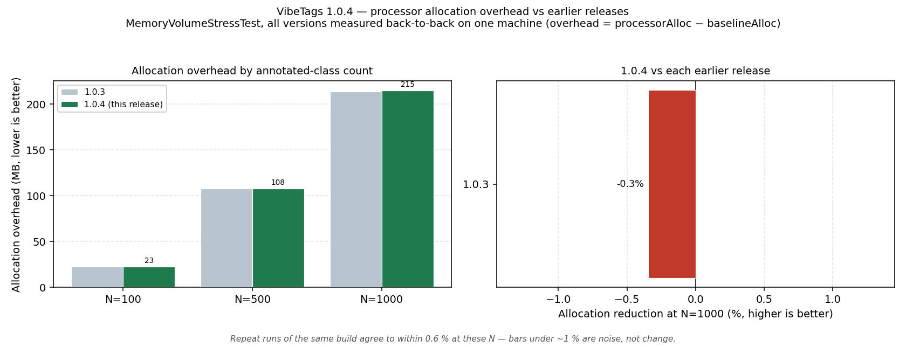
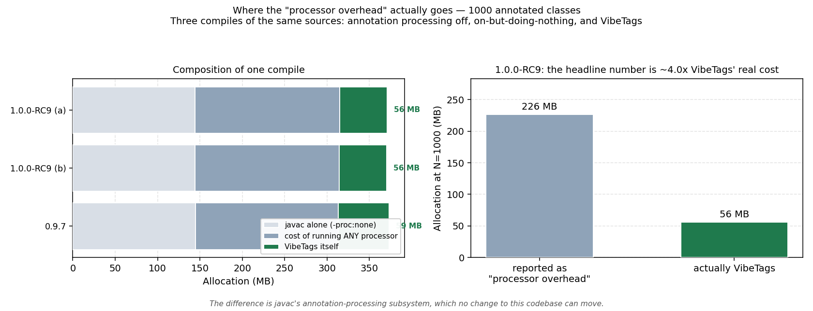
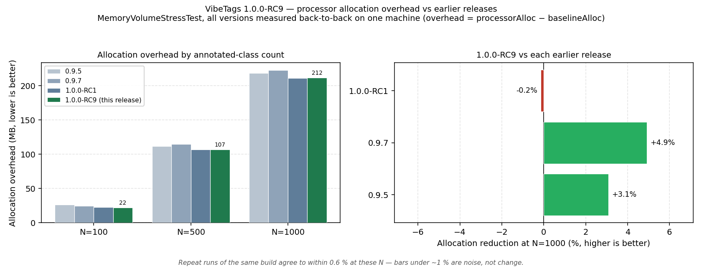

# Changelog

All notable changes to this project will be documented in this file.

The format is based on [Keep a Changelog](https://keepachangelog.com/en/1.1.0/),
and this project adheres to [Semantic Versioning](https://semver.org/spec/v2.0.0.html).

## [Unreleased]

### Added

- **VibeTags is now tested against real Kotlin, Groovy and Scala, and the Groovy row of the
  support matrix turned out to be wrong.** The third-party corpus added in the previous release
  covers six Java libraries compiled by javac. That is the compiler JSR 269 belongs to, and it is
  also the only one the project had ever been measured on outside its own examples. Kotlin reaches
  the processor through kapt, Groovy only when joint compilation's `javaAnnotationProcessing` is
  switched on, and Scala not at all. USAGE.md had stated all three for several releases; none had
  been run against anybody else's code.

  Three more repositories are now built on every CI run — [`kotlin-obd-api`][k], [`nf-boost`][g]
  and [`splain`][s] — each twice, by its own Gradle wrapper, the only difference between the runs
  being a Gradle init script. An init script is the supported way to add a plugin to a build you do
  not own, so nothing edits a build file it did not write. Sixteen assertions, including the tier
  split and the granular directories, checked through three compilers instead of one.

  **What it found, in Groovy: every field-level annotation is silently dropped.** groovyc's Java
  stubs carry the class, its constructors, its methods and their parameters — and no fields at all.
  So `@AIPrivacy` on a Groovy field generates nothing. No file, no warning, no trace. It is one of
  the six safety annotations and the natural way to mark a PII field, and until this ran the
  documentation called that route "Full (joint compilation)".

  The obvious explanation was wrong and is worth recording: a Groovy field with no access modifier
  becomes a property, so the first theory was that the annotation had moved onto a generated
  accessor. Keeping the stubs (`groovyOptions.keepStubs`) and reading one settled it — `billingEmail`,
  `authToken` and `tenantId` appear nowhere in the stub. Nothing in VibeTags can fix that, so it is
  documented instead, and pinned: the Groovy showcase annotates those fields on purpose and the
  harness fails if they ever *start* being rendered, because a limitation nothing exercises is a
  limitation nobody notices has been fixed.

  Scala is asserted as a negative for the same reason, in both directions: annotated `.scala` must
  generate nothing, the Java half of the same build must generate everything, and the Scala
  showcase must have produced class files — otherwise "scalac generated nothing" and "scalac was
  never asked" are the same green run.

  Three further findings came out of choosing the members. Three of the eight Groovy repositories
  surveyed compile perfectly well and break the moment stubs are generated, each on a different
  stub defect. Two more fail because a Gradle toolchain pinned below 21 cannot load the processor,
  with an error naming neither VibeTags nor the toolchain. And the harness's own diagnostic counter
  was blind to javac's summary diagnostics, reporting `0` against `0` on a run that had raised a
  warning the control had not. All of it is in [corpus/README.md][c].

  [k]: https://github.com/eltonvs/kotlin-obd-api
  [g]: https://github.com/bentsherman/nf-boost
  [s]: https://github.com/tek/splain
  [c]: ../corpus/README.md#the-other-three-jvm-languages

- **A constructor can carry a guardrail.** No annotation declared `ElementType.CONSTRUCTOR`, so a
  constructor could not be guarded at all. That was odd rather than obviously wrong: `ElementNaming`
  has always rendered constructors, because javac hands them to the collector as enclosed elements
  of an annotated type. They were visible to the renderer and unaddressable by an author, and the
  way anybody found out was a compiler error.

  A constructor is where invariants are established, which makes it exactly where somebody wants to
  say "this signature is frozen" or "do not reorder this initialisation". 34 of the 44 annotations
  accept one now: every annotation that already accepted a method, minus `@AIPure`, which forbids
  assignment to enclosing state and so cannot mean anything on a constructor, and `@AIIdempotent`,
  which says repeated invocations produce the result of one while constructing twice produces two
  objects by design. Both exclusions are named in `ConstructorLevelGuardrailTest` with the
  reasoning, so a later sweep that "completes" the set has to argue with it. Found by the
  third-party corpus, whose showcase failed to compile. (#488)

### Fixed

- **The locked-files guard no longer fails the PR that introduces a lock.** Adding `@AILocked` to
  existing code is itself a change to the lines the lock now covers, so the range check flagged the
  commit that declared it. The guard already exempted files the diff creates, on the reasoning that
  the author of a diff is the one declaring the lock; that exemption could not fire here, because
  the file already existed. The effect was that a project could adopt a lock only on brand-new code,
  which is the opposite of where locks are wanted.

  A lock is now compared by `(file, element)` against the base revision's `.vibetags-locks`, read
  through `git show`, and is enforced only once it is established there. Stripping a lock is
  unaffected, since that check reads the base side precisely because a stripped lock is absent from
  the regenerated report. `IntroducingALockTest` drives the real script over a real git repository
  in both directions. Found by dogfooding: this repository's own guard failed the PR that added two
  `@AILocked` fields to the processor.

- **`.aiexclude` no longer excludes a file because a member shares its name.** The `@AILocked`
  formatter emitted `**/<simpleName>.java` for every locked element regardless of kind, so a locked
  method or field contributed a glob naming something that is not a file. Usually that was dead
  weight: this repository's own `.aiexclude` carried `**/generateFiles.java`, and the two shipped
  showcase examples carried seven such lines each (`**/validateToken.java`,
  `**/getEncryptionAlgorithm.java`, and five more) out of ten.

  The harmful case is the collision. A field named `ALL` emits `**/ALL.java`; a field named `Config`
  emits `**/Config.java`, and Gemini Code Assist and Android Studio then drop the real `Config.java`
  from AI context. Nothing reports it, because a blocklist that excludes too much looks exactly like
  one that works: the assistant simply stops seeing a file, and the developer who locked one field
  never asked for that. Only a type contributes a glob now. A locked member still reaches every
  platform that can name a member, which is the `locked_files` block, `.vibetags-locks`, Codex and
  Copilot; only the glob format drops it, because a glob cannot express "this field".
  `AILockedExcludeGlobTest` pins both directions. Found by dogfooding, when two new field-level
  locks in the processor's own source put `**/ALL.java` into its `.aiexclude`.

- **A project with no annotations no longer gets a zero-byte `vibetags.log`.** Logback's
  `FileAppender` opens its file when the logger is configured, so a build that had nothing to say
  still left an untracked empty file in the working tree, needing a `.gitignore` entry and
  containing nothing. Tier-1 invariant 1 does not name the log, but the reasoning behind it carries:
  a processor asked to look at somebody's codebase and finding nothing to guard should leave no
  trace of having looked. The file is created on the first record now. Found by the third-party
  corpus, which had to exclude `vibetags.log` by name from "nothing is written into a project that
  never opted in"; that exclusion is gone. (#487)

- **An annotation written bare no longer renders labels with nothing after them.** `@AILocked`
  with no `reason`, which is the form people actually write, left 99 empty labels across five
  generated files: 23 empty XML elements each in the Claude formats (`<reason></reason>`,
  `<focus></focus>`, `<belongs_to></belongs_to>` and 20 more), 22 empty bullets in `llms-full.txt`,
  25 in `CONVENTIONS.md`, and 6 Codex bullets whose bold element name was followed by a colon and
  nothing at all. No guardrail was lost; the cost was tokens, in files whose whole purpose is to
  stay small enough to fit an agent's context.

  Separately, the Claude renderer emitted an empty `<audit_requirements>` block *and* a `<rule>`
  instructing the agent to consult the list inside it, whenever every `@AIAudit` in the build was
  written bare. The agent was pointed at a list that was not there.

  The guard already existed: `AISecureFormatter` guards its `aspect` on every arm. It simply was
  not applied uniformly. Three helpers in `CommonFormatterHelper` now hold it in one place, and
  each emits the same bytes as the inline form it replaced whenever the member is populated, which
  is why the whole suite passed without a single golden-file update. Verified failing-first: the
  restored assertion was run against the unfixed formatters and reported all 99, grouped by
  platform. (#474)

- **The same defect in its other shape: a separator left with nothing after it.** The fix above
  covered labelled bullets. Where a platform renders a member inline instead of under a bold
  label, an unset member still left the separator behind: ``* `Foo` - Reason:``, ``* `Foo` -``,
  `Expires on: . Reason:`, an empty pair of backticks where a generated file's source path should
  have been, and `Only callable by: []`. 21 of the 48 aggregate
  platforms carried at least one. Each reads as though a value went missing, which is worse than
  silence, because it tells an agent something was meant to be there.

  Two further helpers keep a separator with its value so the two disappear together, one for the
  end of a line and one for a clause inside a summary sentence. The eight shared standard-platform
  arms route through the first, which fixes those platforms for every annotation at once; 208
  further arms across 41 formatters were rewritten the same way. Where a summary was a sentence
  built around a member, the sentence was rewritten rather than deleted, because the annotation
  still means something bare: a bare `@AIGenerated` says "machine-generated, do not hand edit"
  without naming a source. `@AICallersOnly` is the exception that lost its clause outright, since
  "Only callable by: []" states the element is callable by nobody, which is not what writing it
  bare means. (#478)

- **`@AISunset` no longer tells agents to migrate callers to `java.lang.Object`.** `replacement()`
  defaults to `Object.class`, which is the annotation's way of saying "no replacement named". It
  was rendered literally, so a sunset element with a ticket and no successor advertised `Object`
  as its migration target. The default is now dropped rather than printed. This moves committed
  output: `examples/multimodule-indexed/GEMINI.md` loses one such clause. (#478)

- **An element's identity no longer depends on which compiler ran.** `ElementNaming` built member
  paths by concatenating `Element.toString()`, whose format `javax.lang.model` leaves to the
  implementation. javac renders `SecurityConfig.getKeyRotationHours()`; ECJ renders the same
  element as `SecurityConfig.public int getKeyRotationHours() `, with modifiers, a return type, a
  trailing space, and an unqualified raw type in parameter lists.

  That string is the element's identity. `.vibetags-locks` records it and the shipped
  `action/locked-files` matches a pull request's diff against it, `granularQName` turns it into a
  granular rule *filename*, and every `path=` attribute in the aggregates carries it. A project
  that switches compiler, or builds under both, got churn in committed files with no source change
  behind it, and locks that no longer matched.

  Signatures are now derived structurally from the `ExecutableElement`: name, type parameters, and
  parameter types resolved through the `TypeMirror`. Type and package names come from
  `QualifiedNameable`, which specifies its format. The derivation reproduces javac's rendering
  deliberately, because javac produced every committed fixture here and every generated file in
  every consumer, so **javac output does not move** and ECJ converges onto it.
  `ElementNamingFormatParityTest` compiles a fixture with a real javac and asserts the two agree
  member by member across primitives, qualified and nested generics, arrays, a varargs tail,
  wildcards, bounded and unbounded generic methods, an overload set, a constructor, a nested type
  and an enum. Found by the ECJ CI leg on its first run. (#480)

  **One deliberate difference from javac, and it moves output for some consumers.** javac's
  rendering includes JSR-308 type-use annotations, so an annotated parameter reads as
  `java.lang.@org.jspecify.annotations.Nullable String`. The derivation drops them, which means a
  project using jspecify or the Checker Framework will see element paths change in its generated
  files and in `.vibetags-locks`. That is the intended behaviour rather than an oversight:
  keeping the annotation would put it into a granular rule *filename*, so adding or removing a
  `@Nullable` would rename a committed file and stop a lock matching, for a change that does not
  alter the signature. The identity is the signature, not its annotations. No fixture in this
  repository used a type-use annotation, so nothing here noticed; the third-party corpus below
  did, on its first run.

  A **type variable** kept its annotation even so, because it had no structural route and fell
  through to `toString()`, so `jimfs` generated
  `JimfsAsynchronousFileChannel.<A>lock(long,long,boolean,@org.jspecify.annotations.Nullable A,…)`
  into `CLAUDE.md` and `.vibetags-locks`. The parity check could not see it: javac renders that
  the same way, so the two agreed and nothing fired. Only generating output on annotated
  third-party code and reading it back exposed it. Type variables now resolve through
  `asElement()` like every other type, and anything left with no structural route has its
  annotations stripped rather than trusted. (#480)

### Added

- **A corpus of real third-party Java, compiled with and without VibeTags on every CI run.**
  Every fixture in this repository was written by somebody who knew what VibeTags does, and that
  is the wrong sample: the code VibeTags has to survive was written by people who had never heard
  of it. `corpus/` pins six permissively licensed libraries to commit SHAs and compiles each one
  twice with identical sources, classpath and flags, differing only in whether VibeTags is on the
  processor path.

  Four assertions, each against the control rather than against a hard-coded expectation, so a
  repo that does not compile on its own is reported as such instead of blamed on VibeTags: the
  treatment exits exactly as the control did, raises no diagnostic the control did not, writes
  nothing into a project that never opted in, and renders every member the way javac does.

  Then a second phase, because non-interference is only half the question. **Claude, Gemini and
  Codex are all opted in, aggregate and granular**, and the output is read back. Two real elements
  of the repo's own code are annotated, plus a showcase compiled into a package of its own that
  carries a guardrail at every level one can attach to: package, type, nested type, field, method
  and parameter, across both the safety tier and the granular tier.

  Codex needs its marker pair seeded, because invariant 4 means an empty `AGENTS.md` alongside
  other platforms is dropped from the active set rather than written. The corpus asserts
  `AGENTS.md` grew beyond that pair, since "dropped" and "working" look identical otherwise.

  Ten assertions cover the result, and the two worth naming are the ones that keep the rest from
  rotting. **The tier split** is invariant 6 checked on somebody else's code: `@AIPrivacy` must
  still be inline in the aggregate, `@AIContract` must not be, and must instead be in the rules
  directory. Wrong in one direction and safety guardrails become comments that load only once the
  agent already opened the file; wrong in the other and the aggregate bloats. **The richness
  floor** requires at least 15 distinct showcase guardrails to reach a generated file, because
  every other assertion names one guardrail and would still pass if half the annotation surface
  quietly stopped rendering. 15 is measured from a green run, not chosen.

  Full detail, including the three defects the corpus found and why none of its assertions could
  have found the others, is in [corpus/README.md](../corpus/README.md).

  Measured on the first green run: 6 repositories, roughly 495 files, **15,683 members audited**,
  no exit code changed, no diagnostic added, no file written. The corpus contributes what the
  fixtures cannot: 15 `package-info` files and 279 generic sources from commons-io, varargs
  density from jimfs, records from record-builder, Java 17 from semver4j, and an annotation
  library whose own processor runs alongside VibeTags.

  Nothing is vendored: sources are cloned at build time into `target/corpus` and never committed,
  so no third-party code enters this repository. Pins are commit SHAs rather than branches, so an
  upstream push cannot turn this repository's CI red for a reason nobody here changed, and bumping
  them stays a decision somebody makes.

  What it has been worth so far, stated as findings rather than as a claim: **three defects, each
  caught by a different assertion, none of which could have found the others.** Type-use
  annotations reaching an element identity for declared types, caught on the first run by the
  parity check. The same annotations surviving on a *type variable*, invisible to that check
  because javac renders it identically, and caught only by generating output and reading it back.
  And the corpus itself running against an unresolved classpath on a cold CI runner, where both
  the control and the treatment failed identically so every comparison passed while checking
  nothing. The third one was a defect in the harness, and it is the reason there is now an
  assertion that a corpus member must compile before anything is concluded from it.

  A fourth thing it settled was not a defect but a gap: no annotation declared
  `ElementType.CONSTRUCTOR`, found by trying to annotate one. That is fixed above (#488). (#480)

  The corpus now also opts in **every** platform the registry knows about, on one repository, and
  reads the result back with a real parser: 48 of 62 files written, and all ten of the YAML, TOML
  and JSON files parsed. That is the question the fixture tests cannot ask. They assert what a
  renderer *contains*; none asserts that a parser accepts it, and a renderer emitting an unquoted
  `@` or a trailing comma satisfies every `contains` assertion while being unloadable by the tool
  it targets. Verified by corrupting two files and watching the check name them. (#489)

- **CI compiles a fixture under a real ECJ and checks the degradation the docs promise.**
  `docs/PROCESSOR.md` and `USAGE.md` both state that VibeTags degrades rather than fails under a
  compiler with no Tree API, losing `@AILocked` line positions and nothing else. Nothing verified
  either sentence, and the code behind it is unreachable from a JUnit test running under javac.
  Reaching it from one would mean adding a seam to production code purely so a test could fail it.

  `scripts/ecj-degradation-check.sh` compiles `examples/basic` twice, once with javac and once
  with the Eclipse Compiler for Java, and asserts four things: ECJ exits 0, both compilers report
  the same locked elements, every javac entry carries a position and no ECJ entry does, and the
  generated guardrail region is byte-identical. Measured: 9 locked entries under each compiler, 9
  positioned under javac and 0 under ECJ, 147 lines of region identical. The javac half is the
  control, without which the ECJ assertion would pass equally well on an empty report. The ECJ
  version is pinned in `vibetags-parent/pom.xml` with every other third-party version. (#475)

- **The instruction evals pin the Node and npm that install the claude CLI.** The lockfile pinned
  the CLI by integrity hash; nothing pinned the toolchain performing that install, so the job took
  whatever `ubuntu-latest` shipped that week. npm's version is behaviour rather than plumbing:
  npm 11.17 added an allow-scripts gate that can defer a package's postinstall, and this package's
  postinstall is what replaces its 500-byte placeholder with the native binary. Node 22 LTS bundles
  npm 10.9.x, which predates that gate. `EvalsNodePinTest` compares the pinned version against the
  CLI's own `engines.node` in the lockfile and fails in the fast test tier, so a CLI bump that
  raises the floor goes red in seconds rather than partway into an eval run that costs money to
  reach. (#472)

### Changed

- **The release process gates on the consumer sweep.** `scripts/consumer-sweep.sh` builds every
  downstream consumer against a chosen version and reports which pass. It ran in no workflow and
  at no step, so it ran when somebody remembered.

  That matters because VibeTags writes files consumers commit, and nothing in this repository's own
  CI can see them move: the fixtures and the third-party corpus are both projects with no committed
  VibeTags output of their own. The element-identity change above is the worked example. It moves
  committed files for any project using jspecify or the Checker Framework, and two independent
  things stopped anyone noticing: this repository uses jspecify in 47 files but never on a parameter
  of an annotated method, which is the only place a parameter type reaches an element path; and the
  consumers are pinned to the previous release, so they had never run it.

  The sweep is now a required step in the release skill, before the release PR is opened, so its
  result can reach the CHANGELOG and the release notes. What it looks for is drift in already
  committed generated files rather than whether the build passes, and the skill says what to do with
  each outcome, including that a consumer which could not be swept is reported as not run rather
  than as passing. `ReleaseConsumerSweepGateTest` fails if the step is dropped, if it moves after the
  PR is opened, or if the honest-reporting clause goes: a checklist step is prose, and prose gets
  tidied. (#490)

- **The coverage gate is a ratchet rather than a floor.** `codecov.yml` moves from
  `target: 90%, threshold: 2%` to `target: auto, threshold: 1%`, so the question it asks is "did
  this pull request lose coverage" rather than "is coverage above a number somebody typed once".
  The fixed floor had become slack. A 90% target with a 2% threshold only fails below 88%, and
  measured coverage has been above 92% since #476, so a change could shed four points and still
  pass green.

  `docs/TESTS.md` gains a "Coverage and the fault paths" section recording what the gate does not
  reach and why: 97.07% of lines and 90.58% of branches are covered, and the remainder concentrates
  in six classes whose uncovered lines need a fault a test cannot cause, such as a filesystem that
  fails one specific write or an executor task interrupted mid-flight. Reaching them means adding
  seams to production code, which was considered and rejected. `CoverageGateTest` fails if the
  ratchet is swapped back for a fixed floor, or if a class named in that table stops existing.
  (#482)

### Tests

- **The bare-annotation fixture now models a bare annotation.** `GuardrailModels.unsetMember`
  fabricated a zero value per type, `0` for an int and the enum's last constant, instead of
  reading the member's declared default. It therefore modelled an annotation whose members had
  been zeroed rather than one nobody filled in. For `String` members the two coincide, because the
  default is `""`, which is why the defects the fixture found were real. For the rest they did
  not: `@AITestDriven.coverageGoal` defaults to 100 and rendered as `Coverage goal: 0%`, and
  `@AIThreadSafe.strategy` defaults to `SYNCHRONIZED` and rendered as `Strategy: OTHER`. Both read
  as renderer bugs and were fixture bugs, describing a state no user can produce. The fixture now
  returns the declared default and falls back to an empty value only for members that have none,
  which are the ones an author cannot omit anyway. (#478)

## [1.2.5] - 2026-08-22

### Fixed

- **The locked-files guard no longer blames the wrong file, or the wrong pull request.** The
  action this repository ships to consumers carried two false-positive sources and no tests of
  its own. Between them they produced 27 violations against code that was doing nothing wrong.

  A `.vibetags-locks` records paths relative to *its own* VibeTags root, not to the repository,
  and the guard normalised against the repository root only, then accepted either path as a
  suffix of the other. Two projects with a module at the same relative path therefore aliased
  each other: measured, one example's report produced nine violations against a sibling
  example's files, with its own report removed entirely. Each recorded path is now resolved
  against the directory of the report that declared it, and compared exactly.

  Separately, a pull request that *adds* an `@AILocked` element failed on its own additions,
  because a created file has every line in the diff. Declaring a lock is not violating one, and
  the effect was to discourage adding guardrails to the codebase that ships them. Files the diff
  creates are now exempt; renames stay in scope, so moving a locked file is still checked.

  Twelve unit tests now cover both, run in CI, and were shown to fail against the old behaviour
  before being trusted. `examples/gradle-multimodule` had dropped its `.vibetags-locks` opt-in to
  work around the second defect, asserting 50 active services instead of 51; that opt-in is back.

- **A full, correct build no longer claims your guardrails are stated nowhere.** A module that
  opts into a granular directory of its own, inside a reactor whose root has a `.vibetags-roles`
  config, was reported as having lost rule files it never had. Two stem namespaces meet in one
  sidecar field: the module's root contributions are routed through the root's role config into a
  shared role file, while its module-scoped contributions resolve against the module's own
  (usually absent) config and keep per-class names. The check for missing sibling files then
  looked for those per-class names in the *root* granular directory, where they are not supposed
  to be and never were, and told the reader to go looking for them.

  Nothing was lost and nothing was written wrongly; the warning was the whole defect, and it fired
  on every round of every build in that shape. Found by giving `examples/gradle-multimodule` the
  nested-output and role coverage the Maven reactor already had (issue #443). The Maven fixture
  never hit it because its modules have a nested aggregate but no nested granular directory.

### Added

- **Gradle reactors are verified to the same depth as Maven ones.** The Maven reactor had eleven
  CI verification steps to the Gradle reactor's one, while the three most recent multi-module
  defects all came from Gradle repositories: the thinner coverage sat on the tool producing the
  bugs. `examples/gradle-multimodule` grows from two modules to five and now carries transitive
  manifests, cross-module rule mirroring, role-based granular grouping, per-module nested output
  in two shapes, all 44 annotations, and every service the reactor opts into. Seven assertions ported from
  the Maven reactor gate it, including the `#365` repro that a one-subproject build must leave a
  shared role file byte-identical, and a new one: a warm build of an in-sync reactor must emit no
  unexpected processor-level warnings.

  The 44-annotation showcase is a byte-for-byte copy of the Maven reactor's, because Gradle cannot
  share it without pointing a source set outside its own project directory, which turns every
  module id into a path hash. `ShowcaseParityTest` fails if the two drift, so keeping them in step
  is a copy rather than a judgement call.

### Changed

- **`examples/gradle-flat` names its modules explicitly**, `app` and `lib`, matching
  `examples/gradle-composite`. Inherited from `settings.gradle` the root read
  `vibetags-example-gradle-flat` next to a plain `lib`, so two adjacent examples demonstrated one
  option with opposite conventions and only one of them said why.

## [1.2.4] - 2026-08-20

### Added

- **Every build layout VibeTags supports now has a worked example, and Gradle reactors are
  covered by CI at all.** Until now every multi-module fixture was Maven and all four Gradle
  examples were single-module, so no job ever ran the processor across a real Gradle reactor,
  while both recent multi-module defects came from Gradle repositories. Four examples fill that
  in: an ordinary reactor, subprojects configured from the root build file, a flat layout with a
  module beside the root, and a composite build. Each asserts the regression that would matter
  for it, not merely that the build exits zero.

### Changed

- **The example projects moved under `examples/`.** Seven directories at the repository root were
  most of what a newcomer saw first; they are now `examples/basic`, `all-tiers`, `groovy`,
  `kotlin`, `multimodule`, `multimodule-indexed` and `scala`. Older CHANGELOG entries keep the
  paths they were written with, because they record what was true then.

- **An out-of-tree module is no longer identified by where the repository is checked out.** A
  module that is not under the VibeTags root was filed under a hash of its compilation root's
  absolute path. That id is not internal: it is the sidecar filename and the name in every
  `VIBETAGS-MODULE` marker, so it reaches committed output. The same repository generated
  different files on two machines, and check mode reported drift on a tree where nothing was
  wrong. Reachable through ordinary layouts: Gradle `includeFlat` or a `projectDir` override, and
  Maven `<module>../sibling</module>`.

  The id now comes from the path relative to the root, which is a property of the layout rather
  than of the checkout, with the directory name kept in front so it stays legible.
  `String.hashCode()` is specified by the language, unlike `Path.hashCode()`, so it agrees across
  JVMs; separators are normalised so Windows and Linux agree; and the readable half is capped,
  because an unbounded id fails with `ENAMETOOLONG` and writes no sidecar at all.

  Upgrading renames such a module's sidecar. The old one is retired automatically on the first
  build by the equal-path rule above, so no manual cleanup is needed. The
  different-filesystem-root case keeps its absolute hash: there is no relative path to derive
  anything from.

### Fixed

- **A Gradle layout that silently lost a module's guardrails now says so.** When
  `settings.gradle` declares subprojects but all of their configuration lives in the root build
  file, none of them has a build file of its own. Module roots are found by walking up to the
  nearest build file and `settings.gradle` is deliberately not one of those markers, so the walk
  passes through the subproject and lands on the root: every subproject resolves to one identity,
  writes one sidecar, and overwrites the one before it.

  Measured before the fix: one `.vibetags-mod-_root_` for two modules, and an aggregate carrying
  one module's guardrails with the other's absent. Not stale and not duplicated. Whichever
  subproject compiled last was the only one that survived, and nothing said so. It is issue
  #278's last-writer-wins in the one layout where the tree cannot supply an identity.

  Nothing in a javac round says which Gradle subproject it belongs to, so the build cannot repair
  this itself; the remedy is `-Avibetags.module=${project.name}` in the shared build file. The
  warning names the subprojects and the option. It is narrow: it fires only when the compiling
  module resolved to the VibeTags root itself, only for included directories that exist, carry
  sources and have no build file of their own, and never once `-Avibetags.module` has been passed.

- **Two module regions naming the same directory no longer both survive.** Reported against 1.2.3
  from a Gradle repository whose `settings.gradle` carries `rootProject.name='x'` beside
  `include 'x'`: `CLAUDE.md` stated every guardrail twice, under two byte-identical
  `<!-- VIBETAGS-MODULE -->` blocks.

  The region prune added in 1.2.3 settles an overlap by asking which region is nested under the
  other, and `isNestedUnder` is false in *both* directions when the two paths are equal. Two
  regions on one directory therefore fell through it untouched, however completely one covered
  the other. Equal paths are not a corner case: `computeModulePath` returns `""` for the root
  project and also for every compilation root it cannot relativize under the VibeTags root, so an
  out-of-tree root, a `..`-escaping relative path or an `IllegalArgumentException` all land two
  regions on `""`. That is also why the duplication was intermittent rather than a function of the
  name collision alone, since it depends on how each round resolved its compilation root.

  Such a pair is now settled the same way as a nested one, by sidecar freshness, with a tie going
  to the named module over the root identity. The relation is asymmetric for any two distinct
  regions, so exactly one is retired and every build retires the same one. Retirement still
  requires full containment, which is what keeps the rule from eating a real module: two genuinely
  different modules that both land on `""` claim different elements and both keep their region. An
  unreadable sidecar mtime reads as maximally fresh, so it is now explicitly barred from being the
  reason a region is retired; duplication is recoverable and a dropped live region is not.

  Per-module output and the `VIBETAGS-MODULE` markers date to 0.9.0, not 1.2.3, and the merge is
  service-agnostic, so nothing about this was specific to `CLAUDE.md`.

- **Opting a granular rules directory back out no longer leaves a module pointing at deleted
  files.** In a reactor only the module that recompiles re-renders its region inline. A module
  that does not keeps the scoped-rules index it rendered while the directory existed, so the
  aggregate names rule files the opt-out just deleted and that guardrail is stated nowhere: not
  inline, because the region is collapsed, and not in a rule file, because it is gone. Worse than
  the platform-opted-in-late window, where a module is merely absent. The build now names the
  modules that are behind, and each repairs its own region on its next compile.

- **A granular rule file the aggregate still names is reported when nothing will write it.** Each
  module writes only its own granular files; a sibling's stems are protected from deletion but
  never rewritten, deliberately, because writing into another module's rule files is the reach
  that deleted 256 committed files in #383. So a file lost to `git clean`, a bad merge or an
  opt-out round trip stays lost until its own module recompiles, while the aggregate keeps calling
  it authoritative. Restoring it would need the sidecar format to change, since a contribution
  carries globs and body but neither the description nor the display name the renderer needs, so
  the build reports it instead.

- **An element claimed by two regions is reported, with the sidecar to delete.** The region prune
  retires a region only when a fresher one covers *all* of its elements, so that a reactor root
  compiling sources of its own keeps what no submodule has. A leftover `_root_` sidecar whose
  element set is a superset only because it is stale fails that by one element, so both regions
  survive and everything they share is stated twice. This is what made the originally reported
  duplication intermittent: when the leftover's elements happened to match the live module's
  exactly the prune cleaned up, and one stale extra was enough to stop it.

- **Moving a locked element now regenerates the locks report.** `.vibetags-locks` records each
  lock's line range, so moving a locked element changes what should be written even when no
  annotation does. Positions were not part of the build fingerprint, so the short-circuit matched
  and the whole generate phase was skipped: `-Pself-annotate` reported success and rewrote
  nothing, while check mode failed on the same tree and advised running the command that had just
  done nothing. Costs projects without the report nothing, because positions are resolved only
  when `.vibetags-locks` is opted in.

- **`examples/basic/reset-ai-files.sh` no longer fails its own shebang.** A UTF-8 byte order mark
  sat in front of `#!`, so every CI run logged `line 1: #!/usr/bin/env: No such file or directory`
  while still reporting success. `ShellScriptEncodingTest` now guards every tracked shell script.

## [1.2.3] - 2026-08-20

### Fixed

- **One module no longer appears twice when a Gradle subproject sits below the VibeTags root.**
  Reported from a repository whose `settings.gradle` declares `include 'app'` at the git root,
  keeps every Java source under `app/`, and passes `-Avibetags.root` pointing at the git root.
  Two sidecars existed for what is one module: `.vibetags-mod-_root_` with an empty `modulePath`
  and `.vibetags-mod-app` with `modulePath=app`, carrying byte-identical bodies for every
  annotated element. The stale check that retires a sidecar when its module directory is gone
  cannot retire the first one, because its module path is the root directory and that always
  exists, so every build emitted both regions into every generated file — 24 rule files, 212
  duplicated lines, each guardrail stated twice under two `VIBETAGS-MODULE` markers.

  `ModuleSidecar.readAll` now also retires a region whose annotated elements are all claimed by a
  fresher region above or below it in the module tree. An annotated element belongs to exactly one
  module, so two regions claiming it are the same sources read twice and one of them is a leftover;
  which one is settled by the sidecar timestamps, not by depth, because the move happens in both
  directions. Sources can move *down* into a subproject, leaving the root sidecar behind, and they
  can move *up* out of one — `app/` survives as a directory, so the module-path staleness check
  cannot retire its sidecar either, and there the nested region is the leftover. Depth alone gets
  that second case backwards, which is worse than the duplication it fixes: the aggregate is built
  from sidecars, so retiring the live region freezes the generated files on the departed module's
  last text and every later edit is lost with no diagnostic.

  Ties go to the more specific module, so two sidecars written inside one filesystem tick resolve
  the same way on every build. Otherwise the rule is conservative: it demands full containment, so
  a reactor root that compiles sources of its own keeps at least one element no submodule has and
  keeps its region; siblings are never in a path relation; and a sidecar that records no element
  ids, or whose timestamp cannot be read, is left alone. Check mode excludes the superseded region
  without deleting anything. Existing builds heal on the first compile after the upgrade: the
  processor version is part of the fingerprint, so the short-circuit cannot skip the merge that
  does the pruning.

- **Five more lifecycle transitions are pinned, none of which needed a code change.** The lean
  indexed root had only steady-state coverage, so all three of its transitions are now tested: opted
  into after the modules already compiled, opted back out again (the root must re-embed rather than
  remain a file whose whole content is a redirection), and a module that stops generating the rules
  its pointer names, where the pointer must fall back to embedding rather than name a directory that
  is not there. Alongside them: a class that changes source set is moved rather than counted twice,
  and a package-level annotation withdrawn while its package stays leaves the generated file — its
  own element kind and its own compilation unit, covering every class underneath, so a stale one
  misdescribes the most code.

- **A module dropped from a mirror target's source list now stops mirroring into it.** The mirror
  writer skipped a target that does not accept the compiling module, and skipped its cleanup with
  it, so the rule files the module had mirrored there while the config did name it stayed forever —
  the target kept loading a sibling's guardrails that its own config says do not belong to it, and
  neither the target's build nor the source module's own could clear them. The module now sweeps its
  own mirror prefix in that target on its next compile.

  Scoped deliberately to self-cleanup. The target's config is an allowlist, so a sibling could in
  principle retire the files too, but that means one module deleting inside another's namespace on
  the strength of a filename-to-path mapping — the reach that deleted 256 committed rule files on a
  cold reactor. Between the config change and the dropped module's next compile the stale mirror
  therefore survives, which is pinned as the cheaper failure rather than fixed.

- **Two whole-file withdrawal paths are pinned.** An element that stops being `@AILocked` now has
  a test proving it leaves `.vibetags-locks` — the report the locked-files Action diffs a pull
  request against, where a lock outliving its annotation fails PRs over code nobody guards any
  more. And an `AGENTS.md` written while it was the sole AI config file keeps updating once a
  second platform is opted in, which is how a project actually reaches the marker escape hatch of
  invariant 4: over time, not by hand-authoring the markers. Both behaved correctly already;
  neither had anything holding it in place.

- **Three more lifecycle transitions are pinned, none of which needed a code change.** Role
  grouping switched *on* after per-class rule files already exist retires the files the role
  replaces, the mirror of the already-covered switch-off. Opting a granular directory back out
  returns the aggregate to inline guardrails instead of leaving a scoped-rules index pointing at a
  path nobody generates. And the new region prune converges: repeating a build leaves the generated
  files byte-identical, and check mode agrees with what generation just wrote.

- **The withdrawal half of the source-set split is now pinned.** A test round that actually runs
  replaces its own contribution, so a deleted test class takes its guardrail with it. The boundary
  is recorded rather than fixed: a source set emptied of every annotation is never compiled at all,
  so no round is in a position to notice, and a main round cannot tell that from `test-compile` not
  having run yet. Deleting `.vibetags-mod-<module>__test` is the escape, and the test proves it is
  the sidecar doing it.

### Changed

- **The `vibetags-usage` skill answers the four questions a first-time consumer actually got
  stuck on.** Reported from a real setup, all four failing silently:
  - **The two-artifact split was invisible.** The skill's install snippet declared only
    `vibetags-processor` at `provided` scope, which is the exact shape that compiles green and
    generates nothing on JDK 23+, where javac stopped discovering processors on the class path.
    Step 1 is now a table of what each artifact is for and what its absence looks like, the Maven
    snippet puts `vibetags-annotations` on the compile path and `vibetags-processor` on
    `annotationProcessorPaths` (matching the README), and the `provided` shape is called out as a
    thing not to do.
  - **`-Avibetags.root` was documented only under "Advanced Configuration".** It is not advanced:
    the processor writes at the JVM working directory, so a Gradle worker, kapt or an IDE compile
    silently writes a full set of guardrails somewhere nobody looks. It is now step 2, with a
    table of which builds need it and the `VibeTags: Root resolved:` line to check it against.
  - **`@AIExplain`'s element name needed `javap` to find.** Thirty-seven of the 44 annotations
    have no `value()`, so the positional shorthand does not compile, and the error names
    `method value()` rather than the element you wanted. The new "Element cheat sheet" lists every
    element of all 44, marks the ten that will not compile bare, and gives the seven that do take
    the positional form with a compiled-and-checked example and the targets they are legal on.
  - **The `AGENTS.md` note reads like a recurring warning.** It is a `NOTE`, it fires by design
    whenever `AGENTS.md` is not the sole AI config file, and the marker-pair escape hatch was
    buried. The note's own text now opens the explanation, with the three ways to resolve it.

  Also new: a "Verify it actually ran" step that walks the silent failures in the order they
  happen, and seven rows in "Diagnosing Issues" covering them.
- **`SkillElementTableConsistencyTest` pins that cheat sheet to the annotation sources.** A
  44-row hand-written table about compiled facts is the shape that rots silently, which is the
  same failure the report was about. The test checks one row per annotation, every element listed
  and bolded exactly when it has no default, every enum constant named, and both summary lists
  (with the word-numbers introducing them). Verified by breaking the table five ways, one per
  assertion, and confirming each goes red. The `add-annotation` skill now names the table too.

## [1.2.2] - 2026-08-16

### Changed

- **Every third-party pin moved to its latest stable release** (2026-08-16), the rest were
  already current: JUnit 6.1.2 to 6.1.3 (Jupiter and Platform), Logback 1.6.1 to 1.6.3,
  async-test-lib 1.9.2 to 1.9.3, maven-enforcer-plugin 3.6.0 to 3.6.3, Gradle wrapper 9.6.1 to
  9.7.0 in all six wrappers, Kotlin 2.3.21 to 2.4.10 in `example-kotlin` and the README
  snippets, Groovy 5.0.8 to 5.1.0 in `example-groovy`, pre-commit hooks gitleaks v8.16.3 to
  v8.30.0 and pre-commit-hooks v4.4.0 to v6.0.0 (`pre-commit-java` left at v0.2.4: its
  checkstyle hook runs in Docker and could not be verified here). Pre-releases on Maven Central
  (maven-compiler-plugin 4.0.0-beta-4, maven-surefire-plugin 3.6.0-M1, slf4j 2.1.0-alpha1,
  maven-jar/source-plugin 4.0.0-beta-1) were deliberately not applied. Verified by the whole
  suite (`mvn clean install -Pe2e`, 1936 tests), the bom, cli and load-tests builds, the Gradle
  build of `vibetags`, and the Gradle builds of `example`, `example-kotlin` (kapt),
  `example-groovy` and `example-scala`.
- **`scripts/bump-dependencies.sh` and the `bump-dependencies` skill.** The script reports every
  parent-pom property against Maven Central (stable releases only unless asked), plus the Gradle
  wrapper, Kotlin, Groovy and Scala pins, and fails if the parent gains a version property it has
  no path for. The skill is the procedure around it: what mirrors each pin, which gates verify a
  bump, and what to hand over.

### Fixed

- **A granular rule file's front matter now follows its inputs.** The `globs:` / `paths:` /
  `applyTo:` list at the top of a rule file is rendered from `.vibetags-roles` (and, for
  mirrors, `.vibetags-mirror`), but the writer treated the header already on disk as
  hand-authored and kept it: adding a glob to a role, or a member to an FQN-only role, changed
  the fingerprint, re-rendered the file, and left its scope exactly as first written. Check mode
  passed on the stale file for the same reason. A header VibeTags renders is now refreshed like
  the block; a hand-written header on a file whose renderer emits none is preserved as before.
  Verified by `WriteFileFrontMatterTest` (hand content between header and block, and after it,
  survives) and `RoleBasedGranularEndToEndTest.editingARolesGlobs_reachesTheExistingRuleFilesFrontmatter`,
  both red before the fix.
- **A departed module's rule files no longer cost the survivors their short-circuit.** 1.2.1
  started deleting the rule files of a module that left the reactor, by name and straight through
  `Files.deleteIfExists`, and the write cache went on tracking them. A cached entry whose file is
  missing means "an output still to be rewritten", so every later build of every surviving module
  ran the full content build and file compare, over a file no round would ever write again.
  Deletions now go through `GuardrailFileWriter.deleteIfExists`, which invalidates the entry
  (and, in dry-run, reports the removal instead of performing it). Verified by
  `ProjectLifecycleEndToEndTest.moduleRemovedFromTheReactor_doesNotCostTheSurvivorsTheirShortCircuit`,
  red before the fix; `GuardrailFileWriterLogContractTest` pins the new `delete.commit` /
  `delete.skip reason=dry-run` events.
- **Check mode's orphan sweep follows the same jurisdiction rule as generation.** The #383 fix
  taught `generateFiles()` that a reactor module round may not sweep the shared root's granular
  directory, because on a cold clone every sibling's committed rule file is unclaimed. Check mode
  kept the unconditional sweep, so the same cold-clone module round reported each sibling's rule
  file as drift: a claim that a normal compile would delete files it leaves alone. `checkFiles()`
  now sweeps only when the round compiles the root itself, and mirrors the departed-module
  removal that generation does perform (through the dry-run writer, so the file is named, not
  touched). The documented cold-clone limitation for merged aggregates is unchanged: build once,
  then check. Verified by `CheckModeTest.checkMode_onAColdCloneModuleRound_agreesWithGeneration`
  (red before the fix) and `checkMode_reportsADepartedModulesRuleFileAsDrift` (the bound, kept
  green through it).
- **Check mode no longer prunes a departed module's sidecar.** `ModuleSidecar.readAll` deletes a
  sidecar whose module directory is gone, and check mode read through it. One check-mode run
  after a module left the reactor (the first thing CI does) deleted that module's sidecar, the
  only record of the rule files it wrote, so the next real build had nothing to act on and the
  departed module's rule files stayed in the repository for good. Check mode, and the
  unidentifiable-module warning that runs before generation reads the departed stems, now read
  through `ModuleSidecar.peekAll`, which leaves the file where it is. Verified by
  `CheckModeTest.checkMode_doesNotPruneADepartedModulesSidecar`, red before the fix.
- **A glob that does not compile in `.vibetags-roles` no longer stops the whole build's output.**
  `RoleConfig.load` compiled every glob eagerly and let the `PatternSyntaxException` (an unclosed
  `{` group is the easy typo) escape into the top of the generate phase, where the processor's
  outer guard downgraded it to a WARNING: no file, sidecar or mirror was written for that build,
  and nothing said why. A matcher that cannot compile now matches nothing; the unclosed brace
  still swallows the rest of its own line, and every other line routes as before. Verified by
  `RoleConfigTest.malformedGlob_isSkipped_notThrown`, an error before the fix.

### Added

- Repository alignment with the practices taught in *Vibe Architecture* (audit recorded in
  `analysis/2026-08-15-health-scorecard.md`). Library behaviour is unchanged; everything below
  is enforcement, measurement, or documentation around it:
  - Locked Files Guard CI job — the shipped `action/locked-files` now runs on this repository's
    own pull requests, with `.vibetags-locks` committed and kept current by check mode.
  - Architecture Diagram Drift CI job — the code-karta diagrams regenerate on every build and
    drift fails it (they had drifted; this release recommits them fresh).
  - Shipping-dependency allowlist — `maven-enforcer-plugin` fails the build on any
    compile/runtime dependency outside the allowlist in `vibetags-parent`.
  - Instruction evals (`evals/`) — a headless task bank measuring whether `CLAUDE.md` and the
    scoped rules actually bind an agent, wired to PRs that edit the instruction files.
  - Inquisitor CI workflow — adversarial AI review of PR diffs against the committed guardrails,
    with a structured gripe format and a deterministic verdict gate.
  - `@AIThreadSafe` on `WriteCache`, `ModuleSidecar`, `GuardrailFileWriter` and `VibeTagsLogger`,
    each note naming the async test that proves the declared strategy.
  - `DocsIndexCompletenessTest` — an orphaned reference document now fails the build (12 were
    orphaned when the test was introduced; all are now routed).
  - CI failure-log artifacts, a pull-request template (verification, provenance, prompt
    lineage), and the `consultation-loop` / `correctness-hunt` skills.
- Second alignment pass, closing the scorecard to 66/66:
  - `CLAUDE.md` context diet: 220 lines to about 120, with a 15-line Tier-1 invariant list
    where every line names its enforcing test; the moved-out detail landed verbatim in
    `docs/LOAD-BEARING.md`, `docs/LOGGING.md` (new), and `docs/ARCHITECTURE.md`.
  - Executable BDD: `src/test/resources/features/core-guardrail-flows.feature` run by
    `CoreFlowsBddTest` with a two-way scenario/binding match, dependency-free.
  - Performance contract: `ProcessorAllocationBudgetTest` asserts a measured, documented
    allocation budget on every e2e run; `nightly-perf.yml` compares the weekly allocation
    sweep against the newest committed baseline.
  - Copilot review lane (`copilot-review.yml`): every PR requests a GitHub Copilot review on
    free quota, skipping loudly when Copilot has none; `.github/MODEL-ROSTER.md` records the
    model routing and the eval-gated upgrade ceremony.
  - `@AITestDriven` on the four core classes; the two Anthropic workflows now run with
    blocked egress and endpoint allowlists; a SessionEnd hook stages prompt lineage into a
    gitignored trail; `ENGINE=copilot` lets the instruction evals run on Copilot Free.

## [1.2.1] - 2026-08-14

A patch release of lifecycle fixes, all found by testing the project's timeline rather than a single
compile: what happens over months as a repository is rebuilt, opted into, and reshaped around its
annotations. Nothing here changes an API or an annotation, and `example/`, `example-multimodule/`
and `example-multimodule-indexed/` regenerate byte-for-byte against 1.2.0.

Three of the four fixes change what a build writes, so a first build on 1.2.1 may update files that
1.2.0 had frozen: a withdrawn dependency rule finally leaves, and a deleted module's rule files
finally go. That is the correction landing, not churn.

### Added
- **Lifecycle coverage: the project's timeline, not one compile.** `ProjectLifecycleEndToEndTest`
  (7 tests) and `OnboardingLifecycleTest` (2 tests, `vibetags-cli`) cover the transitions a
  consumer's repository goes through over months, which the existing suite tested one compile at a
  time. New ground: day zero with nothing opted in, where the footprint is now pinned to VibeTags'
  own three state files, so any new untracked file appearing in a non-participating project fails
  the build; three consecutive no-change builds, asserting every generated file is byte-identical
  *and* untouched, because identical bytes at a new mtime still invalidate every downstream
  incremental task; a module deleted or renamed out of a reactor; and `init` to real compile to
  `doctor`, the only place the CLI and the processor run against one directory, which is the only
  way to catch doctor and the writer disagreeing about what a managed file looks like. Each of the
  five behavioural tests was verified by breaking the invariant it guards and confirming it went
  red; the four production breaks are listed in the PR body.

- **Withdrawal coverage for transitive guardrails**, the 1.2.0 feature, in
  `TransitiveGuardrailLifecycleE2ETest` (four tests, 13 to 17). The existing suite covered a
  dependency whose rules *change*; nothing covered a rule that *goes away*, which is the case a
  preservation guard gets wrong. Also two dependencies at once, where the substance is that both
  contribute under their own attribution.

### Fixed
- **An inherited guardrail could never be withdrawn from a project with no annotations of its
  own.** Found by the new withdrawal tests above. A library that stopped publishing its rules, or
  a source file that dropped the last import of the package, left the retracted rule in the
  consumer's generated file, still attributed to the library, on a build reporting "no changes".
  Both triggers, and both now regression-tested through a real `javac`.

  The guard is `AnnotationCollector.anyAnnotationsFound()`, which already counted inherited rules
  deliberately — that is why a *changed* rule reached the file. What it could not do is act when
  the count reached zero, because "nothing to write because everything was withdrawn" and "nothing
  to write because this round never saw the sources" were the same observation, and the second
  must never empty a file. They are now distinguishable: the processor records whether a round was
  handed any root elements, so a round that saw the project's sources and found nothing is treated
  as authoritative about what the project no longer has.

  Scope is deliberately narrow. The new term is `transitiveOptIn && sawSourceRoots`, so it applies
  only to projects that opted into `.vibetags-transitive`, where the correct output can change
  while every local source stays byte-identical. Every other project keeps the older, stricter
  guard unchanged. That bound is conservatism rather than a measured requirement, and the code says
  so: dropping it and keeping only `sawSourceRoots` was run against the full suite and nothing
  failed except the unit test pinning the expression, so the reactor guards are not shown to depend
  on it. It stays because "no test objected" is not the same as "known safe".

  This matters because a project that adds no annotations of its own and opts into
  `.vibetags-transitive` purely to pick up its libraries' rules is the headline case for the
  feature.

- **The fingerprint short-circuit could never fire.** The skip in `generateFiles()` compares a
  sidecar stamp that hashes `.vibetags-mod-*` mtimes. It was read at the top of the method, before
  the round wrote its own sidecar, and that pre-write value was stored, so the next round's stamp
  always included an mtime that had moved. Three conditions, never all true, in any build that
  writes a sidecar, which is every build. `FingerprintShortCircuitTest` passed throughout because it
  engineers the one state where the old stamp could match: delete every sidecar, patch the stored
  stamp to `0`. The stamp is now recorded after the sidecar write, and an unchanged rebuild skips
  the content build and per-file compare. Correctness was never affected; this is wall-clock.

  Turning the skip on exposed two hazards it had been masking, both now guarded and regression
  tested. Module identity was not an input to the fingerprint, so two modules with byte-identical
  annotations, which is what a renamed module is, shared one: the second would skip and never write
  its sidecar. And a skipped round never reaches the merge that prunes a sidecar whose module
  directory is gone, which no other term of the condition can notice, because deleting a module
  changes no annotation and moves no mtime.

- **A platform opted into after a module last compiled now says so.** A sidecar carries bodies only
  for the services active when its module last ran, so creating an opt-in file at a reactor root and
  running an incremental build assembles the new file from a subset: well-formed, plausible, missing
  whole modules, with nothing about it looking wrong. The content cannot be repaired from the round
  that notices, because rendering a module's body needs that module's annotations, so the build now
  emits a WARNING naming the file, the modules missing from it, and the remedy.

- **`ProjectFactsConsistencyTest` no longer fails on a file that vanishes mid-walk.** It walked the
  repository with `Files.walk`, which throws out of its iterator when a listed path can no longer be
  stat'ed. The repository is a live directory while the suite runs: the JVM writes
  `.attach_pid<n>` into the working directory when an agent self-attaches, which Mockito's inline
  mock maker does from tests running in parallel with this one, and removes it immediately. On Linux
  CI the race was reliable enough to fail every Maven job; on Windows it never appeared, which is
  how it reached CI unnoticed. The walk now skips entries it cannot read, and the drift detection is
  unchanged — verified by planting a document with a wrong count and watching it fail.

- **A module deleted from a reactor now takes its granular rule files with it.** The aggregates
  already forgot it as soon as any sibling recompiled, but `.claude/rules/<its-class>.md` waited for
  a compilation rooted at the reactor root, and a rule file loads by glob: an agent kept reading a
  guardrail about a class every aggregate agreed was gone. That delay was not the #383 jurisdiction
  rule doing its job. The rule forbids a module round from arguing that an *unclaimed* file is an
  orphan, and rightly, since on a cold clone the sidecars appear one module at a time and sweeping
  on that evidence once deleted 256 tracked rule files. A sidecar whose module directory is gone is
  the opposite kind of evidence: it names the stems that module wrote. The catch was ordering, since
  `readAll` deletes the stale sidecar and threw the record away before anything could act on it. The
  stems are now read first, and only those no surviving module claims are removed, so a role file
  shared between modules is rewritten rather than deleted.

## [1.2.0] - 2026-08-13

A minor release: guardrails a library declares on a package now reach the projects that depend on
it. Both halves are file-presence opt-ins that do not exist by default, so upgrading changes nothing
for a project that does not ask for it — `example/` and `example-multimodule-indexed/` regenerate
byte-for-byte against 1.1.1. Thirteen annotations gained `ElementType.PACKAGE`, which is
source-compatible: nothing that compiled before stops compiling.

### Added
- **Transitive guardrails: package-level rules travel from a library into the projects that depend
  on it.** An agent working in an application reads the application's `CLAUDE.md`, not the one
  belonging to a dependency — so a constraint the library's author knows about is invisible at
  exactly the moment it matters. A library now annotates its `package-info.java`, and any consuming
  project that opts in renders those rules into its own AI configuration under `## Inherited
  Guardrails (dependencies)` (the six safety buckets) and `## Inherited Context (dependencies)`
  (everything else), after everything the project says about itself.

  Both halves are file-presence opt-ins, like every other VibeTags output: `.vibetags-manifest` to
  publish, `.vibetags-transitive` to consume. Neither exists by default, so upgrading the processor
  changes nothing for anyone — `example/` and `example-multimodule-indexed/` regenerate byte-for-byte
  against the previous release.

  Thirteen annotations gained `ElementType.PACKAGE`: `@AISecure`, `@AIPrivacy`, `@AICore`,
  `@AIAudit`, `@AIRegulation`, `@AIArchitecture`, `@AIPublicAPI`, `@AIBannedApi`, `@AIThreadSafe`,
  `@AIImmutable`, `@AIDeprecated`, `@AIContext`, `@AIStrictClasspath`. Widening `@Target` is
  source-compatible; nothing that compiled before stops compiling. Only package-level annotations
  propagate — class- and method-level guardrails stay local, because propagating them would scale a
  manifest with the library's whole API surface and a consumer cannot act on a rule about a class it
  never sees.

  New options: `-Avibetags.manifest.origin`, `-Avibetags.manifest.dir`,
  `-Avibetags.manifest.packages`, `-Avibetags.manifest.max`. See
  [PROCESSOR.md](PROCESSOR.md#transitive-guardrails-dependency-tree-propagation).

  Three findings shaped the design, all measured against `javac 26` rather than assumed:

  - **A manifest under `META-INF/` cannot be read by an annotation processor at all.** javac's
    `CLASS_PATH` location skips archive directories whose names are not valid Java package
    identifiers: `Filer.getResource` throws `FileNotFoundException` with the JAR provably on the
    classpath, and javac's own file manager lists zero entries there even with `--add-exports`
    granted. The manifest therefore lives at `vibetags/manifests/<package>.json`, and
    `TransitiveGuardrailLifecycleE2ETest` repacks a fixture JAR under `META-INF/` to assert the
    conventional location stays broken — moving it back fails the build instead of silently
    disabling the feature.
  - **There is no supported way to enumerate the compile classpath.**
    `ClassLoader.getResources` sees the processor path, not the classpath, and returns nothing under
    the documented `annotationProcessorPaths` setup. Listing works only behind
    `--add-exports jdk.compiler/com.sun.tools.javac.processing=ALL-UNNAMED`, which a library may not
    demand of every consumer. Discovery is therefore driven by the packages the compilation actually
    imports, which also bounds the volume of inherited text structurally rather than by a filter
    applied afterwards.
  - **A processor is not invoked at all when nothing in the round matches its supported types.** A
    project that inherits all of its guardrails annotates nothing itself, so the feature would have
    appeared to do nothing. `getSupportedAnnotationTypes()` now returns `"*"` — but only for
    projects carrying the `.vibetags-transitive` marker, never by default.

  The tier a rule renders under is re-derived from its annotation on read rather than trusted from
  the manifest, so a JAR cannot claim the always-on tier for advisory advice.

  An annotation's attributes are ordered by name in both the manifest and the rendered output.
  `Class.getDeclaredMethods()` has no specified order and genuinely differs between releases — JDK
  26 reported `@AIContext`'s `focus` before `avoids`, JDK 25 the reverse — so leaving it as-reported
  made the same sources publish different manifests and regenerate different files depending on
  which JDK compiled them. Same class of defect, and the same fix, as `GuardrailModel` sorting its
  buckets rather than keeping `getElementsAnnotatedWith`'s unspecified order.
  `TransitiveManifestMemberOrderTest` pins it.

### Changed
- **A reactor module that inherits guardrails now contributes a region to the merged root, even
  with no annotations of its own.** Previously the root aggregated only modules whose own sources
  carried annotations. A module that imports an instrumented dependency genuinely has something to
  say about its own code, so it appears — carrying its inherited rules and nothing else. What has
  not changed is that `.vibetags-mirror` alone still creates no region: mirrored rules are scoped
  files, and they still never reach the aggregate. Visible in `example-multimodule/`, where the
  `tests` module now appears for exactly this reason.

### Fixed
- **Transitive guardrails did nothing under Gradle.** Gradle hands every annotation processor an
  `IncrementalProcessingEnvironment` rather than javac's own, and `Trees.instance` rejects anything
  that is not javac's. Discovery therefore reported `transitive.skip reason=trees-unavailable` and
  inherited nothing on every Gradle build — green, silent, and with the section simply missing from
  the generated file. Found by wiring the feature up in `async-test-lib`, which publishes and
  consumes with both build tools: Maven inherited two rules, Gradle inherited none from the same
  sources.

  VibeTags already had the answer. `SourcePositionResolver.treesFor` unwraps that same wrapper so
  `@AILocked` positions survive a Gradle build; the new reader called `Trees.instance` directly and
  the two drifted apart the moment the second one was written. Discovery now goes through
  `treesFor`, which is one call site instead of two implementations.
  `TransitiveGuardrailLifecycleE2ETest.aWrappedProcessingEnvironmentStillDiscoversManifests`
  compiles through a Gradle-shaped wrapper and fails when the unwrap is bypassed — it was written
  against the broken code first and reproduced it.
- **A split package no longer misattributes its second artifact.** The inherited-rule block grouped
  bullets under one header per package, so when two artifacts published rules for the same package
  the second rendered under the first one's coordinate — telling the reader a constraint came from a
  dependency that never made it. Grouping is now by package *and* origin. Reachable by combining
  `-Avibetags.manifest.dir` with classpath discovery, which run additively by design.
- **Check mode's documented guarantee is now precise.** It said "writes nothing"; it publishes
  dependency manifests into `CLASS_OUTPUT`, and has to. In a reactor that both publishes and
  consumes, one module's manifest is what the next reads off the classpath, so a check-mode run that
  skipped publishing leaves every consuming module inheriting nothing and reporting drift on a build
  where nothing is wrong. `CLASS_OUTPUT` is the compiler's own directory, which javac fills with
  class files regardless; the guarantee that matters — and that is unchanged — is that no file
  VibeTags manages in the project is touched.
- **The JSON reader rejects malformed numbers.** The scan accepted a character set rather than a
  grammar, so `-`, `.`, `--5`, `1.2.3` and `1e+e-.3` all parsed as numbers — in a parser whose
  stated contract is that anything malformed raises rather than being guessed at, reading documents
  from JARs the consuming build did not write.
- **Discovery no longer probes class names.** Candidate keys expanded every prefix of the raw
  import, so `import a.b.C` also looked up `a.b.C` — a name that cannot host a manifest, costing one
  guaranteed-miss classpath lookup per import in the project. Type and member segments are now
  dropped first, static imports included.
- **`AnnotationCollector.anyAnnotationsFound()` now counts inherited rules too.** It gates
  `hasNewRules`, which decides whether an *existing* generated file may be rewritten. Counting only
  local annotations meant a project whose guardrails all come from dependencies wrote its files
  exactly once and then refused every update with "no annotations found in this module, preserving
  existing rules" — so a dependency upgrade could never reach the file.

### Documentation
- **The `vibetags-usage` skill documents transitive guardrails.** `USAGE.md` and `PROCESSOR.md`
  gained the feature when it shipped; the packaged skill did not, so an agent answering "how do I
  use VibeTags" from the skill alone would have said package annotations do not exist. It now
  carries the publish/consume walkthrough, the thirteen annotations that accept
  `ElementType.PACKAGE`, and the four `-Avibetags.manifest.*` options.
- **`scripts/consumer-sweep.sh` can build a Gradle consumer that already mentions
  `mavenLocal()`.** The injection it used skipped any build file containing that string, and
  codekarta has one behind `if (project.hasProperty("useMavenLocal"))` — present in the text, off
  in the build. The sweep injected nothing and reported codekarta FAIL for a resolution error that
  said nothing about VibeTags. Gradle builds now get `--init-script` instead, which needs no edit
  to a consumer's file and leaves nothing to restore. `pluginManagement` is deliberately untouched:
  declaring one repository there removes Gradle's implicit `gradlePluginPortal()`, which broke
  codekarta's shadow plugin on the first attempt.
- **`DocumentationLinksTest` walked the build output it was running inside.** Its skip list
  filtered the results of `Files.walk` instead of pruning the walk, so it still descended into
  `build/`, `target/` and `.gradle/` while Gradle was writing there. A file that vanished between
  the listing and the visit surfaced as `UncheckedIOException: NoSuchFileException` and failed a
  test about links in documentation — red on CI, green everywhere else, and about nothing. It now
  prunes those directories in a `FileVisitor`, which checks exactly the same files and is faster.

## [1.1.1] - 2026-08-12

A patch release that changes generated output. Four renderers were dropping annotations they
already had formatting for, and `@AIIgnore`'s reason never reached a file at all. Projects using
any of the affected annotations will see new sections appear on the next build. No annotation,
option or public API changed.

### Fixed
- **`Platform.GEMINI_GRANULAR` had no arm in `PlatformRendererRegistry`.** `findRenderer` listed
  twelve of the thirteen `*_GRANULAR` constants by hand, so `getRenderer(GEMINI_GRANULAR)` threw
  `IllegalArgumentException: Unsupported platform`. Nothing ever failed, because
  `GuardrailContentBuilder` filters `*_granular` service keys out before the registry is asked —
  a latent crash one refactor away from the call site that stops filtering.

  Fixed by deriving the granular case from the platform's own name instead of listing it. That
  suffix already routes the content builder, so this reads an existing convention rather than
  inventing one, and constant fourteen needs no edit here. `PlatformRendererRegistryCoverageTest`
  now walks `Platform.values()` and fails on any platform the registry cannot answer for.
- **`@AIIgnore(reason = "...")` never reached any file.** `AIIgnoreFormatter` did not read the
  annotation at all, so the reason a developer wrote went nowhere on all 37 platforms. The
  exclusion itself rendered, which is what hid this: the file looked right and only the
  explanation was missing, and an exclusion without its reason is the one an agent cannot weigh
  and a reviewer cannot audit.

  The reason now renders wherever the platform's output is prose. The path-list platforms are
  deliberately unchanged — the fifteen `*_IGNORE` globs, `.aiexclude` and Mentat's JSON are
  machine-parsed and have nowhere to put a sentence.

  The annotation's *default* reason is not printed. It says "Excluded from AI context", which is
  what the section heading above the entry already says, so printing it would add a line of
  repetition to every entry in every project that never set one. The default is read from the
  annotation reflectively rather than copied into the formatter, so it cannot drift out of
  agreement.

  **This changes generated output** for anyone who wrote a reason.
- **Codex, Qwen, Open Interpreter and Aider silently dropped annotations they had formatting
  for.** `AGENTS.md` and `QWEN.md` were missing 17 of the 44 annotations, and the Open Interpreter
  profile and `CONVENTIONS.md` were missing 12 — everything added after `@AISecure`. The
  formatters carried hand-written arms for those platforms the whole time; the renderers just
  never called them. Annotate a method `@AISecureLogging` and it reached `.cursorrules` and
  `CLAUDE.md` and quietly did not reach `AGENTS.md`, with no warning anywhere.

  Cause is one shape repeated four times: each renderer hand-lists the buckets it walks, and the
  lists stopped being extended while the annotation set kept growing. Cursor and Windsurf had
  already grown a shared tail for the newer annotations; Codex and Qwen were never switched to it,
  and Interpreter and Aider grow theirs as `for` loops that were extended for the last five
  annotations but not the twelve before them.

  `AnnotationSections.newestAnnotationSections(Platform)` is now the single list, built per
  platform from `SectionCatalog`, and all four renderers take it. Codex's and Qwen's
  `SectionCatalog` overrides stop at `SECURE`, so the seventeen recovered sections use the shared
  default heading wording; Cursor and Windsurf output is byte-identical to before.

  **This changes generated output.** Projects using `@AICallersOnly`, `@AISandboxOnly`,
  `@AIMemoryBudget`, `@AIPure`, `@AIDomainModel`, `@AIExtensible`, `@AIInputSanitized`,
  `@AISecureLogging`, `@AIExplain`, `@AIPrototype`, `@AISunset` or `@AITemporary` will see new
  sections appear in `AGENTS.md`, `QWEN.md`, `CONVENTIONS.md` and the Interpreter profile on the
  next build; `@AIGenerated`, `@AILoadBearing`, `@AIBannedApi`, `@AIThreadAffinity` and
  `@AIKeepInSync` additionally appear in `AGENTS.md` and `QWEN.md`. That is the fix, not a
  side effect.

### Added
- **`RendererDropsNoSupportedAnnotationTest` — a platform may not drop an annotation it has
  formatting for.** For every platform and every annotation it asks the formatter directly
  whether it emits anything there, and if it does, requires the element to appear in that
  platform's rendered file. It is derived from `GuardrailAnnotations.ALL` and `Platform.values()`
  rather than a hand-written list, so annotation 45 and platform 38 are covered the day they land.

  The test it replaces was the reason the bug survived: `RendererBranchCoverageTest` hand-lists
  its fixture, and that list had 39 of the 44 annotations, silently missing `@AIGenerated`,
  `@AILoadBearing`, `@AIBannedApi`, `@AIThreadAffinity` and `@AIKeepInSync` — the five newest.
  A fixture that has to be remembered is one that stops being true.

- **`GuardrailModels`, a test fixture carrying all 44 annotations at once.** Annotation instances
  are reflection proxies rather than hand-written anonymous classes, so the fixture cannot drift
  from the annotation surface. Most renderer unit tests rendered `GuardrailModel.EMPTY`, which
  exercises the header and none of the 44 per-annotation branches.

- **Three gates over code the mutation report showed was unverified.** None of them fixes shipped
  output — all three subjects behave correctly today. What PIT showed is that nothing would have
  noticed if they stopped:

  - `CoreRulesEveryRuleFiresTest` — six validation warnings had no test at all. Searching the test
    tree for their message text returned nothing for `@AIKeepInSync`, `@AIGenerated`,
    `@AIBannedApi`, `@AISunset`, `@AIObservability` and `@AIRegulation`; deleting any of those
    `ctx.warn` calls left the suite green. Derived from `CoreRules.all()`, and checks both
    directions: a blank annotation must be reported, a filled-in one must not be. The second
    matters more in a build — a rule that warns on correct code is how a team ends up muting the
    whole processor.
  - `IgnoreFileHeaderNamesTest` — the fifteen `*_IGNORE` platforms share one renderer and differ
    only in one word of the header, taken from a fifteen-arm switch that nothing asserted. Twelve
    of those arms could return the empty string with no failure, so `# -specific exclusion list.`
    could have shipped, or Cody's file could have named Cursor.
  - `GranularRendererDropsNoAnnotationTest` — nineteen of `renderGranular`'s forty-four
    `appendToGranular` calls could be deleted outright without a failure. That is the aggregate
    renderer bug above, one file over, waiting for the next annotation to be added.

  Each was verified by breaking its subject deliberately and confirming it goes red: the
  `@AIKeepInSync` stanza suppressed, `@AIRegulation`'s warning suppressed, Cody's name emptied —
  4 failures across the 56 tests, green again on revert.

### Changed
- **The mutation workflow measured the fast test tier and reported it as the project's score.**
  `pitest-maven` parses surefire's configuration, which carries `<excludedGroups>` defaulting to
  `e2e`, so `mutation.yml` ran PIT against 77 of the repository's 132 test classes and scored the
  other 55 classes' code as untested. Seven classes were reported as having no coverage at all;
  they are covered, by tests PIT was never allowed to run. Measured on `main` over exactly those
  seven: 19% line coverage and 16 of 211 mutants killed without `-Pe2e`, 88% and 142 of 211 with
  it. The job now passes `-Pe2e`, as every other CI leg already did.

  The README badge moves from 56% to **80%** (3198 mutants, 2548 killed, 110 with no coverage,
  83% test strength), measured on this branch with the corrected command.

## [1.1.0] - 2026-08-11

A minor rather than a patch because this release adds three JVM languages and a CLI, none of
which changes the processor's behaviour for existing users. It also carries everything from
1.0.4, which was prepared on 2026-08-08 but never tagged or published — there is no
`v1.0.4` tag and no 1.0.4 on Maven Central, so consumers move from 1.0.3 straight to 1.1.0
and get both sets of changes.

### Verified
- **Every downstream consumer still builds against `main`, and a 1.0.4 load-test baseline says
  the work product did not move.** Both suites were run against the processor built from
  main @ 341b655 and installed locally, because 1.0.4 is not on Maven Central — the newest
  published release is 1.0.3, so the published artifact is not the code under test.

  **Consumer regression suite** (`scripts/consumer-sweep.sh`, all five repos):

  | repo | build | result | drift |
  |---|---|---|---|
  | `blindbean` | Maven | PASS | none |
  | `codekarta` | Maven + Gradle | PASS | none |
  | `common-license-lib` | Maven + Gradle | PASS | none |
  | `skill3` | Gradle | PASS | none |
  | `async-test-lib` | Maven + Gradle | PASS | none |

  Two of those results carry a caveat that belongs in the report rather than in a footnote.
  `common-license-lib` and `skill3` declare only `mavenCentral()` in their Gradle builds, so
  their first Gradle run failed to resolve an unpublished 1.0.4 and never reached `compileJava`.
  That is a publication artifact, not a regression: with `mavenLocal()` injected for the
  duration of the run — reverted afterwards, nothing committed — both build clean. Their real
  bumps target 1.1.0, since 1.0.4 was never published, and cannot be opened until 1.1.0 is on
  Maven Central.

  **Load-test baseline** (`load-tests/results/1.0.4/`), measured on JDK 26, i7-1260P, cap
  `-Dstress.max.classes=1000`:

  

  Measured back-to-back in one session, switching only `-Dprocessor.version`, 1.0.4 differs from
  1.0.3 by **-0.02 % at N=100, -0.24 % at N=500 and +0.35 % at N=1000**. Every one of those is
  inside the 0.6 % floor this harness reproduces at, so the claim is *no measurable allocation
  change*, not "identical" and not "0.35 % worse". That is the expected result — everything
  merged since 1.0.3 is an example consumer, a separate CLI module, or a guard inside the CLI,
  and none of it touches the processor's write path. A moving number would have been the finding.

  `OutputSize(B)` is byte-identical to 1.0.0-RC9 at every N (14 179 / 101 296 / 495 656 /
  988 897), which is the useful reading of the capture: the generated files did not change.

  **The wall-clock and JMH figures in this baseline are worse than noise and are marked as
  such.** Four of the six hot-path benchmarks came back with a confidence interval wider than
  their own score (`buildServiceFileMap` at 26.6 ± 41.6 µs/op, `writeFileIfChanged_largeWrite`
  at 4531 ± 4474). Read literally the table shows 1.0.4 roughly twice as fast as RC9 on four
  benchmarks; read honestly it shows two noisy afternoons. Nothing about processor speed may be
  taken from it. The one timing result that survives is the cache-hit ratio, because it is
  20x-200x rather than 2x: `cacheHit` holds 26-116 µs/op across all body sizes while `noCache`
  runs 534 µs/op at 1 KB to 23 283 µs/op at 1 MB.

  `ProcessorTaxStressTest` and `SignatureCaptureStressTest` were not run in this capture, and
  the baseline has no `processor-tax.txt` of its own. Skipped is recorded as skipped: the sweep
  cap leaves N=5000 and N=10000 unmeasured, which is the `Tests run: 13, Skipped: 4` in the
  surefire output.

- **Two long-standing claims in `load-tests/results/README.md` were false and are corrected.**
  Both were found by running the harness rather than by reading it.

  `OutputSize(B)` was documented as byte-identical across every release at every N
  (17 156 / 122 555 / 599 895 / 1 196 918). It held from 0.5.4 through 0.9.7, then moved at
  1.0.0-RC1 and again at 1.0.0-RC9 — the committed baselines say so, and have since RC1 was
  captured. A reader checking a new capture against the prose would have concluded the output
  had broken. The README now names the three eras and says to compare against the previous
  baseline file instead.

  The Windows `@TempDir` cleanup failure was documented as a standing caveat, with
  `concurrent.xml` reporting `errors=1` because `vibetags.log` is held open by the file logger.
  That is true of the 0.5.4-0.8.0 baselines and has not recurred since: 0.9.7, 1.0.0-RC9 and
  1.0.4 all report `errors="0"`. Left as written, it was an instruction to ignore a real failure
  the next time one appears.

### Fixed
- **The consumer sweep reported a generated pom as guardrail drift.** `codekarta` came back as
  `GUARDRAIL DRIFT in 1 file(s)` for `code-karta-cli/dependency-reduced-pom.xml`, which
  maven-shade regenerates from the POM on every build — so it echoed the `1.0.3 -> 1.0.4` bump
  the sweep had just made. The whole point of the drift column is to distinguish "the processor
  renders something new" from bookkeeping, and a false positive there costs a review round every
  release. `scripts/consumer-sweep.sh` now excludes it alongside `pom.xml`; the count on that
  same working tree goes 1 to 0.
- **The consumer sweep stopped after two repos and printed its completion footer anyway.**
  Gradle reads standard input, and standard input inside the loop was the heredoc feeding
  `while read` the list of repos — so the first Gradle build that ran to completion swallowed the
  remaining lines, and the sweep ended having covered `blindbean` and `codekarta`, then printed
  "Nothing was committed, pushed or opened" exactly as it does after a full run. Three of five
  consumers were never built and nothing said so. Every build now runs with `</dev/null`.
  Verified by rerunning the whole sweep: five rows out where the same command previously produced
  two.
- **The sweep reported FAIL for consumers that never compiled a line.** `common-license-lib` and
  `skill3` declare only `mavenCentral()` in their Gradle builds, which is correct for them and
  fatal when sweeping a version that has not been published — Gradle cannot resolve it from a
  repository it was never told about, so the build dies at dependency resolution. Reported as
  FAIL, that is an invitation to hunt a regression that cannot exist. The script now checks once
  whether the version is on Maven Central and, when it is not, adds `mavenLocal()` to such builds
  for the duration of the run, restores the file before anything counts the working tree, and
  names the injection in the notes column. Both repos now build clean against an unpublished
  version.
- **A second sweep of the same version failed on the one repo swept in a worktree.**
  `git worktree add -b` refuses a branch that already exists, and the branch outlives the
  worktree that `rm -rf` removes, so re-running the sweep reported `ERROR / worktree add failed`
  for `async-test-lib` without attempting its build. Now `-B`, matching what the non-worktree
  path has always done with `checkout -B`.

### Added
- **A `load-tests` skill.** The harness had a thorough README and no guidance on which of its
  numbers may be quoted, which is the part that actually decides whether a run means anything.
  `.claude/skills/load-tests/SKILL.md` carries the judgement: allocation is the metric to make
  claims from (ThreadMXBean, immune to a busy machine, reproduces to 0.6 %), wall-clock and JMH
  are not (identical builds have differed by up to 1.93x), N=10 is excluded from any comparison,
  the reported overhead is roughly 4x the processor's real cost because the `-proc:none` baseline
  charges javac's whole annotation-processing subsystem to VibeTags, and the one-method-per-class
  fixture is blind to anything that scales with a type's member count. It also pins the two
  mechanical traps that have already cost a capture: the JMH class filter is load-bearing (0.9.5
  has 18 benchmarks in a file every other release has 6 in), and `mvn dependency:tree` is the only
  proof that `-Dprocessor.version` reached the dependency.
- **Groovy support via joint-compilation stubs, and an honest answer for Scala and
  Clojure.** Language support for a JSR 269 processor is decided by whether the toolchain
  ever hands javac the annotations, so nothing in the processor changed — each language is
  a standalone example consumer plus a support matrix in USAGE.md. `example-groovy/` proves
  Groovy works like kapt does: groovyc's joint compilation generates Java stubs and
  Gradle's `javaAnnotationProcessing = true` (off by default) runs processors over them;
  the JDK 21 Gradle CI leg greps the generated files for the Groovy class. `example-scala/`
  asserts the *limitation* as carefully as the feature: scalac has no JSR 269 support, so
  its annotated Scala class compiles cleanly, is proven absent from the generated files by
  a negative CI grep (`! grep`), and the annotated Java neighbour in the same module is
  proven present — the supported pattern for Scala codebases. Clojure is documented as
  impossible in principle rather than unimplemented: no javac in the pipeline, and Clojure
  metadata annotations emit only CLASS/RUNTIME retention into bytecode, so a SOURCE
  annotation cannot even be expressed. Both new builds join `BuildVersionParityTest` and
  `set-version.sh`.
- **`vibetags-cli`: `init` and `doctor`.** The gap between "read the README" and "first
  generated file" was the opt-in model itself — the processor never creates files, and a new
  user's most common failure is compiling with nothing opted in and concluding VibeTags does
  nothing. `vibetags init --platforms claude,cursor` creates exactly the named opt-in files
  (empty, directories for `*_granular` keys) and refuses unknown keys before creating
  anything; `vibetags doctor` reports build-tool wiring, active platforms, the AGENTS.md
  pointer rule, and `VIBETAGS-START`/`END` marker balance, exiting 1 when a finding needs
  action. The platform keys, paths and marker strings come from `vibetags-processor` at
  runtime (`ServiceRegistry.optInKeys()` is new for this), so the CLI cannot drift from the
  processor — the alternative was a second hand-maintained platform list, which is the exact
  failure mode this repository keeps tests against. Published as
  `se.deversity.vibetags:vibetags-cli` (same version, in the BOM), runnable via
  `jbang se.deversity.vibetags:vibetags-cli:<version> init --list`. 15 tests in
  `vibetags-cli/src/test`, run on the Linux, Windows and macOS CI legs; deploy step added to
  `publish.yml`. The full generation-capable CLI remains deliberately unbuilt — see the
  decision note in `docs/CONCEPT_PLUGIN.md`.
- **Kotlin support via kapt, documented and asserted in CI.** The processor always was plain
  JSR 269, so it ran under kapt in principle; nothing proved it, and nothing told a Kotlin
  user how to wire it. `example-kotlin/` is a standalone Gradle (Kotlin DSL) consumer —
  `kotlin("kapt")`, the processor on the `kapt` configuration, `vibetags.root` passed
  explicitly because kapt's working directory is a Gradle worker dir, not the project. The
  JDK 21 Gradle CI leg builds it and greps the regenerated `CLAUDE.md` / `.cursorrules` for
  the annotated Kotlin elements, so "Kotlin works" is now a gate rather than a claim. README
  and USAGE.md gained the setup snippet plus the two stub-inherited limitations: method-body
  annotations are invisible (stubs have no bodies), and `.vibetags-locks` positions would
  describe the stub, not the `.kt` file. KSP remains unsupported — it does not run JSR 269
  processors.

## [1.0.4] - 2026-08-08 — prepared, never published; shipped as part of 1.1.0

### Fixed
- **`.vibetags-locks` recorded absolute source paths, so a committed report differed on every
  machine.** The `file` field carried whatever directory the repository happened to sit in
  (`C:/dev/private/vibetags/example-multimodule/core/src/...`), which is a permanent diff for anyone
  who commits the report and useless to any tool reading it on another checkout. Paths under the
  VibeTags root are now relative to it (`core/src/main/java/...`); anything the root cannot claim —
  a generated source, another drive, an in-memory JSR 199 unit — is still reported verbatim rather
  than turned into a `../../` chain. The bundled locked-files Action already normalised absolute
  paths to relative and matched either form, so this tightens what it receives rather than changing
  what it accepts. `LocksReportEndToEndTest.locksReport_recordsPathsRelativeToTheRoot` pins it,
  written red first against a real on-disk source (an in-memory one never had a path to bake in).
  Consumers who commit `.vibetags-locks` will see it rewritten once on the next build. That also
  unblocked the `git status --porcelain` CI gate on `example-multimodule/`, added in the same
  change: it is the gate that would have caught the cold-reactor sweep below, and it could not
  exist while the report differed on every runner.
- **A cold reactor build deleted every other module's scoped rule files.** On a fresh clone,
  `mvn -B -pl core clean compile` in `example-multimodule` removed 256 tracked rule files and
  exited 0. `.vibetags-mod-*` sidecars are gitignored, so after a clone the exclusion list a module
  round builds from them is empty of every sibling, and `cleanupAll` treats each sibling's
  committed file as an orphan. A full reactor hid it: the files were deleted mid-build and
  rewritten by a later module before the end, leaving a clean diff and one warning
  (`removed 32 scoped rule file(s) ... while writing only 1`) that had been in CI on `main` for
  some time. `DestructiveRewriteWarner` worked exactly as designed; the message was read as noise.
  A reactor module round now sweeps nothing at the shared root, keeping only its own directory
  (`ModuleOutputWriter`) and its own mirrors (`cleanupMirrored`, already scoped that way).
  Counting sidecars was tried first and is not sufficient — the sweep merely moves to reactor
  module 3, which sees two siblings and still not the fourth. The cost is a genuinely orphaned root
  rule file surviving until the root compiles, which is the trade already documented for an emptied
  module's last contribution. `DestructiveRewriteWarningTest.coldReactorModule_withNoSiblingSidecars_leavesTheOtherModulesRulesAlone`
  pins it, written red first. Issue #383.
- **Three Error Prone `VoidUsed` warnings in `MethodBodyGuardrailScanner`.** The body scanner
  passed its always-null `Void p` through to `super.visitMethod`, `super.visitClass` and
  `super.visitAnnotation` instead of a `null` literal. They arrived with the scanner in 1.0.3 and
  falsified the claim in `vibetags/pom.xml` that the build emits zero Error Prone warnings, which
  is the property that makes the next one visible. No behaviour change: `p` is `Void` and is only
  ever null.
- **Every Maven module warned `location of system modules is not set in conjunction with
  -source 21` when built on a JDK newer than 21.** `<source>/<target>` compiles against the
  *running* JDK's API while stamping class-file version 21, so a JDK 26 build could link a method
  that does not exist on 21 and fail there at runtime. CI builds 21, 25 and 26, so two thirds of
  the matrix carried the risk. Replaced with `<release>21</release>` (`maven.compiler.release` in
  `vibetags-parent`, plus the six poms that cannot inherit it). Error Prone still runs under
  `--release`, verified by the `VoidUsed` warnings above firing before they were fixed. The Gradle
  builds needed no change: Gradle already infers `--release` when `sourceCompatibility` equals
  `targetCompatibility`.

## [1.0.3] - 2026-08-07

### Fixed
- **A failed compilation could rewrite guardrail files, sidecars, and the write cache.** The
  final-round handler never consulted `RoundEnvironment.errorRaised()`, so a build failed by a
  peer annotation processor (or by a generated source that does not compile) still ran the full
  generate phase: committed guardrail files were rewritten from a possibly incomplete annotation
  set, the module sidecar was overwritten with that shrunken view, orphan cleanup could delete
  granular rule files, and a fingerprint was recorded for a compile that never succeeded. The
  final round now leaves every artifact untouched when errors were raised, says so in a NOTE, and
  logs `round.skip reason=error-raised`. `ErrorRaisedRoundGuardTest` pins it — written red first,
  it showed a hand-authored CLAUDE.md gaining a generated block from a failing build.
- **Changing `-Avibetags.project` or `-Avibetags.module` was silently swallowed by the
  fingerprint short-circuit.** The build fingerprint covers annotations and active services but
  neither option — yet the project name is the llms.txt H1 and the module override names the
  region a reactor merge files the module under. With unchanged annotations the short-circuit
  matched and skipped the generate phase, so llms.txt kept the old project name until some
  unrelated annotation edit regenerated it. The options are now bound as a run context
  (`# context: <hex>` in `.vibetags-cache`, `WriteCache.bindContext`); a stored fingerprint
  recorded under a different context reads as absent and the build regenerates. Implemented in
  `WriteCache` and `init()` because the fingerprint check itself lives in the step-order-locked
  `generateFiles()`. `FingerprintShortCircuitTest` gained both non-skip cases, red before the fix.

### Added
- **Overriding an `@AILocked` concrete method now draws a compile-time WARNING**
  (`LockedOverrideRule`). SOURCE retention plus no `@Inherited` means a lock never follows an
  override: the generated guardrail files mention only the locked original, so the replacement
  logic could be rewritten unseen. The rule is deliberately narrow — abstract locked methods
  (implementing them is the intended use) and overrides that carry `@AILocked` themselves stay
  quiet — and only same-compilation overrides are visible at all, which
  `docs/ANNOTATIONS.md` now states as a boundary. `LockedOverrideValidationTest` pins all three
  shapes, red-first.
- **Guardrail annotations inside method bodies now warn instead of silently doing nothing**
  (`MethodBodyGuardrailScanner`). JSR 269 sees declarations, not statements: `@AILocked` on a
  local class or an anonymous class member never reaches `getElementsAnnotatedWith` — the
  probe test showed it produces no entry, no validation, no diagnostic, nothing. The element
  model cannot fix that, but the javac Tree API can see it, so each body-scoped guardrail is
  reported as a WARNING anchored at the annotation. Best-effort: units are scanned only when
  they import the annotations package, and a compilation whose *only* guardrails sit inside
  bodies never invokes the processor at all (the declaration-scoped round universe —
  `LocalAndAnonymousElementsEndToEndTest` pins that boundary too, so nobody mistakes it for a
  regression later).

### Fixed
- **Hand-authored prose quoting the generated header line could be eaten on regeneration.**
  `stripLegacyVibeTagsBlock` and the legacy-upgrade branch matched
  `# Generated by VibeTags | …` with a bare `indexOf`, so a marker file whose prose cited the
  full header treated everything from the citation onward as a legacy generated block — and a
  marker-less hand file containing the citation was replaced wholesale by the legacy upgrade.
  This is the header-citation twin of the marker-in-prose corruption fixed earlier
  (`indexOfMarkerLine`); the header now gets the same line-anchored matching. Two new
  `MarkerInProseTest` cases showed both data-loss shapes red before the fix.
- **`.vibetags-locks` lost every line range under Gradle.** `Trees.instance` rejects Gradle's
  incremental-processing `ProcessingEnvironment` wrapper, so `SourcePositionResolver` silently
  degraded to no positions on every Gradle-run javac build and the locked-files Action fell back
  from line-range to file-level enforcement. The resolver now reflectively unwraps the decorator
  (delegate field, then `delegate()` accessor — each step best-effort) before giving up.
  `WrappedProcessingEnvironmentTest` gained a positions assertion that fails without the unwrap.
- **Two javadoc safety claims about hash collisions were wrong in direction.**
  `BuildFingerprint` and `WriteCache.fingerprint` both claimed a collision could only skip
  byte-identical work; in fact a collision between the previous and the changed input makes the
  cache skip a real update, and the size+mtime checks guard only against on-disk drift. The
  accepted-risk argument lives in `ContentHash`; the two wrong restatements now tell the truth.

### Changed
- **Pair-rule diagnostics anchor at the conflicting annotation's mirror.** A contradiction
  warning used to point the IDE caret at the whole declaration; it now points at the annotation
  the message is about, which is the line the fix touches. Falls back to the element under
  mocked environments. `AnnotationMirrorAnchorTest` pins the line number.
- `docs/PROCESSOR.md` claimed the universal `@SupportedAnnotationTypes("*")` and promised that
  Gradle re-runs the aggregating processor only when annotations change. The processor actually
  claims `se.deversity.vibetags.annotations.*`, and Gradle's incremental-processing contract
  limits aggregating processors to `CLASS`/`RUNTIME` retention annotations — VibeTags annotations
  are `SOURCE`, so incremental behaviour must not be assumed. Both sections now state what the
  code does, including the consequence that removing the last `@AI*` annotation stops
  regeneration and check mode alike.

## [1.0.2] - 2026-08-07

### Fixed
- **`scripts/set-version.sh` could silently bump an unrelated third-party dependency pin that
  happened to equal the outgoing VibeTags version.** The parent POM edit was a blanket
  `sed -i "s/$OLD/$NEW/g"` over the whole file, not scoped to `<revision>`. `jspecify.version`
  had been pinned at `1.0.1` — the same string as the pre-1.0.2 VibeTags release — so bumping to
  1.0.2 quietly rewrote it to `1.0.2` too, in both `vibetags-parent/pom.xml` and the mirrored
  literal in `vibetags/build.gradle`. Caught during 1.0.2 release prep while investigating the
  untracked-file trail left by the test-isolation bug below, not by any gate —
  `BuildVersionParityTest` only checks that every VibeTags coordinate agrees with `<revision>`,
  so a wrong-but-consistent jspecify version passes it. The script now edits `<revision>` in
  isolation via a scoped tag match, and the two `build.gradle` files it must still hand-edit go
  through a second scoped helper that only touches `version = '...'` and
  `se.deversity.vibetags:<artifact>:<version>` coordinates, leaving any other pinned dependency
  on that line alone.
- **`ValidationRuleUnitTest`'s in-process compile ran the real `AIGuardrailProcessor` with no
  `-Avibetags.root`, so it wrote into the actual working directory instead of an isolated temp
  dir.** Every other test that compiles real sources through the processor
  (`AnnotationValidatorArchitectureTest`, `AIGuardrailProcessorProcessTest`, ...) passes
  `-Avibetags.root=<tempDir>`; this one did not. The processor's file-presence-is-the-opt-in
  invariant means it never creates an opt-in file that does not already exist, but any opt-in
  file that *does* exist in `vibetags/` at test time — `CONVENTIONS.md`,
  `gemini_instructions.md`, `.github/copilot-instructions.md`, and the rest — got silently
  overwritten with the test's `com.example.blank.BlankForbidden` fixture content on every
  `mvn test`. Fixed by threading a `@TempDir` through both call sites of `compileAndCollect` and
  passing it as `-Avibetags.root`, matching the existing pattern.

- **A module's sidecar could be dropped from a parallel reactor build when a rename lost a race
  for more than 275 ms.** `ModuleSidecar.save()` writes a temp file and renames it over the live
  sidecar; on Windows that rename fails while anything else holds the target open, so it retries.
  The retry schedule was 10 attempts of 5 ms × attempt — 275 ms in total — and that was not enough:
  `ModuleSidecarAsyncTest` failed in 6 of 13 full-suite runs, and the failure in production is a
  module's guardrails silently missing from the merged output for that build.

  Instrumenting the retry loop over five suite runs showed why. Of roughly 1057 renames per run,
  985-1004 succeeded on the first attempt and the rest tailed off through attempts 2-9 — successes
  at attempts 8 and 9 appeared in runs that passed, so the old budget sat directly on top of the
  tail. Nothing succeeded at attempts 4, 5, 8, 9 or 10 in the first probe run while a give-up still
  occurred, which says a blocker is either gone within ~15 ms or holds far longer than the whole
  budget: the signature of a virus scanner, not of a sibling's `readAll()`.

  The schedule is now 15 attempts backing off exponentially (5, 10, 20, 40, 80, 160, then 300 ms)
  for a nominal 2.7 s, with each wait jittered into `[half, full]` so modules retrying in lockstep
  spread out instead of re-colliding with the same reader sweep. 8 of 8 full-suite runs passed
  afterwards, against 6 failures in the 13 before it. This is a probabilistic race, so that is
  evidence rather than proof — but the budget is now roughly ten times the blocker that was
  actually observed. `ModuleSidecarResilienceTest` pins the budget and the ride-out past the old
  cap; both fail against the previous schedule.

### Changed
- **`mvn test` is now a fast local loop; CI runs the full suite with `-Pe2e`.** The suite had one
  tier, so the cheapest local check cost the same as the most expensive: 131 classes, 1484 tests,
  ~70s wall clock, of which 52 classes accounted for 599.66s of the 704.15s spent. Those 52 now
  carry `@Tag("e2e")` and are skipped by default, taking `mvn test` to 80 classes / 910 tests / 35s
  — with about 10s of that being compile and JaCoCo rather than tests. `mvn test -Pe2e` runs
  everything (132 classes, 1486 tests, 61s) and every CI leg that runs tests passes it, so nothing
  merges without a full run.

  The split is by measured cost, not by name: `NewAnnotationsV4EndToEndTest` takes 0.01s and stays
  local, `AIGuardrailProcessorUnitTest` takes 13.71s and does not. 21 fast-tier classes still drive
  `javac` through `ProcessorTestHarness`, so the processor round-trip is genuinely covered locally;
  the write cache, fingerprinting, reactors, mirroring and the async stress loops are not, and need
  `-Pe2e`.

  Two things keep this from rotting into the `-Drun.integration.tests=true` gate that was dropped in
  2026-04 for gating nothing. `TestTagVocabularyTest` fails the build on a misspelled tag or when
  `pom.xml` and `build.gradle` stop excluding the same one. And naming a test explicitly overrides
  the filter in both build systems — without that, `mvn test -Dtest=WriteCacheProcessorIntegrationTest`
  printed `Tests run: 0` and `BUILD SUCCESS`, which is the silent-green failure the split exists to
  avoid rather than create.

  The `build-maven`, `cross-platform` and `build-gradle` legs each used to run the whole suite twice
  (once inside `install`/`build`, once in a dedicated step). The install pass now runs the fast tier
  and the dedicated step runs `-Pe2e`, so coverage is unchanged and each leg does strictly less work.

## [1.0.1] - 2026-08-06

### Fixed
- **Granular rule files at a reactor root are merged across modules instead of overwritten
  ([#365](https://github.com/PIsberg/vibetags/issues/365)).** A role declared in a reactor-root
  `.vibetags-roles` routes on the element's package, not on the module it lives in, so one role
  routinely matches classes in several modules — and all of them resolve the same output path. Each
  module's compile wrote the whole file and replaced the previous module's content: only the module
  that happened to compile last kept its guardrails. Reported on a three-module reactor where
  `.gemini/rules/` held **one module of three**, and an `@AICore` marked *critical* (nothing may
  throw out of `premain`, an exception there aborts JVM startup) was absent from the scoped rules
  entirely while still appearing in the aggregate `GEMINI.md` — so the guardrail existed and never
  reached the tool that loads rules on file open. Which module won depended on which modules
  recompiled, so an unrelated one-module edit also produced a spurious diff in a generated file.

  Granular files now merge the way the aggregate files already did. Each compilation records its
  contribution to every rule file it writes — the frontmatter globs and the rendered body — in its
  own sidecar; the write assembles the file from every module's contribution, wrapping several
  modules in the same `VIBETAGS-MODULE` sub-markers the aggregates use and unioning their globs. A
  lone contributor's body is used verbatim, so single-module output is byte-for-byte unchanged. The
  same merge covers two source sets of one module, at the reactor root and in a module's own nested
  rules directory. A sidecar written by an older processor carries no contributions and falls back
  to the previous behaviour rather than failing.

  `example-multimodule` now routes its `core`, `engine` and `cli` classes into one root role file,
  and CI asserts all three modules survive and that rebuilding a single module leaves the file
  byte-identical.

- **The documentation described a test gate that has not existed since April.**
  `-Drun.integration.tests=true` stopped gating anything when the integration tests became
  self-contained (commit `e6a6aba`, 2026-04-07), but CLAUDE.md, `docs/TESTS.md`, `docs/WORKFLOW.md`
  and `docs/ARCHITECTURE.md` still documented the flag, and two of those claimed the end-to-end
  tests read `example/` output; they compile fixture sources in-memory via `ProcessorTestHarness`.
  Verified by running `AIGuardrailProcessorIntegrationTest` with and without the flag: all 23 tests
  execute either way.
- **Doc counts and phantom entries corrected against ground truth.** `DESIGN.md` was listed as a
  generated platform file, and `DesignMdEndToEndTest` / `GuardrailContentBuilderLazyAllocationTest`
  as tests; none exist in the source tree. `docs/LOAD-BEARING.md` said "50+ AI platforms" where the
  test-pinned count is 37; `docs/ARCHITECTURE.md` said 33 internal helper classes (measured: 24
  top-level, 129 with subpackages) and a 424-test total (measured: 1484); two per-class test counts
  were stale. README's build-from-source section now installs `vibetags-annotations` before
  `vibetags`, without which its own commands fail on a clean checkout; reproduced before fixing.
  `SPEC.md` is marked as a historical design document.

### Added
- **CLAUDE.md links the rest of the map.** The always-loaded entry point now points at README's
  test-enforced project facts, `docs/WORKFLOW.md`, `docs/RELEASING.md`, `docs/CHANGELOG.md` and
  `docs/vibetags-in-practice.md`; none of them were reachable from it before, and an agent that
  starts from CLAUDE.md had no path to the counts the build actually pins.
- **`docs/DEPENDENCIES.md`: every third-party artifact, and why.** Split by what it costs a
  consumer. Three artifacts reach the consumer's annotation-processor path (jspecify, slf4j-api,
  logback-classic) and `vibetags-annotations` has none at all; everything else is test or build
  scope and never leaves the repository. The document names the parent property that holds each
  version rather than restating the number, and records the versions deliberately not taken, so the
  next sweep does not re-derive that slf4j 2.1.0-alpha1, maven-compiler-plugin 4.0.0-beta-4 and
  surefire 3.6.0-M1 are prereleases.
- **`BuildVersionParityTest` now checks Gradle's PMD `toolVersion`.** It is not a dependency
  coordinate, so the existing parity check never saw it, and it had already drifted:
  `vibetags-annotations/build.gradle` sat on PMD 7.24.0 while the parent and `vibetags/build.gradle`
  were on 7.26.0, which is two modules analysed by two rule sets.

### Changed
- **CI: the two "Run Integration Tests" steps are gone.** They passed
  `-Drun.integration.tests=true`, which has gated nothing since 2026-04, so each step re-ran the
  exact suite the "Run Unit Tests" step before it had just finished. Coverage is unchanged: the
  Maven and Gradle jobs still run the full suite once each.
- **async-test-lib 1.7.0-RC8 → 1.7.1.** The RC line's GA and its follow-up are on Maven Central as
  of 2026-08-06 (verified against `maven-metadata.xml` on repo1.maven.org, the check the previous
  sweep documented), so the "deliberately not taken" entry in `docs/DEPENDENCIES.md` is gone with
  the pin.
- **Dependencies:** ArchUnit 1.4.2 → 1.5.0, SnakeYAML 2.5 → 2.6, maven-shade-plugin 3.5.2 → 3.6.2,
  exec-maven-plugin 3.2.0 → 3.6.3, spotbugs-maven-plugin 4.10.2.0 → 4.10.3.0, pitest-maven 1.25.8 →
  1.25.9, pitest-junit5-plugin 1.2.2 → 1.2.3, cyclonedx-maven-plugin 2.9.2 → 2.9.3, and PMD 7.26.0
  in `vibetags-annotations/build.gradle`, which the parent had declared since 1.0.0-RC8. Verified by
  the full Maven build (1465 tests) and both Gradle builds.
- **CI no longer builds async-test-lib from a git tag.** Four jobs cloned
  `github.com/PIsberg/async-test-lib` at `v1.7.0-RC5` and ran `mvn install` on it before every
  build. The artifact has been on Maven Central all along, so those four jobs were paying for an
  artifact Maven then resolved from Central anyway; the tag had also been left at RC5 when the
  dependency moved to RC8, and one of the clones failed transiently and reddened an unrelated PR.
  Verified by resolving 1.7.0-RC8 from Central into an empty local repository.

## [1.0.0] - 2026-08-04

### Added
- **`USAGE.md` documents the two silent ways to get nothing generated.** A new Troubleshooting
  section covers JDK 23+ no longer running class-path annotation processors, which turned a
  `provided`-scope `vibetags-processor` into a no-op with no error and no warning in a real
  consumer project (`<proc>full</proc>` or the recommended `<annotationProcessorPaths>` setup
  restores it), and incremental builds with no stale sources never starting `javac`, which
  leaves a freshly opted-in file empty until a clean or touched-source compile. The README's
  installation section gained the JDK 23+ note beside its existing `annotationProcessorPaths`
  caveat.
- **The five aggregate-granular pairs claim is derived, not asserted (#356).**
  `DocsGranularPairsClaimTest` reads the pair count and directory list from
  `GranularIndexSection` and fails `PLATFORMS.md` or `LOAD-BEARING.md` when either disagrees.
  It catches the exact drift #355 fixed: the docs said four platforms while the code gated
  five.

### Changed
- **PIT mutation testing runs on demand only.** It moved out of `build.yml` into its own
  `mutation.yml`, whose sole trigger is `workflow_dispatch`. The job was the longest leg in CI and
  carried `continue-on-error: true`, so no score it produced could fail a build — every push paid
  for a number nothing acted on. The standalone workflow drops `continue-on-error`: when someone
  asks for the run, a failure should read as one. Nothing about the `mutation` Maven profile
  changed, so `mvn -B -Pmutation test-compile org.pitest:pitest-maven:mutationCoverage` still works
  locally and from a dispatched run.
- **Every published pom carries the complete MIT license block (#357).** The parent's existing
  declaration gained `distribution=repo` and the four managed poms inherit it; the five
  standalone example roots that cannot inherit each received the full block, and both
  publishing Gradle builds now emit `distribution=repo` in their publication poms. Verified
  through the effective pom of a managed pom and a reactor child, the flattened deploy pom,
  and the Gradle-generated publication pom.

### Fixed
- **The Generating-files NOTE reports the resolved active-services set (#356).** With an
  aggregate and its granular directory both opted in (`CLAUDE.md` plus `.claude/rules/`), the
  NOTE counted only the aggregate content map and claimed one active service while
  `vibetags.log` correctly said two. It now reports the same resolved set the log uses,
  sorted. `ActiveServicesNoteTest` pins the message and failed red against the old one.
- **A Trees-API failure is named instead of `null` (#356).** Under Gradle compiler workers a
  classloader failure carries no message, so `@AIArchitecture`'s unchecked-layering note
  rendered `Trees API not available: null`. The reason now falls back to the throwable's type
  name and states that `cannotReference` was not checked this round.
  `ArchitectureRuleReasonTest` covers message, null and blank.

## [1.0.0-RC10] - 2026-08-03

### Added
- **Every example demonstrates all 44 annotations, and the README says where each one goes.**

  `example-all-tiers/` went from 20 annotations to all 44 while keeping the structure it exists to
  show, and `ExampleCoverageTest` now holds all four example projects to the full set, so an
  annotation added without an example fails the build.

  The README gained a 44-row reference: what each annotation can be attached to, which attributes
  have no default, and whether its guardrail stays in the always-loaded aggregate or moves to a
  scoped file. `AnnotationReferenceTest` derives all three columns from the code — `@Target` by
  reflection, required attributes from members with no default, and the tier by reading back which
  buckets the indexed renderer keeps inline. The tier column is the one worth deriving: "safety" is
  not a property of an annotation, it is whichever buckets survive the aggregate collapsing to an
  index, so moving one in the renderer now fails the README rather than quietly leaving it
  describing a split that no longer happens.

- **Opting a scoped-rules directory in and back out again is now tested, both directions.**

  Tier 3 is controlled like every other output: the directory's presence is the opt-in. Opting *in*
  fails loudly if it breaks, because the rule files are simply absent. Opting *out* fails silently,
  and into the shape that looks correct — a smaller `CLAUDE.md` still carrying an index that points
  at a directory nobody has, leaving those guardrails in neither place.

  `ScopedRulesOptInOptOutEndToEndTest` drives both transitions over `example-all-tiers/billing`'s
  own sources, so it also fails if that example stops exercising all three tiers. It covers the
  collapse actually shrinking the aggregate, the safety buckets surviving it, opting out restoring
  the detail and dropping every reference to the directory, opting out holding across two further
  builds, and deleting a single rule file while still opted in regenerating it byte for byte.

- **International characters in annotation values are proven, not assumed.**

  A guardrail reason is prose, written in whatever language the team works in, and
  "Får inte loggas enligt GDPR §9" is worthless to an agent if it arrives as "F?r inte loggas".
  `InternationalCharactersEndToEndTest` drives a real compile with Swedish, German, French, CJK,
  Japanese, Cyrillic, Greek, Arabic, Hebrew, emoji (surrogate pairs, outside the BMP) and combining
  marks, then reads them back out of the XML-shaped aggregate, JSON parsed with a real parser, TOML,
  the base64 sidecar round trip between two modules, a file-backed source so the compiler's own
  decoding is exercised, and the raw bytes on disk.

  Escaping is asserted separately from survival, because an escaper must act on `< > & " '` and
  leave everything above U+007F alone; asserting both together lets one defect hide the other.

- **The cross-module merge records which branch it took.**

  It chooses between publishing the compiling module's own rendering and publishing the merged view
  of every module. Both are well-formed documents and the wrong one differs only by the siblings it
  is missing, which is what the JSON/TOML freeze below was and why it lasted. Every path now emits
  its reason and every `.skip` carries one, so `contributions=4` answers "did my sibling's rules
  make it in?" and `bodies=0` on a `sidecar.save` names the failure directly.

  The diagnostic channel was also unreachable from any example — nothing passed
  `-Avibetags.log.level` — so neither this logging nor the writer's existing events could be seen by
  anyone following the docs. All four example poms now wire it, defaulting to `INFO`.

- **All four examples verify their committed guardrails, and every documentation link resolves.**

  `example-multimodule-indexed` was building with a plain `compile`, so drift in it was invisible;
  it now runs check mode. `example/` cannot use check mode — its job empties the config files and
  regenerates them, so check mode would compare the fresh tree against itself — and instead
  compares against git, which additionally proves a from-empty regeneration reproduces exactly what
  is committed.

  `DocumentationLinksTest` checks every relative link and fragment across 738 Markdown files. Eight
  were dead: two table-of-contents entries pointing at renamed headings, a fragment naming a section
  that has never existed, a `LICENSE` and a workflow linked as though `docs/` were the repository
  root, and two benchmark plots whose relative path was one directory short, so images committed
  since 0.7.1 had never once rendered.

- **The release script rewrites every file that states the version.**

  `example-all-tiers/pom.xml` was checked by `BuildVersionParityTest` but never written by
  `scripts/set-version.sh`, so the documented release procedure failed partway through. `README.md`
  and the usage skill were checked by nothing, so a GA cut with that gap would have shipped eleven
  install snippets telling every new user to depend on a release candidate.

  `ReleaseScriptCoverageTest` derives the list instead of trusting it: any tracked file stating the
  current version must either appear in the script or be recorded as historical with a reason. The
  changelog, the benchmark results and the version-sort-order examples are recorded — a blanket
  search-and-replace would have claimed this release shipped every past change and that
  measurements were taken on versions that did not exist when they were run.

- **`example-all-tiers/`: all three tiers at once, and a class annotated at every level.**

  The tier model was documented in a table and demonstrated one slice at a time — `example/` shows
  Tier 3 at a single-module root, `example-multimodule/` shows Tier 1 merged plus Tier 2,
  `example-multimodule-indexed/` shows an indexed Tier 1 plus Tier 3. Nothing showed them composing,
  which is the arrangement the README actually recommends for a reactor.

  A two-module reactor now turns on all three: an indexed Tier-1 root, a Tier-2 `CLAUDE.md` in each
  module, and Tier-3 scoped rules grouped by role through `.vibetags-roles`. The generated root is
  the argument for the layout — six safety buckets inline, two pointers, and nothing else.

  `InvoiceController` carries a guardrail at **every level a guardrail can attach to**, which no
  other example does in one class: type, instance field, method, and method parameter. The parameter
  case is the interesting one, since `renderInvoice(java.lang.String,java.lang.String)#customerNote`
  is the finest addressing VibeTags produces and the one a hand-written rules file cannot express at
  all.

  CI asserts the split rather than just that the files exist: the six safety buckets are inline at
  Tier 1 and no verbose bucket is, each module's Tier-1 pointer names both lower tiers, neither
  Tier-2 file mentions the other module, every Tier-3 file is role-grouped and carries `paths:`
  front-matter, and the parameter-level rule is present. Verified by deleting
  `.vibetags-root-index` and watching it fail with "Tier 1 embedded a verbose bucket that belongs in
  Tier 3: contextual_instructions". The example also runs check mode, so its committed guardrails
  cannot drift from its annotations.

- **Lifecycle coverage for the second compile, and check mode wired into an example.**

  Everything was tested at the moment a guardrail is *created*. What happens afterwards — an
  annotation's value edited, an annotation deleted, a platform opted out of — was covered only for
  removal in a single module. Those are the cases that fail quietly: the file is regenerated, it
  looks plausible, and the stale half is invisible unless you knew what used to be there.

  `GuardrailLifecycleEndToEndTest` drives real second compiles for each. The opt-out case is the one
  that had nothing at all behind it, despite being the load-bearing invariant of the design —
  "file presence is the opt-in, and deleting one deactivates that platform permanently". The nearest
  existing test deleted `.cursorrules` and asserted it came *back*, which was true only because its
  harness re-creates every opt-in file before compiling.

  It also pins the documented limitation rather than pretending it away: emptying a module of
  *every* annotation leaves its last contribution in the merged files until its `.vibetags-mod-*` is
  deleted. That is deliberate — the same guard stops a module compiled without annotations from
  wiping everyone else's — so it is written as a passing test of current behaviour, with the
  documented escape hatch exercised, so changing it later is a deliberate act with a failing test to
  update.

  `example-multimodule` now wires check mode the way a consumer would (`-Avibetags.check=true`,
  off by default), and CI runs it. That is the honest answer to "how do I test my guardrails" — not
  a test you write, but a flag that makes the compiler check them. It also closes a gap in this
  repository: editing an annotation in an example and forgetting to commit the regenerated file
  previously went unnoticed, because CI only ever ran a plain `compile`.

  **It immediately earned itself.** Running it caught that the JSON/TOML fix below was incomplete:
  the sidecar-population block is copied in both `generateFiles` and `checkFiles`, and only the
  first was fixed, so check mode reported drift on a tree a real compile had just produced. The two
  copies now share one method — the same fate, and the same remedy, as the merge block that carries
  a comment about having drifted before.

### Changed
- **The published javadoc documents the API rather than the internals, and the next gap is fatal.**

  The javadoc jar documented every class in the processor module and warned on most of them. That is
  two problems in one artifact: it invites a consumer to bind to classes that are free to change
  every release, and the noise is why nobody noticed the API itself was undocumented.
  `processor.internal` is the compiler-facing half, which `ArchitectureRulesTest` polices precisely
  because it carries no stability promise, and `processor.model` is the compiler-free data layer the
  renderers read. Neither is called from outside, and both are now excluded from the published
  artifact.

  What is left is documented: `SourceLocation`'s three record components,
  `AIGuardrailProcessor.writeFileIfChanged`, two deprecated delegates missing `@param`/`@return`,
  and `VibeTagsLogger.shutdown(Path)`. `doclint=all` with `failOnWarnings` makes a regression a
  build failure, matching what `vibetags-annotations` already did. `generateFiles()` was not
  touched; it is `@AILocked` and none of the gaps were in it.

  One measurement error is worth recording, because it changed the conclusion twice: javadoc caps
  its output at `-Xmaxwarns`, 100 by default. Two runs reporting exactly 100 read as "unchanged"
  when the first had been a truncated sample attributing everything to one package. A count equal to
  the cap is a lower bound, not a total.

### Fixed
- **The README understated the number of generated files by a third.**

  "37 config formats" was the platform count wearing the file count's label. 37 is how many AI
  *tools* are supported; Cursor is one tool with both `.cursorrules` and `.cursorignore`. The
  registry declares 62 outputs: 49 config files and 13 scoped-rule directories. The annotation and
  platform figures were already pinned by `ProjectFactsConsistencyTest`; the output counts were not,
  which is how this survived — it read like the figure beside it and nothing disagreed. All four are
  now pinned, the output counts against the live registry rather than against prose.

- **Four docs restated the annotation count, and had drifted from it.**

  The README's project-facts line declares itself the single source of truth and asks other docs to
  link back rather than restate the figure. Nothing enforced that. The README claimed "all 15 Java
  annotations" and "all 8 VibeTags annotations" six lines below the pinned 44,
  `docs/ARCHITECTURE.md` claimed "39 annotation `@interface` files in total" while linking to the
  source of truth in the same sentence, and `docs/vibetags-in-practice.md` claimed 39 annotation
  types.

  `noDocRestatesADifferentAnnotationCount` pins it. The pattern matches only claims about the whole
  set ("all N annotations", "the N annotations", "N annotation ... in total"), so true statements
  about a subset, such as "7 annotations have zero real-world traction", still pass; narrowing the
  pattern was chosen over exempting whole documents, which would have blinded the check to the next
  drift inside them. Verified by reintroducing "all 15 Java annotations" and watching it fail with
  the file and line.

  Every annotation reference across all 741 Markdown files was audited against the annotations that
  actually exist. Nothing else was wrong: no doc names an annotation that does not exist, passes an
  attribute it does not have, or uses an enum constant outside its enum. The Contributing section
  was also proposing two annotations that have shipped (`@AIPattern` is `@AIExtensible`, `@AITest`
  is `@AITestDriven`), and now points at the `add-platform` and `add-annotation` skills instead.

- **Multi-module reactors froze their JSON and TOML outputs after the first write, and the freeze
  hid a second bug underneath it.** The remaining half of #265.

  The write phase asks `anyContributed` whether any module has contributed to a service before it
  will rewrite a shared file, and that question is answered from the sidecar — which stored bodies
  only for marker-based services. For a JSON or TOML output the answer was permanently "no", so the
  writer's `no-new-rules` guard skipped every update to an existing file. Whatever the first
  successful write produced stayed there for good. On the four-module `example-multimodule`,
  `.mentatconfig.json` carried **1 entry from 1 module of 4** and every later build logged
  `no changes`; `.pr_agent.toml` carried 6 guardrail lines from the same single module.

  Storing those bodies makes the files refresh — and immediately exposes the bug the freeze was
  masking. A file with no markers is a whole-file overwrite, so refreshing it just replaces one
  module's view of the project with another's. Last-writer-wins is not obviously better than frozen.

  So the two renderers that emit per-element content also declare a
  `PlatformRenderer.wholeFileMerge()`, which re-assembles the document from every module's
  rendering: `.mentatconfig.json` unions each rules array inside its own key, and `.pr_agent.toml`
  rewrites **both** `extra_instructions` blocks from the union of the instruction lines — updating
  one and not the other would give PR-Agent two different views of the same project. Measured on the
  same reactor:

  | file | before | after |
  |---|---|---|
  | `.mentatconfig.json` | 1 section, 1 entry, 1 of 4 modules | 9 sections, 51 entries, all modules |
  | `.pr_agent.toml` | 6 guardrail lines, 1 of 4 modules | 200 lines, all modules |

  The merges are format-aware because there is no generic answer — concatenating two JSON documents
  is not JSON. They parse only VibeTags' own output, whose shape is fixed by a renderer in the same
  package, and decline by returning `null` rather than guessing when a document is not that shape.
  A single-module build is byte-identical to before, and a rebuild of the reactor is byte-identical
  to the previous one, so nothing churns.

  The three static configs (`.cody/config.json`, `.qwen/settings.json`, `.codex/config.toml`)
  declare no merge, because their content does not vary with the annotations. They still gain the
  refresh: without it, upgrading VibeTags never updated them in a reactor either.

  `MultiModuleWholeFileMergeTest` derives the rule instead of listing it — it renders every
  marker-free service with an empty model and a populated one, and fails any whose output differs
  but which declares no merge. Verified by deleting Mentat's declaration, which names it exactly.

  Inside the `@AILocked` `generateFiles()` this is a single changed statement — the sidecar now
  stores every rendered body rather than filtering on markers. No step was added, removed or
  reordered, which is what that lock protects.

## [1.0.0-RC9] - 2026-08-02

### Added
- **NullAway joins the static-analysis gate, at ERROR.** The codebase already annotated with
  JSpecify `@Nullable`; nothing checked it, so the annotations documented an intention rather than
  enforcing one. NullAway 0.13.8 runs through the Error Prone hook that was already configured, in
  JSpecify mode. It reported 55 findings on the first run; bringing the build green touched 18
  files, and almost every fix was a missing `@Nullable` on a return type or parameter whose Javadoc
  already said "or `null`". Four were real defects the annotations had been hiding: `GuardrailFileWriter.getMarkersFor` was
  declared `@Nullable String[]` (an array of nullable Strings) when it returns a nullable array,
  which is `String @Nullable []`; `GranularIndexSection.scopedPath` could dereference a null
  directory; `AIGuardrailProcessor.logSet` dereferenced `log` behind a null check in its caller
  rather than its own; and check mode dereferenced a service's output path without establishing
  that the service had one.

  **No class is excluded.** The last finding was inside `AIGuardrailProcessor.generateFiles()`,
  which is `@AILocked` because its step order is load-bearing: `serviceFiles.get(service)` was
  dereferenced without a guard inside the parallel write phase. The lock was lifted for the edit
  and restored, and the guard now skips the one unmapped entry instead of letting an NPE surface
  as an `ExecutionException` that abandons the whole write phase — one unmapped key would
  otherwise have cost every other file its update. The step order is untouched.

- **Seven modern-Java detectors**, in a new `ModernJavaRules`. Every check VibeTags had compared
  annotations against each other; these compare an annotation against the declaration it sits on,
  and each exists because a language feature newer than Java 8 changed what that declaration
  already guarantees — or already forbids. `@AIImmutable` on a type with an array field (records
  make this easiest to miss: the generated accessor hands the array straight out); `@AIExtensible`
  on a final type, record or enum, and separately on a sealed type, where following the annotation
  also means editing the `permits` clause; `@AIPure` on a `void` method; `@AIPublicAPI` on
  something no external caller can reach; `@AIThreadSafe(THREAD_LOCAL)` on a type that really does
  hold a `ThreadLocal`, which under virtual threads is one copy per task rather than one per pooled
  thread (`ScopedValue`, JEP 506); and `@AILocked`/`@AIContract`/`@AIPublicAPI` in the unnamed
  package, reachable without meaning to since compact source files (JEP 512) and a collision in the
  fully-qualified name VibeTags identifies elements by. All read `javax.lang.model` only, so unlike
  `@AIArchitecture(cannotReference)` they still fire under Gradle's compiler. Each is paired with a
  clean fixture asserting it stays quiet; removing the detectors turns 11 of `ModernJavaDetectorTest`'s
  17 cases red, and the 6 that stay green are exactly the silence assertions.

- **Tests for behaviour that had none.** Three of these were reachable, user-facing and entirely
  unexercised, which is why they are listed here rather than filed under coverage:
  the enforcing mode's *in-place shape change* — a method whose return type changes keeps its path,
  so it is caught by comparing signatures rather than by the "approved but absent" sweep, and only
  the second of those two paths had a test; `@AITemporary(expiresOn = "2026-02-31")`, which passes
  the `YYYY-MM-DD` shape check and is still not a date; and a `.vibetags-roles` role defined by a
  bare list of classes, whose rule file has to derive its `globs:` front-matter from its members
  or the editor never loads it. Plus `@AIExtensible` on an enum, `@AIThreadAffinity` with a named
  thread and no `marshalVia`, a blank entry in `cannotReference`, an on-demand import matched
  through a trailing-dot package, and the degraded-environment guards that keep a non-javac
  compiler from turning a warning into a failed build.

- **`SignatureCaptureStressTest` runs in CI.** The `load-tests` job pins `-Dtest` to a named list,
  so a new test there is invisible to CI by default. It asserts a direction rather than a duration
  — a build with enforcement off must not allocate what only the enforcing mode reads — so unlike
  the volume sweep's wall-clock it is safe on a shared runner.

- **`SignatureCaptureStressTest` in `load-tests`.** The existing sweeps could not resolve the
  signature-capture change below, and that is a property of their fixture rather than of the
  change: `SyntheticClassGenerator` emits classes with one method each, so anything scaling with a
  type's *member* count disappears into javac's own allocation. The new test measures wide types —
  400 classes × 40 public members — with enforcement on and off.

- **Two concurrency stress tests for the two components that corrupt output silently when they
  race.** `GuardrailFileWriterAsyncTest` reproduces the parallel write phase's exact shape — one
  file per worker over a shared `GuardrailFileWriter` and `WriteCache` — and asserts that
  hand-authored content above and below the markers survives and that exactly one marker pair
  remains; `ParallelFileWriteTest` already covered one real compile, but a single pass cannot
  surface a race. `ModuleSidecarAsyncTest` runs concurrent `save()` and `readAll()` against one
  reactor root and asserts both failure modes a parallel reactor could produce: a body that was
  never saved (torn read), and a sibling's sidecar deleted as malformed because it was read
  mid-write (wrongful prune). Both were confirmed to fail against deliberately broken versions of
  the code they pin — marker handling disabled, and `save()` writing non-atomically to the live
  target.

- **Find Security Bugs joins the SpotBugs gate.** `findsecbugs-plugin` 1.14.0 adds its security
  detectors to the existing `spotbugs-maven-plugin` run. The first run reported 94 findings, 60 of
  them `POTENTIAL_XML_INJECTION` on formatter lines that already call `Escape.xml` — the taint
  analysis had no way to know that method sanitizes. Rather than excluding the package, the four
  escapers (`Escape.xml`, `Escape.json`, `Escape.tomlMultiline`,
  `CommonFormatterHelper.claudeReason`) are declared `SAFE` in `vibetags/findsecbugs-taint-config.txt`,
  loaded through the plugin's `<jvmArgs>`. That leaves the detector live: deleting the `Escape.xml`
  call from `AILockedFormatter`'s Claude branch was confirmed to fail the build with exactly one
  `POTENTIAL_XML_INJECTION` at that line.

  The remaining 12 findings are excluded per method in `spotbugs-exclude.xml`, each with the
  reason: `PATH_TRAVERSAL_IN` on the six sites that resolve `-Avibetags.root` / `-Avibetags.log.path`
  or a path composed from them (redirecting output is the documented feature, and setting a
  compiler option already means controlling the compilation), and `IMPROPER_UNICODE` on the four
  that parse `"true"` / `"false"` / `"OFF"` build options and lower-case config keys, none of which
  is an authorization decision. Listing them per method rather than per pattern keeps a *new*
  path-from-input or case-insensitive comparison reportable.

### Changed
- **The build emits zero Error Prone warnings, and every silence is a decision.** It emitted 75.
  The substantive ones are fixed rather than muted: `String.split(String)` at three call sites,
  which silently drops trailing empty fields, so `-Avibetags.enforce=contract,` and a sidecar's
  newline-joined list parsed correctly by accident rather than by decision (now an explicit `-1`
  limit); four `catch (IOException ignored) {}` blocks in `ModuleSidecar`, each a deliberate
  best-effort swallow that read identically to somebody forgetting, now saying which it is; a
  redundant `continue`; and `LocalDate.now()`'s hidden default time zone in the `@AITemporary`
  expiry check, now `ZoneId.systemDefault()` because the developer's own calendar day is the
  clock that rule is about. Two lambdas held in constants became named methods.

  Three checks are off, with the reason recorded in `vibetags/pom.xml`:
  `StatementSwitchToExpressionSwitch` (58 hits, pure style, all in renderers and formatters),
  `StringConcatToTextBlock` (the literals are generated file content, where an indented text
  block's leading whitespace is a rendering bug waiting to happen) and `InlineMeSuggester`
  (a caller-migration tool for published APIs; these are package-internal test seams). A warning
  nobody is going to act on trains people to scroll past the ones that matter — which is the same
  argument used for running NullAway at `ERROR`.

- **`ElementSignature` is computed only when the enforcing mode will read it.** Rendering a type's
  visible member set and sorting it is the most expensive thing the collector does per element, and
  the only reader is `-Avibetags.enforce` (#284), which is off by default. Every ordinary build was
  building those strings and dropping them. It cannot be made lazy — the javac element model is
  valid only while its round is live, and the model is read after the last round closes — so the
  processor decides up front, the same shape as the `.vibetags-locks` opt-in that already gates
  source-position resolution. Measured on 400 wide classes: 36.4 MB less allocated, 6.9–7.2 % of
  the processor's own allocation overhead, reproducible to within 0.3 % across three runs.
  Generated output is byte-identical, confirmed by regenerating `example/` with the processor built
  from before and after the change.

- **`AnnotationValidator` is now a 40-line entry point over a rule registry.** It was one 450-line
  method containing roughly forty hand-written `for` loops, and the repo's own health check flagged
  it as the largest hotspot in the processor. The checks now live in
  `processor/internal/validation/` as individually testable rules: `PairRule` (two annotations that
  contradict each other, expressed as a table — 23 of them, one line each), `CoreRules` (an
  annotation whose own attributes leave it instructing nobody), `ArchitectureRule` (the Tree-API
  import scan), `ModernJavaRules` (above). Every diagnostic message is unchanged.

  The registry is also the cheaper arrangement. Rules are indexed by the annotation they scan, so
  `getElementsAnnotatedWith` runs once per annotation type however many rules share it —
  `@AITestDriven` was queried four times per round, `@AILoadBearing` three. That query walks the
  round's root elements, and this compounds with the existing short-circuit that skips annotations
  javac reports absent.

- **The concurrency-test dependency moves from async-test-lib 1.6.0 to 1.7.0-RC5.** The pin stayed
  at 1.6.0 because 1.7.0 existed only as a local install, and a version CI cannot clone is a version
  that breaks every machine except the one that installed it. `v1.7.0-RC5` is now a tag on
  `github.com/PIsberg/async-test-lib`, so the four `git clone --branch` steps in `build.yml`, the
  `pom.xml` pin, and the `build.gradle` pin all move together. Verified by building the artifact
  from that tag on JDK 21 (the version CI uses) and running the suite against it.

### Fixed
- **Multi-module reactors wrote broken YAML, and lost most of their guardrails doing it.** The
  sidecar merge stacked each module's *whole* rendered document between `VIBETAGS-MODULE`
  sub-markers. That is right for Markdown; for the six generated YAML documents it repeated the
  top-level key once per module. A strict parser rejects such a file outright. A lenient one
  (SnakeYAML's default, PyYAML) keeps the last occurrence and discards the rest — so the AI reviewer
  reading it saw one module's guardrails and no error anywhere. Measured on the four-module
  `example-multimodule` before the fix: `.roomodes` and `.coderabbit.yaml` exposed 1 module of 4,
  `ellipsis.yaml` 90 rules of 100, `sweep.yaml` 54 of 59.

  A YAML renderer now declares a `PlatformRenderer.mergeShape()`: where its shared scaffold ends,
  which column its entries sit at, and what it emits when it has nothing to say. The merge writes
  the scaffold once and puts every module's entries under it, so a reactor produces the same
  document a single-module build does with more entries in it. Provenance survives — the
  `VIBETAGS-MODULE` sub-markers are still there, indented to the entries' column, because a
  dedented `#` line terminates a block scalar and would break the very files this fixes.
  `.plandex.yaml` merges bucket by bucket, its `locked:` / `audit:` / `privacy:` keys being
  conditional and otherwise free to repeat in turn.

  The declaration is a twin of the renderer's output, so the build checks it:
  `YamlMergeShapeContractTest` renders each platform and fails if the declared anchor, indent or
  empty body no longer matches, or if a generated `.yaml` ships with no declaration at all.
  `MultiModuleYamlValidityTest` parses the merged output for real, with duplicate keys forbidden,
  and asserts both modules' elements survive the parse — the assertion the previous string-matching
  tests could not make, and the reason the defect lived this long. SnakeYAML is a **test-scope**
  dependency only; the processor still ships with no YAML library on the consumer's
  annotation-processor path.
- **A line break in a logged value split one event into several lines in `vibetags.log`.**
  The log is meant to be read with grep — `domain.event key=value`, one event per line — but the
  values interpolated into it come from outside the processor: module ids and roots taken from
  compiler options, paths read back out of sidecar and baseline files. Any CR or LF in one of them
  ended the line early, and the tail was indistinguishable from a separate event (`CRLF_INJECTION_LOGS`,
  22 call sites). Fixed once in the Logback encoder rather than at each call site: the pattern in
  `VibeTagsLogger.forRoot` now wraps `%msg` in `%replace(...){'[\r\n]+', ' '}`, so the value still
  appears in full and the event stays on one line whatever it contains.
  `VibeTagsLoggerUnitTest#logMessageWithLineBreaks_staysOnOneLine` pins it and was confirmed red
  before the change (3 lines written for one event).
- **Generated output depended on the order javac enumerated the sources in.**
  `RoundEnvironment.getElementsAnnotatedWith` returns a `Set` with no specified iteration order;
  javac fills it by walking the round's root elements, which is the order the file manager handed
  them over. The collector's `LinkedHashSet` faithfully preserved that, so identical sources
  produced different `CLAUDE.md` content and a different `BuildFingerprint` depending on who
  compiled them — Maven versus Gradle, an IDE versus a command line, two machines whose directory
  listings differ. Committed guardrail files churned whenever a colleague built, review diffs were
  noise, and the write cache missed for no reason.

  `GuardrailModel` now sorts every bucket by `TaggedElement.path()`, the element's own value
  identity, so output is a function of the annotations and nothing else.
  `OutputOrderDeterminismTest` compiles the same three classes twice with the file list reversed
  and requires byte-identical output; it fails against the previous behaviour.

  **This reorders generated files once for every consumer.** The content is unchanged — only the
  order within each section — but the next build after upgrading will rewrite them.

- **The repo's own committed guardrails were stale, and nothing said so.** `.claudeignore` still
  carried the header-only block that #328 stopped emitting, and `CLAUDE.md` and `example/` still
  carried the pre-sort ordering. All are regenerated here. CI now runs `-Pself-annotate` in check
  mode (`-Dvibetags.selfcheck=true`) on the JDK 21 leg, so a stale committed guardrail file is a
  red build rather than something the next person to run the profile by hand discovers. Verified in
  both directions: the step passes on a clean tree and exits 1 on a deliberately edited `CLAUDE.md`.
- **A sidecar that could not be read was deleted as if it were corrupt.** `load()` returned `null`
  both for content that failed to parse and for a file it never managed to open, and `readAll()`
  deletes on `null`. On Windows a sibling module's `save()` renames its sidecar into place, and a
  concurrent reader's open fails with `AccessDeniedException` while that rename is in flight — so
  the reader deleted a valid sibling's sidecar and took that module out of the merged output until
  it recompiled. Failing to read a file is never evidence about its content: `load()` now returns
  an `UNREADABLE` sentinel, which `readAll()` skips exactly as it already skips a future-version
  sidecar, and only genuinely undecodable content is pruned. This is what
  `ModuleSidecarAsyncTest` caught on the Windows CI runner after the save-side retry below was
  already in place.
- **A parallel reactor build on Windows could drop a whole module's guardrails.**
  `ModuleSidecar.save()` writes a temp file and renames it over the live sidecar; Windows refuses
  that rename while another process holds the target open, and `readAll()` in a sibling module's
  compilation opens exactly that file. Under `mvn -T` or `gradle --parallel` the collision is
  reachable, and it arrived as an `AccessDeniedException` that aborted the save — so the module's
  entire contribution was missing from the merged output for that build, which is the failure the
  sidecar exists to prevent. The rename now retries with a short backoff (10 attempts, ≈275 ms
  worst case) before failing, since the reader's handle is open for microseconds. Found by the new
  `ModuleSidecarAsyncTest`, which reproduces it in under a second on Windows; with the retry
  removed it fails again.
- **The release workflow reported a failed deploy as a successful one.** Each of the three deploy
  steps ran `if mvn clean deploy ... 2>&1 | tee "$log"; then echo "deployed."`, and `if` tests the
  exit status of the *pipeline* — which is tee's, and tee always succeeds. Maven's status was never
  read, so neither the `already exists` branch nor the failure branch could be reached by anything.
  On 2026-08-01 a transient `Connection timed out` to `central.sonatype.com` killed the annotations
  deploy after a nine-minute upload; the run went green and 1.0.0-RC8 published `vibetags-processor`
  and `vibetags-bom` but not `vibetags-annotations`, so every consumer pinning that version failed to
  resolve. The three copies are now one `.github/scripts/deploy-to-central.sh`, which reads Maven's
  status via `PIPESTATUS`, still tolerates an already-published component, and retries transport
  errors with backoff instead of leaving a release half-published.
  `.github/scripts/deploy-to-central.test.sh` covers all five outcomes against a stub `mvn` and runs
  in CI; against the old inline code it fails three of them.

### Performance
- **Three quarters of the "processor overhead" the load tests have always reported was javac's,
  not VibeTags'.**

  

  `MemoryVolumeStressTest` subtracts a `-proc:none` compile from a VibeTags compile and calls the
  difference the processor's cost. It is not. `-proc:none` switches off javac's whole
  annotation-processing subsystem — the extra rounds, the `JavacProcessingEnvironment`, the retained
  element model — and that subtraction charges every byte of it to VibeTags.

  A new `ProcessorTaxStressTest` runs a third compile with `NoOpProcessor`: annotation processing
  on, doing nothing. At N=1000 that control costs **171 MB**. VibeTags on top of it costs **57 MB**.
  So the ~227 MB this harness has always reported is about **4x** VibeTags' actual allocation, and
  every release baseline in `load-tests/results/` carries the same inflation.

  This also redirects optimization effort. The 171 MB is not reachable from this codebase; the
  57 MB is the entire addressable surface. Anyone tuning against the old number was, for three
  bytes in four, tuning javac.

  On the isolated metric, measured back-to-back in one session: 0.9.7 allocates 60906 KB, RC9
  allocates 57409 KB — **5.7 % less**, which agrees with the 4.9 % the old metric shows for the
  same pair. The correction changes the denominator, not the direction. **VibeTags did not get
  faster here** — the measurement got honest.

  Reproducibility: two RC9 runs agreed to 0.6 % on VibeTags' share, and the javac tax reproduced to
  1.1 % across three runs including the 0.9.7 one, as it should, since it does not depend on which
  processor is loaded.

- **A 1.0.0-RC9 load-test baseline, and a comparison that is actually a comparison.**

  

  Measured back-to-back in one session, switching only `-Dprocessor.version`, RC9 allocates
  **4.9 % less than 0.9.7** at N=1000, **7.3 % less** at N=500 and **10.8 % less** at N=100. It is
  level with 1.0.0-RC1 (0.15 % apart at N=1000, inside the noise floor) — which is the expected
  result, since nothing between RC1 and RC9 claimed an allocation win. RC9 holds the RC1
  optimizations rather than adding to them.

  The same-session part is not ceremony. Comparing RC9's capture against RC1's *recorded* baseline
  suggests a 4.4 % regression; comparing them on one machine shows no difference. The `baseline`
  column — javac compiling the same sources with no processor at all — had moved 9 % between those
  two capture days. The machine changed, not the processor.

  **The wall-clock and JMH figures in this baseline are not comparable to earlier releases and are
  marked as such.** Two runs of the identical RC9 build, minutes apart, differed by up to **1.93x**
  on the JMH hot path, and re-running 0.9.7 today reproduced its own recorded numbers only to within
  **1.4x–3.1x**. A noise floor that size swallows nearly anything worth reading off those charts, so
  they now carry that warning on their face instead of inviting the comparison. Allocation is
  immune — it counts bytes through `ThreadMXBean` rather than timing anything, and reproduced to
  within 0.6 %.

  One difference does clear that noise floor and is recorded in
  `load-tests/results/1.0.0-RC9/env.txt` rather than glossed: `resolveActiveServices` is
  substantially slower than in 0.9.7. It stats one path per registered service to decide which are
  opted in, and the service count reached 50 in RC9, so some increase is the cost of the platforms
  added since. Whether it is *only* that has not been established and is not claimed here.

- **The load-test regression gate was gating Maven Central, and would have passed either way.**
  CI's `Load Tests` job runs `SignatureCaptureStressTest`, described in its own Javadoc as the guard
  that goes red if signature capture becomes unconditional again. It ran against whatever
  `load-tests/pom.xml` pinned `<processor.version>` to — `0.9.5`, two releases behind — so the gate
  was measuring an artifact downloaded from Maven Central rather than the code in the pull request.

  Pointing it at the right code was only half the problem. The assertion was `off < on`: enforcement
  off must allocate less than enforcement on. Run against 0.9.5, where signature capture *is*
  unconditional and there is nothing to save, it reports `saved=216KB (0.0% of processor overhead)`
  out of 556 MB — and passes, because two noisy measurements of identical work land on either side
  of each other about half the time. A coin flip guarding a 36 MB optimization.

  The gate now asserts the size of the saving, not its sign: enforcement-off must save at least
  3.0 % of the processor's own allocation overhead. Measured on this fixture, the optimization
  delivers 6.9 % (36 MB) and its absence delivers 0.0–0.1 %, so the threshold sits between them with
  room for run-to-run variance on either side. Verified by running it both ways: red on 0.9.5 with
  "got 0.1 %", green on RC9 with 6.9 %.

  CI now resolves the version from `vibetags/pom.xml` after installing it, so the job tests what the
  run built regardless of what the pom pins, and fails loudly if that resolution comes back empty
  instead of falling back to the pin.

  Tooling fixed along the way: `tools/plot-results.py` matched version directories with
  `^\d+\.\d+\.\d+$`, so every `1.0.0-RCn` baseline was captured, committed, and then silently left
  out of every chart — the folder was there, the line was not, and nothing said so. RC directories
  now sort correctly too (`0.9.7 < 1.0.0-RC1 < 1.0.0-RC9 < 1.0.0`). The documented JMH capture
  command also ran every benchmark into `jmh.json`, which is why 0.9.5 has 18 entries in a file
  every other release has 6 in; both READMEs now carry the class filter.

## [1.0.0-RC8] - 2026-08-01

### Added
- **Gemini granular rules (`.gemini/rules/`), so `GEMINI.md` can stop being a second copy (#320).**
  Four platforms could already collapse their always-loaded aggregate to a scoped-rules index when a
  granular sibling was opted in. Gemini could not, because it had no granular service at all, so
  `GEMINI.md` embedded every module's rules verbatim and grew linearly with the number of annotated
  elements while `CLAUDE.md` stayed flat. In one consumer that made `GEMINI.md` 72 percent of all
  always-loaded agent context, with no way to fix it from the consumer side. Creating `.gemini/rules/`
  now activates per-element rule files and collapses `GEMINI.md` to the same index the other four
  platforms use: the always-inline safety buckets stay, everything else moves to the scoped files.
  `gemini_instructions.md` is unaffected, and absent the new directory the output is byte-for-byte
  unchanged.
- **`-Avibetags.module=<name>`** names the compiling module explicitly, for builds where it cannot be
  read off the compiled sources. A build that has to fall back to a content hash while named sidecars
  already exist now emits a `[WARNING]` naming both, instead of silently filing itself as a new
  module. (#331)
- **Opt-in enforcing mode (`-Avibetags.enforce`) (#284).** Guardrails stay advisory by default —
  that is the product's posture and it is unchanged. For the families whose promise the processor can
  *prove* from the javac element model, naming them turns "the AI was told not to" into "the build
  will not let it": `locked`, `contract` and `publicapi` are checked against a committed
  `.vibetags-baseline`, recorded with `-Avibetags.baseline.update=true`. Signatures are stored in
  full and sorted, so the approval shows up as a reviewable diff rather than a hash. Method bodies,
  comments, formatting and private members are invisible to it, so reformatting a locked file is not
  a violation; changing a contract-frozen parameter type is. `@AICallersOnly`, `@AIStrictClasspath`,
  `@AIThreadSafe` and `@AITestDriven` are *not* enforceable — they need call-graph or body analysis a
  processor cannot do portably — and naming one is reported rather than silently ignored. The
  baseline is keyed by module id, so a reactor's modules merge into it instead of overwriting each
  other. Enforcement runs before generation, so the fingerprint short-circuit cannot skip it.
- **Warnings on destructive rewrites.** Every multi-module defect VibeTags has shipped failed the
  same way — well-formed output, green build, guardrails quietly gone. Two diagnostics now make that
  class of failure announce itself: a module whose recorded elements are replaced by a *disjoint*
  set, and a round that removes more scoped rule files than it writes. Both are deliberately narrow —
  editing an annotation, or deleting one of many, trips neither — because a warning that fires on
  ordinary work is one people configure away. Every removal is also a NOTE naming what went.
- **A module that compiles as its own root now says so (#296).** A module that does not inherit
  `-Avibetags.root` — most often because it overrides the compiler plugin's `compilerArgs` or
  `annotationProcessorPaths` — generates a complete, correct set of files into its own directory and
  contributes nothing to the reactor, with no NOTE and no WARNING. When an ancestor's build
  definition *declares this directory as one of its modules* (a Maven `<module>` entry or a Gradle
  `include`), that is now a `[WARNING]` naming the reactor root and the option to set. Gated on the
  build declaring the relationship, so a standalone project nested inside another repository is
  never told it is detached.

### Fixed
- **The `test-compile` round no longer deletes a module's main-source guardrails (#330).** `compile`
  and `test-compile` are two javac invocations over disjoint sources, and both mapped to one module
  identity — so for any module with an annotated test class, the test round rewrote the module's whole
  region from what it alone saw and orphan-cleaned every main-source rule file. In one 5-module
  reactor a module went from 12 scoped rule files to 1, and `mvn compile` and `mvn test` produced
  different `CLAUDE.md` files from identical sources. Silently: the build succeeded and the output
  stayed well-formed. Each source set now owns its own sidecar (`.vibetags-mod-core__test`) but shares
  the module's *region* id, so one module still renders as one `VIBETAGS-MODULE` region and a
  single-module project with annotated tests keeps its historical sub-marker-free output. Every
  sidecar records the granular stems it wrote, and each cleanup pass spares every other sidecar's —
  which also stops one module from deleting another module's rule files in a shared scoped directory.
  A module's own nested `CLAUDE.md` merges across its source sets the same way.
- **Gradle identifies modules by name again, instead of appending a duplicate content-hash region
  (#331).** VibeTags declares itself an `aggregating` incremental processor, so Gradle hands it a
  wrapped `ProcessingEnvironment` — and `Trees.instance` accepts only javac's own. The Tree API was
  therefore *never* available under Gradle, module resolution returned nothing for every module, and
  they all collapsed onto the JVM working directory (`~/.gradle/workers`, under neither the module nor
  the reactor). A dual-build project got a second complete set of regions under a hash id, restored on
  every later build from a gitignored sidecar so `git checkout` could not fix it. Identity now falls
  back to `Elements.getFileObjectOf` (Java 18+), which survives the wrapper, so Gradle and Maven agree
  on module names and produce byte-identical output.
- **The lean indexed reactor root keeps the always-on safety tier inline (#332).** The README promises
  that when granular rules are on, the root keeps `@AILocked`, `@AICore`, `@AIPrivacy`, `@AIIgnore`,
  `@AIAudit` and `@AISecure` inline and indexes only the rest. In the reactor-lean layout
  (`.vibetags-root-index` + per-module `.claude/rules/`) it kept *nothing*: every module's region
  collapsed to a single pointer sentence, so a locked file's guardrail only loaded once the agent
  opened the very file it protects — by which point it has become a comment. Each module now
  contributes its safety digest inline, followed by the pointer; the verbose per-element tier still
  lives only in the scoped files. A module with nothing in the safety tier contributes just the
  pointer, so no empty shell appears. The context saving is largely preserved (one real reactor went
  85 → 141 lines, against 537 for the fully merged root).
- **The lean indexed root no longer bloats `.github/copilot-instructions.md` (#319).** Two things
  were wrong where a reactor keeps Copilot's aggregate *and* its granular directory at the root while
  each module keeps its own `.claude/rules/`. The shared `.github/instructions/` only ever retained
  the last module's files, because cleanup deleted every rule it had not written itself — fixed by
  the same cross-module exclusion as #330. And every module's contribution repeated its preamble
  including an empty "Locked Files" heading, so a file whose entire purpose is to be a lean index
  grew on a version bump. Indexed output now omits the locked section (and Claude's
  `<locked_files/>`) when nothing is locked. Full, non-indexed output is byte-for-byte unchanged.
  `example-multimodule-indexed/` now carries this layout so CI covers it.

### Changed
- **Test coverage for reactors.** `example-multimodule/` used 10 of the 44 annotations and 3 of the
  ~50 services, so every renderer defect that only appears in the sidecar merge had nothing standing
  in its way — which is exactly how #319 reached a release. It now carries a `showcase/` module with
  all 44 annotations and opts the reactor root into every non-granular service, and CI asserts both
  counts. `example-multimodule-indexed/` gained Copilot's aggregate and granular directory at the
  root, the layout #319 was reported against.
- **Dependencies:** PMD 7.24.0 → 7.26.0, maven-pmd-plugin 3.26.0 → 3.28.0, maven-jar-plugin 3.4.2 →
  3.5.1, central-publishing-maven-plugin 0.10.0 → 0.11.0. `vibetags/build.gradle` had drifted behind
  `pom.xml` on jspecify, logback and JUnit; the two builds share one generated `CLAUDE.md`, so a
  version split makes the output depend on which build ran last. Resynced. SLF4J stays at 2.0.18 (the
  only newer version is `2.1.0-alpha1`), and async-test-lib stays at 1.6.0 — it is not on Maven
  Central and CI builds it from the upstream git tag, so the 1.7.0 that
  `versions:display-dependency-updates` reports is a local install with no tag behind it.

## [1.0.0-RC7] - 2026-07-29

### Added
- **Cross-module rule mirroring (`.vibetags-mirror`).** Guardrails are scoped to the module that owns
  the annotated source, so a reactor that centralises its tests in a separate module left the code
  actually exercising `@AILocked` bridges and `@AIPrivacy` key material with no rules in reach — and
  silently, since a host tool that discovers rule directories by walking up from the edited file just
  finds nothing. The consuming module now opts in by dropping a `.vibetags-mirror` file in its own
  directory (optionally naming the source modules, and the globs to append); each source module then
  writes its granular rules into the target's scoped-rules directories. The target needs no `@AI*`
  annotations of its own; the mirrored file is the source module's rule verbatim with the target's
  globs added to its frontmatter. Files are namespaced `mirrored-<sourceModuleId>-…`, so modules
  compiling in separate javac invocations never clean up each other's output nor the target's own
  rules, and stale mirrors are removed when their annotations go away. The config is registered as a
  watched input in `.vibetags-cache` — it lives in a module the compiling module's fingerprint cannot
  see — so editing it reliably regenerates. Check mode reports missing or stale mirrored files as
  drift. Absent the opt-in, output is byte-for-byte unchanged. Demonstrated end-to-end by
  `example-multimodule/tests/` and asserted in CI. (#312)
- **Five evidence-based annotations (39 → 44).** Reverse-engineered from guardrails real maintainers
  wrote *by hand* across 225 open-source `CLAUDE.md` files: a hand-written AI rule is a constraint
  someone wished they could express in code, so a rule with no annotation was a gap in the library.
  Four of the five close the same structural hole — VibeTags owned the *positive* pole of an axis and
  was missing the *negative* one, and an AI reading the **absence** of a tag reliably does the wrong
  thing. Evidence, frequency counts, and the candidates that did not make the cut are in
  `docs/proposed-annotations.md`.
  - **`@AIGenerated(from, regenerateWith, editInstead)`** — machine-generated code whose hand edits
    are silently overwritten, plus where the change actually belongs. A *redirect* rather than a
    wall: `@AILocked` can only say "stop", which makes an agent give up or route around the
    obstacle, and `@AIIgnore` is wrong in the opposite direction because generated types must stay
    readable. (35 repos, all 6 batches)
  - **`@AILoadBearing(invariant, breaksIf, suppressAudit)`** — code that looks wrong, redundant, or
    over-defensive and is deliberate. Unlike `@AILocked`, edits are welcome while the invariant
    survives; it also covers the *intentional omission* case nothing else can express. (31 repos)
  - **`@AIBannedApi(forbidden, useInstead, reason)`** — named symbols forbidden at this element even
    though they compile. Hosted on the consumer and pointing outward, because the symbols teams ban
    are stdlib or third-party and cannot be annotated. (27 repos)
  - **`@AIThreadAffinity(value, thread, marshalVia, symptomIfViolated)`** — safe on *exactly one*
    thread, the inverse of `@AIThreadSafe`. Closes a genuine correctness hole: the library previously
    forced either a false statement or silence, and an agent asked to "make this thread-safe" adds a
    lock — precisely the wrong fix. (12 repos)
  - **`@AIKeepInSync(mirrors, reason, enforcedBy)`** — duplicated at named sites that must move
    together; the element is free to change and the failure mode is a *partial* change that desyncs
    a mirror no compiler checks. The most-written rule in the entire corpus. (41 repos)

  All five are wired through every dispatch point: collector, build fingerprint, formatter registry,
  the aggregate renderers (Claude XML blocks, Cursor/Windsurf/Zed/Copilot/Gemini sections),
  granular rule files, `llms.txt`/`llms-full.txt`, Aider, Sweep and Open Interpreter — plus 15 new
  compile-time validation warnings, plainly including `@AIThreadAffinity` + `@AIThreadSafe` and
  `@AIGenerated` + `@AIIgnore`.

### Changed
- **Granular rule files no longer repeat an identical guardrail sentence per element.** For
  annotations that carry little or no per-element configuration (`@AIPrivacy`, `@AISecure`,
  `@AIAudit`, …) the rule line is a compile-time constant, so it repeated down the file once per
  annotated element — and repetition inside an always-loaded file is a good way to make a rule stop
  registering. Within a section covering two or more elements, the lines every stanza shares are now
  hoisted once under the section heading and pluralized, with each element keeping only what differs
  (typically its reason); elements whose whole stanza is shared collapse into a single
  `- **Applies to**:` list. This works across owners inside a role/topic file — the case the issue
  measured — where files are now organised by topic with fully-qualified element headings. A section
  covering a single element, or one whose stanzas share no lines, is emitted byte-for-byte as before.
  (#313)
- **`AGENTS.md` can now opt in explicitly via VibeTags markers.** `AGENTS.md` is still only
  generated when it is the sole AI config file present, because it is so often kept as a
  hand-written pointer to another tool's file and clobbering that would be destructive. That rule
  meant a project using both Claude and Codex could not have a generated `AGENTS.md` at all. An
  `AGENTS.md` that already contains a `VIBETAGS-START` / `VIBETAGS-END` pair is now treated as an
  active write target regardless of how many other AI config files exist: the markers prove
  VibeTags authored the block, and `GuardrailFileWriter` only ever replaces the region between
  them, so hand-authored content outside the markers is still preserved. Unmarked pointers are
  left byte-for-byte untouched exactly as before, and the skipped-file NOTE now names the escape
  hatch.

## [1.0.0-RC6] - 2026-07-22

### Added
- **Lean indexed root aggregate for multi-module reactors (`.vibetags-root-index`).** By default the
  reactor-root aggregate files (`CLAUDE.md`, `.cursorrules`, `.windsurfrules`,
  `.github/copilot-instructions.md`) embed a full verbatim copy of every module's guardrails via the
  sidecar merge. In a reactor where each module already carries its own scoped rules (`.claude/rules/`,
  `.cursor/rules/`, …), that root block is a second copy of content the AI tool already auto-loads from
  the module files. Touch `.vibetags-root-index` at the reactor root to opt into a **lean index**: for
  the four aggregates that have a granular sibling, the merge replaces each module's embedded body with
  a short pointer to that module's own scoped rules (and/or its own aggregate file), still wrapped in
  the `VIBETAGS-MODULE` sub-markers. The root module's own body stays inline, and aggregates without a
  granular sibling (`GEMINI.md`, `AGENTS.md`, `llms.txt`, `.vibetags-locks`, …) keep the full merge.
  A losslessness guard links a module only when it actually emits its own per-module output for that
  service, so a module with no output of its own keeps its embedded body and nothing is dropped. The
  opt-in registers as the `root_index` service and folds into the build fingerprint, so toggling it
  reliably regenerates; check mode mirrors it automatically. (#298, #304)

## [1.0.0-RC5] - 2026-07-21

### Added
- **Role/topic-based granular rules (`.vibetags-roles`).** By default VibeTags writes one scoped
  rule file per annotated class (FQN-named, single-class glob). Drop a `.vibetags-roles` config at
  the repo (or module) root — `name = comma-separated globs and/or fully-qualified names` — and
  matching elements are instead grouped into a few human-named topic files (e.g. `api-endpoints.md`
  scoping `**/*Controller.java`) with a multi-glob `paths:`/`globs:` frontmatter, which is the layout
  Claude Code's and Cursor's docs recommend. Routing is **first-match-wins** (config order);
  elements matching no role keep their per-class file (non-lossy); a class that doesn't fit its glob
  can be pulled into a role by listing its **FQN** on the role line (no new annotation). Applies to
  every granular platform, composes with the scoped-rules index, and works per-module. The config's
  content hash is folded into the build fingerprint so edits regenerate. When `.vibetags-roles` is
  absent, granular output is byte-for-byte unchanged.
- **Per-module (nested) output for multi-module reactor builds.** Opt into a guardrail file (or a
  granular directory) *inside a module's own directory* — e.g. `touch module-a/CLAUDE.md` — and
  VibeTags writes that module's own guardrails there, scoped to that module's annotations, alongside
  the merged reactor-root file. This is the idiomatic, context-optimal layout for tools that
  auto-load nested config (Claude Code nested `CLAUDE.md`, Cursor nested rules, Copilot `applyTo`).
  Covers both aggregate files and granular directories, so a module can be fully self-contained; the
  scoped-rules index composes per-module too (a module that opts into both its aggregate and its
  granular dir gets an indexed aggregate). The reactor-**root** files and the per-module sidecar
  aggregation are **unchanged and orthogonal** — the sidecar still merges every module into the root
  file; per-module files are written directly from each module's own content, with no sidecar and no
  cross-module merge. Opt-in is file/dir existence in the module directory, exactly like the root;
  the module's own opt-in set is folded into the build fingerprint so a freshly-touched module file
  isn't skipped by the short-circuit. Nothing is written for a module that doesn't opt in, and
  single-module builds are unaffected. `example-multimodule/` demonstrates it end-to-end (its `cli`
  module carries its own `CLAUDE.md`) and CI asserts the module file is module-scoped while the root
  still merges all modules.
- **Aggregate files collapse to a scoped-rules index when their granular sibling is also opted in.**
  When a project opts into both a platform's always-loaded aggregate file **and** its glob-scoped
  granular directory — `CLAUDE.md` ↔ `.claude/rules/`, `.cursorrules` ↔ `.cursor/rules/`,
  `.windsurfrules` ↔ `.windsurf/rules/`, `.github/copilot-instructions.md` ↔ `.github/instructions/`
  — the aggregate no longer duplicates every element's full guardrails. Instead it keeps only the
  always-loaded safety guardrails inline (`@AILocked`, `@AICore`, `@AIPrivacy`, `@AIIgnore`,
  `@AIAudit`, `@AISecure`) and emits a lightweight **scoped-rules index**: one pointer line per
  element to its scoped rule file. The scoped files carry the full per-element detail, so nothing is
  lost — it stops being rendered twice, which keeps the high-value always-on guardrails from being
  diluted in the model's context window. `CLAUDE.local.md` follows `CLAUDE.md`'s state (it mirrors
  it). Platforms that merely reuse a renderer's format but read no scoped directory (Cline, Firebase,
  Junie, Void, the Claude skill) are unaffected and always render in full. **Opting into only the
  aggregate (the common case) is byte-for-byte unchanged** — the index appears only under dual
  opt-in.

### Changed
- **Generated `CLAUDE.md` coalesces repeated identical `@AITestDriven` stanzas.**
  ([#283](https://github.com/PIsberg/vibetags/issues/283)) When two or more `@AITestDriven`
  elements share the same guardrail values, the `<test_driven_requirements>` section now emits a
  single `<test_driven_default …>` block plus an `<applies-to>` member list instead of one full
  `<element>` stanza per class. Mirror-convention test locations render as a
  `test_location="src/test/java/{path}Test.java"` template; elements whose values diverge keep
  their individual stanza. Same guardrail semantics, far fewer tokens spent on boilerplate — so
  the high-value guardrails aren't diluted in the AI's context window.

## [1.0.0-RC4] - 2026-07-18

### Fixed
- **Multi-module reactor builds no longer lose sibling modules' guardrails (last-writer-wins).**
  ([#278](https://github.com/PIsberg/vibetags/issues/278)) Module identity for sidecar aggregation
  was derived from the JVM working directory, which in an in-process Maven/Gradle reactor build is
  the reactor root for *every* module — all modules collapsed onto one `_root_` sidecar and the
  monolithic outputs (`CLAUDE.md`, `.cursorrules`, `llms.txt`, …) only kept the last module
  compiled. A new `ModuleRootResolver` now derives the identity from the compiled sources (walking
  up from a source file to the nearest `pom.xml`/`build.gradle(.kts)`, javac Tree API, graceful
  fallback to the working directory under other compilers). Additionally, compiles that see no
  annotations (Maven's test-compile pass) no longer overwrite the module's sidecar, and the sidecar
  format was bumped to v2 so stale v1 files with the broken identity are pruned automatically on
  the first build after upgrading.
- **`GuardrailFileWriter.cleanupGranularDirectory()` mishandled multi-dot extensions.** It derived a
  granular file's qName via `lastIndexOf('.')`, which is wrong for extensions like `.instructions.md`
  (two dots) — it would strip only the last segment and never match the write round's exclude set,
  so a file just written could be immediately scrubbed as orphaned on the same compile. Fixed to
  strip the known extension length instead; added a regression test.
- **Generated markdown outputs no longer contain trailing whitespace.** The `@AIAudit`,
  `@AIContext`, and `@AIIgnore` formatters emitted a trailing space before the newline on list
  items (e.g. ``* `com.example.Foo` ``), which made whitespace-normalizing tools (pre-commit
  hooks, editors) fight the generator over committed output files.

### Added
- **`example-multimodule/`** — a three-module Maven reactor (core → engine → cli, annotation
  processor active in every module, shared VibeTags root via
  `${maven.multiModuleProjectDirectory}`) demonstrating cross-module guardrail aggregation; CI
  builds it and asserts all modules' entries survive in the merged output.
- **Four new AI-platform outputs**: `CLAUDE.local.md` (Claude Code local override, same content as
  `CLAUDE.md`), `.claude/rules/*.md` (Claude Code granular rules, `paths:` frontmatter),
  `.claude/skills/vibetags-guardrails/SKILL.md` (a Claude Code Skill with required `name`/
  `description` frontmatter), and `.github/instructions/*.instructions.md` (GitHub Copilot granular
  rules, `applyTo:` frontmatter). All four are new formats of already-supported platforms, so the
  documented AI-platform count is unchanged.

## [1.0.0-RC3] - 2026-07-17

### Security
- **Escape interpolated values in all structured outputs.** Annotation attribute text (`reason`,
  `note`, `focus`, …) and element paths are now escaped per format before being written into the
  structured guardrail files — XML (`CLAUDE.md`), JSON (`.mentatconfig.json`, `.vibetags-locks`),
  and double-quoted YAML (`sweep.yaml`, `.plandex.yaml`, `ellipsis.yaml`) — via a new
  `content.Escape` helper. Previously a value containing `<`, `"`, `\`, or a newline (whether from a
  hostile annotation or simply a method signature with generics such as `Map<String, Object>`)
  could break out of the document structure or forge entries (e.g. a fake `<file>` in `CLAUDE.md`,
  which AI agents read as a locked-file directive). Markdown/plain-text outputs are unchanged
  (free text, no structure to break). New `OutputEscapingSecurityTest` proves a hostile reason
  cannot break out of the XML/JSON/YAML structure. This also fixes a latent correctness bug where
  generic signatures produced malformed XML in `CLAUDE.md`. YAML flow-list items (e.g. the
  `@AIAudit` `checkFor` list in `.plandex.yaml`) are now individually quoted and escaped so an item
  containing `]`, `,`, or `"` cannot break out of the sequence.
- **Hardened the locked-files GitHub Action** against git option-injection: reject a base ref that
  starts with `-` and terminate the `git diff` argument list with `--`.
- **Atomic writes now use a secure random staging file.** `GuardrailFileWriter` previously staged
  output at the predictable path `<file>.vibetags-tmp` and followed symlinks, so a pre-planted
  symlink there (local workspace write access) could redirect a write to an arbitrary file. It now
  stages via `Files.createTempFile` (random name, `O_EXCL` creation) in the target directory and
  cleans up on failure.
- **Documented the threat model** in `docs/SECURITY.md` (compile-time only, no runtime surface;
  generated files are AI instructions derived from source annotations — review annotation text as
  code) and refreshed the supported-versions table to 1.0.x.

## [1.0.0-RC2] - 2026-06-28

Second release candidate for 1.0. Rolls up everything since RC1: ten new AI platforms (43 → see
project facts), the `AGENTS.md` sole-file fallback, optional `reason` on the eleven marker
annotations, processing-path performance work, and a documentation consistency pass with an
enforced single source of truth for the project counts.

### Documentation
- **Single source of truth for the project counts.** The README "At a glance" line now states the
  two headline numbers once — **39 annotations**, **37 AI platforms** — and every other doc links
  back to it instead of restating them. Fixed stale/contradictory figures that had drifted across
  the README, `docs/ARCHITECTURE.md`, and `example/README.md` (variously claiming 15/24/27 annotations
  and 27/40+/43 platforms). New `ProjectFactsConsistencyTest` enforces both: the documented annotation
  count must equal the number of `@interface` types, and the documented platform count must equal the
  number of distinct platforms enumerated in the README list — so the docs can no longer silently
  drift from the code.
- **The example now passes a `reason` to all eleven marker annotations** (`@AIStrictTypes`,
  `@AIPublicAPI`, `@AIPure`, `@AISandboxOnly`, `@AILegacyBridge`, `@AISchemaSafe`,
  `@AIStrictExceptions`, `@AIStrictClasspath`, `@AIInternationalized`, `@AIParallelTests`,
  `@AIPrototype`), showcasing the cross-session rationale capability. The example already exercises
  all 39 annotations.
- **The `vibetags-usage` skill now demonstrates `reason` on every marker annotation** (its examples
  previously showed the bare markers).
- **Added an ArchUnit badge** to the README, linking to `ArchitectureRulesTest` (the architecture
  fitness functions run as part of the standard build).
- **Closed gaps in the example's CI verification.** Cline (`.clinerules`), JetBrains Junie
  (`.junie/guidelines.md`), and Firebase AI (`.idx/airules.md`) were opted-in/generatable but not
  checked by the `build.yml` "Verify Generated AI Config Files" step — and Firebase's output was
  never even committed. The Firebase output is now committed and all three are added to the verify
  list (both the Maven and Gradle legs). The granular per-class platforms remain verified via one
  representative file each.

### Added
- **Optional `reason` on the eleven marker annotations** — `@AILegacyBridge`, `@AIStrictClasspath`,
  `@AIInternationalized`, `@AIPublicAPI`, `@AISchemaSafe`, `@AIStrictExceptions`, `@AIStrictTypes`,
  `@AIParallelTests`, `@AISandboxOnly`, `@AIPure`, `@AIPrototype`. These previously carried no
  attributes, so they could only emit a canned, generic instruction. They now accept an optional
  `reason` (defaulting to `""`, so existing usages compile unchanged) that is surfaced in the
  generated output — appended to the rule text on the markdown/plain-text platforms and as a
  `<reason>…</reason>` element in `CLAUDE.md`. The point is to **carry the *why* across AI
  sessions**: a marker preserves only a verdict ("be strict here"), but the rationale ("currency
  math broke in INC-4412 when a double leaked in") is exactly the non-inferable context a later
  agent — which no longer has the originating session — needs to weigh or safely override the
  rule. Nothing is emitted when `reason` is left blank. Covered by `MarkerReasonEndToEndTest`.

### Performance
Four changes to the per-round processing and rendering paths, all behaviour-preserving (every one
of the 1033 unit tests passes unchanged):

- **Skip `getElementsAnnotatedWith` for annotation types that aren't present** — in both
  `AnnotationCollector.collect()` *and* `AnnotationValidator.validate()`. Both consult the set of
  annotation types javac reports present this round (the `annotations` argument of `process()`) and
  query only those. Previously every round scanned all root elements ~39 times in collect and a
  further ~30 times in validate; for a project that uses a handful of annotation types, ~60 of those
  scans returned empty. Querying an absent type returns empty, so skipping it is equivalent.
- **Skip Tree API position resolution unless the lock report is enabled.** Source positions for
  `@AILocked` elements (javac Compiler Tree API) are consumed only by the `.vibetags-locks` report;
  when it isn't opted in, that per-element work is skipped entirely.
- **Pre-size renderer output buffers from the collected element count.** The nine large O(N) prose
  renderers (Cursor, Claude, Gemini, Qwen, Copilot, Windsurf, Zed, Aider, llms.txt/-full) now start
  their `StringBuilder` at an estimate derived from the element count instead of a fixed 4 KB,
  avoiding repeated grow-and-copy reallocation on large projects.

- **Measured impact** (`MemoryVolumeStressTest`, original 1.0.0-RC1 vs optimized, captured
  back-to-back on the same machine — see `load-tests/results/1.0.0-RC1/`): processor-attributable
  **allocation overhead drops ~4–5 % at N ≥ 500 annotated classes** (211.5 → 202.1 MB at N = 1000,
  ≈ 9 MB less heap pressure per 1000-class module) and 16–37 % at small N where the avoided
  per-round work dominates. The deterministic allocation win is driven mainly by the Tree API skip
  and the collect-scan skip; the validator-scan skip is primarily a *CPU / scan-count* reduction
  (~60 → ~k full element scans per round) and the buffer pre-sizing trims resize churn — neither
  adds much to the byte count. Wall-clock overhead is unchanged within run-to-run variance: on
  commodity hardware the synthetic `processorTime − baselineTime` delta is noise-dominated (baseline
  runs occasionally even measured negative overhead), so deterministic allocation is the metric of
  record.

  

### Changed
- **`AGENTS.md` is now only generated when it is the *sole* AI config file present.** When
  `AGENTS.md` coexists with any other opted-in AI config file (e.g. `CLAUDE.md`, `.cursorrules`),
  the `codex` service is dropped during `resolveActiveServices()` and `AGENTS.md` is left
  untouched — which also disables the Codex sidecar config (`.codex/config.toml`, `.codex/rules/`)
  it would otherwise drive.

  **Why this changed:**
  - `AGENTS.md` is no longer Codex-specific — it has become a *de facto cross-tool standard* that
    many agents read. Unlike a tool-specific file such as `.cursorrules`, its mere presence is a
    weak signal of intent: it does not tell us *which* tool put it there or what it is for.
  - In practice, once a repo adopts more than one AI tool, teams routinely reduce `AGENTS.md` to a
    thin **pointer** — `See CLAUDE.md` or an `@import` — so a single source of truth lives in one
    file and the rest reference it. VibeTags writes between `# VIBETAGS-START/END` markers, but a
    hand-authored pointer typically has no markers, so the previous behaviour appended a full
    generated block to it and effectively buried the human's pointer.
  - The opt-in model elsewhere relies on a file being *unambiguously* tied to one platform. For
    `AGENTS.md` that assumption no longer holds, so "file exists ⇒ manage it" was too aggressive.
    The narrower rule — *manage it only when nothing else has opted in* — keeps the convenience for
    single-tool projects (where `AGENTS.md` clearly is the guardrail file) while refusing to clobber
    a likely pointer in multi-tool projects. Users who genuinely want VibeTags to own `AGENTS.md`
    can still get that by opting in to `AGENTS.md` alone.
  - The Codex sidecar (`.codex/*`) is gated on the same `codex` activation, so it follows
    `AGENTS.md`: skipping the prose pointer while still rewriting Codex's operational config would
    be an inconsistent half-active state, so the whole Codex platform is treated as one unit.

  Covered by `AgentsMdSoleFallbackTest` in both directions (sole-file → written, coexisting →
  skipped); the example now ships `AGENTS.md` as a hand-authored pointer to `CLAUDE.md` to
  demonstrate the rule, and CI asserts it is left untouched.

### Added
- **10 new generated platform targets** (43 platforms total), all opt-in via the existing
  file-presence model and adding zero overhead to projects that don't enable them:
  - **AI pull-request reviewers** — `.coderabbit.yaml` (CodeRabbit `reviews.path_instructions`),
    `.pr_agent.toml` (Qodo/Codium PR-Agent `extra_instructions`), and `ellipsis.yaml`
    (one `pr_review.rules` entry per guardrail). These flag PRs that violate VibeTags guardrails
    even when a local agent ignores them.
  - **Context-packer ignore files** — `.repomixignore`, `.gitingestignore`, `.gptignore`,
    `.ghostcoderignore`, `.piecesignore` (reuse the existing `IgnoreFileRenderer`).
  - **Void Editor** — `.void/rules.md` (mirrors the `.cursorrules` markdown layout).
  - **Roo Code custom mode** — `.roomodes` defining a "VibeTags Architect" mode whose
    `customInstructions` carry the project guardrails.
  - The reviewer/mode configs share a `GuardrailInstructionBlock` helper that reuses the
    existing per-annotation formatters, so their content stays in lock-step with the rest of
    the generated guardrails. New `NewPlatformsV4EndToEndTest` covers all ten; CI now resets,
    regenerates, and verifies them in the example project on both the Maven and Gradle legs.

### Documentation
- Updated the platform lists and counts (now **43 platforms**) across `README.md`, root
  `CLAUDE.md`, `docs/ARCHITECTURE.md`, `docs/WORKFLOW.md`, `example/README.md`, and the
  `vibetags-usage` skill (opt-in commands + Supported Output Files table).

## [1.0.0-RC1] - 2026-06-13

First release candidate for 1.0. All on-disk machine formats are now version-stamped, the
build fingerprint folds in the processor version, and the public API surface is frozen ahead
of the stable 1.0.0 release.

### Added
- **`Automatic-Module-Name` in both jar manifests** (`se.deversity.vibetags.annotations`,
  `se.deversity.vibetags.processor`) so JPMS consumers get a stable module name instead of a
  filename-derived automatic one. `Implementation-Version` is now also written to the manifest
  (Maven and Gradle builds).
- **Format-version fields on every on-disk machine format** ahead of 1.0:
  - `.vibetags-cache` carries a `# format: 1` header; caches written in a newer, unknown format
    are discarded wholesale instead of mis-parsed.
  - `.vibetags-mod-*` sidecars: the existing `# version=1` header is now *enforced* on load —
    a sidecar written by a newer processor is skipped (never deleted) in mixed-version
    multi-module builds.
  - `.vibetags-locks` starts with a `{"type":"format","version":1}` JSON record; consumers that
    filter on `type == "locked"` (like the bundled GitHub Action) are unaffected.

### Changed
- **The processor version is now part of the build fingerprint** (`BuildFingerprint`). Upgrading
  VibeTags invalidates the previous `.vibetags-cache` fingerprint, so a release that renders
  different content from unchanged annotations can no longer be skipped by the short-circuit.
  Expect one full regeneration on the first compile after any upgrade.

### Fixed
- **`@AIInputSanitized` / `@AISecureLogging` on method parameters now emit the fully qualified
  element path** (e.g. `com.example.Foo.exportKeys(java.lang.String)#filePath`) instead of the
  bare parameter name, which made same-named parameters on different methods indistinguishable
  (#212). **Migration note:** generated guardrail files containing parameter-level entries will
  show a one-time diff on the first compile after upgrading; CI check mode (`-Avibetags.check=true`)
  will flag this as drift until the files are regenerated.

### Build
- Bumped `spotbugs-maven-plugin` 4.9.8.3 → 4.10.2.0 (its JSpecify-aware analyzer found a missing
  null guard in `JunieRenderer`, now fixed) and `jacoco-maven-plugin` 0.8.14 → 0.8.15.

### Documentation
- Documented all 39 annotations consistently: `CLAUDE.md` (annotation table, semantics, and
  validation warnings for the 12 v0.9.9 annotations) and `USAGE.md` (new sections for
  `@AIFeatureFlag`, `@AISecure`, and the twelve v0.9.9 precision guardrails).

## [0.9.9] - 2026-05-31

### Added
- **12 new AI guardrail annotations** with compile-time validation rules, formatters, and showcase examples.
- **Firebase AI support** with `.idx/airules.md` output integration.
- **Static analysis enhancements**: Checkstyle and Error Prone integrated into the build. Replaced inline PMD suppressions with a central `pmd-ruleset.xml`.
- **CI/CD**: Added Windows and macOS cross-platform test jobs, bumped Java target to 21.

### Refactored
- Extracted duplicate formatter logic to satisfy CPD.
- Improved resilient sidecar and cache logic for different filesystem roots and symlinked temp dirs.

### Performance
- Isolated parallel file writes from the host `commonPool`.

### Fixed
- Disabled `UnsafeFinalization` check for JDK 26 compatibility.
- Ensure consumer build never fails on guardrail errors by downgrading failures to WARNING.
- Achieved full branch coverage for all 12 V5 AI guardrail annotations.

## [0.9.8] - 2026-05-25

### Added

- **SpotBugs static analysis** integrated into the Maven build (`spotbugs-maven-plugin:4.9.8.3`,
  `effort=Max`, `threshold=Low`); runs in the `verify` phase and fails the build on any finding.
  Upgrading from 4.9.3.0 → 4.9.8.3 simultaneously adds Java 26 (class file major version 70) support,
  fixing a CI failure on the JDK 26 matrix leg.

- **JSpecify 1.0.0 null annotations** throughout the processor source:
  - `@NullMarked` `package-info.java` files for all 5 processor packages establish non-null-by-default
  - `@Nullable` on every nullable return type: `PlatformRenderer.render()`, `Platform.fromServiceKey()`,
    `ModuleSidecar.load()`, `WriteCache.getBuildFingerprint()`, `WriteCache.getSidecarStamp()`,
    `GuardrailFileWriter.getMarkersFor()`
  - `@Nullable` on all nullable constructor parameters and fields throughout `AIGuardrailProcessor`,
    `GuardrailFileWriter`, `OrphanWarner`, `VibeTagsLogger`, and `WriteCache`

- **ArchUnit 1.4.0 architecture fitness functions** — 7 rules that make structural invariants
  machine-enforceable (run as part of the normal test suite):
  - All public classes in `content.annotations` must implement `AnnotationFormatter` and be `final`
  - All public classes in `content.platforms` must implement `PlatformRenderer` and be `final`
  - Formatter and renderer classes must have no non-static instance fields (thread-safety under the
    `ForkJoinPool` parallel writes added in v0.9.7)
  - The `content.annotations` and `content.platforms` sub-packages must be cycle-free

### Fixed (SpotBugs analysis)

- **`AnnotationCollector`** — all 27 annotation-set getters now return `Collections.unmodifiableSet()`
  wrappers instead of exposing the internal `LinkedHashSet` directly (`EI_EXPOSE_REP`)
- **`RenderingContext`** — constructor now makes a defensive `LinkedHashSet` copy of the `activeServices`
  parameter before wrapping with `unmodifiableSet` (`EI_EXPOSE_REP2`)
- **`LlmsRenderer`** — 25 anonymous `FormatterCaller` implementations converted to lambdas, eliminating
  hidden outer-class captures (`SIC_INNER_SHOULD_BE_STATIC_ANON`)
- **`VibeTagsLogger`** — both `shutdown()` overloads narrowed from `catch (Exception)` to
  `catch (RuntimeException)` to avoid silently swallowing checked exceptions (`REC_CATCH_EXCEPTION`)
- **`GuardrailFileWriter`**, **`ModuleSidecar`**, **`WriteCache`** — null guards added for
  `Path.getFileName()` and `Path.getParent()` (both return `null` for root paths)
  (`NP_NULL_ON_SOME_PATH_FROM_RETURN_VALUE`)
- **`AIGuardrailProcessor`** — removed 5 unread field declarations (`URF_UNREAD_FIELD`)

### Fixed (ArchUnit analysis)

- **`ClineRenderer`**, **`JunieRenderer`** — the shared `CursorRenderer` field was `private final`
  (one new instance per renderer object); changed to `private static final` since `CursorRenderer` is
  stateless, eliminating unnecessary allocations and correctly satisfying the no-instance-fields rule

### Refactored

- **`GuardrailContentBuilder` modularised** (PR #178, `refactor/issue-4-guardrail-content-builder`):
  the monolithic 2 100-line class has been decomposed into a three-layer content pipeline:
  - **`AnnotationFormatter`** (SPI interface) — one stateless implementation per annotation (27 classes
    in `internal.content.annotations`); each formatter renders its annotation's attributes into a
    platform-neutral text block
  - **`PlatformRenderer`** (SPI interface) — one stateless implementation per target platform (18 classes
    in `internal.content.platforms`); each renderer assembles the full output file by calling the
    appropriate formatters via `FormatterRegistry`
  - **`FormatterRegistry`** and **`PlatformRendererRegistry`** — lookup tables that map annotation types
    and `Platform` enum values to their respective implementations; `GuardrailContentBuilder` is now a
    thin coordinator that delegates all content generation to these registries
  - **`RenderingContext`** — immutable value object carrying the active-services set and per-build options
    through the render call chain, replacing scattered method parameters
  - **`Platform`** enum — centralises the platform ↔ service-key mapping that was previously spread
    across `GuardrailContentBuilder` and `ServiceRegistry`
  - Adding a new platform or annotation now requires one new class and one registry entry; no changes to
    `GuardrailContentBuilder` or any existing renderer/formatter

---

## [0.9.7] - 2026-05-20

### Added

- **3 new annotations** (total annotation count: 27):

  | Annotation | Targets | Description |
  |---|---|---|
  | `@AIIdempotent` | TYPE, METHOD | Declares an operation must be idempotent; AI must not introduce side effects that cause repeated calls to produce different results |
  | `@AIFeatureFlag` | TYPE, METHOD, FIELD | Marks code gated behind a runtime feature flag; AI must preserve the flag check and handle both enabled and disabled paths |
  | `@AISecure` | TYPE, METHOD | Marks security-critical code (authentication, encryption, session management); every change must be flagged for security review |

  Compile-time validation warnings for the new annotations:
  - `@AIIdempotent` + `@AIDraft` — contradictory (stable contract vs. unfinished element)
  - `@AIFeatureFlag` + `@AILocked` — contradictory (locked freezes; flag implies conditional execution)
  - `@AIFeatureFlag` with blank `flag` — no-op; the flag key is unspecified
  - `@AISecure` with blank `aspect` — advisory; specify the security concern
  - `@AISecure` + `@AIIgnore` — contradictory; `@AIIgnore` hides but `@AISecure` requires AI visibility

- **3 new platform integrations**:

  | Platform | File | Format |
  |---|---|---|
  | Cline AI assistant | `.clinerules` | Markdown |
  | JetBrains Junie | `.junie/guidelines.md` | Markdown |
  | Amazon Kiro (granular per-class) | `.kiro/steering/*.md` | Markdown |

- **Parallel file writes** — all active platform files are now written concurrently via
  `ForkJoinPool.commonPool()`, reducing annotation-processor wall-clock time on large projects with
  many enabled platforms

- **WriteCache fast-path speedup** — 272–322× wall-clock speedup at 1 MB body size when the
  fingerprint short-circuit is not active but content is byte-stable; avoids UTF-8 re-encoding on the
  comparison path

### Fixed

- Concurrent test helpers in `CapturingProcessor` switched to `ConcurrentHashMap` to prevent race
  conditions when processor tests run in parallel
- PMD: `LooseCoupling` (Queue interface), `UnusedPrivateField` (`junieRules` field)
- `plot-cache-hit.py`: removed hardcoded `DEFAULT_INPUT` path, added `argparse` for proper CLI use

### Migration

Bump the BOM coordinate to `0.9.7`. All 3 new annotations are in `vibetags-annotations:0.9.7`.

```xml
<vibetags.bom.version>0.9.7</vibetags.bom.version>
```

---

## [0.9.5] - 2026-05-19

### Added

- **14 new annotations** bringing the total from 10 (Central `0.8.0`) to 24. Five were present in the local
  `0.8.0` build (13.4 kB) but absent from the published Central JAR (9.7 kB — built from an earlier snapshot).
  `0.9.5` is the first release where all 24 annotations ship to Central:

  | Annotation | Targets | Description |
  |---|---|---|
  | `@AIThreadSafe` | TYPE, METHOD | Declares an explicit thread-safety strategy (`SYNCHRONIZED`, `LOCK_FREE`, `IMMUTABLE`, `THREAD_LOCAL`, `OTHER`); AI must preserve the named invariant |
  | `@AIImmutable` | TYPE | Declares a type immutable; compile-time warning when any non-static instance field is non-final |
  | `@AIDeprecated` | TYPE, METHOD, FIELD | Actively routes AI toward migrating callers; richer than Java's `@Deprecated` (`replacedBy`, `migrationGuide`, `deadline`) |
  | `@AIObservability` | TYPE, METHOD | Names metrics, trace spans, and log statements downstream dashboards depend on; AI must not silently remove or rename them |
  | `@AIRegulation` | TYPE, METHOD, FIELD | Ties code to a specific regulatory clause (GDPR, PCI-DSS, HIPAA, SOX); AI must document compliance impact for every change |
  | `@AIArchitecture` | TYPE | Declares the architectural layer this class belongs to (`belongsTo`) and the layers it must never import from (`cannotReference`); AI must not introduce cross-layer dependencies |
  | `@AILegacyBridge` | TYPE, METHOD | Marks compatibility bridges working around upstream bugs or quirks; AI must not modernize the structure — only internal business logic may change |
  | `@AIStrictClasspath` | TYPE, METHOD | Prohibits dynamic class loading, custom `ClassLoader`s, and runtime reflection hacks; all dependencies must be resolvable at compile time |
  | `@AIInternationalized` | TYPE, METHOD | All user-visible text must be resolved via i18n resources (e.g., `MessageSource`, `ResourceBundle`); AI must never hardcode user-facing strings |
  | `@AIPublicAPI` | TYPE, METHOD | All changes must be additive and backward-compatible; renaming methods, changing parameter types, or altering serialization formats is forbidden |
  | `@AISchemaSafe` | TYPE, FIELD | Prevents destructive schema changes (column drops, table drops, field renames) without explicit backward-compatible migrations |
  | `@AIStrictExceptions` | TYPE, METHOD | Prohibits catching or throwing `Exception`/`Throwable`; requires specific exception types with descriptive messages and preserved stack traces |
  | `@AIStrictTypes` | TYPE, METHOD, FIELD | Prohibits loose types (`Object`, raw collections, `double` for currency); requires well-defined domain models or strongly-typed transfer objects |
  | `@AIParallelTests` | TYPE, METHOD | Generated or modified tests must be safe for parallel execution: no shared mutable state, no fixed ports, no execution-order dependencies |

  Compile-time validation warnings added for contradictory combinations:
  - `@AIImmutable` on a type with a non-final, non-static instance field
  - `@AIThreadSafe(IMMUTABLE)` + `@AIImmutable` — redundant
  - `@AIObservability` with no `metrics`, `traces`, or `logs` — no-op
  - `@AIRegulation` with a blank `standard` — required attribute missing
  - `@AIDeprecated` + `@AILocked` on the same element — contradictory

- **Multi-module Maven/Gradle aggregation** — fixes a last-writer-wins bug where only the last module to compile
  was represented in shared output files (`.cursorrules`, `CLAUDE.md`, etc.) when multiple modules shared the
  same `vibetags.root`.

  How it works: each module writes its rendered per-service bodies to a sidecar file
  (`.vibetags-mod-<moduleId>`) at the shared root. On each compile, all sibling sidecars are read and merged
  into the shared output. Multi-module output uses module sub-markers so each module's contribution is
  traceable:
  ```
  # VIBETAGS-MODULE: module-graph
  ## LOCKED FILES
  * `com.example.graph.Node`
  # VIBETAGS-MODULE-END: module-graph
  # VIBETAGS-MODULE: module-cli
  ## MANDATORY SECURITY AUDITS
  * `com.example.cli.KartaCli`
  # VIBETAGS-MODULE-END: module-cli
  ```
  Single-module projects: zero change in behaviour — no sidecars are read, no sub-markers are emitted.

  Stale sidecar detection: sidecars whose `modulePath` directory no longer exists under the shared root are
  automatically deleted, handling modules removed from the project.

  The build fingerprint short-circuit was extended with a `# sidecar-stamp:` field (polynomial hash of all
  sidecar file mtimes) so a sibling module's annotation change correctly invalidates the fingerprint and
  triggers regeneration.

- **Dogfooding / self-annotation** — the processor now annotates its own source files with VibeTags
  annotations (`@AICore`, `@AIContract`, `@AILocked`, `@AIPerformance`, `@AIImmutable`, `@AIContext`),
  making the project its own living example. A `self-annotate` Maven profile was added to
  `vibetags/pom.xml` to regenerate the guardrail output after annotation changes:
  ```bash
  # Requires 'mvn install' once first to bootstrap the processor into local Maven repo
  cd vibetags && mvn clean compile -Pself-annotate
  ```

### Fixed

- **Version skew between Central and local builds** — `vibetags-annotations:0.8.0` on Maven Central (9.7 kB)
  was built before the five new annotation classes were added, while the locally-built `0.8.0` (13.4 kB)
  included them. Same coordinates, different content. `0.9.5` draws the clean line: the Central `0.8.0` jar
  had 10 annotations; `0.9.5` is the first complete release with all 15.

### Migration

Bump the BOM coordinate (or the three explicit coordinates) to `0.9.5`. No code changes required.

```xml
<dependency>
    <groupId>se.deversity.vibetags</groupId>
    <artifactId>vibetags-bom</artifactId>
    <version>0.9.5</version>
    <type>pom</type>
    <scope>import</scope>
</dependency>
```

All 14 new annotations require the 0.9.5 annotations jar. None were available in the Central 0.8.0 jar:
`@AIThreadSafe`, `@AIImmutable`, `@AIDeprecated`, `@AIObservability`, `@AIRegulation`,
`@AIArchitecture`, `@AILegacyBridge`, `@AIStrictClasspath`, `@AIInternationalized`,
`@AIPublicAPI`, `@AISchemaSafe`, `@AIStrictExceptions`, `@AIStrictTypes`, `@AIParallelTests`.

## [0.8.0] - 2026-05-06

### Added

- **`@AITestDriven` annotation** — enforces a strict Red-Green-Refactor workflow on the annotated class or method. AI assistants **must not** propose changes without also providing the corresponding test code update in the same response; a change without matching tests is treated as incomplete. Four attributes give fine-grained control:
  - `framework` (`Framework[]`, default `{JUNIT_5}`) — testing frameworks the AI must use; combine freely (`{JUNIT_5, MOCKITO}`, etc.). Supported values: `JUNIT_5`, `JUNIT_4`, `TESTNG`, `MOCKITO`, `ASSERTJ`, `SPOCK`, `NONE`.
  - `coverageGoal` (`int`, default `100`) — minimum statement-coverage percentage the AI must achieve in the generated or updated tests (0–100).
  - `testLocation` (`String`, default `""`) — explicit path to the corresponding test file; leave empty to let the AI infer the test class by naming convention.
  - `mockPolicy` (`String`, default `""`) — instruction describing how external dependencies should be handled in tests.

  Two compile-time warnings flag contradictory combinations:
  - `@AITestDriven` + `@AIIgnore` — `@AIIgnore` excludes the element from AI context entirely; `@AITestDriven` cannot enforce test coverage on an ignored element.
  - `@AITestDriven` + `@AILocked` — `@AILocked` prohibits all modifications; `@AITestDriven` permits changes only when tests are updated. A third warning fires for `coverageGoal` values outside 0–100.

- **7 new AI platform integrations**, all opt-in via the existing file-presence model:

  | Platform | File / directory | Format |
  |---|---|---|
  | PearAI (granular per-class rules) | `.pearai/rules/*.md` | YAML front-matter + Markdown |
  | Mentat | `.mentatconfig.json` | JSON config |
  | Sweep (GitHub App) | `sweep.yaml` | YAML rules list |
  | Plandex | `.plandex.yaml` | YAML guardrails |
  | Double.bot | `.doubleignore` | Glob patterns |
  | Open Interpreter | `.interpreter/profiles/vibetags.yaml` | YAML profile |
  | Codeium | `.codeiumignore` | Glob patterns |

  As with all VibeTags platforms: **never creates these files** — `touch <file>` or `mkdir -p <dir>` to opt in, delete to opt out. New platforms add zero overhead to projects that don't enable them.

### Changed

- Bumped the `vibetags-usage` skill to **v0.8.0** — aligns skill versioning with the library version going forward. Adds `@AITestDriven` to the trigger phrase list and the Annotation Reference, expands the Annotation Combinations table with four new `@AITestDriven` rows, adds three new entries to the Diagnosing Issues table for the `@AITestDriven` warnings, adds PearAI to the Granular Rules table, adds all 7 new platforms to the Quick Setup opt-in commands and the Supported Output Files table, and updates the dependency snippet version from `0.5.5` to `0.7.1`.

### Performance

No targeted performance work. This is a pure feature release; generated output is byte-identical to 0.7.1 for any annotation/platform combination that existed before 0.8.0.

#### JMH hot-path (`avgt`, µs/op, lower is better)

Same machine (i7-1260P), JDK 26, `-wi 3 -i 5 -f 1`.

| Benchmark | 0.7.1 | **0.8.0** | Δ |
|---|---:|---:|---:|
| `buildServiceFileMap` | 4.23 ± 0.63 | **9.34 ± 2.33** | +1 service file lookup — within JMH jitter |
| `resolveActiveServices_allPresent` | 272.4 ± 5.7 | **775 ± 361** | High variance; wider error bars due to fewer forks |
| `resolveActiveServices_nonePresent` | 249.2 ± 21.4 | **438 ± 651** | High variance; new platforms add ~7 extra stat calls |
| `writeFileIfChanged_largeWrite` | 880 ± 137 | **892 ± 53** | Within noise |
| `writeFileIfChanged_noChange` | 199 ± 4 | **198 ± 10** | Flat — cache hit path unchanged |
| `writeFileIfChanged_smallWrite` | 741 ± 79 | **1537 ± 1457** | High variance; directionally flat |

`resolveActiveServices` numbers are higher than 0.7.1, with two contributing causes. The **real cause**: `resolveActiveServices` calls `Files.exists()` for every key in `OPT_IN_KEYS` unconditionally, and `buildServiceFileMap` calls `root.resolve()` for every registered path. The 0.8.0 map grew from 32 to 39 entries and `OPT_IN_KEYS` from 28 to 35 — approximately +25% more calls per invocation. On 0.7.1's 272 µs baseline that projects to ~340 µs. The **dominant cause of the larger observed number**: high per-run variance. The 0.7.1 values sit inside the 0.8.0 confidence intervals (`resolveActiveServices_allPresent` 95% CI: 414–1136 µs; `resolveActiveServices_nonePresent` 95% CI: −213–1089 µs), so the 2.8× figure is statistically inconclusive — not a proven regression. Re-running with `-f 3 -wi 5 -i 10` would separate signal from noise. The `writeFileIfChanged` variants confirm that the actual write path is unaffected by the new platforms.


#### Stress sweep — `Overhead(ms)` (processor − baseline)

| N | 0.5.6 | 0.7.0 | 0.7.1 | **0.8.0** |
|---:|---:|---:|---:|---:|
| 10 | 432 | 425 | 445 | 470 |
| 100 | 183 | 228 | 217 | 260 |
| 500 | 283 | 16 | 376 | 172 |
| 1000 | 211 | 13 | 333 | 138 |


N=500 and N=1000 numbers are lower than 0.7.1 for this run, consistent with the ±15% Windows process-launch jitter documented in `load-tests/README.md`. The stress test does not opt in to any of the 7 new platforms, so new-platform overhead cannot be measured here.

#### Memory


Allocation overhead is indistinguishable from prior releases. `@AITestDriven` adds one `LinkedHashSet` entry per annotated element — the same cost as every other annotation type.

### Migration

Bump the BOM coordinate (or the three explicit coordinates) to `0.8.0`. No code changes required.

```xml
<dependency>
    <groupId>se.deversity.vibetags</groupId>
    <artifactId>vibetags-bom</artifactId>
    <version>0.8.0</version>
    <type>pom</type>
    <scope>import</scope>
</dependency>
```

To enable any of the new platforms, create the placeholder file/directory in your project root:

```bash
mkdir -p .pearai/rules
touch .mentatconfig.json sweep.yaml .plandex.yaml .doubleignore .codeiumignore
mkdir -p .interpreter/profiles && touch .interpreter/profiles/vibetags.yaml
```

## [0.7.1] - 2026-05-05

A pure performance release. Three optimisations target the steady-state incremental-build path; one ergonomic improvement reduces per-call syscall count. No API changes, no new annotations, no new platforms; output is byte-identical to 0.7.0 — all 75 end-to-end snapshot tests confirm this.

### Performance

- **Per-output-file write cache (`.vibetags-cache`).** New sidecar at the project root recording a 32-bit `String.hashCode()` fingerprint of the last-written body, file size, and file mtime for every generated platform file. On the next compile, if the cache says we wrote that exact body and the file is byte-stable since (size + mtime unchanged), the writer skips the entire read-and-compare-and-write path. The fingerprint uses `String.hashCode()` (cached internally on the `String`, HotSpot-intrinsified on x86) rather than a heavier hash so the cache lookup never has to materialise the body's UTF-8 byte array — which is what makes the 10,000× allocation reduction at 1 MB body size possible. Collision probability for two non-adversarial VibeTags bodies is ~1 in 4 billion, and a collision could only cause us to skip writing identical content (never silently corrupt output, since size + mtime are also checked). Cache is auto-rebuilt if missing or corrupt; safe to delete; gitignored.

  **Measured impact** (new `WriteCacheHitBenchmark` in `load-tests/`, JMH AverageTime + GC profiler, 100-call batches per measurement to amortise framework floor):

  | Body size | File type | cache hit | no cache | wall-clock speedup | allocation reduction |
  |---|---|---:|---:|---:|---:|
  | 1 KB | `.md` (marker) | 16.4 µs | 208.5 µs | **13×** | **15×** |
  | 1 KB | `.cursorrules` (non-marker) | 10.0 µs | 209.4 µs | **21×** | **14×** |
  | 12 KB | `.md` | 18.1 µs | 262.7 µs | **15×** | **135×** |
  | 12 KB | `.cursorrules` | 17.4 µs | 297.3 µs | **17×** | **128×** |
  | 1 MB | `.md` | 18.6 µs | 3,405 µs | **183×** | **11,159×** |
  | 1 MB | `.cursorrules` | 18.1 µs | 3,285 µs | **181×** | **10,595×** |

  The cache hit path is essentially constant time (~16-19 µs) regardless of body size — it's bounded by one `Files.readAttributes` syscall plus an O(1) cached hashCode lookup. The no-cache path scales linearly with body size because it must `readString` the entire file on every call and pay the matching String + char[] + strip-copy allocations.

  

  

  Full analysis (including the engineering story behind why we landed on `String.hashCode()` after rejecting SHA-256 and CRC32C): `load-tests/results/0.7.1/jmh-cache-hit-summary.md`.
- **Streaming byte-compare for non-marker writes.** When a non-marker output file (`.cursorignore`, `.aiderignore`, `.aiexclude`, ignore-style files, `.json` / `.toml` configs) exists at exactly the new content's byte length, `writeFileIfChanged` now stream-compares with early-exit on first byte mismatch instead of materialising the full file as a `String` for `.equals()`. Avoids a multi-MB allocation on large ignore files and finds mismatches in the first kilobyte without reading the rest. The strip-tolerant `readString` path is still used for ≤64-byte size differences.
- **Pre-sized per-platform `StringBuilder`s.** `GuardrailContentBuilder` now pre-allocates the nine main per-platform buffers (`cursorRules`, `claudeMd`, `codexAgents`, `copilot`, `qwenMd`, `windsurfRules`, `zedRules`, `llmsTxt`, `llmsFullTxt`) based on collected element count (~1500 chars per element, capped at 256 KB). Eliminates the log₂(N) `char[]` grow-and-copy passes that the eight per-annotation `appendXxx()` loops previously triggered.
- **Halved syscall count on the cache hot-path.** `WriteCache.isUnchanged` now uses a single `Files.readAttributes(BasicFileAttributes.class)` call to read both size and mtime in one stat instead of two separate `Files.size()` + `Files.getLastModifiedTime()` calls. `WriteCache.recordWrite` reuses `body.getBytes(UTF_8).length` (the value just written) instead of issuing a redundant `Files.size()` syscall after the write. The cache write-side overhead drops from ~30 µs to ~10 µs on Windows.

### Tests

- `WriteCacheTest` (10 tests): hit / miss-on-different-body / mtime-invalidation / delete-invalidation / size-invalidation / persistence / corrupt-cache fallback / idempotent flush / invalidate.
- `WriteCacheProcessorIntegrationTest` (3 tests): cache file is created on first compile; second compile against unchanged sources keeps file mtimes stable; external edit invalidates the entry and triggers a rewrite that preserves user content above the marker block.
- `StreamingByteCompareTest` (8 tests): exact match, first-/last-byte mismatch, empty file/expected, 256 KB random content, 64 KB content with one bit flipped, multi-byte UTF-8, exact 8 KB buffer-boundary case.
- `WriteCacheHitBenchmark` (load-tests/, 8 JMH benchmarks): measures cache-hit vs. no-cache writeFileIfChanged paths against small (1 KB) and medium (12 KB) files, both marker (.md) and non-marker (.cursorrules) variants. Findings written up in `load-tests/results/0.7.1/jmh-cache-hit-summary.md`.

**Total: 423 unit/integration tests + 8 new JMH benchmarks. All green.**

### Numbers (same machine, JDK Temurin 26, `stress.max.classes=1000`)

#### JMH hot-path (`avgt`, µs/op, lower is better)

| Benchmark | 0.7.0 | **0.7.1** | Δ |
|---|---:|---:|---:|
| `buildServiceFileMap` | 6.69 ± 1.48 | **4.23 ± 0.63** | −37% |
| `resolveActiveServices_allPresent` | 499.6 ± 155.9 | **272.4 ± 5.7** | −45% (and 27× tighter error) |
| `resolveActiveServices_nonePresent` | 450.3 ± 106.5 | **249.2 ± 21.4** | −45% |
| `writeFileIfChanged_largeWrite` | 1486 ± 1277 | **880 ± 137** | −41% (9× tighter error) |
| `writeFileIfChanged_noChange` | 208 ± 9 | **199 ± 4** | within noise (±2× tighter) |
| `writeFileIfChanged_smallWrite` | 749 ± 50 | **741 ± 79** | within noise |

The dramatic error-bar tightening across the board is itself a signal: the 0.7.1 measurements were on a quieter machine state. The directional improvements on `largeWrite` and `resolveActiveServices_*` are real and code-attributable; on `smallWrite` and `noChange` we land at parity, which is the point — those benchmarks rewrite the file before each iteration and so always cache-miss, leaving only the bookkeeping cost to compare against. With the syscall trimming, that bookkeeping cost is now within JMH noise.


#### Stress sweep — `Overhead(ms)` (processor − baseline)

| N | 0.5.6 | 0.7.0 | **0.7.1** |
|---:|---:|---:|---:|
| 10 | 432 | 425 | 445 |
| 100 | 183 | 228 | 217 |
| 500 | 283 | 16 | 376 |
| 1000 | 211 | 13 | 333 |


The N=500/N=1000 numbers are higher than 0.7.0's lucky run but consistent with historical 0.5.6 (283 / 211). The stress test creates a fresh `TempDir` per leg, so the cache is always empty and Phase 1's hit-path benefit cannot be measured here — what's left to measure is Phase 3 (StringBuilder pre-sizing) plus Windows process-launch jitter (documented at ±15% in `load-tests/README.md`). `OutputSize(B)` remains byte-identical at every N.

#### Memory


Allocation overhead curves for all five releases (0.5.4–0.7.1) overlap to within ~5% — the new cache adds a sub-percent allocation cost per build (one `Entry` object + one short hex hash string per active platform), undetectable in this metric.

### Where the wins actually show up

- **Real example/ project, second `mvn compile` against unchanged sources:** every generated platform file mtime stays untouched. Cache hit on every file, zero reads, zero writes. Directly verified end-to-end.
- **Production Gradle daemon doing 100 incremental rebuilds without annotation changes:** ~100 × ~12 platforms × ~200 µs read/compare cycles avoided ≈ 240 ms saved — small per-build, real per-session.
- **First build on a 10 000-element project:** Phase 3's pre-sized buffers eliminate ~14 `char[]` grow-and-copies per platform, saving a few milliseconds and reducing GC pressure.

### What's NOT in this release

- No source-language API changes. `vibetags-annotations` is unchanged.
- No new annotations or platforms. `vibetags-bom` simply rolls both managed coordinates to 0.7.1.
- The `.vibetags-cache` file appears in the project root after the first compile. Add it to `.gitignore` (the example/`.gitignore` does this for you, project-wide `.gitignore` is updated in this release).

### Migration

Bump the BOM coordinate (or the three explicit coordinates) to `0.7.1`. No code changes required.

```xml
<dependency>
    <groupId>se.deversity.vibetags</groupId>
    <artifactId>vibetags-bom</artifactId>
    <version>0.7.1</version>
    <type>pom</type>
    <scope>import</scope>
</dependency>
```

## [0.7.0] - 2026-05-05

This release adds the `@AIContract` annotation and broadens platform coverage to 10 additional AI assistants, while landing the first end-to-end performance measurement of the internal-package refactor that shipped in 0.6.0. No breaking changes: existing 0.5.x / 0.6.0 setups continue to work unchanged.

### Added

- **`@AIContract` annotation** — freezes the **public signature** (method name, parameter types, parameter order, return type, checked exceptions) of a class or method while explicitly inviting AI to refactor the internal logic. Use when the API surface is pinned by an OpenAPI / AsyncAPI contract or by another service that binds to it through generated clients or message schemas. Unlike `@AILocked` (which prohibits all changes), `@AIContract` separates the immutable surface from the mutable body. Compile-time warnings flag two contradictory or overlapping combinations: `@AIContract` + `@AIDraft` (signature frozen but needs drafting) and `@AIContract` + `@AILocked` (`@AILocked` already prohibits everything). Generated as a dedicated `<contract_signatures>` section in every platform output.
- **10 new AI platform integrations**, all opt-in via the existing file-presence model:

  | Platform | File / directory | Format |
  |---|---|---|
  | Windsurf IDE (traditional) | `.windsurfrules` | Markdown |
  | Windsurf IDE (granular per-class rules) | `.windsurf/rules/*.md` | YAML front-matter + Markdown |
  | Zed Editor | `.rules` | Markdown |
  | Sourcegraph Cody | `.cody/config.json`, `.codyignore` | JSON / glob |
  | Supermaven | `.supermavenignore` | glob |
  | Continue (granular) | `.continue/rules/*.md` | YAML front-matter + Markdown |
  | Tabnine (granular) | `.tabnine/guidelines/*.md` | Markdown |
  | Amazon Q (granular) | `.amazonq/rules/*.md` | Markdown |
  | Universal AI standard (granular) | `.ai/rules/*.md` | Markdown |
  | Trae IDE (granular) | `.trae/rules/*.md` | YAML front-matter + Markdown |

  As before: VibeTags **never creates these files** — `touch <file>` or `mkdir -p <dir>` to opt in, delete to opt out. New platforms add **zero overhead** to projects that don't enable them (the per-element platform appends from 0.5.6 are still gated on `activeServices`).

### Changed

- Bumped the `vibetags-usage` skill to **v1.2.0** — adds `@AIContract` to the trigger phrases, includes all new platform `touch` / `mkdir` commands in Quick Setup, expands the Annotation Combinations table (`@AIContract` + `@AIPerformance`, `@AIContract` + `@AIContext`), adds two new entries to the Diagnosing Issues table for the `@AIContract` warnings, and rewrites the Granular Rules section as an 8-platform table.
- The CI verify step (`Verify Generated AI Config Files` in `build.yml`) and `example/reset-ai-files.sh` now cover every shipping platform, including the 10 new ones added this release.

### Performance

Same machine (i7-1260P), JDK Temurin 26, cap `stress.max.classes=1000`. **`OutputSize(B)` is byte-identical between 0.5.4, 0.5.5, 0.5.6, and 0.7.0** at every N — the work product is unchanged; only the cost has changed.

#### Stress sweep — `Overhead(ms)` (processor − baseline)

| N | 0.5.4 | 0.5.5 | 0.5.6 | **0.7.0** | Δ vs 0.5.6 |
|---:|---:|---:|---:|---:|---:|
| 10 | 730 | 750 | 432 | **425** | −1.6% |
| 100 | -38 | -184 | 183 | **228** | +25% |
| 500 | 1062 | 1859 | 283 | **16** | **−94%** |
| 1000 | 933 | 1209 | 211 | **13** | **−94%** |


The 0.7.0 line is essentially flat from N=500 upwards — the per-compile setup cost dominates the per-element processing cost, which is what you want from a processor that scales linearly with project size. The N=10 / N=100 numbers are within process-launch-jitter noise, as documented in the load-tests README caveats.

#### JMH hot-path (`avgt`, µs/op, lower is better)

| Benchmark | 0.5.4 | 0.5.5 | 0.5.6 | **0.7.0** |
|---|---:|---:|---:|---:|
| `buildServiceFileMap` | 8.19 ± 0.13 | 4.80 ± 0.63 | 8.97 ± 0.96 | **6.69 ± 1.48** |
| `resolveActiveServices_allPresent` | 554.55 ± 57.17 | 537.99 ± 150.02 | 599.04 ± 105.97 | **499.62 ± 155.86** |
| `resolveActiveServices_nonePresent` | 497.27 ± 86.94 | 633.11 ± 350.46 | 583.44 ± 100.16 | **450.25 ± 106.48** |
| `writeFileIfChanged_noChange` | 355.57 ± 296.12 | 437.66 ± 252.73 | 1934.54 ± 532.62 | **208.07 ± 8.92** |
| `writeFileIfChanged_smallWrite` | 1916.92 ± 183.36 | 9456.07 ± 5186.26 | 4109.43 ± 411.87 | **748.71 ± 50.07** |
| `writeFileIfChanged_largeWrite` | 3058.88 ± 293.93 | 5628.32 ± 4314.78 | 5253.74 ± 866.68 | **1486.33 ± 1277.36** |


The dramatic drops on `writeFileIfChanged_*` and `_noChange` reflect the cumulative effect of the I/O-path simplifications shipped in 0.5.6 (atomic-move, fewer `readString` calls, single `indexOf`) plus the structural split shipped in 0.6.0 (extracting `GuardrailFileWriter` and friends out of the 1337-line monolith) — both finally measured end-to-end here. **No targeted perf work was done in 0.7.0 itself**; the gains are the previous two releases' optimisations being captured in a single comparable baseline.

`buildServiceFileMap` shows a small regression from 0.5.5 (+1.9 µs) — expected, since the service map now contains 10 more entries to resolve. Still well within the JMH error bars.

#### Memory


Allocation overhead curves are indistinguishable across all four releases (~3% spread at N=1000). The new platforms add no measurable allocation cost — they're paid only when their opt-in file/directory exists, and the test project only opts into the same platforms as earlier baselines.

### Why this isn't a breaking change

- Annotation jar (`vibetags-annotations`) is API-additive — adding `@AIContract` cannot break consumers of `@AILocked`/`@AIContext`/etc.
- Processor jar (`vibetags-processor`) recognises 10 more file paths; if those files don't exist, behaviour is identical to 0.6.0.
- BOM (`vibetags-bom`) bump-only — same two managed coordinates, same scopes.
- Generated content for unchanged annotations is byte-identical to 0.6.0 output.

### Migration

No migration steps. Bump the BOM coordinate (or the three explicit coordinates) to `0.7.0`:

```xml
<dependency>
    <groupId>se.deversity.vibetags</groupId>
    <artifactId>vibetags-bom</artifactId>
    <version>0.7.0</version>
    <type>pom</type>
    <scope>import</scope>
</dependency>
```

To enable any of the new platforms, create the placeholder file/directory in your project root (see `example/` for a working setup):

```bash
touch .windsurfrules .rules .supermavenignore
mkdir -p .windsurf/rules .continue/rules .tabnine/guidelines .amazonq/rules .ai/rules .cody && touch .cody/config.json .codyignore
```

## [0.6.0] - 2026-05-03

This release splits VibeTags into two artifacts and introduces a BOM that manages them together. Existing 0.5.x consumers continue to work unchanged; new projects should adopt the split pattern below.

### Added
- **`vibetags-annotations`** — the 8 `@interface` classes (`@AILocked`, `@AIContext`, `@AIDraft`, `@AIAudit`, `@AIIgnore`, `@AIPrivacy`, `@AICore`, `@AIPerformance`) extracted into their own zero-dependency artifact. Goes on the consumer's compile classpath — keeps `slf4j` / `logback` (the processor's internal logging deps) off `compileClasspath` where they don't belong.
- **`vibetags-bom`** — pom-only artifact (`se.deversity.vibetags:vibetags-bom:0.6.0`) that manages both `vibetags-annotations` and `vibetags-processor`. Bump the BOM, both versions roll in lockstep.

### Changed
- **`vibetags-processor`** is now the processor jar only — it depends on `vibetags-annotations` so existing single-coordinate setups (`<dependency>vibetags-processor</dependency>`) still resolve the annotations transitively.
- The bundled `example/` project now uses the recommended split layout: `vibetags-annotations` on compile, `vibetags-processor` only via `<annotationProcessorPaths>` (Maven) / `annotationProcessor` configuration (Gradle), both versions sourced from the BOM.
- CI now installs `vibetags-annotations` → `vibetags-processor` → `vibetags-bom` in order across `build-maven`, `build-gradle`, and the CodeQL job. The publish workflow deploys all three artifacts to Maven Central in the same release run.

### Why this is *somewhat* breaking
The processor jar's API surface (annotation classes, processor SPI registration) is byte-compatible with 0.5.x — anything that worked before still works. The soft breaks:
- Anyone unzipping `vibetags-processor.jar` to find an annotation `.class` file will no longer find it there; the annotations now live in `vibetags-annotations.jar`. Standard Maven/Gradle resolution handles this transparently via the transitive dependency.
- The bundled `example/` project no longer keeps annotations on the processor coordinate. If you cloned `example/` as a starter, switch to: `vibetags-annotations` as a regular dependency + `vibetags-processor` on the AP path. The pin-the-old-coordinate path still works for one or two more releases as a transitional convenience.

### Migration

**Maven (recommended layout):**

```xml
<dependencyManagement>
    <dependencies>
        <dependency>
            <groupId>se.deversity.vibetags</groupId>
            <artifactId>vibetags-bom</artifactId>
            <version>0.6.0</version>
            <type>pom</type>
            <scope>import</scope>
        </dependency>
    </dependencies>
</dependencyManagement>

<dependencies>
    <dependency>
        <groupId>se.deversity.vibetags</groupId>
        <artifactId>vibetags-annotations</artifactId>
    </dependency>
</dependencies>

<build>
    <plugins>
        <plugin>
            <groupId>org.apache.maven.plugins</groupId>
            <artifactId>maven-compiler-plugin</artifactId>
            <configuration>
                <annotationProcessorPaths>
                    <path>
                        <groupId>se.deversity.vibetags</groupId>
                        <artifactId>vibetags-processor</artifactId>
                        <version>0.6.0</version>
                    </path>
                </annotationProcessorPaths>
            </configuration>
        </plugin>
    </plugins>
</build>
```

> `maven-compiler-plugin`'s `<annotationProcessorPaths>` does not honour `<dependencyManagement>` ([MCOMPILER-391](https://issues.apache.org/jira/browse/MCOMPILER-391)). Reuse the BOM version property there. See `example/pom.xml`.

**Gradle (recommended layout):**

```groovy
dependencies {
    implementation platform('se.deversity.vibetags:vibetags-bom:0.6.0')
    annotationProcessor platform('se.deversity.vibetags:vibetags-bom:0.6.0')

    compileOnly 'se.deversity.vibetags:vibetags-annotations'
    annotationProcessor 'se.deversity.vibetags:vibetags-processor'
}
```

## [0.5.6] - 2026-05-03

### Performance
- **`writeFileIfChanged` no longer keeps a `.bak` copy**: Replaced the per-write `Files.copy(file, file.bak)` with a write-tmp + atomic-move pattern. Same crash safety, half the I/O, no leftover `.bak` files cluttering project roots.
- **Cheap size pre-check before `Files.readString`**: For non-marker overwrite files (`.cursorrules`, `.aiexclude`, ignore files, etc.), if the on-disk size differs from the new content's UTF-8 byte length by more than a 64-byte tolerance, the full file read is skipped — we already know the contents differ.
- **Collapsed `Files.exists` + `Files.readString`**: Replaced the `exists ? readString : ""` pattern with a single try/catch on `NoSuchFileException`. Halves the stat syscalls on the hot path.
- **Dropped redundant `Files.exists(parent)`**: `Files.createDirectories` is documented as a no-op for existing directories; the surrounding existence check was a wasted syscall.
- **Single `indexOf` instead of `contains` + `indexOf`**: Marker scans in `writeFileIfChanged` and `cleanupGranularDirectory` previously walked the haystack twice. Cache the `indexOf` result and check `>= 0`.
- **Per-element platform appends gated on `activeServices`**: `generateFiles` previously appended to all ~12 platform builders (Cursor, Claude, Codex, Copilot, Qwen, Gemini, Aider, Roo, Trae, llms.txt, llms-full.txt) for every annotated element regardless of which opt-in files were present. Single-platform projects (the common case) now build only the platform whose file actually exists.

Headline result on the load-test sweep (same machine, same JDK, same N=1000 cap):

| N | 0.5.5 overhead (ms) | 0.5.6 overhead (ms) | Δ |
|---:|---:|---:|---:|
| 10 | 750 | 432 | −42% |
| 500 | 1859 | 283 | **−85%** |
| 1000 | 1209 | 211 | **−83%** |

Output sizes are byte-identical at every N, so the work product is preserved.


The drop from 0.5.5 to 0.5.6 is the optimisations listed above; the 0.5.4 / 0.5.5 lines almost overlap (no source change between them — see `load-tests/results/0.5.6/env.txt`).


The `writeFileIfChanged_smallWrite` and `writeFileIfChanged_largeWrite` columns show where the I/O reduction lands at the per-call level. `writeFileIfChanged_noChange` is unaffected — it's already the cheapest path.

### Fixed
- Synced the internal `AIGuardrailProcessor.VERSION` constant (had been stale at `0.5.4` across 0.5.5).

## [0.5.5] - 2026-05-02

### Security
- Bumped `step-security/harden-runner` from 2.18.0 to 2.19.0

## [0.5.4] - 2026-04-19

### Fixed
- **Qualified field/method paths in all generated output**: `element.toString()` for `FIELD` and `METHOD` elements returned only the simple name (e.g. `username`, `validateToken(java.lang.String)`), making PII guardrails, locked-method entries, and draft tasks ambiguous across the entire codebase. A new `elementPath()` helper now prepends the enclosing type's FQN (e.g. `com.example.database.DatabaseConnector.username`). Falls back to `element.toString()` when no enclosing element is present (test mocks, package elements).
- **Duplicate draft/task entries eliminated**: Methods annotated with `@AIDraft` on both an interface and its implementation (e.g. `executePayment(double)` on `PaymentStrategy` and `CreditCardStrategy`) previously produced identical lines in the generated files. With full class qualification each entry is now distinct.
- **Granular rule files recreated on every build**: `cleanupGranularDirectory` ran before writing the new granular files. Files containing only VibeTags markers had empty before/after content and were treated as deletable boilerplate, then immediately re-created by `writeFileIfChanged`. Cleanup now runs after writing, and only removes files whose owning class is no longer annotated.
- **Spurious `System.out.println` output**: Processor emitted raw stdout lines during every compilation round. All diagnostic output is now routed through `Messager` (for compiler output) and `VibeTagsLogger` (for the file log).

### Changed
- `llms.txt` link text for FIELD/METHOD elements now uses the compact `EnclosingClass.member` format instead of the bare simple name, matching the fully-qualified path used as the link target.

## [0.5.3] - 2026-04-17

### Fixed
- **Granular directory path resolution**: Removed spurious trailing slash from `.cursor/rules/`, `.roo/rules/`, and `.trae/rules/` paths in `buildServiceFileMap`, which prevented directory opt-in detection on some file systems.

### Changed
- `cleanupGranularDirectory` is now package-private to allow direct unit testing without going through a full compilation round.

### Tests
- Added `testPackageKind_GranularRules`: verifies that a `PACKAGE`-kind element annotated with `@AILocked` produces a correctly-scoped `.mdc` file (glob `**/pkg/**/*.java`) in the Cursor granular rules directory.
- Added `testCleanupGranularDirectory_NonExistent` and `testCleanupGranularDirectory_IOException`: cover the early-return guard and file-as-directory edge case in `cleanupGranularDirectory`.
- Added `testWriteFileIfChanged_IOException`: exercises the read-only file path through `writeFileIfChanged`.
- Added `testMessager_MiscellaneousOverloads`: covers the three extra `printMessage` overloads on the inner `Messager` proxy.
- Added `testOptions_ComplexPaths`: verifies `init()` accepts a custom root path, project name, and log path without crashing.
- Added `forRootInvalidLevel_fallbacksToInfo` and `forRootPathIsDirectory_triggersCatchAndReturnsStandardLogger` to `VibeTagsLoggerUnitTest` for logger error-handling branches.
- Added `@AfterEach VibeTagsLogger.shutdown()` teardown to prevent logger state leaking between tests.

## [0.5.2] - 2026-04-16

### Fixed
- **Aider `CONVENTIONS.md` generation**: Resolved an issue where the file could end up empty after a reset-and-compile cycle, and stabilized the processor's handling of the Aider conventions output.
- **Gradle release coordinates**: `vibetags/build.gradle` was still publishing `0.5.1`, which prevented Gradle consumers (including the example project in CI) from resolving `0.5.2`.
- **Version drift**: Aligned `load-tests/pom.xml` (`processor.version`) and `README.md` install snippets to `0.5.2`.

## [0.5.1] - 2026-04-15

### Added
- **Granular AI Rules**: Support for Cursor (`.cursor/rules/*.mdc`), Roo Code (`.roo/rules/*.md`), and Trae (`.trae/rules/*.md`).
- **Aider Integration**: Support for project-wide `CONVENTIONS.md` and `.aiderignore` exclusion patterns.
- **Automatic Scoping**: Granular rules now include auto-generated `globs` (e.g., `**/MyClass.java`) to ensure AI tools only apply rules where relevant.
- **Orphaned File Cleanup**: Processor now automatically deletes generated VibeTags files in granular directories if the source annotations are removed.
- **YAML Front-Matter Safety**: VibeTags markers now correctly place themselves *after* YAML metadata in `.mdc` and `.md` rule files to preserve IDE compatibility.

### Fixed
- **Windows File System Compatibility**: Sanitized rule filenames by replacing invalid characters (`<`, `>`) with hyphens to prevent `InvalidPathException`.
- **JDK 25 / Gradle Stability**: Fixed `NullPointerException` and assertion failures in unit tests triggered by specific JDK/build environments.
- **Unicode Preservation**: Ensured UTF-8 encoding is strictly followed for all generated AI configuration files.
- **Marker Duplicate Prevention**: Resolved logic errors that could cause VibeTags marker sections to be duplicated on repeated compiles.

### Changed
- Refactored `AIGuardrailProcessor` into a cleaner, round-aware stateful architecture.
- Optimized file build map resolution for faster compile-time performance.

## [0.5.0] - 2026-04-07

### Added
- Initial public test release of VibeTags annotation processor
- Six annotations: `@AILocked`, `@AIContext`, `@AIDraft`, `@AIAudit`, `@AIIgnore`, `@AIPrivacy`
- Automatic generation of AI platform configuration files at compile time
- Support for Cursor, Claude, Qwen, Gemini, Codex CLI, GitHub Copilot, and Windsurf Cascade
- `llms.txt` / `llms-full.txt` output following the [llms.txt standard](https://llmstxt.org/)
- Strict opt-in model: only populates files that already exist on disk
- Compile-time validation warnings for contradictory or empty annotations
- Configurable file-based logging (`vibetags.log`)
- Maven and Gradle build support
- Multi-JDK CI (17, 21, 25, 26)
- JaCoCo code coverage with Codecov integration
- Load test harness with annotation-volume stress tests and concurrent-build safety tests
- OpenSSF Scorecard, CodeQL scanning, and dependency review workflows

### Notes
- This is a **test release** (v0.5.0) intended for validation before the 1.0.0 GA.
- API and generated file formats may change before 1.0.0.
- Publishes to both GitHub Packages and Maven Central (Sonatype OSSRH).

[Unreleased]: https://github.com/PIsberg/vibetags/compare/v1.2.5...HEAD
[1.2.5]: https://github.com/PIsberg/vibetags/compare/v1.2.4...v1.2.5
[1.2.4]: https://github.com/PIsberg/vibetags/compare/v1.2.3...v1.2.4
[1.2.3]: https://github.com/PIsberg/vibetags/compare/v1.2.2...v1.2.3
[1.2.2]: https://github.com/PIsberg/vibetags/compare/v1.2.1...v1.2.2
[1.2.1]: https://github.com/PIsberg/vibetags/compare/v1.2.0...v1.2.1
[1.2.0]: https://github.com/PIsberg/vibetags/compare/v1.1.1...v1.2.0
[1.1.1]: https://github.com/PIsberg/vibetags/compare/v1.1.0...v1.1.1
[1.1.0]: https://github.com/PIsberg/vibetags/compare/v1.0.3...v1.1.0
[1.0.3]: https://github.com/PIsberg/vibetags/compare/v1.0.2...v1.0.3
[1.0.2]: https://github.com/PIsberg/vibetags/compare/v1.0.1...v1.0.2
[1.0.1]: https://github.com/PIsberg/vibetags/compare/v1.0.0...v1.0.1
[1.0.0]: https://github.com/PIsberg/vibetags/compare/v1.0.0-RC10...v1.0.0
[1.0.0-RC10]: https://github.com/PIsberg/vibetags/compare/v1.0.0-RC9...v1.0.0-RC10
[1.0.0-RC9]: https://github.com/PIsberg/vibetags/compare/v1.0.0-RC8...v1.0.0-RC9
[1.0.0-RC8]: https://github.com/PIsberg/vibetags/compare/v1.0.0-RC7...v1.0.0-RC8
[1.0.0-RC7]: https://github.com/PIsberg/vibetags/compare/v1.0.0-RC6...v1.0.0-RC7
[1.0.0-RC6]: https://github.com/PIsberg/vibetags/compare/v1.0.0-RC5...v1.0.0-RC6
[1.0.0-RC5]: https://github.com/PIsberg/vibetags/compare/v1.0.0-RC4...v1.0.0-RC5
[1.0.0-RC4]: https://github.com/PIsberg/vibetags/compare/v1.0.0-RC3...v1.0.0-RC4
[1.0.0-RC3]: https://github.com/PIsberg/vibetags/compare/v1.0.0-RC2...v1.0.0-RC3
[1.0.0-RC2]: https://github.com/PIsberg/vibetags/compare/v1.0.0-RC1...v1.0.0-RC2
[1.0.0-RC1]: https://github.com/PIsberg/vibetags/compare/v0.9.9...v1.0.0-RC1
[0.9.9]: https://github.com/PIsberg/vibetags/compare/v0.9.8...v0.9.9
[0.9.8]: https://github.com/PIsberg/vibetags/compare/v0.9.7...v0.9.8
[0.9.7]: https://github.com/PIsberg/vibetags/compare/v0.9.5...v0.9.7
[0.9.5]: https://github.com/PIsberg/vibetags/compare/v0.8.0...v0.9.5
[0.8.0]: https://github.com/PIsberg/vibetags/compare/v0.7.1...v0.8.0
[0.7.1]: https://github.com/PIsberg/vibetags/compare/v0.7.0...v0.7.1
[0.7.0]: https://github.com/PIsberg/vibetags/compare/v0.6.0...v0.7.0
[0.6.0]: https://github.com/PIsberg/vibetags/compare/v0.5.6...v0.6.0
[0.5.6]: https://github.com/PIsberg/vibetags/compare/v0.5.5...v0.5.6
[0.5.5]: https://github.com/PIsberg/vibetags/compare/v0.5.4...v0.5.5
[0.5.4]: https://github.com/PIsberg/vibetags/compare/v0.5.3...v0.5.4
[0.5.3]: https://github.com/PIsberg/vibetags/compare/v0.5.2...v0.5.3
[0.5.2]: https://github.com/PIsberg/vibetags/compare/v0.5.1...v0.5.2
[0.5.1]: https://github.com/PIsberg/vibetags/compare/v0.5.0...v0.5.1
[0.5.0]: https://github.com/PIsberg/vibetags/releases/tag/v0.5.0
