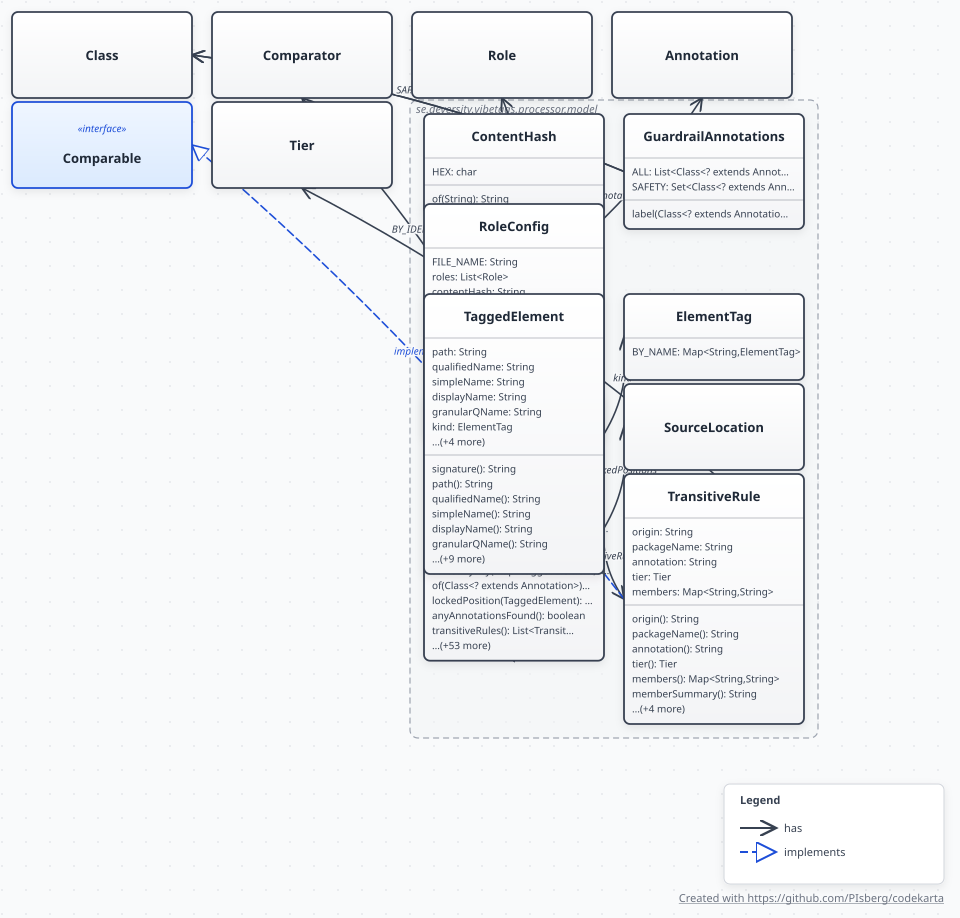

# Load-bearing behaviors

> Moved out of `CLAUDE.md` so the always-loaded context stays small. The invariants that must
> not be broken are summarised there; this file is the reasoning behind each one.

Full technical deep dive (system diagram, data flow, design decisions, limitations): `docs/ARCHITECTURE.md`.

### Core processing flow

`AIGuardrailProcessor.process()` runs during `javac` compilation of the **consumer** project (not the library itself — the library disables annotation processing with `-proc:none`, apart from the `self-annotate` profile):

1. Collects all annotation elements across **all compilation rounds** into `LinkedHashSet`s (one per annotation type)
2. Returns `false` from `process()` so other processors can still see the annotations
3. On `processingOver() == true`, calls `resolveActiveServices()` — only files that already exist on disk are regenerated (file presence = opt-in)
4. Writes to `Paths.get("").toAbsolutePath()` (project root of the consumer), or to `vibetags.root` if set

That is the summary. The literal call order — every method the orchestrator invokes, numbered
in the order it invokes it — is parsed straight out of `AIGuardrailProcessor.java` into
[`diagrams/codekarta/sequence/aiguardrailprocessor-sequence-diagram.svg`](diagrams/codekarta/sequence/aiguardrailprocessor-sequence-diagram.svg).
Read it when the question is *what actually runs, and when*, rather than *why*: this file
answers the second, the diagram answers the first, and neither is a substitute for the other.

It is worth having because `generateFiles()` is under `<locked_files>` for exactly this reason —
its step order (fingerprint check → sidecar write → sidecar read → merge → file write → cache
flush) is load-bearing, and reordering two steps produces no error, just silently skipped
regeneration or corrupted multi-module output. A hand-drawn sequence diagram of that order would
be a second thing to keep in sync with the code; a parsed one cannot drift, only diff.
Regenerate with
[`tools/generate-architecture-diagrams.sh`](../tools/generate-architecture-diagrams.sh); the
whole parsed set is described in
[ARCHITECTURE.md](ARCHITECTURE.md#parsed-diagrams-code-karta).

### File-existence opt-in

The processor never creates new files. To activate a platform, create the file first, then compile:

```bash
touch CLAUDE.md .cursorrules   # in the consumer project root
mvn compile
```

To deactivate, delete the file — it will never come back.

**AGENTS.md sole-file fallback.** `AGENTS.md` (the `codex` service) doubles as a near-universal agent-instructions file and is frequently kept only as a thin pointer to another tool's file, so `resolveActiveServices()` treats it as a write target **only when it is the sole AI config file present** — otherwise `codex` is dropped, which also disables the Codex sidecar config (`.codex/config.toml`, `.codex/rules/`). Escape hatch: a file that already contains a `VIBETAGS-START`/`VIBETAGS-END` pair was written by VibeTags in the first place, so it stays an active write target alongside other config files.

### Marker-based updates

Generated content is written between markers so a file can hold hand-authored content alongside generated guardrails:

- **HTML comments** (CLAUDE.md, llms.txt, llms-full.txt): `<!-- VIBETAGS-START -->` / `<!-- VIBETAGS-END -->`
- **Hash comments** (.cursorrules, .aiexclude, ignore files): `# VIBETAGS-START` / `# VIBETAGS-END`
- **No markers** (JSON/TOML config files): complete overwrite

YAML front-matter in `.mdc`/`.md` files is preserved — markers go after the front-matter block. Files written by an older VibeTags (without markers) are migrated on the next compile.

### Output files

50+ AI platforms (Cursor, Claude, Gemini, Codex, Copilot, Windsurf, granular per-class rules, AI PR reviewers, context packers, …). Full file/platform/format table: `docs/PLATFORMS.md`.

### Aggregate ↔ granular de-duplication (scoped-rules index)

Five platforms have both an always-loaded aggregate file and a glob-scoped granular directory: `CLAUDE.md`↔`.claude/rules/`, `.cursorrules`↔`.cursor/rules/`, `.windsurfrules`↔`.windsurf/rules/`, `.github/copilot-instructions.md`↔`.github/instructions/`, `GEMINI.md`↔`.gemini/rules/`. When **both** are opted in, the aggregate renderer collapses to a **scoped-rules index**: only the always-loaded safety buckets stay inline (`@AILocked`, `@AICore`, `@AIPrivacy`, `@AIIgnore`, `@AIAudit`, `@AISecure`), plus one pointer line per element to its scoped file (`GranularIndexSection`); every other bucket moves to the granular files.

Gating is per platform via `GranularIndexSection.governingGranularKey` — `CLAUDE_LOCAL` maps to `claude_granular` (so `CLAUDE.local.md` mirrors `CLAUDE.md`), while renderers that reuse the Cursor/Claude format but read no scoped directory (Cline, Firebase, Junie, Void, the Claude skill) map to `null` and always render in full. Single-opt-in output is unchanged. The owner set is computed once in `GuardrailContentBuilder.build()` and passed on `RenderingContext.granularOwners()`.

**This repo dogfoods it**: the block at the bottom of this file is a scoped-rules index; the per-element detail lives in `.claude/rules/`, which your tooling loads on demand by glob.

### Annotations

44 `@AI*` annotations, all `RetentionPolicy.SOURCE`. Full table, semantics, and validation-warning list: `docs/ANNOTATIONS.md`.

### The compiler boundary: `internal` → `model` ← `content`

The processor has two halves and one seam between them.

**Above the seam (`processor/internal/`)** is everything that talks to javac: `AnnotationCollector`
drains `RoundEnvironment`, `ElementNaming` walks the `Element` hierarchy, `SourcePositionResolver`
reads the Compiler Tree API, `AnnotationValidator` reports through the `Messager`.

**The seam (`processor/model/`)** is plain data: `GuardrailModel` (the buckets), `TaggedElement`
(one annotated element, with its name forms precomputed and its `@AI*` annotation instances carried
as-is), `ElementTag`, `SourceLocation`, `RoleConfig`, `GuardrailAnnotations.ALL`.

**Below the seam (`processor/internal/content/`)** is rendering, and it never sees a compiler.
`AnnotationFormatter.format(TaggedElement, …)` and `PlatformRenderer.render(GuardrailModel, …)` are
the only two entry points, so all ~90 formatter and renderer files can be exercised without invoking
javac.



*`processor/model/` — the seam itself, parsed from source. Its two useful properties are things
the picture shows by omission: nothing here imports a compiler type, and nothing here points
back up at `internal`.* The layer below it,
[`content/`](diagrams/codekarta/content/class-diagram.svg), is drawn the same way in
[PLATFORMS.md](PLATFORMS.md#the-rendering-layer); the whole processor, seam included, is in
[ARCHITECTURE.md](ARCHITECTURE.md#class-diagram). `ArchitectureRulesTest` is what keeps the
omissions true — the diagrams only make them visible.

Three things make this load-bearing rather than tidy:

- **An `Element` is only valid while its round is live.** The parallel write phase runs after the
  last round has closed. Snapshotting once, in `AnnotationCollector.model()`, is what makes reading
  it afterwards safe; a renderer holding an `Element` is a latent use-after-round.
- **`AISunset.replacement()` is `Class`-valued**, so reading it during processing throws
  `MirroredTypeException`. It is resolved to a type name at snapshot time — the one point where the
  compiler is still in scope — and read back with `TaggedElement.typeMember`. No renderer can
  resolve it, and none should try.
- **The dependency runs one way.** `content` used to take `AnnotationCollector` as a parameter,
  which made `internal ↔ content` a cycle that `ArchitectureRulesTest` had to carve an exception
  for. It now enforces the boundary instead: `CONTENT_IS_COMPILER_FREE`,
  `CONTENT_DOES_NOT_DEPEND_ON_INTERNAL`, `MODEL_IS_COMPILER_FREE`,
  `MODEL_DOES_NOT_DEPEND_ON_THE_PROCESSOR`.

`ElementTag` mirrors `javax.lang.model.element.ElementKind` **by name**, and that is a published
contract: the `kind` field in `.vibetags-locks` is parsed by the bundled GitHub Action, and granular
rule-file headings lower-case it. `ElementTagMappingTest` pins the two enums together.
`ElementTag.UNKNOWN` is VibeTags' own value for "the compiler reported no kind" and renders as the
word "element", preserving what a null `ElementKind` produced before the enum existed.

### Internal class responsibilities

Beyond what the generated section below describes:

- `AnnotationCollector` — accumulates elements across rounds into one bucket per annotation type,
  keyed by annotation class and driven by `GuardrailAnnotations.ALL`; `model()` snapshots them.
  Buckets are created once in the constructor and only ever cleared **in place**, because
  `AIGuardrailProcessor` holds three of them as fields initialised before the first round
- `AnnotationValidator` — the entry point for all compile-time consistency checks. The checks
  themselves are individually testable rules in `internal/validation/`: `PairRule` (two annotations
  that contradict each other, as a table), `CoreRules` (an annotation whose own attributes leave it
  instructing nobody), `ArchitectureRule` (the Tree-API import scan), `ModernJavaRules` (an
  annotation that contradicts the declaration it sits on — records, sealed types, virtual threads,
  the unnamed package). Add new warnings there, not in the entry point.

  `ValidationRules` indexes rules by the annotation each one scans and runs
  `getElementsAnnotatedWith` **once per annotation type**, however many rules share it. That is
  load-bearing for build time on a large compilation unit: the query walks the round's root
  elements, and the pre-registry validator issued one per check — four for `@AITestDriven` alone
- `GuardrailModel` — sorts every bucket by `TaggedElement.path()` when it snapshots. Load-bearing:
  `getElementsAnnotatedWith` returns a `Set` with no specified iteration order, so preserving the
  order the collector received makes generated output and the `BuildFingerprint` depend on which
  machine ran the build. `OutputOrderDeterminismTest` pins it
- `ElementNaming` — fully-qualified element paths (`com.example.Foo.bar`) for generated output; handles TYPE, METHOD, FIELD, PACKAGE. Called at snapshot time only
- `OrphanWarner` — warns when an annotation is present but its platform opt-in file is absent (e.g. `@AIIgnore` with no `.cursorignore`)

### Content rendering subsystem (`internal/content/`)

`GuardrailContentBuilder` snapshots the collector once and delegates all content generation here:

- `Platform` (enum) + `PlatformRendererRegistry` — one entry per output file; the registry maps each platform to its `PlatformRenderer` in `content/platforms/` (~30 renderers)
- `AnnotationFormatter` + `FormatterRegistry` — one `AI*Formatter` per annotation in `content/annotations/`; renderers pull per-annotation text from here rather than formatting inline
- `SectionCatalog` / `AnnotationSections` — shared driver that walks annotation buckets into titled sections
- `GranularBody` / `GranularSections` — structured stanzas for granular rule files, so a file hoists the constant rule sentence a section shares instead of repeating it per element
- `GranularContribution` — one compilation's share of one granular rule file (its globs and body), recorded in the module sidecar so a file several modules write is merged rather than replaced (#365)

Adding a platform touches `Platform` + registry + a renderer; adding an annotation touches
`GuardrailAnnotations.ALL` + a formatter + `FormatterRegistry` + any bespoke renderers. Step-by-step
checklists: the `add-platform` and `add-annotation` skills in `.claude/skills/`.

`GuardrailAnnotations.ALL` is the single registry of collected annotation types. It fixes the order
buckets are populated in and therefore the insertion order of every `LinkedHashSet` downstream —
appending is safe, reordering changes generated files. It is deliberately **not** the order
`BuildFingerprint` hashes in; that one is pinned separately, in that class, because changing it
invalidates every consumer's cached fingerprint.
