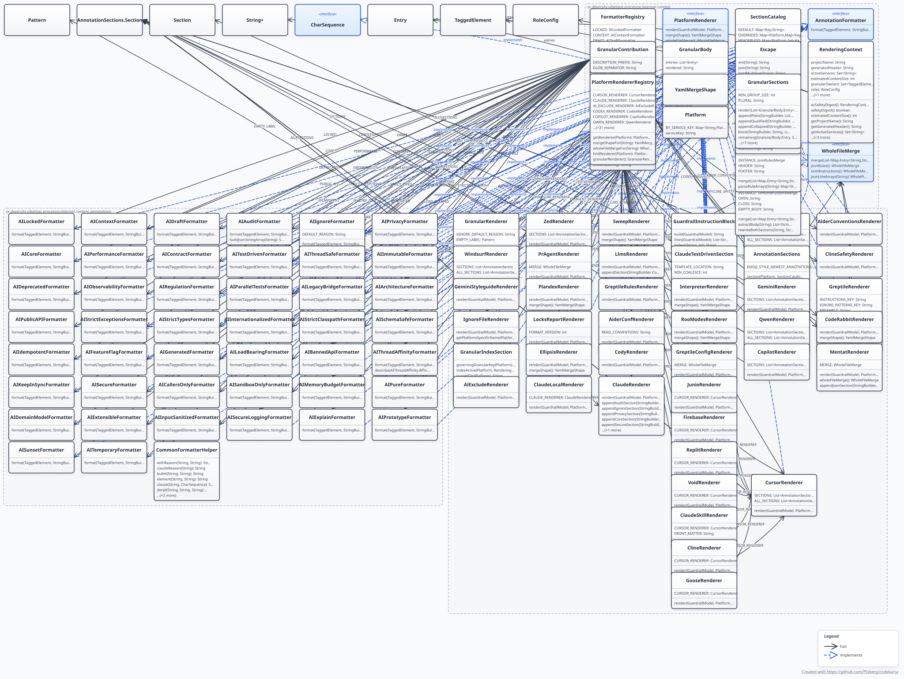

# Platform Output Files

Every file VibeTags can generate, which AI platform it targets, and its format — consult this when adding a new platform or checking what a given output file is for.

### The rendering layer



`se.deversity.vibetags.processor.internal.content`, parsed from source — the package a new
platform plugs into. `Platform` names the output file, `PlatformRendererRegistry` maps that name
to a `PlatformRenderer` in `content/platforms/`, and the renderer pulls its per-annotation
sentences from `FormatterRegistry` rather than formatting inline. Note what the diagram does
*not* contain: no `javax.lang.model`, no `javax.annotation.processing`. That absence is the
invariant `ArchitectureRulesTest` enforces (`CONTENT_IS_COMPILER_FREE`) and the reason all ~90
renderers and formatters can be tested without invoking javac — the reasoning is in
[LOAD-BEARING.md](LOAD-BEARING.md#the-compiler-boundary-internal--model--content).

Regenerated by
[`tools/generate-architecture-diagrams.sh`](../tools/generate-architecture-diagrams.sh) from
[`vibetags/src/main/java/se/deversity/vibetags/processor/internal/content`](../vibetags/src/main/java/se/deversity/vibetags/processor/internal/content);
the rest of the parsed set is described in
[ARCHITECTURE.md](ARCHITECTURE.md#parsed-diagrams-code-karta). Adding a platform means rerunning
that script — see the `add-platform` skill for the full checklist.

If the new output is a **YAML document**, the renderer must also override
`PlatformRenderer.mergeShape()`. Without it the multi-module merge stacks each module's whole
rendering, and the document ends up with its top-level key repeated once per module — invalid to a
strict parser, silently truncated to the last module by a lenient one. `YamlMergeShapeContractTest`
fails the build for a generated `.yaml` with no declaration, so this is hard to forget; see
[MULTI-MODULE.md](MULTI-MODULE.md#yaml-outputs-merge-differently) for what the declaration means.

### Output files

| File | Platform | Format |
|---|---|---|
| `.cursorrules` | Cursor IDE | Markdown |
| `.cursor/rules/*.mdc` | Cursor IDE (granular) | YAML front-matter + Markdown |
| `.cursorignore` | Cursor IDE | Glob patterns |
| `CLAUDE.md` | Claude | XML + Markdown |
| `CLAUDE.local.md` | Claude Code (local override) | XML + Markdown |
| `.claudeignore` | Claude | Glob patterns |
| `.claude/rules/*.md` | Claude Code (granular) | YAML front-matter + Markdown |
| `.claude/skills/vibetags-guardrails/SKILL.md` | Claude Code (Skill) | YAML front-matter + Markdown |
| `.agents/skills/vibetags-guardrails/SKILL.md` | Agent Skills (cross-client) | YAML front-matter + Markdown |
| `.aiexclude` | Gemini | Glob patterns |
| `AGENTS.md` | Codex CLI | Markdown |
| `.codex/config.toml` | Codex CLI | TOML config |
| `.codex/rules/vibetags.rules` | Codex CLI | Starlark rules |
| `gemini_instructions.md` | Gemini (**deprecated**, see below) | Markdown |
| `.github/copilot-instructions.md` | GitHub Copilot | Markdown |
| `.github/instructions/*.instructions.md` | GitHub Copilot (granular) | YAML front-matter + Markdown |
| `.copilotignore` | GitHub Copilot | Glob patterns |
| `CONVENTIONS.md` | Aider | Markdown |
| `.aider.conf.yml` | Aider (loads `CONVENTIONS.md`) | YAML (`read:`) |
| `.aiderignore` | Aider | Glob patterns |
| `QWEN.md` | Qwen | Markdown |
| `.qwenignore` | Qwen | Glob patterns |
| `.qwen/settings.json` | Qwen | JSON config |
| `.qwen/commands/refactor.md` | Qwen | Markdown command template |
| `.trae/rules/*.md` | Trae IDE (granular) | YAML front-matter + Markdown |
| `.roo/rules/*.md` | Roo Code (granular) | Markdown |
| `llms.txt` | Windsurf Cascade, all LLM agents | Markdown (concise map/directory) |
| `llms-full.txt` | Windsurf Cascade, large-context LLMs | Markdown (full reference book) |
| `.windsurfrules` | Windsurf IDE | Markdown |
| `.windsurf/rules/*.md` | Windsurf IDE (granular) | YAML front-matter + Markdown |
| `.rules` | Zed Editor | Markdown |
| `.cody/config.json` | Sourcegraph Cody (**deprecated**, see below) | JSON (custom commands) |
| `.codyignore` | Sourcegraph Cody (**deprecated**, see below) | Glob patterns |
| `.supermavenignore` | Supermaven (**deprecated**, see below) | Glob patterns |
| `.continue/rules/*.md` | Continue (granular) | YAML front-matter + Markdown |
| `.tabnine/guidelines/*.md` | Tabnine (granular) | Markdown |
| `.amazonq/rules/*.md` | Amazon Q (granular) | Markdown |
| `.ai/rules/*.md` | Universal AI standard (granular) | Markdown |
| `.pearai/rules/*.md` | PearAI (granular) | YAML front-matter + Markdown |
| `.kiro/steering/*.md` | Amazon Kiro (granular) | Markdown |
| `.mentatconfig.json` | Mentat | JSON config |
| `sweep.yaml` | Sweep (GitHub App) | YAML rules list |
| `.plandex.yaml` | Plandex | YAML guardrails |
| `.doubleignore` | Double.bot | Glob patterns |
| `.interpreter/profiles/vibetags.yaml` | Open Interpreter | YAML profile |
| `.codeiumignore` | Codeium | Glob patterns |
| `GEMINI.md` | Google Gemini (official markdown) | Markdown |
| `.gemini/rules/*.md` | Google Gemini (granular, per element) | Markdown |
| `.grok/rules/*.md` | Grok Build (granular, per element) | Markdown |
| `.agents/rules/*.md` | Antigravity (granular, per element) | Markdown |
| `.aiassistant/rules/*.md` | JetBrains AI Assistant (granular, per element) | Markdown |
| `.augment/rules/*.md` | Augment Code (granular, per element) | Markdown |
| `.zencoder/rules/*.md` | Zencoder (granular, per element) | YAML front-matter + Markdown |
| `.goosehints` | goose (Block) | Markdown |
| `.antigravityignore` | Antigravity AI | Glob patterns |
| `.clinerules` | Cline AI assistant (single file, **deprecated**, see below) | Markdown |
| `.clinerules/*.md` | Cline AI assistant (granular, per element; same path as the file, see [below](#clines-two-shapes-at-one-path)) | YAML front-matter + Markdown |
| `.junie/guidelines.md` | JetBrains Junie | Markdown |
| `.idx/airules.md` | Firebase AI | Markdown |
| `.void/rules.md` | Void Editor | Markdown |
| `replit.md` | Replit Agent | Markdown |
| `.coderabbit.yaml` | CodeRabbit (AI PR reviewer) | YAML (`reviews.path_instructions`) |
| `.pr_agent.toml` | Qodo/Codium PR-Agent (AI PR reviewer) | TOML (`extra_instructions`) |
| `ellipsis.yaml` | Ellipsis (AI PR reviewer) | YAML (`pr_review.rules`) |
| `.gemini/styleguide.md` | Gemini Code Assist (AI PR reviewer) | Markdown |
| `.roomodes` | Roo Code (custom "VibeTags Architect" mode) | YAML |
| `.repomixignore` | Repomix (context packer) | Glob patterns |
| `.gitingestignore` | Gitingest (context packer) | Glob patterns |
| `.gptignore` | GPT context packer | Glob patterns |
| `.ghostcoderignore` | Ghostcoder | Glob patterns |
| `.piecesignore` | Pieces for Developers | Glob patterns |
| `.rooignore` | Roo Code | Glob patterns |
| `.continueignore` | Continue | Glob patterns |
| `.augmentignore` | Augment Code | Glob patterns |
| `.vibetags-locks` | CI tooling (locked-files GitHub Action) | JSON Lines between hash markers |
| `.vibetags-root-index` | Reactor root, opt-in to the lean indexed aggregate ([MULTI-MODULE.md](MULTI-MODULE.md#lean-indexed-root-aggregate-vibetags-root-index)) | Marker file |

#### Granular rules

Cursor, Windsurf, Continue, Tabnine, Amazon Q, Trae, Roo Code, PearAI, Amazon Kiro, Claude Code, GitHub Copilot, Google Gemini, Grok Build, Antigravity, JetBrains AI Assistant, Augment Code, Zencoder, Cline, and the universal `.ai/rules/` standard all support per-class rule files. When a class or method is annotated, the processor writes one rule file per annotated class (filename derived from the fully-qualified class name). Orphaned granular files — for classes that have had annotations removed — are cleaned up **after** new files are written to prevent delete-then-recreate cycles.

Claude Code's granular rules (`.claude/rules/*.md`) and Cline's (`.clinerules/*.md`) scope with a `paths:` front-matter glob list rather than Cursor's `globs:`/`alwaysApply:` pair. GitHub Copilot's granular files (`.github/instructions/*.instructions.md`) use a single `applyTo:` glob string and, unlike every other granular platform, a two-part `.instructions.md` extension.

**Dual opt-in de-duplicates.** Five platforms have both an aggregate file and a granular directory: `CLAUDE.md` ↔ `.claude/rules/`, `.cursorrules` ↔ `.cursor/rules/`, `.windsurfrules` ↔ `.windsurf/rules/`, `.github/copilot-instructions.md` ↔ `.github/instructions/`, `GEMINI.md` ↔ `.gemini/rules/`. If you opt into **both** for one platform, the aggregate no longer repeats every element's guardrails: it keeps the always-loaded safety guardrails inline (`@AILocked`, `@AICore`, `@AIPrivacy`, `@AIIgnore`, `@AIAudit`, `@AISecure`) and adds a **scoped-rules index** — one line per element, with the file-naming convention stated once in the index note instead of a path repeated on every entry — while the full per-element detail lives in the scoped files. An element that `.vibetags-roles` groups onto a shared role file keeps an explicit path, because its name no longer follows the convention. Opting into only the aggregate keeps the complete inline output as before. (`CLAUDE.local.md` follows `CLAUDE.md`; the other fourteen granular platforms have no aggregate counterpart, so nothing is de-duplicated for them. Cline is among them: its `.clinerules` file and `.clinerules/` directory are one path, so they are never opted into together.)

**Per-module (nested) output.** In a multi-module reactor build, opt into a file (or granular directory) *inside a module's own directory* — e.g. `touch module-a/CLAUDE.md` — and VibeTags writes that module's own guardrails there, scoped to that module's annotations. This is the context-optimal layout for tools that auto-load nested config (Claude Code nested `CLAUDE.md`, Cursor nested rules). It is additive: the reactor-**root** file still merges every module (unchanged), and a module that doesn't opt in gets no file. The scoped-rules index composes here too — a module that opts into both its aggregate and its granular dir gets an indexed module aggregate.

**Role/topic-based grouping (`.vibetags-roles`).** By default each annotated class becomes one granular file (FQN-named, single-class glob). Drop a `.vibetags-roles` config at the repo (or module) root to group elements into a few human-named topic files by glob instead — `name = comma-separated globs and/or fully-qualified names`, one role per line:

```
api-endpoints     = **/*Controller.java
database-models   = **/*Entity.java
external-webhooks = **/webhooks/**, com.example.legacy.WeirdEndpoint
```

Each role emits `<name>.<ext>` (e.g. `api-endpoints.mdc` / `api-endpoints.md`) with the role's globs in the platform's frontmatter (`globs:` / `paths:` / `applyTo:`) and the matched elements' guardrails grouped inside. An element goes to the **first** matching role (config order); an element matching no role keeps its per-class file. Listing a **fully-qualified name** on a role line routes an odd class that doesn't fit its glob. Applies to every granular platform and works per module.

**Cross-module mirroring (`.vibetags-mirror`).** A module that exercises another module's annotated code — a reactor's centralised test module is the canonical case — receives that module's granular rules by carrying a `.vibetags-mirror` file next to its own granular directory. Mirrored files are written as `mirrored-<sourceModuleId>-<stem>.<ext>` with the target's globs appended to the frontmatter; the target needs no annotations of its own. Details and format: `docs/MULTI-MODULE.md`.

**Repeated rule sentences collapse.** Within one granular file, a section covering two or more elements states its constant `- **Rule**:` sentence once (pluralized) and keeps only each element's varying detail beneath — elements whose whole stanza is shared collapse into an `- **Applies to**:` list. A section covering a single element is emitted exactly as before.

#### llms.txt vs llms-full.txt

VibeTags follows the [llms.txt standard](https://llmstxt.org/) for LLM agent discovery:

- **`llms.txt`** — The Map: A concise directory listing all guardrail rules with links to the annotated class. Intended for LLM agents (e.g., Windsurf Cascade) to quickly understand the project's AI interaction rules without bloating the context window.
- **`llms-full.txt`** — The Book: A single expanded file with all rule details. Intended for large-context LLMs (Claude 4.6, Gemini 1.5 Pro) that can ingest the entire ruleset at once.

Both files follow the llms.txt format hierarchy: `# Title`, `> Summary blockquote`, informational text, and `## H2` resource sections.

### The review platforms carry a subset

Sweep, Mentat and Plandex are code-review tools, not editors. Their formatters carry an arm for
the annotations a reviewer can act on from a diff, and nothing else; the other 34 platforms carry
all 44. The three lists below are the declaration, and `ReviewPlatformSubsetClaimTest` derives
each set from the formatters and holds these lines to it in both directions, so an arm added or
removed without the matching name here fails the build. To carry one more annotation on one of
these platforms, add the arm in its formatter and the name on its line in the same commit.

- **Sweep** (`sweep.yaml`) carries: `@AIAudit`, `@AIBannedApi`, `@AIContract`, `@AICore`, `@AIDraft`, `@AIFeatureFlag`, `@AIGenerated`, `@AIIdempotent`, `@AIKeepInSync`, `@AILoadBearing`, `@AILocked`, `@AIPerformance`, `@AIPrivacy`, `@AISecure`, `@AITestDriven`, `@AIThreadAffinity`.
- **Mentat** (`.mentatconfig.json`) carries: `@AIAudit`, `@AIContract`, `@AICore`, `@AIDraft`, `@AIIgnore`, `@AILocked`, `@AIPerformance`, `@AIPrivacy`, `@AITestDriven`.
- **Plandex** (`.plandex.yaml`) carries: `@AIAudit`, `@AILocked`, `@AIPrivacy`.

### The YAML key VibeTags writes for aider, and the one it refuses to write for Gemini

`.aider.conf.yml` exists because aider does not load `CONVENTIONS.md` by itself. Its
[conventions documentation](https://aider.chat/docs/usage/conventions.html) says the file has to be
named with `/read CONVENTIONS.md`, `--read`, or a `read:` key in the config, so between v0.5.0 and
this release VibeTags generated a conventions file that no aider session ever opened. The generated
block is one `read:` entry; everything else in the file is yours.

The cost is that `read:` is a top-level YAML key, and a hand-authored `read:` outside the VibeTags
markers would be a duplicate. PyYAML, which aider uses, does not reject a duplicate key: it keeps
the last one, so whichever of the two sits lower in the file silently wins. Opt in with a
`.aider.conf.yml` that has no `read:` of its own. Moving your entries inside the generated block
does not work: the block is rewritten on every build and they are gone after the next one.

The build says so when it happens. On every compile, including one the fingerprint short-circuit
skips, VibeTags reads each opted-in YAML file and warns about any top-level key the generated block
writes that also appears outside it, naming both line numbers and which one a last-wins loader
reads. That covers every YAML platform, not only aider: the keys come from the renderers
themselves, so CodeRabbit's `reviews:`, Ellipsis's `version:` and `pr_review:`, Sweep's `rules:`,
Plandex's `guardrails:`, Open Interpreter's `instructions:` and Roo Code's `customModes:` are
checked the same way. `reviews:` is the one most likely to bite, since it is where CodeRabbit keeps
every review setting.

`.gemini/config.yaml` is deliberately **not** written, for the same reason with none of the
upside. Its `ignore_patterns` key would collide the same way, and unlike aider's `read:` it buys
nothing that `.gemini/styleguide.md` does not already deliver: the style guide is where Gemini Code
Assist takes its review rules from, and it is Markdown, so the marker merge is clean. Issue #636
records the decision.

### Four deprecated outputs whose tool has moved on

These are deprecated. They are still written, and an existing project's output does not change, but
they stop being written in the next major version, tracked in
[#645](https://github.com/PIsberg/vibetags/issues/645). Three of the four name a tool that no longer
reads them, and the file-presence opt-in model means a path VibeTags names is a path a user may
create.

They were not simply removed. Removing a service stops an opted-in consumer's file regenerating, and
that file then sits in the repository looking current while it drifts from the annotations, which
is worse than a file nobody reads. So a build that has one of them opted in gets one compiler
warning per compilation naming each file and its replacement, and `vibetags.log` records a
`platform.deprecated key=... file=... replacement=...` event per file. The "no AI config files
found" note no longer offers them to a new project. The decision is recorded in #641.

To move off one: create the replacement, move any hand-written content outside the VibeTags markers
across, then delete the deprecated file.

| Output | Status | Evidence |
|---|---|---|
| `gemini_instructions.md` | **No vendor source found.** Google documents `GEMINI.md` for the Gemini CLI (configurable via `contextFileName`), `.idx/airules.md` for Firebase, and `.gemini/styleguide.md` for the GitHub reviewer. This path appears in none of them. It sits in 55 public repositories, none of them VibeTags consumers, so people do write it -- but no documentation says anything reads it. | [Gemini CLI context docs](https://github.com/google-gemini/gemini-cli/blob/main/docs/cli/gemini-md.md) |
| `.cody/config.json`, `.codyignore` | **Product retired.** Sourcegraph retired Cody Free and Pro on 23 July 2025; the successor, Amp, reads `AGENTS.md`, which VibeTags writes. 4 and 3 public repositories. | [Sourcegraph's announcement](https://sourcegraph.com/blog/changes-to-cody-free-pro-and-enterprise-starter-plans) |
| `.supermavenignore` | **Product sunset.** Supermaven was acquired by Anysphere in November 2024 and the standalone product was discontinued in November 2025; its technology is inside Cursor Tab, and VibeTags writes `.cursorignore`. 5 public repositories. | [Cursor's announcement](https://cursor.com/blog/supermaven) |
| `.clinerules` (the single file) | **Legacy shape.** [Cline's current rules documentation](https://docs.cline.bot/features/cline-rules) documents a `.clinerules/` **directory** and does not mention the file, though Cline's loader still reads it. VibeTags now writes the directory form as well (see [Cline's two shapes at one path](#clines-two-shapes-at-one-path)), so the file is kept for projects that already have it rather than as the recommended opt-in. |

The lesson is the one #611 recorded from the other direction. A platform list is not a thing you
write once: the tools underneath it are renamed, acquired and retired, and a generated file
outlives the product it was generated for. Nothing in the build can notice that, which is why the
release process now re-checks every platform path against its vendor before a version is cut
([RELEASING.md](RELEASING.md)).

### Cline's two shapes at one path

Cline reads `.clinerules` as either a single file or a directory of rule files, and VibeTags writes
both: the `cline` service for the file, `cline_granular` for the directory. They share one path, so
which one activates is decided by what is on disk. A regular file opts into the file, a directory
opts into the directory, and the two can never both be active in one project. The single file is
deprecated (#645) and the directory is its replacement, so the deprecation warning fires only for a
regular file; a project on the directory never sees it.

The directory's rule files carry `paths:` front matter, the same shape Claude Code uses. That is read
from Cline's source rather than its prose: `rule-helpers.ts` parses each file's YAML front matter and
activates a rule when a `paths:` glob matches a file in the task's context, and that context includes
files Cline is about to edit. A rule without front matter would load on every request instead.

**Cline converts the file for you, and nothing is lost when it does.** Creating a workspace rule from
Cline's UI while a `.clinerules` file exists turns the file into a directory and moves its content
into `.clinerules/default-rules.md`. The next build sees a directory, switches to the directory form,
and sweeps the moved VibeTags block out of `default-rules.md` as a stale copy, leaving your own text
in place. `ClineRulesDirectoryEndToEndTest` replays that conversion step for step.

**How the README counts it.** `.clinerules` is counted once among the config files and once among
the scoped-rule directories, because VibeTags can write it as either. The project-facts line names
it, and `ProjectFactsConsistencyTest` fails if a path shared this way is not named there.

### Three ignore files added, and three checked and refused

`@AIIgnore` already drove fifteen exclusion files. Three more were added because each is the only
exclusion mechanism its tool has, and VibeTags already writes that tool's rules directory:
[`.rooignore`](https://docs.roocode.com/features/rooignore) (Roo Code: prevents reading and
writing, the closest match to what `@AIIgnore` means),
[`.continueignore`](https://docs.continue.dev/customize/deep-dives/codebase) and
[`.augmentignore`](https://docs.augmentcode.com/setup-augment/workspace-indexing) (both exclude
from indexing, which is the whole of what those tools offer).

Three more were checked against the vendor's own documentation and refused. Adoption is not the
test -- a file can sit in thousands of repositories and still be one a tool no longer reads, or one
another file already covers:

| File | In public repos | Why not |
|---|---|---|
| `.aiignore` | 820 | Redundant, in JetBrains' own words: "If your project already contains a `.cursorignore`, `.codeiumignore`, or `.aiexclude` file, there is no need to create a separate `.aiignore` file, as these files are also supported." VibeTags writes all three. |
| `.cursorindexingignore` | 670 | Absent from [Cursor's current ignore-files documentation](https://cursor.com/docs/context/ignore-files), which describes only `.cursorignore`. Writing it would be adopting a path the vendor has stopped documenting. |
| `.clineignore` | 514 | Cline's own documentation page is titled "`.clineignore` (deprecate soon)". Cline also honours `.cursorignore`-style rules files VibeTags already writes. |

Counts are GitHub public code search, 2026-09-12. The pattern is the one #611 recorded: every row
that was checked against the vendor rather than an aggregator turned up something the aggregator
did not say.
